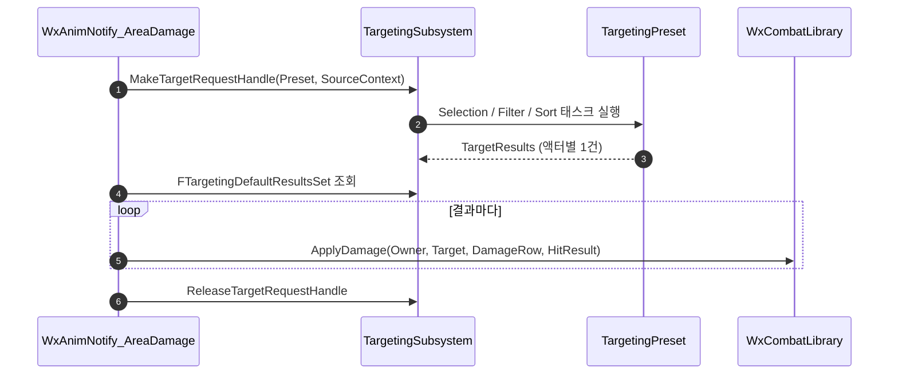

# TargetingPreset 기반 범위 대미지 AnimNotify 추가

## 계획

### 목표

지금 `FWxDamageTableRow` 로 대미지를 주는 경로는 무기 히트박스와 투사체뿐이라, 몽타주 한 시점에 주변 적을 한꺼번에 때리는 공격을 저작할 수단이 없다. 범위 판정을 `TargetingPreset` 에 맡기고 대미지는 기존 `FWxDamageTableRow` 경로를 그대로 쓰는 단발 AnimNotify를 추가한다.

### 수정 범위

| 파일 | 수정할 내용 | 구분 |
|---|---|---|
| `Plugins/WxCombat/Source/WxCombat/Public/AnimNotify/WxAnimNotify_AreaDamage.h` | `UWxAnimNotify_AreaDamage` 선언 | 신규 |
| `Plugins/WxCombat/Source/WxCombat/Private/AnimNotify/WxAnimNotify_AreaDamage.cpp` | 타겟팅 쿼리 + 대미지 적용 | 신규 |

기존 파일 수정 없음. `TargetingSystem` 은 이미 `WxCombat.Build.cs` 의 Public 의존이다.

### 접근 방식

- **저작 필드 2개**: `TargetingPreset`(범위·형상·필터 전담)과 `DamageDataRow`(`WxDamageTableRow` 행 핸들, `WxPreviewRow` 미리보기).
- **Notify 흐름**: Owner와 `UTargetingSubsystem` 확보 → `FTargetingSourceContext` 의 `SourceActor`·`InstigatorActor` 에 Owner → `MakeTargetRequestHandle` → `ExecuteTargetingRequestWithHandle` 동기 실행 → `FTargetingDefaultResultsSet` 순회하며 결과 `HitResult` 를 그대로 넘겨 `UWxCombatLibrary::ApplyDamage` → `ReleaseTargetRequestHandle`.
- **`GetNotifyName_Implementation`**: `UWxAnimNotifyState_WeaponAttack` 과 같이 대미지 행 이름을 표시한다.

### 설계 근거

- **`ApplyDamage` 재사용**: 팀·사망·무적·예측 키·`AdditionalEffects`·퍼펙트 가드 게이팅이 전부 그 안에 있어 노티파이에 별도 판정을 두지 않는다. `IsHostile(self, self)` 가 Friendly라 자기 피격도 자동으로 걸러진다.
- **중복 타격 장치 불필요**: `UTargetingSelectionTask_AOE` 가 오버랩 결과를 액터 단위로 dedupe하고, 단발 노티파이는 한 번만 발화한다.
- **동기 실행 전제**: 동기 진입점(`ExecuteTargetingRequestWithHandle`)으로 돌려 그 자리에서 결과를 읽는다. 비동기 요청으로 바꾸면 결과가 다음 프레임에 도착해 대미지가 사라진다.
- **소켓 중심 필드 제외**: `GetSourceLocation` 은 `SourceActor` 가 있으면 액터 위치만 쓰고 `SourceSocketName` 을 보지 않는다. 소켓을 쓰려면 `SourceActor` 를 비워야 하는데 그러면 `UWxTargetingFilterTask_Team` 같은 소스 액터 기반 필터가 무력화된다. 위치 보정은 프리셋의 상대 오프셋으로 저작한다.
- **히트스톱 제외**: 무기의 히트스톱은 1:1 히트 전제라, 다대상 버스트에서 대상 수만큼 겹쳐 거는 건 의도와 다르다.

---

## 계획 (추가) — 에디터 범위 시각화

### 목표

범위·형상을 프리셋이 들고 있어 애님 에디터에서는 어떤 크기의 범위가 어디에 잡히는지 보이지 않는다. 실제 쿼리와 같은 위치·회전·형상으로 뷰포트에 와이어 볼륨을 그린다.

### 수정 범위

| 파일 | 수정할 내용 | 구분 |
|---|---|---|
| `.../Public/AnimNotify/WxAnimNotify_AreaDamage.h` | `DrawInEditor` 오버라이드 선언 (`WITH_EDITOR`) | 수정 |
| `.../Private/AnimNotify/WxAnimNotify_AreaDamage.cpp` | AOE 태스크별 와이어 볼륨 PDI 드로잉 | 수정 |

### 접근 방식

- **`UAnimNotify::DrawInEditor` 오버라이드**: Persona 뷰포트가 프리뷰 중인 애니메이션의 모든 노티파이에 매 프레임 호출한다. Character 메뉴의 노티파이 시각화 토글이 게이트다.
- **임시 타겟팅 핸들로 실제 값 조회**: 프리뷰 메시의 소유 액터를 소스로 하는 핸들을 만들어 `GetSourceLocation + GetSourceOffset`, `GetSourceRotation * GetSourceRotationOffset`, `GetCollisionShape` 를 그대로 읽는다. 형상 수치와 오프셋은 protected라 직접 못 읽고, 이 공개 getter들이 `ExecuteImmediateTrace` 와 같은 식이라 보이는 볼륨과 실제 오버랩이 어긋나지 않는다.
- **PDI 와이어 드로잉**: 엔진의 `DebugDrawBoundingVolume` 은 월드 라인 배처에 수명 기반으로 쌓아 프리뷰에서 깜빡이므로 쓰지 않고, 뷰포트가 넘겨준 PDI에 직접 그린다.
- **색은 `NotifyColor` 재사용**: 타임라인 칩 색과 볼륨 색이 일치하고 저작자 변경 통로도 이미 있다.

---

## 완료

### 수정한 파일
| 파일 | 수정한 내용 | 구분 |
|---|---|---|
| `Plugins/WxCombat/Source/WxCombat/Public/AnimNotify/WxAnimNotify_AreaDamage.h` | `UWxAnimNotify_AreaDamage` 선언, 저작 필드 2개, `DrawInEditor` 오버라이드 | 신규 |
| `Plugins/WxCombat/Source/WxCombat/Private/AnimNotify/WxAnimNotify_AreaDamage.cpp` | 동기 타겟팅 쿼리 후 결과 전원에 `ApplyDamage`, AOE 와이어 볼륨 드로잉 | 신규 |

### 구현·결정과 그 이유
- **결과 순회에서 필터를 두지 않음**: 프리셋 필터를 통과한 액터라도 사망·무적·팀은 `ApplyDamage` 가 다시 본다. 노티파이에서 한 번 더 거르면 판정이 두 군데로 갈라진다.
- **`HitResult` 를 그대로 전달**: AOE 선택 태스크가 채운 `ImpactPoint` 는 대상 액터 위치라 히트 큐 연출 지점으로 그대로 쓸 만하다.
- **핸들을 const로 잡지 않음**: `ReleaseTargetRequestHandle` 이 비const 참조를 받는다.
- **시각화도 임시 핸들을 거침**: 형상 수치·오프셋은 protected라 직접 못 읽는다. 공개 getter가 곧 쿼리가 쓰는 식이라, 핸들을 한 번 만드는 대가로 볼륨 불일치 가능성을 없앴다.
- **드로잉은 프레임마다 갱신되는 값만 사용**: 캐시 멤버를 두면 노티파이 객체가 몽타주 단위로 공유되는 특성상 프리뷰 대상이 바뀔 때 어긋난다.

### 계획 대비 달라진 점
- **결과를 복사한 뒤 핸들을 먼저 반납**: 리뷰에서 잡힌 결함. `FTargetingDefaultResultsSet::FindOrAdd` 참조는 `TSortedMap` 내부를 가리켜, 루프 안 `ApplyDamage` 가 촉발한 다른 타겟팅 요청이 삽입되면 끊긴다. `GetTargetingResults` 로 지역 배열에 받아 순회한다.
- **비동기 관련 서술 정정**: 계획에 "프리셋의 AOE 태스크가 비동기 오버랩이면"이라 적었으나 그런 프리셋 설정은 없다. AOE 태스크는 *요청*이 비동기인지로 갈리며, 그건 호출부가 `StartAsyncTargetingRequestWithHandle` 를 쓸 때만 켜진다. 위 계획 항목을 정정했다.

### 후속 과제
- **권위 게이트 미결**: 코드로 대상을 고르는 다른 경로(`WxFinisherDamageComponent`, `AWxProjectileBase`)는 `HasAuthority` 로 막는다. 무기 경로가 모든 머신에서 도는 건 같은 형상이 물리로 판정해 결론이 일치하기 때문이라 성격이 다르다. 서버 전용으로 갈지 소유 클라 예측을 남길지 결정 필요.
- **브랜칭 포인트 미적용**: 무기 공격 ANS는 `bIsNativeBranchingPoint` 를 켜 저프레임 스킵을 막는다. 대미지 노티파이인데 이쪽만 큐 방식이라 검토 대상.
- **프리셋 미지정 검증 없음**: 타임라인 칩에 대미지 행 이름이 그대로 보여 정상 설정과 구분되지 않는다. `ValidateAssociatedAssets` 후보.
- 프리셋 에셋 저작과 인게임 다대상 피격 확인은 사용자 몫. 코드 검증은 컴파일까지다.
- `SourceComponent` 형상은 프리뷰에 그릴 대상이 없어 시각화 제외. 실제로 쓰게 되면 재검토.
- 다대상 히트스톱이 필요해지면 별도 논의.
