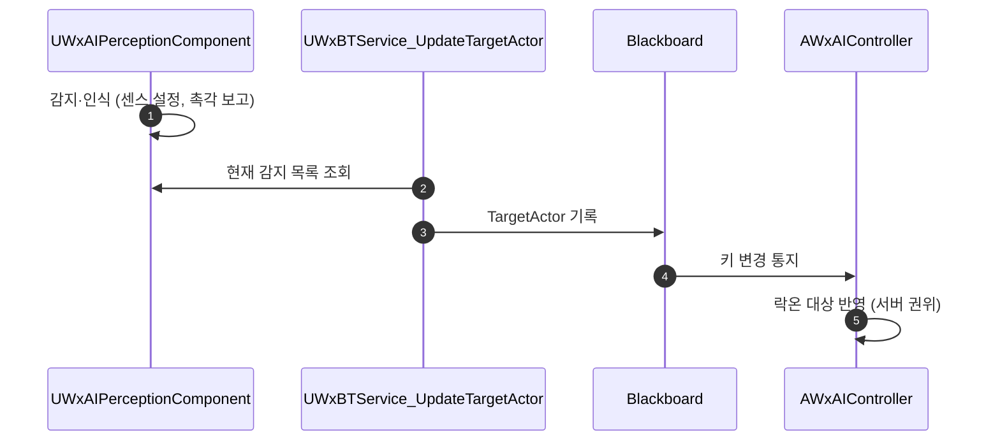

# 타겟 선정을 퍼셉션 컴포넌트에서 BT 서비스로 이관

## 계획

### 목표
`UWxAIPerceptionComponent` 가 자극 이벤트로 타겟을 고르느라 타겟마다 사망 태그·EndPlay 를 구독했다 해제하는 장부를 지고 있다. 선정 주체를 BT 서비스로 옮겨 그 장부를 없애고, 퍼셉션은 감지·인식까지만 맡게 한다.

### 수정 범위
| 파일 | 수정할 내용 | 구분 |
|---|---|---|
| `Plugins/WxAI/.../WxBTService_UpdateTargetActor.h/.cpp` | 타겟 선정 서비스 | 신규 |
| `Plugins/WxAI/.../WxAIPerceptionComponent.h/.cpp` | 선정·소실 감시 제거(약 130줄) | 수정 |
| `Plugins/WxAI/.../WxBTTask_ReturnHome.cpp` | 커스텀 캐스팅 → 스톡 API | 수정 |
| `Plugins/WxAI/.../WxBlackboardKeys.h` | TargetActor 담당자 서술 정정 | 수정 |
| `Source/WxGame/Controller/WxAIController.h/.cpp` | 커스텀 델리게이트 → 블랙보드 옵저버 | 수정 |
| `Content/AI/BT_Enemy·BT_Minion·BT_Soldier` | 루트에 서비스 부착 | 사용자 작업 |

### 접근 방식
- **신규 `UWxBTService_UpdateTargetActor`**: 현재 타겟이 살아 있으면 유지(시야에서 벗어나도 유지하는 기존 규칙), 죽었거나 비었으면 감지 목록에서 자기 폰·죽은 액터를 걸러 승계. 사망 판정 헬퍼도 여기로 옮긴다.
- **퍼셉션에 남는 책임**: 센스 설정·폰별 수치 적용·빙의 전환 시 감지 기록 초기화·GAS 피격을 촉각 자극으로 넘기는 다리.
- **타겟 키 초기화 이동**: 폰 교체 시 키 비우기는 컨트롤러 `OnPossess`·`OnUnPossess` 로. SelfActor·HomeLocation 리셋과 한 자리에 모인다.
- **락온 통로 교체**: 컨트롤러가 블랙보드 TargetActor 키를 관찰(`RegisterObserver`)해 기존 핸들러로 흘려보낸다. WxAI 는 WxCombat 을 참조할 수 없어 락온 반영은 컨트롤러 몫으로 남는다.
- **복귀 태스크**: 스톡 `ForgetActor` + 키 비우기로 대체해 커스텀 클래스 캐스팅을 없앤다.

확인한 사실: 파괴된 액터는 퍼셉션 기록이 약참조라 감지 목록에서 저절로 빠지고, 엔진의 잊기 처리는 시야 쿼리의 직전 결과만 지워 폴링으로 바꿔도 리쉬 복귀 뒤 재획득 시점이 같다.

알려진 동작 차이: 복귀 중 다른 적이 이미 시야에 있으면 폴링에서는 즉시 승계한다(지금은 새 자극까지 비어 있음). 리쉬 데코레이터가 복귀 브랜치를 붙들어 복귀 자체는 멈추지 않는다.

---

## 완료

### 수정한 파일
| 파일 | 수정한 내용 | 구분 |
|---|---|---|
| `Plugins/WxAI/.../WxBTService_UpdateTargetActor.h/.cpp` | 타겟 선정 서비스(유지·승계 판정, 감지 목록 필터, 사망 판정) | 신규 |
| `Plugins/WxAI/.../WxAIPerceptionComponent.h/.cpp` | 선정·소실 감시 제거, 429줄 → 237줄 | 수정 |
| `Plugins/WxAI/.../WxBTTask_ReturnHome.cpp` | 스톡 `ForgetActor` + 블랙보드 키 비우기로 대체 | 수정 |
| `Plugins/WxAI/.../WxBlackboardKeys.h` | TargetActor 담당자 서술 정정 | 수정 |
| `Source/WxGame/Controller/WxAIController.h/.cpp` | 블랙보드 옵저버 등록·해제, 빙의 전환 시 타겟 키 비우기 | 수정 |

### 구현·결정과 그 이유
- **유지 규칙을 그대로 옮겼다**: 시야에서 벗어나도 타겟을 놓지 않는 기존 동작이 서비스의 "살아 있으면 유지" 한 줄이 됐다. 파괴는 블랙보드 약참조가, 사망은 태그 조회가 가른다.
- **EndPlay 구독이 필요 없어졌다**: 감지 기록의 대상 참조가 약참조라 파괴된 액터는 감지 목록 조회에서 저절로 빠진다. 승계 전에 기록을 지우던 처리도 함께 사라졌다.
- **복귀 태스크는 두 가지를 다 해야 한다**: 블랙보드만 비우면 여전히 감지 중이라 서비스가 곧바로 같은 대상을 다시 문다. 감지 기록을 지우는 스톡 호출을 함께 남겼다.
- **락온 통로는 블랙보드 옵저버로**: WxAI 는 WxCombat 을 참조할 수 없어 락온 반영은 컨트롤러 몫으로 남는다. 커스텀 델리게이트 대신 스톡 키 관찰을 쓰면 통로를 새로 만들지 않고도 같은 신호를 받는다.
- **타겟 키 리셋을 컨트롤러로**: SelfActor·HomeLocation 리셋과 한 자리에 모여, 퍼셉션은 감지 기록 초기화만 남았다.

### 계획 대비 달라진 점
- 옵저버 콜백의 인자 이름을 `InBlackboard` 로 바꿨다. `AAIController` 에 같은 이름의 멤버가 있어 컴파일 경고(C4458)가 에러로 올라왔다.

### 후속 과제
- BT_Enemy·BT_Minion·BT_Soldier 루트에 Update Target Actor 서비스를 달아야 한다. 달기 전에는 적이 타겟을 잡지 못한다. 언리얼 MCP 서버가 연결 실패 상태라 에디터 작업은 사용자 몫이다.
- 부착 후 인게임 확인: 시야·소리·피격 획득, 타겟 사망 시 승계, 리쉬 복귀 시 해제, 락온 대상 복제.
- 복귀 중 다른 적이 이미 시야에 있으면 즉시 승계한다(이전에는 새 자극까지 비어 있었음). 복귀 브랜치는 리쉬 데코레이터가 붙들어 멈추지 않는다.
