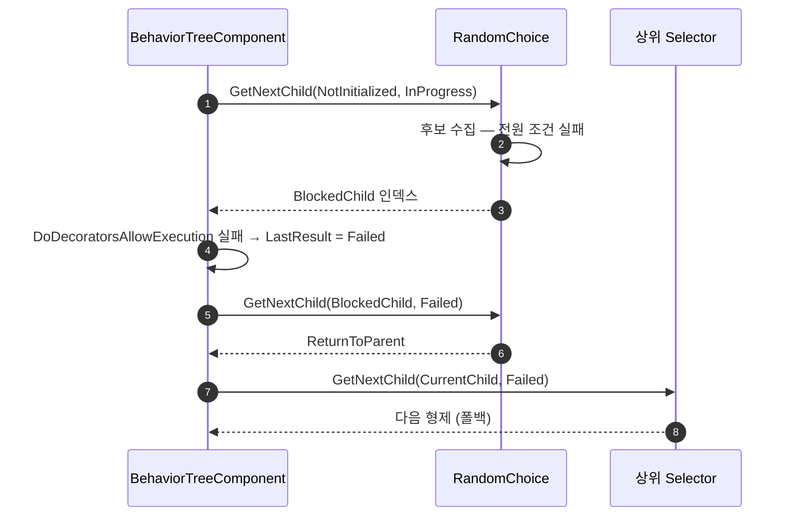

# RandomChoice 후보 0일 때 실패 전파 수정

## 계획

### 목표

`UWxBTComposite_RandomChoice` 는 헤더에서 "유효 후보가 하나도 없으면 아무 자식도 실행하지 않고 실패를 반환한다" 고 선언하지만 실제로는 실패가 전파되지 않는다. 그래서 상위 Selector 의 폴백 형제가 어떤 경로로도 실행되지 않는다. 선언한 계약을 코드가 실제로 지키게 만든다.

### 수정 범위

| 파일 | 수정할 내용 | 구분 |
|---|---|---|
| `Plugins/WxAI/Source/WxAI/Private/WxBTComposite_RandomChoice.cpp` | 조건에 막힌 자식 인덱스를 기억했다가, 후보가 비면 부모 반환 대신 그 인덱스를 반환 | 수정 |
| `Plugins/WxAI/Source/WxAI/Public/WxBTComposite_RandomChoice.h` | 실패 전파 메커니즘과 남는 예외를 계약에 명시 | 수정 |

### 접근 방식

- **실패 판정을 엔진 루프에 되돌려준다**: 엔진 `UBTCompositeNode::FindChildToExecute` 는 자식을 실제로 한 번 돌려보고 `DoDecoratorsAllowExecution` 이 막을 때만 `LastResult = Failed` 를 세팅한다. `GetNextChildHandler` 의 `LastResult` 는 값 전달이라 그 변수에 쓸 수 없고, `OnNodeDeactivation` 은 가상 함수가 아니라 오버라이드할 수도 없다. 따라서 후보가 비었을 때 조건에 막힌 자식 하나를 반환해, 엔진이 같은 검사를 다시 하면서 Failed 를 세팅하게 만든다. 곧이어 다시 물어올 때는 진입 호출이 아니므로 기존 상단 분기가 그대로 `ReturnToParent` 를 낸다.
- **사전 필터와 그 통지는 유지한다**: 헤더가 의도적 선택으로 명시한 "조건 실패 자식 전원에게 활성화 실패 통지" 를 지키기 위해서다. 사전 필터를 버리고 엔진 루프에 전부 맡기면 엔진은 자기가 실제로 시험한 자식에게만 통지하므로 그 계약이 깨진다.

---

## 완료

### 수정한 파일
| 파일 | 수정한 내용 | 구분 |
|---|---|---|
| `Plugins/WxAI/Source/WxAI/Private/WxBTComposite_RandomChoice.cpp` | `BlockedChild` 로 조건 실패 자식 첫 인덱스를 기록하고, 후보가 비면 부모 반환 대신 그 인덱스를 반환 | 수정 |
| `Plugins/WxAI/Source/WxAI/Public/WxBTComposite_RandomChoice.h` | 실패 전파 메커니즘과 가중치 전원 0 예외를 계약에 명시 | 수정 |

### 구현·결정과 그 이유

- **차단 자식을 되돌려주는 방식**: 실패를 세팅할 수 있는 지점이 엔진 조건 검사 하나뿐이라 다른 선택지가 없었다. `GetNextChildHandler` 의 `LastResult` 는 값 전달이고 `OnNodeDeactivation` 은 가상 함수가 아니다.
- **사전 필터 유지**: 사전 필터를 버리고 엔진 루프에 맡기면 코드는 단순해지지만, 엔진은 자기가 실제로 시험한 자식에게만 통지하므로 "조건 실패 자식 전원 통지" 계약이 깨진다. 그 계약이 이 노드의 의도적 선택이라 필터를 남겼다.
- **첫 번째 차단 자식 선택**: 어느 것을 골라도 엔진 판정 결과는 같아 특별한 우선순위를 두지 않았다.
- **이중 통지 허용**: 되돌려준 자식은 사전 필터와 엔진 양쪽에서 통지를 받는다. 관찰자 등록이 `AddUniqueUpdate` 라 멱등이고 `OnNodeProcessed` 를 구현한 스톡 데코레이터가 `BTDecorator_ForceSuccess` 뿐이라, 통지를 건너뛰는 분기를 새로 만드는 것보다 그대로 두는 편이 단순했다.

### 계획 대비 달라진 점

계획대로.

### 후속 과제

- 조건 전원 통과 + 가중치 전원 0 인 경우는 되돌려줄 자식이 없어 여전히 실패를 만들지 못한다. 이 훅으로는 해결 불가라 헤더에 예외로 명시만 했다.
- 되돌려준 자식에 `ForceSuccess` 가 붙어 있으면 엔진이 세팅한 Failed 가 Succeeded 로 뒤집힌다. 스톡 Selector 와 동일한 엔진 시멘틱이라 손대지 않았다.
- 런타임 확인 미수행. 사거리 게이트가 걸린 추첨 묶음 뒤에 폴백 형제를 둔 BT 에셋에서 폰이 접근 행동으로 넘어가는지 봐야 한다.
