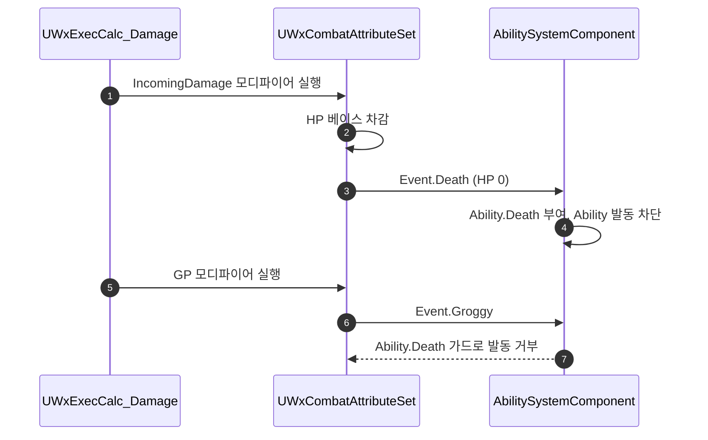

# 사망·그로기 발동 순서와 메타 어트리뷰트 소비 정리

## 계획

### 목표

Max 베이스 스케일 수정에 이어 나온 코드 리뷰 지적을 적용한다. 값이 그대로인 Max 갱신이 짝 어트리뷰트 베이스를 헛되이 다시 쓰는 것을 막고, 같은 파일에 남아 있던 현재값·베이스 혼동(메타 어트리뷰트 소비)을 없애며, 치명적인 한 방에서 그로기가 사망보다 먼저 발동하는 순서를 바로잡는다. GP·UP를 Max 쌍 비례 스케일에서 빼는 건은 이번 범위 밖이다.

### 수정 범위

| 파일 | 수정할 내용 | 구분 |
|---|---|---|
| `Plugins/WxCombat/Source/WxCombat/Private/AbilitySystem/Attribute/WxCombatAttributeSet.cpp` | `AdjustAttributeForMaxChange`에 같은 값 조기 반환 추가, `PostGameplayEffectExecute`의 피해량 읽기를 베이스로 전환하고 ASC 조회를 함수 앞으로 단일화 | 수정 |
| `Plugins/WxCombat/Source/WxCombat/Private/AbilitySystem/Effect/WxEffect_Damage.cpp` | 출력 모디파이어 순서를 IncomingDamage → GP 로 교체 | 수정 |

### 접근 방식

- **같은 값 조기 반환**: `AdjustAttributeForMaxChange` 진입 조건에 `FMath::IsNearlyEqual(OldValue, NewValue)`를 더한다. `PostAttributeChange`는 값이 그대로여도 호출되고, Max 쪽 aggregator가 더티해질 때마다 짝 어트리뷰트 베이스를 같은 값으로 다시 쓰며 변경 델리게이트를 울린다. 베이스 쓰기가 멱등이라 값이 틀어지진 않지만 VM·위젯이 헛돈다.

- **피해량을 베이스에서 읽는다**: `SetIncomingDamage(0.f)`가 `SetNumericAttributeBase` 래퍼라 aggregator 몫을 지우지 못한다. 읽기가 현재값이면 IncomingDamage에 붙은 지속형 모디파이어 몫이 매 타격 피해량에 영구히 얹힌다. 그런 GE는 지금 없지만 헤더에서 `BlueprintReadOnly`로 노출돼 저작 실수로 닿을 수 있고, 직전 작업이 HP에서 없앤 것과 정확히 같은 형태다.

- **`Data.EvaluatedData.Magnitude`를 쓰지 않는 이유**: 그 값은 이번 모디파이어 하나의 크기라 베이스에 누적된 값과 다르다. 누적 후 소비라는 지금 의미를 유지하려면 베이스를 읽어야 하고, `MultiplyAdditive` 같은 다른 Op가 들어와도 어긋나지 않는다.

- **ASC 조회 단일화**: 함수 앞에서 한 번 얻고 없으면 조기 반환한 뒤 세 분기가 공유한다. `PostAttributeChange`가 이미 쓰는 형태다. ASC가 없으면 `Set...` 래퍼가 `ensure`로 아무것도 못 하므로 동작 차이는 없다.

- **출력 모디파이어 순서 교체**: 엔진이 모디파이어마다 `PostGameplayEffectExecute`를 부르므로 출력 순서가 곧 이벤트 순서다. IncomingDamage를 먼저 내보내면 치명적인 한 방에서 HP가 먼저 0이 되어 `Event.Death`가 뜨고, 뒤이은 GP 분기의 `Event.Groggy`는 그로기 어빌리티의 `ActivationBlockedTags(Ability.Death)`와 사망 어빌리티의 `BlockAbilitiesWithTag(Ability)` 양쪽에 막힌다.

### 검증 근거

- `UWxAbility_Groggy`는 `ActivationBlockedTags`에 `Ability.Death`를 이미 선언해 두었다. 순서 때문에 그 가드가 무력화됐을 뿐이라, 순서만 바꾸면 기존 선언이 제 역할을 한다.
- 그로기와 사망은 둘 다 `Override` 그룹이라 `CanBeCanceled()`가 false다. 사망의 `CancelAbilitiesWithTag(Ability)`로는 이미 뜬 그로기를 끊지 못하고, 0.1초 폴링이 `Ability.Death`를 보고 스스로 끝낼 때까지 시체가 그로기 몽타주와 DrainGP를 문다.
- `UWxEffectComponent_DamageResponse`는 어트리뷰트가 아니라 `GESpec.GetModifiedAttribute()->TotalMagnitude`를 읽고 모든 모디파이어 실행 뒤에 돈다. 출력 순서 교체에 영향을 받지 않으며, "같은 히트의 GP로 뜬 그로기" 분기도 그대로 유효하다.
- 가드 브레이크 판정은 ExecCalc 안에서 동적 태그로 끝나므로 SP 차감과 IncomingDamage의 상대 순서를 타지 않는다.
- 치명타에서도 GP 모디파이어 자체는 실행돼 GP가 최대치로 남는다. 순서 교체 전과 같아 이번 변경으로 달라지지 않는다.

---

## 완료

### 수정한 파일

| 파일 | 수정한 내용 | 구분 |
|---|---|---|
| `Plugins/WxCombat/Source/WxCombat/Private/AbilitySystem/Attribute/WxCombatAttributeSet.cpp` | `AdjustAttributeForMaxChange` 같은 값 조기 반환, 피해량을 IncomingDamage 베이스에서 읽도록 변경, ASC 조회를 함수 앞으로 단일화 | 수정 |
| `Plugins/WxCombat/Source/WxCombat/Private/AbilitySystem/Effect/WxEffect_Damage.cpp` | 출력 모디파이어 순서를 IncomingDamage → GP 로 교체 | 수정 |

### 구현·결정과 그 이유

- **같은 값 조기 반환**: 진입 조건에 `FMath::IsNearlyEqual`을 더했다. 값이 그대로면 스케일 결과도 그대로라 쓰기가 무의미한데, 그 쓰기가 짝 어트리뷰트 델리게이트를 울려 구독자를 헛돌린다. 엄밀 비교 대신 근사 비교를 쓴 건 엔진 표준 구현과 같은 판단이고, Max가 미세하게 흔들릴 때 배율을 건너뛰어도 비율 오차가 그만큼 작기 때문이다.

- **피해량을 베이스에서 읽는다**: 리셋이 베이스만 지우는 이상, 읽기가 현재값이면 지속형 모디파이어 몫이 매 타격 피해량에 영구히 얹힌다. 직전 작업이 HP에서 없앤 것과 같은 형태가 같은 블록에 남아 있었다. `Data.EvaluatedData.Magnitude`는 이번 모디파이어 하나의 크기라 누적 후 소비라는 지금 의미를 바꾸므로 쓰지 않았다.

- **ASC 조기 반환**: 세 분기가 모두 ASC를 필요로 해 함수 앞에서 한 번 얻는다. 없으면 `Set...` 래퍼가 어차피 아무것도 못 하므로 분기 전체를 건너뛰어도 동작이 같다.

- **출력 순서 교체**: 그로기 어빌리티는 `ActivationBlockedTags`에 `Ability.Death`를 이미 선언해 두었는데, GP가 먼저 실행돼 HP가 아직 안 깎인 시점에 발동을 판정하느라 그 가드가 무력화됐다. 순서를 바꿔 가드가 볼 것을 먼저 만들어 주는 쪽을 택했다. 그로기 쪽에 조건을 새로 다는 대신 순서를 고친 이유는, 선언은 이미 옳고 틀린 건 순서뿐이기 때문이다.

### 계획 대비 달라진 점

계획대로.

### 후속 과제

- 그로기 도중 사망하는 경로는 순서와 무관하게 남는다. 폴링이 `Ability.Death`를 보고 그로기를 끝낼 때 `ResumeLogic("Groggy")`가 사망의 `StopLogic("Death")` 뒤에 실행되므로, 멈춘 브레인이 되살아나는지 엔진 동작을 확인해야 한다.
- GP·UP가 채워 올리는 게이지인데도 Max 쌍 비례 스케일을 함께 받는다. 이번 범위에서 제외했다.
- PIE 실증은 하지 않았다. 그로기 게이지가 찬 상태에서 치명적인 한 방을 맞혔을 때 시체가 `Ability.Groggy`를 물지 않는지 보면 된다.
