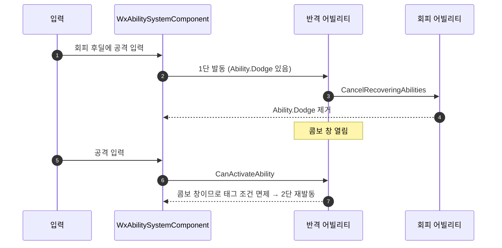

# 콤보 창 재발동을 진입 태그 조건에서 면제

## 계획

### 목표
회피 반격(`GA_TemplatePlayer_Attack_DodgeCounter`)의 2단 콤보가 재생되지 않는 문제를 고친다. 진입 태그(`Ability.Dodge`)가 1단 도중 사라지는데 콤보 재발동이 그 조건을 다시 묻기 때문이다.

### 수정 범위
| 파일 | 수정할 내용 | 구분 |
|---|---|---|
| `Plugins/WxCombat/Source/WxCombat/Public/AbilitySystem/Ability/WxAbilityBase.h` | `DoesAbilitySatisfyTagRequirements` 오버라이드 선언 추가 | 수정 |
| `Plugins/WxCombat/Source/WxCombat/Private/AbilitySystem/Ability/WxAbilityBase.cpp` | 콤보 창 중인 자기 재발동은 태그 조건 검사를 건너뛰도록 구현 | 수정 |

### 접근 방식
- **콤보 창 재발동은 진입이 아니라 연장**: 반격 1단이 발동하면서 후딜 중인 회피를 끊고, 그 종료가 `Ability.Dodge`를 걷어간다. 2단은 엔진 순정 재발동이라 `CanActivateAbility`를 다시 통과해야 하는데 여기서 거절된다. 에셋에 우회용 태그를 심는 대신, 이미 성립한 액션의 다음 단은 진입 조건을 다시 묻지 않도록 한다. `FindActivationGroupBlocker`가 "점유자가 후보 자신이면 콤보 진행"이라고 가르는 것과 같은 규칙을 태그 조건에도 적용하는 셈이다.
- **면제 범위의 안전 근거**: 콤보 창은 취소되지 않은 활성 배타 어빌리티에서만 열린다. 피격·그로기·사망은 `CancelAbilitiesWithTag`로 공격을 먼저 끊으므로 `IsActive()` 가드에 걸려 면제에 닿지 않는다. 쿨다운·코스트는 별도 단계라 그대로 검사된다.

---

## 완료

### 수정한 파일
| 파일 | 수정한 내용 | 구분 |
|---|---|---|
| `Plugins/WxCombat/Source/WxCombat/Public/AbilitySystem/Ability/WxAbilityBase.h` | `DoesAbilitySatisfyTagRequirements` 오버라이드 선언 | 수정 |
| `Plugins/WxCombat/Source/WxCombat/Private/AbilitySystem/Ability/WxAbilityBase.cpp` | 활성 상태 + 콤보 창이면 `true`, 아니면 순정 위임 | 수정 |

### 구현·결정과 그 이유
- **에셋이 아니라 기반 클래스에서 해결**: 회피 반격만 겪는 문제가 아니라, 진입 조건이 한순간만 참인 모든 콤보 세트가 같은 함정을 밟는다. 에셋마다 태그를 덧대면 세트가 늘 때마다 같은 실수가 반복된다.
- **`IsActive()`를 가드로 둔 이유**: `ActionPhase`는 인스턴스에 남는 값이라 종료·취소 뒤에도 콤보 창으로 남아 있을 수 있다. 엔진의 다른 호출부(`GetActivatableGameplayAbilitySpecsByAllMatchingTags`)는 CDO로 부르는데, CDO는 `IsActive()`가 false라 순정 경로를 그대로 탄다.
- **`ActivationRequiredTags`만 골라내지 않은 이유**: 순정 함수를 부분 재구현해야 해서 엔진 판정을 중복시킨다. 면제가 걸리는 조건 자체가 이미 좁고(취소되지 않은 활성 배타 어빌리티의 자기 재발동), 위험한 상태들은 공격을 먼저 취소하는 쪽으로 걸러진다.

### 계획 대비 달라진 점
- 계획대로

### 후속 과제
- 콤보 창 동안 `ActivationBlockedTags`도 함께 면제된다. 실질 영향은 `Movement.InAir` 하나로, 콤보 도중 낙하가 시작되면 다음 단이 이어진다. 문제가 되면 그때 좁힌다.
- 인게임 동작(회피 → 반격 1단 → 2단, 라이트 4연타 회귀)은 빌드까지만 확인했고 플레이 검증은 남았다.
