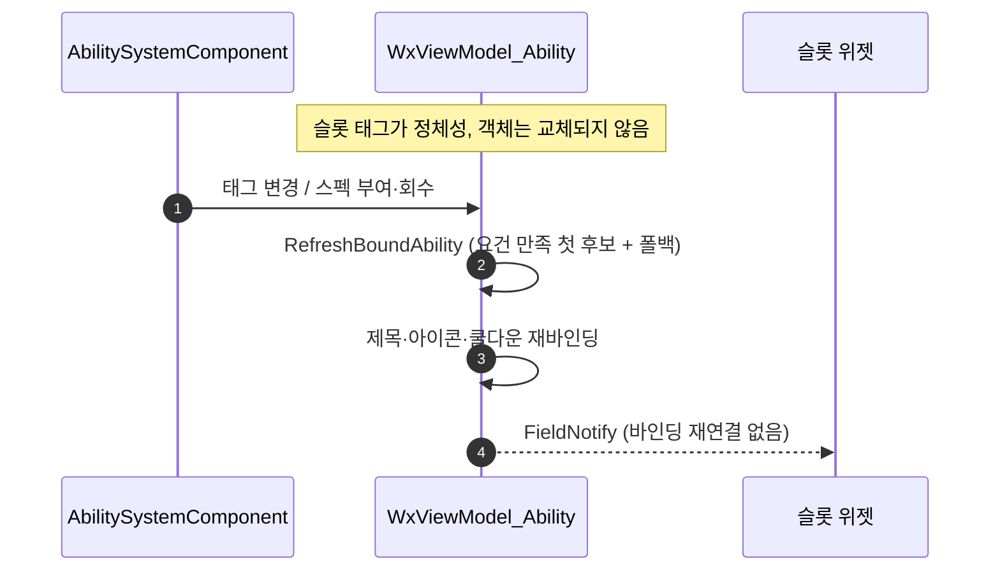

# 스킬 슬롯 뷰모델 교체 경로 제거

## 계획

### 목표
슬롯 하나에 뷰모델 하나가 위젯 수명 내내 살고, 변형은 그 뷰모델이 대상만 갈아타도록 바꾼다. 궁극기처럼 효과가 갈리는 변형을 앞으로 슬롯에 넣을 예정인데, 지금의 `SetViewModel` 교체 경로는 엔진 훅을 끄고 소스 이름을 역추적하는 함정이 많아 표시가 어긋났을 때 추적이 어렵다.

### 수정 범위
| 파일 | 수정할 내용 | 구분 |
|---|---|---|
| `Plugins/WxUI/.../Private/MVVM/WxViewModel_Ability.cpp` | `RefreshBoundAbility` 후보 선택을 태그 요건 판정 + 폴백으로 강화. `FlushActivationRefresh` 가 재선택을 유발 | 수정 |
| `Plugins/WxUI/.../Public/MVVM/WxViewModel_Ability.h` | 클래스 주석 정정 (상태 태그로 대상을 바꾸지 않는다는 서술이 사실과 달라짐) | 수정 |
| `Source/WxGame/MVVM/WxViewModelResolver_Ability.{h,cpp}` | 순수 팩토리로 환원. 슬롯 태그를 VM 캐시 키로, 스위처 부착 제거, `FindAbilitySystem` 이관 | 수정 |
| `Source/WxGame/MVVM/WxAbilitySlotSwitcher.{h,cpp}` | 파일 삭제 | 삭제 |

### 접근 방식
- **판정 주체를 하나로**: 리졸버가 첫 생성 때 고르고 스위처가 이후를 감시하던 이원 구조를 없앤다. 뷰모델이 슬롯 태그를 정체성으로 갖고 자기 대상만 다시 고른다. 뷰모델 객체가 교체되지 않으므로 `UMVVMView::SetViewModel`, `bSetManually`, 소스 이름 역추적이 전부 사라진다.
- **선택 규칙은 기존 것을 그대로 이전**: `UWxAbilitySlotSwitcher::PickAbility` 본문(태그 요건 만족하는 첫 후보 → 직전 후보 유지 → 첫 후보)을 `RefreshBoundAbility` 로 옮긴다. 새 저작 필드는 만들지 않고 어빌리티의 발동 태그 조건을 그대로 쓴다.
- **재선택 통로 추가**: 지금 태그 변화는 발동 가능 여부만 다시 본다. 형태 태그로 변형이 갈리려면 태그 변화도 대상 재선택을 유발해야 하므로, 코얼레싱 지점인 `FlushActivationRefresh` 에서 `RefreshBoundAbility` 를 먼저 부른다.

---

## 완료

### 수정한 파일
| 파일 | 수정한 내용 | 구분 |
|---|---|---|
| `Plugins/WxUI/.../Private/MVVM/WxViewModel_Ability.cpp` | `RefreshBoundAbility` 매칭을 요건 판정 + 폴백으로 교체, `FlushActivationRefresh` 가 재선택을 먼저 수행 | 수정 |
| `Plugins/WxUI/.../Public/MVVM/WxViewModel_Ability.h` | 클래스 주석을 새 선택 규칙으로 정정 | 수정 |
| `Source/WxGame/MVVM/WxViewModelResolver_Ability.cpp` | 순수 팩토리로 환원, ASC 조회를 자체 보유, 슬롯 태그를 VM 키로 | 수정 |
| `Source/WxGame/MVVM/WxViewModelResolver_Ability.h` | 클래스 주석에서 스위처 언급 제거 | 수정 |
| `Source/WxGame/MVVM/WxAbilitySlotSwitcher.{h,cpp}` | 삭제 | 삭제 |

### 구현·결정과 그 이유
- **뷰모델 교체 대신 대상 재바인딩**: `UMVVMView::SetViewModel` 은 해당 소스를 `bSetManually` 로 굳혀 리졸버의 생성·정리 훅을 영구히 끈다. 그 때문에 스위처가 재무장·폰 교체·소스 이름 역추적을 전부 떠안고 있었다. 뷰모델 객체를 고정하면 이 셋이 한꺼번에 사라지고 위젯 바인딩도 다시 걸리지 않는다.
- **VM 캐시 키를 슬롯 태그로**: 기존에는 고른 후보의 애셋 태그를 키로 써서 후보마다 뷰모델이 갈라졌다. 슬롯 태그를 키로 하면 슬롯 하나에 뷰모델 하나가 되어 교체 자체가 불필요해진다.
- **저작 필드 신설 없음**: 변형 구분은 어빌리티가 이미 가진 발동 태그 조건으로 충분하다. 전용 필드를 두면 같은 내용을 두 곳에 적게 되고 어긋남이 새 디버깅 대상이 된다.
- **태그 변화가 재선택을 유발**: 기존 `FlushActivationRefresh` 는 발동 가능 여부만 다시 봤다. 변형을 가르는 근거가 태그이므로 대상 선택도 같은 지점에서 해야 한다. 코얼레싱이 이미 걸린 자리라 추가 티커가 필요 없다.
- **입력 라우팅 미변경**: 같은 입력을 공유하는 후보를 순서대로 시도하는 동작은 콤보·반격 연결이 기대고 있어 손대지 않았다. UI 후보 집합은 애셋 태그로 좁혀지므로 두 경로가 충돌하지 않는다.

### 계획 대비 달라진 점
- 계획대로. `RefreshBoundAbility` 말미가 이미 `RefreshActivationState` 를 부르므로 실제 변형 전환 시에만 그 호출이 한 번 겹치지만, 대상이 그대로면 조기 반환하는 흔한 경로에는 영향이 없어 그대로 두었다.

### 후속 과제
- `GA_Template_Attack_DodgeCounter` 의 AssetTags 에 `Ability.Dodge` 가 들어 있는지 에디터 확인. 들어 있다면 회피 슬롯 후보가 둘이 되어 회피 중에 아이콘이 반격으로 튄다. 그 경우 애셋 태그에서 빼고 `ActivationRequiredTags` 로만 남긴다.
- PIE 실지 확인 미수행. 스킬 HUD 여섯 칸 표시, 쿨다운 스윕, 사망 시 아이콘 유지(폴백)를 확인해야 한다.
- 클라이언트에서 부여 통지가 오지 않는 기존 문제는 범위 밖으로 남겼다. 필요해지면 `UWxAbilitySystemComponent` 가 `OnGiveAbility`/`OnRemoveAbility` 를 오버라이드해 델리게이트를 내는 방식으로 다룬다.
