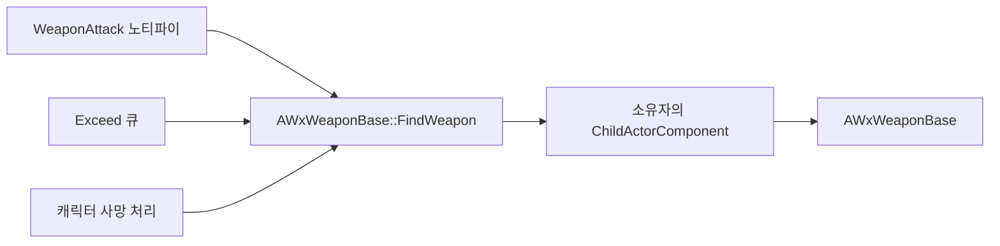

# 무기 조회 경로 일원화

## 계획

### 목표
"이 캐릭터의 무기는 무엇인가"에 답하는 코드가 두 벌이라 서로 다른 액터를 가리킬 수 있다. 조회 구현을 하나로 줄이고, 그 기준을 무기가 실제로 만들어지는 자리인 ChildActorComponent로 세운다. (WxCombat 코드 리뷰 12번)

### 수정 범위
| 파일 | 수정할 내용 | 구분 |
|---|---|---|
| `Plugins/WxCombat/.../Private/Weapon/WxWeaponBase.cpp` | `FindWeapon` 본문을 부착 액터 순회에서 ChildActorComponent 순회로 교체 | 수정 |
| `Source/WxGame/Character/WxCharacterBase.h` | `GetEquippedWeapon` 선언과 함께 쓰임이 없어지는 `AWxWeaponBase` 전방 선언 제거 | 수정 |
| `Source/WxGame/Character/WxCharacterBase.cpp` | `GetEquippedWeapon` 정의 제거, 사망 처리가 `FindWeapon`을 직접 호출 | 수정 |

### 접근 방식
- **유일한 구현은 WxCombat에 둔다**: 플러그인 규칙상 `WxCombat`은 `WxGame`을 볼 수 없어 노티파이·큐가 캐릭터 접근자를 부르는 방향은 불가능하다. 캐릭터가 WxCombat의 조회를 쓰는 방향 하나만 남는다.
- **기준을 부착에서 생성 경로로 바꾼다**: 무기는 전부 캐릭터 생성자의 ChildActorComponent가 만들고 BP는 클래스만 꽂는다. 부착 액터 목록은 카메라·인디케이터도 들어오는 자리라 무기 전용 통로가 아니다. 순회 형태는 같은 모듈의 락온 포인트 조회 관용구를 따른다.
- **캐릭터 측 접근자는 없앤다**: 클래스 안 한 군데에서만 쓰여 남겨도 얇은 전달자이고, 남으면 "더 싸고 권위 있는 다른 경로"로 보여 분기가 다시 자란다. 슬롯 컴포넌트 멤버 자체는 BP가 클래스를 꽂는 자리라 그대로 둔다.

---

## 완료

### 수정한 파일
| 파일 | 수정한 내용 | 구분 |
|---|---|---|
| `Plugins/WxCombat/.../Private/Weapon/WxWeaponBase.cpp` | `FindWeapon`을 ChildActorComponent 순회로 교체, 기준을 주석으로 남김 | 수정 |
| `Source/WxGame/Character/WxCharacterBase.h` | `GetEquippedWeapon` 선언과 쓰임이 없어진 `AWxWeaponBase` 전방 선언 제거 | 수정 |
| `Source/WxGame/Character/WxCharacterBase.cpp` | `GetEquippedWeapon` 정의 제거, 사망 처리가 `FindWeapon`을 직접 호출 | 수정 |

### 구현·결정과 그 이유
- **조회 구현을 WxCombat 한 곳에 모았다**: 노티파이·큐는 플러그인 안에 있어 캐릭터를 볼 수 없으니, 남는 방향은 캐릭터가 플러그인 쪽 조회를 쓰는 것 하나뿐이다. 두 벌이 남아 있는 한 "어느 쪽이 맞나"는 질문이 계속 생긴다.
- **기준을 무기 슬롯으로 옮겼다**: 부착 액터 목록은 카메라·인디케이터처럼 잠깐 붙는 액터도 들어오는 공용 자리라, 무기가 하나라는 가정이 깨지는 순간 답이 갈린다. 슬롯은 무기를 만든 주체라 그 가정이 구조로 보장된다.
- **캐릭터 접근자는 지웠다**: 한 군데에서만 쓰여 남겨도 얇은 전달자이고, 남아 있으면 더 싸 보이는 지름길로 읽혀 분기가 다시 자란다. 슬롯 컴포넌트 멤버는 BP가 무기 클래스를 꽂는 자리라 그대로 뒀다.
- **정적 조회 함수는 유지했다**: 널 검사 한 줄을 감싼 래퍼가 아니라 실제 탐색이고, 호출부가 셋이라 풀어쓰면 같은 순회가 세 벌이 된다. 같은 모듈의 락온 포인트 조회와 같은 형태다.

### 계획 대비 달라진 점
- 계약 주석은 헤더가 아니라 구현 옆에 뒀다. 같은 시각 다른 세션이 런타임 부착 함수를 걷어내고 있어(리뷰 13번), 곧 사라질 경로를 헤더 계약으로 적는 대신 "부착 액터 목록은 기준이 되지 못한다"는 이유만 순회 위에 남겼다.

### 후속 과제
- PIE 실지 확인 미수행. 평타 적중, Exceed 버프 중 무기 메시 이펙트 부착, 스윙 도중 사망 시 판정 해제 세 갈래를 봐야 한다.
- 빌드는 2회차에 성공했다. 1회차 실패는 같은 시각 다른 세션이 저장 중이던 소환물 서브시스템 쪽이고 이번 변경과 무관하다.
