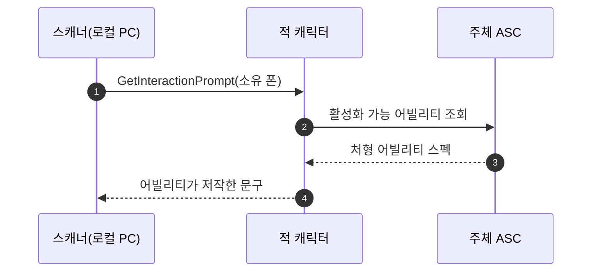

# 처형 프롬프트를 처형 어빌리티에서 FText로 저작

## 계획

### 목표

적에게 뜨는 처형 상호작용 문구가 코드에 박힌 비번역 문자열이라(모듈 리뷰 WxGame #7) 수집 경로에 실리지 않고 바꾸려면 재빌드가 필요하다. 문구의 주인을 대상(적)이 아니라 실제로 나갈 행동인 처형 어빌리티로 옮겨, BP 디폴트에서 `FText`로 저작하게 한다.

### 수정 범위

| 파일 | 수정할 내용 | 구분 |
|---|---|---|
| `Plugins/WxCombat/Source/WxCombat/Public/AbilitySystem/Ability/WxAbility_Finisher.h` | `FText InteractionPrompt` 저작 프로퍼티 추가 | 수정 |
| `Plugins/WxCombat/Source/WxCombat/Private/AbilitySystem/Ability/WxAbility_Finisher.cpp` | 생성자에서 `NSLOCTEXT` 기본값 부여 | 수정 |
| `Plugins/WxCore/Source/WxCore/Public/WxInteractable.h` | `GetInteractionPrompt`에 주체 인자 추가 | 수정 |
| `Source/WxGame/Character/WxEnemyCharacter.h`, `.cpp` | 주체의 처형 어빌리티에서 문구 조회 | 수정 |
| `Plugins/WxDialogue/Source/WxDialogue/Public/WxDialogueActor.h`, `.cpp` | 시그니처만 맞춤(인자 미사용) | 수정 |
| `Plugins/WxInventory/Source/WxInventory/Public/Items/WxItemPickup.h`, `.cpp` | 시그니처만 맞춤(인자 미사용) | 수정 |
| `Plugins/WxWorld/Source/WxWorld/Public/Device/WxDevice.h`, `.cpp` | 시그니처만 맞춤(인자 미사용) | 수정 |
| `Plugins/WxWorld/Source/WxWorld/Private/Interaction/WxInteractionScannerComponent.cpp` | `GetPrompts`가 소유 폰을 넘김 | 수정 |

### 접근 방식

- **문구는 어빌리티가 소유한다**: `EditDefaultsOnly` `FText`를 public으로 둔다. 어빌리티의 저작 데이터를 밖에서 읽는 것은 입력 라우팅이 `ActivationInputAction`을 읽는 것과 같은 기존 관례라 별도 접근자를 만들지 않는다. 생성자에서 `NSLOCTEXT`로 지금과 같은 문구를 기본값으로 넣어, BP를 아직 채우지 않아도 화면이 비지 않고 수집 경로에는 실린다.

- **계약에 주체 인자 복원**: 어떤 처형이 나갈지는 주체가 가진 어빌리티가 정하므로 문구도 주체를 봐야 답할 수 있다. 뒤잡 판정 때문에 `CanInteract`가 주체 인자를 되찾은 선례와 같은 축이다. 대화·픽업·장치는 자기 데이터로 답하므로 인자를 쓰지 않는다.

- **지목은 클래스로**: 적은 주체 ASC의 활성화 가능 목록을 훑어 처형 어빌리티로 캐스팅되는 첫 스펙의 문구를 돌려준다. 프로퍼티를 읽으려면 어차피 구체 타입이 필요하므로 애셋 태그 검사를 겹치지 않는다. 스펙은 소유 클라에 복제되므로 표시 시점에도 보이며, 스캐너가 상호작용 어빌리티를 클라에서 같은 방식으로 훑는 것이 이미 검증된 경로다.

- **앞잡·뒤잡 공용 한 줄**: 문구는 변형 구조체가 아니라 어빌리티 상단에 하나만 둔다. 둘로 가르려면 프롬프트 시점에도 그로기 판정을 되풀이해야 한다. 나중에 갈라야 하면 그때 필드를 변형 안으로 내린다.

---

## 완료

### 수정한 파일
| 파일 | 수정한 내용 | 구분 |
|---|---|---|
| `Plugins/WxCombat/.../Public/AbilitySystem/Ability/WxAbility_Finisher.h` | 저작용 `FText InteractionPrompt` 추가 | 수정 |
| `Plugins/WxCombat/.../Private/AbilitySystem/Ability/WxAbility_Finisher.cpp` | 생성자에서 `NSLOCTEXT` 기본 문구 부여 | 수정 |
| `Source/WxGame/Character/WxEnemyCharacter.cpp` | 프롬프트를 주체의 처형 어빌리티에서 조회 | 수정 |

### 구현·결정과 그 이유
- **문구를 어빌리티가 소유한다**: 대상이 띄우는 문구지만 그 문구가 약속하는 행동은 주체가 가진 어빌리티다. 그래서 `EditDefaultsOnly` `FText`를 어빌리티에 두고 밖에서 직접 읽는다. 어빌리티의 저작 데이터를 밖에서 읽는 것은 입력 라우팅이 `ActivationInputAction`을 읽는 것과 같은 관례라 접근자를 따로 만들지 않았다.
- **기본값을 `NSLOCTEXT`로 넣었다**: BP를 아직 채우지 않아도 화면 문구가 사라지지 않고, 코드에 남은 마지막 문구도 수집 namespace/key를 갖는다. 문구 자체는 지금 화면에 뜨던 것과 같게 두어 표시가 바뀌지 않는다.
- **계약에 주체 인자를 넣지 않았다**: 프롬프트는 로컬 표시라 주체는 언제나 로컬 플레이어다. 그래서 적이 직접 0번 플레이어 폰을 집어 그 ASC에서 어빌리티를 찾는다. 같은 파일의 보상 지급이 이미 같은 전제를 쓰고 있고, 계약을 건드리면 인자를 쓰지 않는 대화·픽업·장치까지 함께 바뀐다. 분할 화면이 생기면 그때 계약에 주체를 싣는다.
- **지목은 클래스 캐스트로 한다**: 프로퍼티를 읽으려면 어차피 구체 타입이 필요해 애셋 태그 검사를 겹치지 않았다. 스펙은 소유 클라에 복제되므로 표시 시점에도 보이며, 스캐너가 상호작용 어빌리티를 클라에서 같은 방식으로 훑는 것이 이미 검증된 경로다.

### 계획 대비 달라진 점
- 승인받은 계획은 `IWxInteractable::GetInteractionPrompt`에 주체 인자를 되살려 스캐너가 소유 폰을 넘기는 안이었다. 인자 없이 되지 않느냐는 지적을 받아 적이 로컬 플레이어를 직접 집는 쪽으로 바꿨다. WxCore 계약과 대화·픽업·장치·스캐너 6개 파일이 수정 대상에서 빠졌다.

### 후속 과제
- 처형 어빌리티 BP의 문구는 아직 비어 있어 C++ 기본값이 뜬다. 한국어 문구는 BP 디폴트에서 채우면 되고, 이번 세션에서는 unreal-mcp 연결이 끊겨 대신 넣지 못했다.
- PIE 미실시. 확인 2건: ① 그로기 적 앞·비전투 적 뒤에서 문구가 그대로 뜬다 ② BP 프로퍼티를 바꾸면 재빌드 없이 문구가 따라온다.
- `Docs/Programmer/module_review_WxGame.md`의 7번 항목은 그대로 두었다. `module-review` 재실행 시 갱신된다.
