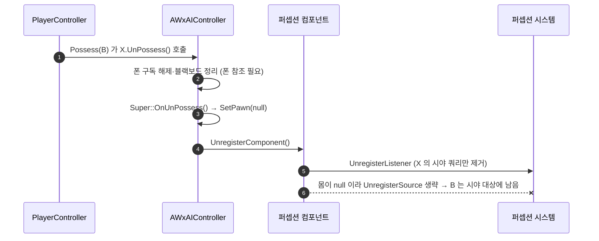

# 빙의 해제 때 폰이 시야 자극원에서 빠지지 않게 한다

## 계획

### 목표
`AWxAIController::OnUnPossess` 가 `Super::OnUnPossess()` 보다 먼저 퍼셉션을 언레지스터해, 엔진 `CleanUp` 이 방금 놓은 폰을 모든 센스의 자극원에서 영구히 뺀다(`/module-review` WxAI 2번 🟡). 실시간 파티원 교체가 들어오면 플레이어가 넘겨받은 캐릭터를 적 AI 가 영영 보지 못하므로, "폰을 놓은 동안 감각을 재운다"는 설계는 두고 재우는 시점만 폰 참조가 끊긴 뒤로 옮긴다.

### 수정 범위
| 파일 | 수정할 내용 | 구분 |
|---|---|---|
| `Source/WxGame/Controller/WxAIController.cpp` | `OnUnPossess` 의 퍼셉션 언레지스터 블록을 `Super::OnUnPossess()` 뒤로 옮기고, 순서 함정을 주석 한 줄로 남긴다 | 수정 |

### 접근 방식
- **Super 앞뒤로 정리를 가른다**: 앞에는 폰이 필요한 정리(구독 해제·블랙보드), 뒤에는 폰이 없어야 하는 정리(감각 재우기)를 둔다. `CleanUp` 은 몸(아우터 컨트롤러의 `GetPawn()`)이 null 이면 자극원 해제를 건너뛰고, 폰 참조는 Super 안의 `SetPawn(NULL)` 에서 끊긴다.
- **엔진 확인(5.8)**: 시야 센스도 리스너 해제를 "게임에서 빠진다"로 보지 않고 리스너 쪽 쿼리만 지운다. 명시 해제·다른 컨트롤러의 빙의·컨트롤러 파괴·폰 파괴가 모두 이 오버라이드를 지난다. 파괴되는 폰은 자극원 등록 때 걸린 EndPlay 훅이 같은 호출 안에서 빼므로 목록에 남지 않고, 현재 게임플레이(적 사망 → 파괴)의 차이도 없다.
- **Super 와 언레지스터 사이 구간은 무해하다**: Super 뒤 엔진 정리(경로 추적·BT·게임플레이 태스크), BT 노드의 `OnCeaseRelevant`, 폰 측 컨트롤러 변경 통지는 퍼셉션을 읽지 않는다. 리스너·시야 쿼리 제거는 리스너 ID 로만 동작해 몸이 필요 없다.

---

## 완료

### 수정한 파일
| 파일 | 수정한 내용 | 구분 |
|---|---|---|
| `Source/WxGame/Controller/WxAIController.cpp` | `OnUnPossess` 의 퍼셉션 언레지스터를 `Super::OnUnPossess()` 뒤로 옮기고, 순서 함정을 주석 한 줄로 추가 | 수정 |

### 구현·결정과 그 이유
- **재우는 설계는 두고 시점만 옮겼다**: 결함은 감각을 재우는 것 자체가 아니라 몸이 아직 붙어 있을 때 재우는 순서였다. 엔진은 몸이 없으면 자극원 해제를 알아서 건너뛰므로, Super 가 폰 참조를 끊은 뒤에 재우는 것만으로 리스너 해제와 자극원 해제가 갈린다. 새 호출·상태·분기가 필요 없다.
- **해제 후 폰을 다시 등록하는 방식은 택하지 않았다**: 원인을 둔 채 부작용만 되돌리는 것이고, 되돌리기 전에 그 폰을 보던 적에게 시야 상실 자극이 한 번 나간다. 등록 경로를 하나 더 두는 셈이라 교체 구현 시 따져야 할 것도 늘어난다.
- **Super 를 기준선으로 삼았다**: 앞에는 폰이 필요한 정리, 뒤에는 폰이 없어야 하는 정리를 둔다. 기존 윗부분 주석("Super 에서 폰 참조를 끊으므로 그보다 앞에서")과 짝을 이루게 했다. 순서를 되돌리면 조용히 재발하는 함정이라 이유를 주석 한 줄로 남겼다.
- **검증**: UE 5.8 `WxEditor Win64 Development` 빌드 `Result: Succeeded`(로그에 경고·에러 없음). PIE 런타임 실측은 하지 않았다.

### 계획 대비 달라진 점
- 계획대로.

### 후속 과제
- **PIE 실측 불가(교체 기능 부재)**: 파티원 교체를 구현할 때 ① 플레이어가 넘겨받은 캐릭터를 적 AI 가 감지하는지 ② 동료 AI 가 된 캐릭터의 감지가 정상인지 확인한다. 적 처치 → 파괴 경로의 회귀는 기존 플레이로 확인할 수 있다.
- **리뷰 문서 강제 갱신 필요**: `/module-review` 는 모듈 경로 변경만 보고 갱신하는데 이번 수정은 WxGame 경로라, WxAI 문서 2번이 자동으로 빠지지 않는다. `/module-review WxAI` 로 재리뷰해야 한다.
