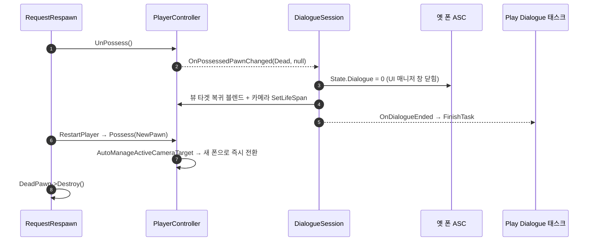

# 빙의가 바뀌면 대화 세션을 접는다

## 계획

### 목표
대화 세션을 닫는 길이 뷰의 `Advance()` 와 "다음 대화의 시작"뿐이라, 대화 중 사망·리스폰으로 빙의가 바뀌면 세션이 굳는다(`/module-review` WxDialogue 1번 🔴). UI 매니저가 관찰을 새 폰으로 옮기며 대화 창을 닫고 새 폰 ASC 에는 `State.Dialogue` 가 없어 창이 다시 서지 않으므로, `Play Dialogue` 태스크가 Running 에 고착돼 퀘스트가 멈추고 대화 카메라 액터도 수명을 못 받아 남는다. 세션 수명을 태그를 올린 폰의 빙의에 묶어, 빙의가 바뀌면 기존 단일 종료 경로 `EndDialogue()` 로 접는다.

### 수정 범위
| 파일 | 수정할 내용 | 구분 |
|---|---|---|
| `Plugins/WxDialogue/Source/WxDialogue/Public/WxDialogueSessionComponent.h` | `BeginPlay`/`EndPlay` 오버라이드, `UFUNCTION() HandlePossessedPawnChanged` 선언, `APawn` 전방선언. 클래스 주석에 수명 규칙 한 줄, `TaggedAbilitySystem` 주석 정정 | 수정 |
| `Plugins/WxDialogue/Source/WxDialogue/Private/WxDialogueSessionComponent.cpp` | 위 3 함수 구현, 카메라 스폰 옆 거짓 주석("컨트롤러가 사라지면 카메라도 정리된다") 정정 — 오너 대입은 유지 | 수정 |

### 접근 방식
- **세션이 오너 컨트롤러의 `OnPossessedPawnChanged` 를 직접 구독**: `BeginPlay` 에서 붙이고 `EndPlay` 에서 뗀다. 같은 PC 컴포넌트가 같은 델리게이트를 듣는 `UWxPlayerLayoutComponent` 선례 그대로라 신규 컴포넌트·신호·PC 결합이 없다.
- **핸들러는 "활성 세션이면 `EndDialogue()`" 한 줄**: 옛 ASC 태그 회수 → 카메라 복귀·수명 부여 → `OnDialogueEnded` 발화까지 기존 종료 경로가 태스크 고착·카메라 누수·태그 잔존을 함께 해소한다. 폰 동일성은 가리지 않는다 — UI 매니저가 모든 전이에서 창을 닫으므로 조건을 두면 그 틈에서 다시 굳는다.
- **`TaggedAbilitySystem` 유지**: 전이 시점엔 컨트롤러가 이미 새 폰(또는 null)을 가리켜 태그를 올린 ASC 를 다시 조회할 수 없다. 필드가 이제 실제로 그 역할을 하므로 주석을 그 이유로 고친다.
- **`EndPlay` 에서는 세션을 접지 않는다**: PC 파괴는 `AController::Destroyed` 가 `UnPossess` 를 먼저 불러 핸들러가 이미 접고, 그 밖의 EndPlay 는 월드 정리라 퀘스트 트리·카메라가 함께 사라진다.
- **엔진 확인(5.8)**: 리스폰은 `UnPossess` 가 폰 파괴보다 앞이라 옛 ASC 가 살아 있을 때 태그를 회수한다. 빙의 중 폰 파괴·PC 파괴도 EndPlay 전에 `UnPossess` 가 발화한다. 월드 정리 중 발화해도 뷰 타겟은 카메라 매니저 null 가드, `FinishTask` 는 약한 컨텍스트 유효성 검사로 무해하다. 복귀 블렌드는 이어지는 `Possess` 의 블렌드 없는 뷰 타겟 지정이 즉시 덮는다.
- **범위 밖(알려진 결과)**: 끊긴 대화도 단일 신호라 `Play Dialogue` 가 Succeeded 로 끝난다. 중단을 Failed 로 가를지는 리뷰 2번의 결정 사항이다.

---

## 완료

### 수정한 파일
| 파일 | 수정한 내용 | 구분 |
|---|---|---|
| `Plugins/WxDialogue/Source/WxDialogue/Public/WxDialogueSessionComponent.h` | `BeginPlay`/`EndPlay` 오버라이드·`HandlePossessedPawnChanged` 선언, `APawn` 전방선언, 클래스 주석에 빙의 전이 시 세션 종료 규칙 한 줄, `TaggedAbilitySystem` 주석을 실제 보관 이유로 정정 | 수정 |
| `Plugins/WxDialogue/Source/WxDialogue/Private/WxDialogueSessionComponent.cpp` | 오너 컨트롤러 `OnPossessedPawnChanged` 구독·해제, 활성 세션이면 `EndDialogue()` 하는 핸들러, 카메라 스폰 옆 거짓 주석 정정 | 수정 |

### 구현·결정과 그 이유
- **새 종료 경로 없이 기존 `EndDialogue()` 에 태움**: 태그 회수·카메라 복귀·수명 부여·종료 신호가 이미 한 함수에 모여 있어, 빙의 전이를 그 입구에 잇는 것만으로 리뷰의 파급 세 가지(태스크 고착·카메라 누수·태그 전제)가 함께 풀렸다.
- **폰 동일성 비교 없이 모든 전이에서 접음**: 창을 여닫는 쪽이 모든 전이에서 창을 닫으므로, 조건을 두면 그 틈에서 세션이 다시 굳는다.
- **`EndPlay` 에서는 세션을 접지 않음**: PC 파괴는 `AController::Destroyed` 가 EndPlay 보다 먼저 `UnPossess` 를 불러 핸들러가 이미 처리하고, 나머지는 월드 정리라 퀘스트 트리·카메라가 함께 사라진다. 정리 도중 뷰 타겟·StateTree 를 굳이 건드리지 않았다.
- **구독에 로컬 컨트롤러 게이트를 두지 않음**: 선례(`UWxPlayerLayoutComponent`)는 UI 를 띄우므로 가르지만, 세션은 소유 클라에서만 열려 핸들러의 `HasActiveDialogue()` 가 이미 가른다. 게이트를 더해도 동작이 같다.
- **카메라 오너 대입은 유지하고 주석만 정정**: 오너는 수명과 무관하지만 누가 스폰했는지 드러내는 관례(피니셔 카메라와 동일)라 두고, 거짓 안전망 서술만 실제 회수 주체로 고쳤다.
- **검증**: UE 5.8 `WxEditor Win64 Development` 빌드 `Result: Succeeded`(로그에 경고·에러 없음). PIE 런타임 실측은 하지 않았다.

### 계획 대비 달라진 점
- 계획대로.

### 후속 과제
- **PIE 실측 미실시**: 퀘스트 `Play Dialogue` 대화 중 사망 → 리스폰 후 ① 퀘스트 다음 단계 진행 ② 1.5초 뒤 `CameraActor` 잔존 없음 ③ 새 폰으로 NPC 상호작용·대화 정상인지 확인.
- **끊긴 대화가 Succeeded 로 보고됨(리뷰 2번)**: 대화 중 사망하면 퀘스트가 그 대사를 건너뛰고 진행한다. 신호에 완주 여부를 실어 Failed 로 가를지는 퀘스트 트리 저작 영향과 함께 결정해야 한다.
