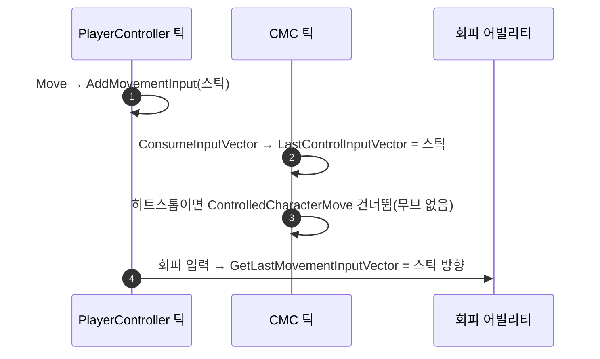

# Move 히트스톱 가드 제거

## 계획

### 목표
`AWxPlayerCharacter::Move`의 히트스톱 가드를 지운다. 가드의 근거인 "이동 틱 정지 중 입력 누적"은 지금 구조에서 성립하지 않는다. 오히려 가드가 정지 동안 마지막 입력 방향을 0으로 만들어, 그 사이 누른 회피가 백스텝으로 바뀐다(모듈 리뷰 WxGame #4).

### 수정 범위
| 파일 | 수정할 내용 | 구분 |
|---|---|---|
| `Source/WxGame/Character/WxPlayerCharacter.cpp` | `Move`에서 `IsFrozen()` 가드와 낡은 주석을 지우고, 가드를 두지 않는 의도를 한 줄로 남긴다 | 수정 |

### 접근 방식
- **지금 구조 기준 재검증**: 리뷰 작성 뒤 b5f00cfc가 이동 정지를 `ControlledCharacterMove` 통째 건너뛰기로 바꿨다.
  - CMC 틱은 계속 돌고, 틱 맨 앞의 `ConsumeInputVector()`가 입력을 매 틱 비운다. 그래서 입력이 쌓이지 않는다.
  - `ControlledCharacterMove`를 건너뛰므로 `Acceleration`도 다시 계산되지 않는다. 가드가 가속을 0으로 만드는 효과도 이제 없다.
- **남은 효과는 해롭다**: 입력을 소비하면 `LastControlInputVector`가 갱신된다. 가드가 입력을 막으니 정지 동안 이 값이 0이 된다.
  - 회피는 `GetLastMovementInputVector()`로 방향을 정하고, 방향이 0이면 백스텝을 낸다.
  - 히트스톱 GE는 어빌리티를 막지 않는다. 그래서 정지 중이나 풀린 첫 프레임의 회피가 방향을 잃는다.
- **범위 밖**: `Jump`·`ToggleCrouch` 가드는 정지 중 누른 입력이 풀릴 때 나가는 것을 막는 효과가 남아 있어 그대로 둔다.

---

## 완료

### 수정한 파일
| 파일 | 수정한 내용 | 구분 |
|---|---|---|
| `Source/WxGame/Character/WxPlayerCharacter.cpp` | `Move`의 히트스톱 가드와 낡은 주석을 지우고, 가드를 두지 않는 의도 주석 한 줄을 남김 | 수정 |

### 구현·결정과 그 이유
- **가드를 옮기지 않고 지움**: 이동 정지는 이미 이동 컴포넌트가 무브 생성 단계에서 건다. 입력 쪽에서 한 번 더 막아 봐야 얻는 것은 없고, 마지막 입력 방향만 잃는다.
- **의도 주석을 남김**: 옆의 `Jump`·`ToggleCrouch`에는 같은 가드가 있다. `Move`만 빠진 것을 누락으로 보고 되살리는 일을 막으려고 한 줄 남겼다.
- **`!Controller` 검사는 유지**: `GetControlRotation` 호출을 보호하는 별개 조건이다.

### 계획 대비 달라진 점
- 계획대로

### 후속 과제
- PIE 수동 확인은 아직 하지 않았다.
  - 히트스톱 중 스틱을 민 채 회피하면 입력 방향 회피가 나와야 한다.
  - 정지 중 스틱 입력으로 캐릭터가 움직이거나, 풀릴 때 튀지 않아야 한다.
- 리뷰 문서의 `Jump` 가드 근거 문장("CheckJumpInput이 PerformMovement 밖")은 b5f00cfc 이후 구조와 맞지 않는다. 다음 모듈 리뷰 갱신 때 반영할 것.
