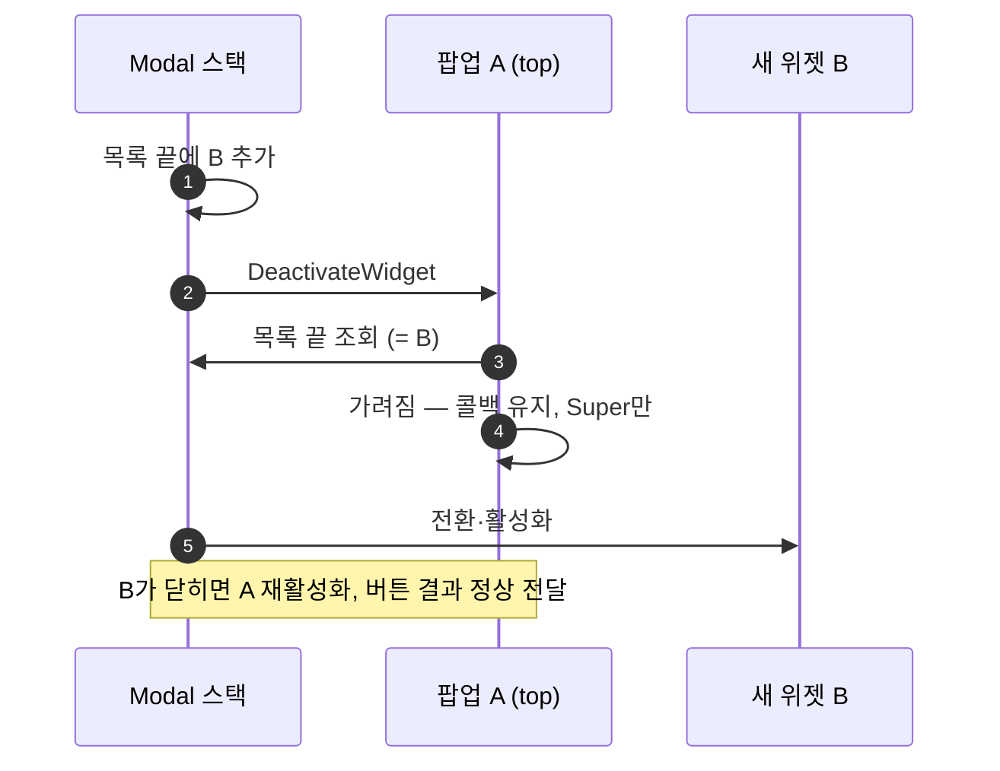

# 가려진 확인 팝업을 종료로 판정하지 않기

## 계획

### 목표
Modal 스택에서 확인 팝업 위에 위젯이 하나 더 올라오면, 가려진 팝업이 `Killed`를 보내고 콜백을 뗀다. 그래서 다시 드러난 뒤 버튼을 눌러도 결과가 오지 않는다(WxUI 리뷰 1번). `4acf5eb4`가 비활성화를 모두 종료로 본 부작용이다. 스택은 가릴 때도 기존 top을 비활성화한다. 가려짐만 가려내서 요청을 유지하고, 나머지 종료 경로의 결과 보장은 그대로 둔다.

### 수정 범위
| 파일 | 수정할 내용 | 구분 |
|---|---|---|
| `Plugins/WxUI/Source/WxUI/Private/Widget/WxConfirmationPopup.cpp` | `NativeOnDeactivated` 앞머리에 가려짐 판정 추가, `NativeDestruct` 주석 정정, include 2개 추가 | 수정 |

### 접근 방식
- **비활성화 직전에 스택 목록으로 판정한다**: 스택은 새 위젯을 목록 끝에 먼저 넣고 기존 top을 비활성화한다. 비활성화 처리(`Super`) 전에 레이아웃의 레이어 맵을 돌아 자신이 든 목록을 찾는다. 끝이 자신이 아니면 가려진 것이므로 콜백을 유지한 채 `Super`만 부른다. 나머지는 기존대로 복사·언바인딩 → `Super` → `Killed` 순서다.
- **레이어를 하드코딩하지 않는다**: Modal이라는 사실은 `ShowConfirmation`만 안다. 레이아웃 조회는 UI 파사드를 쓴다.
- **파괴 시점에만 `Killed`를 내는 안은 버렸다**: 외부 비활성화로 닫힌 팝업은 CommonUI 해제 배열을 비우는 `TArray::Reset` 도중에 소멸하고, 그 안에서 결과 콜백이 돈다. 핸들러가 같은 스택의 위젯을 닫으면 순회 중인 배열에 항목이 추가되어 누수나 크래시가 난다. 결과도 한 틱 늦어진다.
- **중복 요청 가드는 넣지 않는다**: 수정 후에는 겹친 두 팝업이 각자 결과를 전달한다. 연타 처리 방식은 UX 정책이다.

---

## 완료

### 수정한 파일
| 파일 | 수정한 내용 | 구분 |
|---|---|---|
| `Plugins/WxUI/Source/WxUI/Private/Widget/WxConfirmationPopup.cpp` | `NativeOnDeactivated` 앞머리에서 레이어 스택 목록을 조회한다. 끝이 자신이 아니면 `Super`만 부르고 반환한다. `NativeDestruct` 주석은 "가려져 비활성인 채로 제거되는 경우"로 정정했다. `System/WxPrimaryGameLayout.h`, `WxUILibrary.h` include를 추가했다 | 수정 |

### 구현·결정과 그 이유
- **판정은 `Super` 호출 전에 한다**: 닫힐 때는 `Super`의 비활성화 방송을 받은 컨테이너가 전환 안에서 자신을 목록에서 뺀다. 그래서 `Super` 뒤에 보면 가려진 경우와 구분되지 않는다. 전에 보면 가려질 때는 새 위젯이 이미 끝에 있고, 닫힐 때는 자신이 끝이다. 스택 전환 시간이 바뀌어도 판정은 같다.
- **목록에서 못 찾으면 종료로 본다**: 레이아웃 밖 컨테이너나 조회 실패 시에는 결과가 빠지지 않는 쪽을 택했다.
- **`Killed` 실행 맥락을 옮기지 않았다**: 외부 비활성화의 `Killed`는 컨테이너가 전환·해제를 끝낸 뒤 비활성화 호출 안에서 동기로 돈다. 버린 파괴 시점 안처럼 해제 배열을 비우는 도중에 사용자 콜백이 돌지 않는다.
- **검증**: UE 5.8.1 WxEditor Win64 Development 빌드 `Result: Succeeded`. 실행 작업은 `WxConfirmationPopup.cpp`·`Module.WxUI.cpp` 컴파일과 WxUI 링크뿐이었다. 작업 트리에 있던 다른 세션의 WxGame 변경은 이번 빌드 작업에 섞이지 않았다. 원본 인코딩(UTF-8 BOM 없음, CRLF)을 유지했고 `git diff --check`를 통과했다.

### 계획 대비 달라진 점
- 계획대로. 스택 포인터를 지역 변수로 받는 형태는 서브시스템 `WantsGamePause`의 레이어 순회를 따랐다.

### 후속 과제
- PIE 수동 확인 미실시(unreal-mcp 연결 끊김):
  - 팝업 두 개를 겹쳐 띄우고 위 팝업을 닫은 뒤, 다시 드러난 아래 팝업의 확인 결과가 `WBP_FrontEnd`에 오는지
  - 단일 팝업의 확인·취소 버튼과 뒤로 가기 결과가 그대로인지
- 감수한 한계:
  - CommonUI 5.8의 "목록 추가 → 기존 top 비활성화" 순서에 기댄다.
  - 가려진 팝업을 `RemoveWidget`으로 단독 제거하면 `Killed`가 컨테이너 해제 배열을 비우는 도중에 돈다.
  - `ClearWidgets` 때 top 팝업의 `Killed`는 `SetSwitcherIndex` 도중에 돈다(기존과 같음).
  - 위 두 경로 모두 현재 호출자가 없다.
- 중복 요청 가드(연타 처리 정책)는 넣지 않았다. 필요하면 별건으로 다룬다.

---

# 후속: Lyra 방식으로 재수정

## 계획

### 목표
위 수정은 동작은 맞았지만, CommonUI가 블랙박스로 둔 컨테이너의 내부 처리 순서로 가려짐을 추론했다. 사용자 지시에 따라 프로젝트 UI의 원형인 Lyra 5.7 코드를 기준으로 정석대로 고친다. Lyra의 확인 창은 사용자 선택에서만 결과를 내고, 결과를 활성화 상태나 위젯 수명에 묶지 않는다.

### 수정 범위
| 파일 | 수정할 내용 | 구분 |
|---|---|---|
| `Plugins/WxUI/Source/WxUI/Public/Widget/WxConfirmationPopup.h` | `NativeOnDeactivated`·`NativeDestruct` override 선언 삭제 | 수정 |
| `Plugins/WxUI/Source/WxUI/Private/Widget/WxConfirmationPopup.cpp` | 두 정의와 위 수정의 include 2개 삭제 | 수정 |
| `Plugins/WxUI/Source/WxUI/Private/System/WxUIManagerSubsystem.cpp` | `CompleteConfirmationOnce` 삭제, `ResultCallback`을 그대로 전달 | 수정 |

### 접근 방식
- **결과는 사용자 선택에서만 낸다**: `ULyraConfirmationScreen::CloseConfirmationWindow`처럼 `HandleResultChosen`만 결과를 낸다. 비활성화·파괴 훅을 걷으면 스택에 가려져도 콜백이 남는다.
- **`Killed`는 명시적 종료 전용이다**: Lyra의 `Killed`는 코드가 `KillDialog`로 명시적으로 닫은 경우다. 외부에서 닫는 `PopContentFromLayer` → `RemoveWidget` 경로는 결과를 보내지 않는다. 표시 실패 `Killed`는 요청 계층에 그대로 둔다.
- **1회 전달 래퍼를 걷는다**: `ULyraUIMessaging`처럼 콜백을 그대로 넘긴다. 팝업이 스스로 `Killed`를 내지 않으면 push 실패와 선택 결과가 겹칠 수 없다.
- **거두는 보장**: 외부 비활성화·스택 제거·레이아웃 제거 때의 `Killed`. 이 경로로 팝업을 닫는 코드가 없고, `WBP_FrontEnd`는 결과 중 `Confirmed`만 비교한다.

---

## 완료

### 수정한 파일
| 파일 | 수정한 내용 | 구분 |
|---|---|---|
| `Plugins/WxUI/Source/WxUI/Public/Widget/WxConfirmationPopup.h` | `NativeOnDeactivated`·`NativeDestruct` override 선언 삭제 | 수정 |
| `Plugins/WxUI/Source/WxUI/Private/Widget/WxConfirmationPopup.cpp` | 두 정의 삭제. 위 절에서 넣은 가려짐 판정과 include 2개도 함께 사라짐 | 수정 |
| `Plugins/WxUI/Source/WxUI/Private/System/WxUIManagerSubsystem.cpp` | `CompleteConfirmationOnce` 삭제. `ShowConfirmation`이 `ResultCallback`을 BeforePush·완료 콜백에 그대로 넘김 | 수정 |

### 구현·결정과 그 이유
- **가려짐 추론을 버렸다**: 위 절의 판정은 엔진이 "의도적으로 블랙박스"라고 문서화한 컨테이너(`CommonActivatableWidgetContainer.h:19-22`)의 private 처리 순서에 기댔다. 위젯이 전역 레이아웃을 거슬러 조회하는 구조이기도 했다.
- **Lyra와 같은 계약으로 맞췄다** (Lyra 5.7, `VaultCache\Lyra_5.7`)
  - `ULyraConfirmationScreen::CloseConfirmationWindow`만 결과를 낸다(`LyraConfirmationScreen.cpp:72-76`). 비활성화·파괴 재정의는 없다.
  - `Killed`는 "explicitly killed"다(`CommonMessagingSubsystem.h:25`).
  - 외부에서 닫는 `PopContentFromLayer`는 `RemoveWidget`만 한다(`CommonUIExtensions.cpp:96-117`).
  - `ULyraUIMessaging`은 콜백을 그대로 넘긴다(`LyraUIMessaging.cpp:25-36`).
- **1회 전달이 구조로 보장된다**: 결과는 두 곳에서만 난다. 하나는 push 완료 콜백의 `Killed`(`Finish(nullptr)`일 때만), 다른 하나는 팝업 선택이다. `Finish`는 액션당 1회다. 실패 완료가 나는 경우 팝업은 Construct 전이거나, 취소로 비활성화돼 입력을 받지 못한다. 그래서 래퍼가 막을 중복이 없다.
- **호출 맥락이 단순해졌다**: 사용자 결과 콜백이 컨테이너 해제 도중이나 스택 전환 도중에 도는 경로가 모두 사라졌다. 선택 결과는 입력 이벤트 안에서만 난다.
- **검증**
  - UE 5.8.1 WxEditor Win64 Development 빌드 `Result: Succeeded`.
  - 같은 빌드에 다른 세션의 미커밋 `WxPlayerCharacter.cpp` 변경이 함께 컴파일·링크됐다(WxGame).
  - 세 파일 모두 원본 인코딩(UTF-8 BOM 없음, CRLF)을 유지했고, `git diff --check`를 통과했다.

### 계획 대비 달라진 점
- 계획대로.

### 후속 과제
- **거둔 보장**: 외부 비활성화·`RemoveWidget`·`ClearWidgets`·레이아웃 제거로 닫힌 팝업은 이제 결과를 보내지 않는다(`4acf5eb4`의 "외부 비활성화에도 `Killed`" 철회). 지금은 이 경로로 팝업을 닫는 코드가 없고, `WBP_FrontEnd`는 결과 중 `Confirmed`만 비교한다(에셋 문자열 기준).
  - 코드가 팝업을 닫으면서 결과를 알려야 하는 흐름이 생기면, Lyra `KillDialog`처럼 명시적 종료 진입점을 둔다. 그 진입점은 `HandleResultChosen(Killed)`를 부른다.
- PIE 수동 확인 미실시(unreal-mcp 연결 끊김):
  - 팝업 두 개를 겹쳐 띄우고 위를 닫은 뒤, 아래 팝업의 확인 결과가 `WBP_FrontEnd`에 오는지
  - 단일 팝업의 버튼·뒤로 가기 결과
- Lyra와 다른 부분 중 이번과 무관해 남긴 것:
  - 표시 경로: 비동기 스트리밍 push와 `AddWidgetInstance`. Lyra는 클래스 선로드 후 `AddWidget`
  - 뒤로 가기 방식: Lyra는 Decline 버튼의 트리거 액션
  - 리뷰 4번의 `HandleConfirmationPushCompleted` 멤버화
