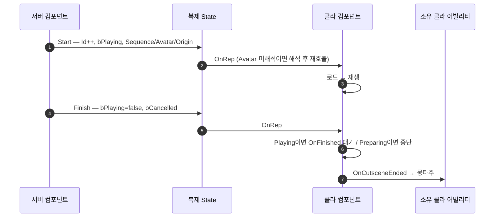

# 스킬 컷신 단순화

## 계획

### 목표

`UWxSkillCutsceneComponent`에 겹겹이 쌓인 장치를 걷어낸다. 전달 채널을 복제 하나로 되돌려 RPC 때문에 생긴 파생 장치(늦은 참조 보정, 완료 보류 큐, 중복 수신 방지 ID)를 통째로 없애고, 재생마다의 시퀀스 복제·예약 2단계·넷모드 분기·준비 타임아웃을 정리한다. 모듈 리뷰 🟡1(시계 클램프로 월드가 0.001배 고정)과 🟡2(전역 배율 저장값 복원)도 같은 코드에서 닫는다.

### 수정 범위

| 파일 | 수정할 내용 | 구분 |
|---|---|---|
| `Public/Cutscene/WxSkillCutsceneComponent.h` | 구조체 4 → 2 평탄화, 공개 API 축소(`Reserve`·`GetSessionId`·`GetPlaybackSeconds` 제거), 멤버 정리 | 수정 |
| `Private/Cutscene/WxSkillCutsceneComponent.cpp` | 아래 A~F 전부 | 수정 |
| `Private/AbilitySystem/Task/WxAbilityTask_PlaySkillCutscene.cpp` | 세션 ID 추정(`GetSessionId() + 1`) 제거, Avatar 일치로만 판정 | 수정 |
| `Private/AbilitySystem/Ability/WxAbility_Ultimate.cpp` | 예약·해제 분기 제거. `bLocalPresentationPending` 보류는 유지 | 수정 |
| `WxCombat.Build.cs` | `MovieSceneTracks` 의존 제거 | 수정 |
| `LS_Template_Ultimate` / `LS_HGTest_Ultimate` | 시전자 애니메이션 섹션 **Force Custom Mode** 체크 | 사용자 작업(선행) |

### 접근 방식

- **A. 포즈 소유권을 저작으로**: `bForceCustomMode`가 엔진에서 하는 일은 `SetAnimationMode(AnimationCustomMode)` 한 줄이다. 에셋에서 체크하면 되므로 재생마다 시퀀스를 복제해 섹션을 패치하던 `CreatePlayerCutsceneSequence`(약 40줄)를 걷는다. C++에서 모드를 직접 바꾸는 안은 채택하지 않는다 — 엔진이 평가 시작 시점에 사전 상태를 캐시해서 우리가 먼저 바꾸면 AnimBP로 복원되지 않고, MetaHuman Face 같은 다중 메시를 덮지 못한다.
- **B. 시계 축소**: 엔진 `FMovieSceneTimeController_PlatformClock`은 쓸 수 없다. 플레이어가 `PlayRate *= GetEffectiveTimeDilation()`을 넘기고 외부 시계가 그걸 먹어 0.001배 월드에서 8초가 8000초가 된다. 커스텀 컨트롤러는 유지하되 컴포넌트 역참조와 `Duration` 클램프를 버리고 자체 시작 시각 + 경과만 돌려주게 한다. 클램프 제거가 🟡1의 수정이다.
- **C. 채널 일원화**: Multicast RPC 2개를 없애고 복제 State 하나로 간다. 미해석 Avatar 참조는 엔진이 해석 시점에 RepNotify를 다시 큐잉해 주므로 `RefreshSessionAvatar`가 필요 없다. 대신 프로퍼티 복제는 최신 값만 보장하므로 `OnRep_State`를 `(ObservedSessionId, Id, bPlaying)` 차분 규칙으로 재작성하고, RPC 인자로만 존재하던 `bCancelled`를 복제 구조체에 넣는다.
- **D. 완료 통지**: 보류 큐와 재스캔 루프를 없애되 "후속 몽타주는 시퀀서가 포즈를 놓은 뒤"라는 규칙은 남긴다. 서버 종료를 받은 시점의 로컬 상태로 갈린다 — `Playing`이면 로컬 `OnFinished`를 기다리고, `Preparing`이면 중단 후 즉시 통지, `Idle`이면 즉시 통지. `Preparing` 중단이 20초 준비 타임아웃을 대체한다.
- **E. 권위 종료**: 배율·무적·관련성 적용을 `Start()` 한 곳으로 모으고, 종료 판정을 `LocalPlayback.Phase == Idle && 경과 >= Duration` 하나로 통합한다. 전용 서버 가드와 권위 실패 경로의 즉시 `Finish`는 유지한다.
- **F. 배율 복원 규칙**: `WxAbilityTask_SlowTime`과 통일 — 실제로 박힌 값을 기억했다가 현재 값이 그대로일 때만 1.0으로 되돌린다. 🟡2의 수정이다.
- **G. 예약 2단계 제거**: 배타성은 `CanActivateAbility`의 `IsBusy()`가 쥔다. 서버의 어빌리티 발동 경로는 전 구간 동기라 두 시전자가 같은 프레임에 통과할 틈이 없다. 소유 약참조는 감시자·취소 검증용으로 `Start()` 안에서 세우고, `Start()` 호출은 쿨다운 환불 창을 남기지 않도록 `CommitAbility`보다 앞에 유지한다.

---

## 완료

### 수정한 파일

| 파일 | 수정한 내용 | 구분 |
|---|---|---|
| `Public/Cutscene/WxSkillCutsceneComponent.h` | 186 → 142줄. 구조체 6개 → 4개, 공개 API 6개 → 4개, 상태 멤버 6개 → 4개 | 수정 |
| `Private/Cutscene/WxSkillCutsceneComponent.cpp` | 578 → 387줄. RPC 2개·대기열 2개·시퀀스 복제·준비 타임아웃·넷모드 분기 제거 | 수정 |
| `Public|Private/AbilitySystem/Task/WxAbilityTask_PlaySkillCutscene.*` | 순수 대기자로 축소. 시퀀스·배율 인자와 세션 ID 추정 제거 | 수정 |
| `Private/AbilitySystem/Ability/WxAbility_Ultimate.cpp` | `Reserve` → `Start` 직접 호출(비용 확정 앞) | 수정 |
| `WxCombat.Build.cs` | `MovieSceneTracks` 제거 | 수정 |

전체 149줄 추가 / 405줄 삭제.

### 구현·결정과 그 이유

- **전달 채널 일원화**: Multicast RPC 2개를 없애고 복제 State 하나로 갔다. RPC로는 미해석 시전자 참조가 널로 굳지만(`net.DelayUnmappedRPCs` 기본 0) 복제 프로퍼티는 해석 시점에 엔진이 RepNotify를 다시 부른다. `RefreshSessionAvatar`의 3중 루프가 `UpdateSession`의 사본 갱신 한 줄로 줄었다.
- **`UpdateSession` 한 함수로 판정 집중**: 프로퍼티 복제는 최신 값만 보장하므로 시작·종료가 한 업데이트에 겹쳐 붕괴되는 경우까지 `(Id, bPlaying, 로컬 단계)` 차분으로 처리한다. 접속 전에 끝난 세션은 입양만 하고, 서버 종료가 도착했는데 로컬이 준비 중이면 접는다 — 이 규칙이 20초 준비 타임아웃을 대체한다.
- **종료 통지 시점**: 각 머신이 "아는 쪽"에서 낸다. 권위는 `Finish`, 그 외는 자기 재생이 끝나는 `CleanupLocalPlayer` 직후. 보류 큐와 재스캔 루프 없이도 후속 몽타주가 시퀀서 복원 뒤에 시작한다. 통지 플래그를 브로드캐스트 **전에** 세워 콜백이 곧바로 다음 컷신을 여는 재진입에서도 이중 통지가 나지 않는다.
- **시계는 축소만**: 엔진 `FMovieSceneTimeController_PlatformClock`으로 갈아타려 했으나, 플레이어가 월드 배율을 곱한 PlayRate를 넘기고 외부 시계가 그걸 다시 반영해 0.001배 월드에서 컷신이 1000배 느려진다. 커스텀 컨트롤러를 유지하되 컴포넌트 역참조와 길이 클램프를 버렸다. 클램프가 종료 임계에 못 닿아 월드가 멈추던 모듈 리뷰 🟡1이 이걸로 닫힌다.
- **배율 복원**: 저장값 복원 → 실제로 박은 값이 그대로일 때만 1.0. 남의 슬로우 타임을 되살리던 🟡2를 닫고 `WxAbilityTask_SlowTime`과 규칙이 같아졌다.
- **예약 2단계 제거**: 서버의 어빌리티 발동 경로가 전 구간 동기라 `CanActivateAbility`의 `IsBusy()` 하나로 배타성이 선다. 소유 약참조는 "어빌리티가 태스크를 안 거치고 사라진 경우"의 감시자라 `Start` 안에 남겼다.
- **코드 리뷰 반영 2건**:
  - 종료와 다음 시작이 한 복제 창에 겹치면 클라가 종료 엣지를 못 본다. `Start`에서 `bCancelled`를 지우지 않고, 새 세션을 받을 때 그 값으로 이전 세션의 결과를 알린다 — 정상 완료가 취소로 뒤바뀌지 않는다.
  - 권위 길이 타이머가 `Phase == Idle`에 갇혀 화면 있는 서버에서는 영영 돌지 않았다. 조건을 "시퀀스가 실제로 돌고 있지 않으면"으로 바꿔 전용 서버·준비 지연·시퀀스 액터 소실을 한 조건으로 덮는다. 삭제한 20초 준비 타임아웃의 자리도 이것이 메운다.

### 계획 대비 달라진 점

- **`Start` 호출 주체가 태스크 → 어빌리티로 이동**. 계획의 "비용 확정보다 앞" 요구를 지키려면 필연이다. 태스크는 종료를 기다리며 컷신 수명을 쥐는 역할만 남았고 시퀀스·배율 인자가 사라졌다.
- **구조체는 2개가 아니라 4개**(USTRUCT 3 + 평범한 struct 1). 재생 정보를 `FWxSkillCutsceneSession`으로 남겨 로컬 사본이 같은 타입을 쓰게 했다 — 평탄화하면 같은 필드 4개를 로컬 쪽에 또 선언해야 한다. 대신 계획에 없던 `ServerExecution`/`ServerRestore` 두 struct를 `FWxSkillCutsceneServerState` 하나로 합쳤다.
- `EnableLocalMeshPoseTick`은 호출처가 하나뿐이라 `StartLocalPlayer`에 인라인했다.

### 후속 과제

- **시퀀스 에셋 체크가 아직 안 됐다.** `LS_Template_Ultimate`·`LS_HGTest_Ultimate` 둘 다 `bForceCustomMode`가 직렬화돼 있지 않다(= 꺼짐). 체크 전에는 원격 머신에서 시전자가 대기 자세로 보이는 증상이 돌아온다.
- 실측은 UE 5.8 WxEditor Development 빌드 성공까지다. 2인 PIE(포즈·몽타주·배율 복원), 슬로우 타임과의 경합, 전용 서버 접속 중 참가는 확인하지 않았다.
- 시전자가 파괴되며 끝난 세션의 종료 통지는 아바타가 널이라 어떤 태스크에도 닿지 않는다. 그 시점엔 어빌리티가 죽은 폰과 함께 정리되므로 그대로 둔다.
