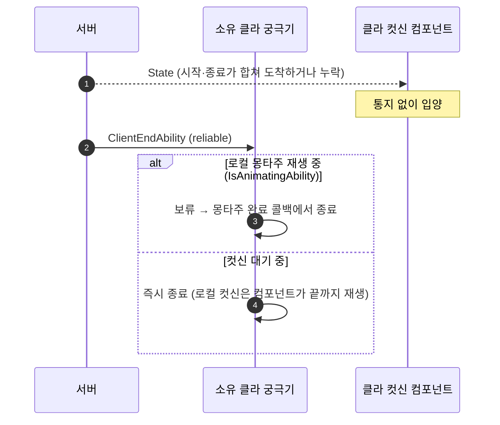

# 궁극기 서버 종료 보류 축소와 컷신 시퀀스 하드 참조

## 계획

### 목표
WxCombat 모듈 리뷰의 두 건을 고친다. 방침은 "컷신은 연출이므로 정합성 장치를 과하게 두지 않는다"이다.
- **1번 🟡**: 소유 클라가 시작 스냅샷을 못 받은 세션이 통지 없이 입양되면, 서버의 정상 종료가 로컬 보류에 삼켜진다. 그러면 궁극기가 영구히 활성으로 남는다(소프트락).
- **4번 🟢**: 관전 클라가 시퀀스를 State 수신 뒤에야 로드한다. 그래서 서버가 월드를 재개한 뒤에도 로드 시간만큼 입력 잠금이 이어진다.

### 수정 범위
| 파일 | 수정할 내용 | 구분 |
|---|---|---|
| `Plugins/WxCombat/Source/WxCombat/Private/AbilitySystem/Ability/WxAbility_Ultimate.cpp` | 보류 판정을 저장 플래그 대신 `IsAnimatingAbility(this)` 조회로 바꾼다. `OnGiveAbility` 선로드와 `LoadSynchronous` 폴백을 제거한다. | 수정 |
| `Plugins/WxCombat/Source/WxCombat/Public/AbilitySystem/Ability/WxAbility_Ultimate.h` | `CutsceneSequence`를 `TObjectPtr`로 바꾼다. `OnGiveAbility`·`CutscenePreloadHandle`·`bLocalPresentationPending`을 제거한다. | 수정 |
| `Plugins/WxCombat/Source/WxCombat/Private/Cutscene/WxSkillCutsceneComponent.cpp` | 입양 규칙 주석에 "왜 알리지 않는가"를 명시한다(동작은 그대로). | 수정 |
| `Content/Character/HGTest/Abilities/Ultimate/GA_HGTest_Ultimate.uasset`, `Content/Character/Template/Player/Abilities/Ultimate/GA_Template_Ultimate.uasset` | 하드 참조로 재저장한다(ResavePackages). | 수정 |

### 접근 방식
- **보류를 몽타주 구간으로 좁힘**
  - 원인: 발동 순간부터 보류가 걸려 있어, 클라 어빌리티의 종료가 컴포넌트의 세션 종료 통지에 묶인다. 그런데 이 통지는 그 머신이 본 세션에만 나간다.
  - 수정: 컷신을 기다리는 동안 온 서버 정상 종료는 그대로 받는다. 보류는 소유 클라가 후속 몽타주를 재생하는 동안에만 건다.
  - 효과: 합쳐진 세션이든 통째로 놓친 세션이든, reliable로 오는 서버 종료가 어빌리티를 닫는다.
  - 정상 경로는 그대로다. 클라 몽타주 시작이 서버 종료 도착보다 몽타주 길이만큼 이르기 때문이다.
- **판정은 엔진 조회로**
  - 엔진은 재생에 성공했을 때만 `AnimatingAbility`를 세우고, 어빌리티가 끝나거나 인터럽트되면 지운다.
  - 프로젝트는 `bAllowInterruptAfterBlendOut=true`로 호출하므로, 블렌드아웃 중에도 값이 유지된다.
  - 저장 플래그를 두면 재생 실패 시 동기 취소 종료와 대입 순서가 엇갈려 값이 남는 함정이 있다. 조회 방식은 이 함정이 없다.
- **리뷰안(입양 제거)은 택하지 않음**
  - 세션을 통째로 놓친 경우를 막지 못한다.
  - 커밋 실패로 한 호출 안에서 열리고 닫힌 세션의 취소가 직후의 재예측 발동을 끊는 경합이 새로 생긴다.
  - 정체가 길면 서버가 끝난 뒤에도 낡은 몽타주를 재생한다.
- **시퀀스 하드 참조**
  - 시전자를 보는 머신은 캐릭터 클래스를 동기 로드한다.
  - 그 사슬(캐릭터 BP → ASC `AbilitySets` → `GrantedAbilities` → 궁극기 클래스)이 전부 하드 참조이므로, 시퀀스도 관전 머신에 미리 올라온다.
  - 선로드 코드가 오히려 줄고, 새 장치가 없다.
  - 비용은 작다. 시퀀스는 각 46KB이고, 임포트는 애님 1개와 메시 1개다. 이미 하드 참조인 몽타주보다 가볍다.
  - 엔진이 소프트→하드 태그를 로드 시 변환한다(5.8은 Zen 로더뿐). 재저장은 필수가 아니지만, 의존을 하드로 기록하려고 한다.

---

## 완료

### 수정한 파일
| 파일 | 수정한 내용 | 구분 |
|---|---|---|
| `Plugins/WxCombat/Source/WxCombat/Private/AbilitySystem/Ability/WxAbility_Ultimate.cpp` | 보류 판정을 `ASC->IsAnimatingAbility(this)`로 교체, 보류 플래그 대입 2곳 삭제. `OnGiveAbility`와 `Get()`/`LoadSynchronous` 폴백 삭제. include 정리(`AssetManager`·`StreamableManager` → `AbilitySystemComponent`) | 수정 |
| `Plugins/WxCombat/Source/WxCombat/Public/AbilitySystem/Ability/WxAbility_Ultimate.h` | `CutsceneSequence`를 `TObjectPtr`로 변경. `OnGiveAbility`·`CutscenePreloadHandle`·`bLocalPresentationPending`·`FStreamableHandle` 전방선언 삭제. 클래스 주석 갱신 | 수정 |
| `Plugins/WxCombat/Source/WxCombat/Private/Cutscene/WxSkillCutsceneComponent.cpp` | 입양 규칙 주석만 갱신(동작 동일) | 수정 |

WxEditor Win64 Development 빌드 성공(UE 5.8.1, 6 actions, 24초. `Result: Succeeded`).

### 구현·결정과 그 이유
- **보류 조건은 "몽타주를 재생 중인가" 하나만 조회한다**
  - 엔진의 `AnimatingAbility`는 재생 성공 시에만 서고, 어빌리티 종료·인터럽트 시 지워진다. 그래서 조회 결과가 다음 발동까지 남지 않는다.
  - 저장 플래그로 구현하면 두 가지 함정이 생긴다. 몽타주 재생이 실패하면 `PlayMontage` 안에서 동기 취소 종료가 일어나 대입 순서에 따라 true가 남고, 그 값이 다음 발동의 컷신 대기 중에 원래 소프트락을 재현한다. 조회 방식에는 이 문제가 없다.
  - 플래그의 `IsLocallyControlled` 조건은 뺐다. 비권위 머신에서 어빌리티가 활성인 곳은 소유 클라뿐이라 `!IsNetAuthority()`로 충분하다.
- **컴포넌트의 입양 규칙은 그대로 둔다**
  - 리뷰안처럼 여기서 통지하면, 커밋 실패로 한 호출 안에서 열리고 닫힌 세션의 취소가 직후의 재예측 발동을 끊을 수 있다.
  - 대신 "서버 종료가 닫는다"는 이유를 주석에 남겨, 나중에 버그로 오인해 되돌리지 않게 했다.
- **동작 변화는 클라 정체가 몽타주 길이를 넘을 때만 생긴다**
  - 이때 클라 몽타주를 생략한다. 서버가 이미 끝낸 몽타주를 늦게 재생하며 잠금을 유지하는 것보다 서버 상태에 가깝다.
  - 로컬 컷신은 컴포넌트가 끝까지 재생하므로 장면과 입력 잠금은 그대로다.
- **하드 참조 변환은 로드 시 엔진이 처리한다**
  - 커맨드렛 로그에서 확인했다. 두 GA를 로드할 때 Zen 로더가 LS를 동기 로드해 dynamic import로 붙였고, 변환 실패 로그는 없었다.

### 계획 대비 달라진 점
- **두 GA 에셋 재저장을 하지 못했다**
  - 두 에셋은 CL 56702186(더 새 5.8 핫픽스)으로 저장돼 있다. 이 PC의 엔진은 5.8.1(CL 56057345)이라, ResavePackages가 다운그레이드 방지 규칙으로 두 패키지를 건너뛰었다(`0/2 considered`).
  - `-IgnoreChangelist`로 강제하지는 않았다. 에셋 파일은 변경되지 않았다.
  - 재저장은 필수가 아니다(로드 시 변환 확인). 기능은 현재 상태로 동작한다.
- 커맨드렛 종료 코드 1은 이번 작업과 무관하다. 원인은 git 소스컨트롤 공급자의 기존 경고 21건(없는 `Content/AbilitySystem/`, `Content/ARPG_Samurai/...` 디렉터리)이다.

### 후속 과제
- **GA 재저장**: `GA_HGTest_Ultimate`와 `GA_Template_Ultimate`를, 에셋을 저장한 환경(CL 56702186 이상)의 에디터에서 열어 저장한다. 에셋 레지스트리 의존이 하드로 기록되고, 매 로드마다 일어나는 변환·동기 로드 로그가 사라진다.
- **미실행 수동 검증**
  - **소프트락**: 2인 PIE 소유 클라에서 `NetEmulation.PktIncomingLoss 100`을 켜고 궁극기를 쓴 뒤, 컷신+몽타주 길이보다 오래 기다렸다가 0으로 되돌린다. 공격이 되는지 확인한다.
  - **정상 경로**: `PktLag`를 준 상태에서 클라 몽타주가 끝까지 재생되는지 확인한다.
  - **관전 선로드**: `-game` 관전 클라에서 시전 전에 `obj list class=LevelSequence`를 실행해 LS가 올라와 있는지 확인한다.
  - **쿡 재확인**: 쿡 결과물의 두 GA 패키지를 다시 확인한다.
- **리뷰 문서**: 다음 `/module-review` 갱신 때 WxCombat 1번·4번의 해소를 반영한다.
