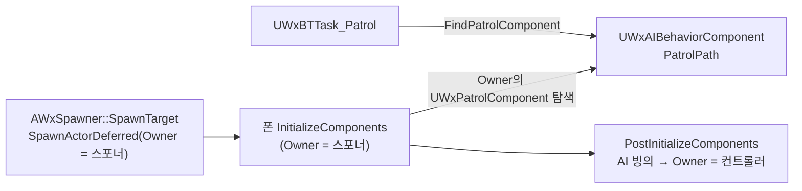

# 적의 스포너 부착 제거

## 계획

### 목표
스포너가 스폰한 적은 캡슐 루트가 스포너에 부착돼 있다. 그래서 원격 클라에서 이동 복제가 `AttachmentReplication` 경로로만 가고, 스무딩과 속도, 이동 모드 복제가 함께 멈춘다(WxGame 리뷰 1번). 부착을 걷어 정상 이동 복제로 되돌린다. 부착이 맡던 "폰 → 정찰 경로" 링크는 AI 컴포넌트가 초기화 시점에 스폰 주체에서 스스로 찾게 바꾼다. 그러면 Enemy뿐 아니라 이 컴포넌트를 가진 모든 스폰 대상에 자동 적용된다.

### 수정 범위
| 파일 | 수정할 내용 | 구분 |
|---|---|---|
| `Plugins/WxAI/Source/WxAI/Public/WxAIBehaviorComponent.h/.cpp` | 런타임 전용 `PatrolPath`(Transient)와 getter 추가, `InitializeComponent`에서 스폰 주체(Owner)의 경로를 찾아 채움 | 수정 |
| `Plugins/WxAI/Source/WxAI/Private/WxPatrolComponent.cpp` | `FindPatrolComponent`가 부착 부모 대신 보관된 `PatrolPath`를 읽도록 | 수정 |
| `Plugins/WxAI/Source/WxAI/Public/WxPatrolComponent.h`, `WxBTTask_Patrol.h` | 경로 출처 주석 정정 | 수정 |
| `Plugins/WxAI/Source/WxAI/Private/Tests/WxPatrolPathSpawnTest.cpp` | 스폰 주체 경로 인계가 빙의 후에도 남는지 실측하는 자동화 테스트 | 신규 |
| `Source/WxGame/Character/WxEnemyCharacter.cpp` | `OnSpawnedBy`에서 부착 제거 | 수정 |
| `Plugins/WxWorld/Source/WxWorld/Private/Spawnable/WxSpawner.cpp` | 적 예외 부착 주석 삭제·대가 정정, Owner 전달 계약 주석 추가, 부착 목록 안전망 삭제 | 수정 |
| `Plugins/WxAI/README.md` | 경로 조회 규칙 정정 | 수정 |

### 접근 방식
- **부착 제거로 복제 경로 정상화**: 엔진은 루트의 `GetAttachParent()` 하나로 분기한다. 서버 `GatherCurrentMovement`, 클라 `OnRep_ReplicatedMovement`, `SimulateMovement`의 "RepMovement가 0이면 반환"이 모두 이 조건에 걸려 있다. 부착이 없으면 세 곳 모두 정상 경로를 탄다.
- **찾는 시점은 AI 컴포넌트의 `InitializeComponent`**:
  - 스포너는 스폰 대상의 Owner로 자신을 넘긴다. 엔진 순서는 `SetOwner` → `InitializeComponents` → `PostInitializeComponents`(AI 자동 빙의가 Owner를 컨트롤러로 덮음)이다.
  - 따라서 컴포넌트 초기화 시점에만 폰의 Owner가 곧 스폰 주체다.
  - 엔진이 기록한 Owner를 읽기만 하므로, 08-26에 폐기한 "컨트롤러 Owner에 의미 써넣기"와 다르다.
- **찾은 경로 컴포넌트를 AI 컴포넌트에 보관**:
  - 이 컴포넌트는 컨트롤러를 갈아타도 캐릭터를 따라다니는 AI 설정을 모은다.
  - Enemy 코드도 스포너 코드도 경로를 넘기지 않으므로, 이 컴포넌트를 가진 폰이면 무엇이든 자동 적용된다.
  - 저작 대상이 아니라 Transient로 둔다. BT가 서버 전용이라 복제하지 않는다.
- **엔진 순서는 테스트로 지킨다**: 이 방식은 엔진 초기화 순서에 기대므로, 실제 스폰·빙의를 돌려 확인하는 자동화 테스트를 남긴다. "스포너가 Owner로 자신을 넘긴다"는 스포너 쪽 주석으로 표시한다.
- **스포너의 부착 목록 안전망 삭제**: 붙는 적이 사라져 잡을 대상이 없다. 남겨 두면 무관한 부착 액터만 파괴한다(WxWorld 리뷰 2번).

---

## 완료

### 수정한 파일
| 파일 | 수정한 내용 | 구분 |
|---|---|---|
| `Plugins/WxAI/Source/WxAI/Public/WxAIBehaviorComponent.h/.cpp` | `PatrolPath`(Transient)와 getter 추가, `InitializeComponent`에서 스폰 주체(폰 Owner)의 `UWxPatrolComponent`로 채움 | 수정 |
| `Plugins/WxAI/Source/WxAI/Private/WxPatrolComponent.cpp` | 부착 부모 조회를 보관된 경로 반환으로 교체 | 수정 |
| `Plugins/WxAI/Source/WxAI/Public/WxPatrolComponent.h`, `WxBTTask_Patrol.h` | 경로 출처 주석 정정 | 수정 |
| `Plugins/WxAI/Source/WxAI/Private/Tests/WxPatrolPathSpawnTest.cpp` | `Wx.AI.Patrol.SpawnOwnerPath` 자동화 테스트 | 신규 |
| `Source/WxGame/Character/WxEnemyCharacter.cpp` | `OnSpawnedBy`에서 부착 제거(스포너 약참조 기록만 남음) | 수정 |
| `Plugins/WxWorld/Source/WxWorld/Private/Spawnable/WxSpawner.cpp` | 적 예외 부착 주석 삭제, 부착 대가를 속도·이동 모드까지 정정, Owner 전달 계약 주석 추가, 부착 목록 안전망 삭제 | 수정 |
| `Plugins/WxAI/README.md` | 경로 조회 규칙 정정 | 수정 |

### 구현·결정과 그 이유
- **부착만 걷으면 복제가 정상화되는 것을 엔진 소스로 확인했다**: 서버 수집, 클라 적용, CMC 시뮬 프록시의 조기 반환이 모두 "루트에 부착 부모가 있는가" 하나로 갈린다. `ACharacter`의 오버라이드는 가속도만 덧붙이고 이 분기를 건드리지 않는다.
- **경로는 AI 컴포넌트가 스스로 찾는다**:
  - Enemy나 스포너가 넘겨주는 방식은 Enemy에만 적용된다. 넘겨받는 쪽이 찾게 하면 이 컴포넌트를 가진 모든 스폰 대상에 자동 적용된다.
  - 시점은 `InitializeComponent`다. 엔진 순서가 `SetOwner` → `InitializeComponents` → `PostInitializeComponents`(AI 자동 빙의가 Owner를 컨트롤러로 덮음)라서, 이 시점에만 폰 Owner가 스폰 주체다.
  - 이 순서는 `PostSpawnInitialize` 머리 주석에 deferred 여부와 무관하게 명시돼 있다.
- **암묵 전제 두 가지 중 엔진 순서만 테스트로 고정했다**:
  - 이 방식은 "스포너가 Owner로 자신을 넘긴다"와 엔진 초기화 순서에 기대므로, 둘 중 하나가 깨지면 정찰이 조용히 꺼진다.
  - 테스트는 임의 액터를 Owner로 AI 폰을 실제 스폰·빙의시킨 뒤 두 가지를 확인한다. ① Owner가 컨트롤러로 덮였는지 ② 그래도 경로가 남았는지. 대조로 Owner 없는 폰은 경로가 비어야 한다.
  - 스포너가 Owner를 넘기는지는 테스트하지 않는다. 그 인자 바로 위의 계약 주석으로만 표시한다.
- **보관 자리는 AI 컴포넌트**: 컨트롤러를 갈아타도 폰을 따라다니는 AI 설정의 자리다. 엔진이 기록한 Owner를 읽기만 하므로, 08-26에 폐기한 "컨트롤러 Owner에 의미 써넣기"와 다르다.
- **부착 목록 안전망을 지웠다**: 스스로 붙는 스폰 대상이 사라져 잡을 대상이 없다. 남겨 두면 무관한 부착 액터를 파괴하는 부작용만 남는다(WxWorld 리뷰 2번도 함께 해소).
- **대가**:
  - 아웃라이너에서 스포너 밑에 적이 보이던 표시가 사라진다(08-29 부착 선택의 근거였다).
  - 스포너 없이 배치한 폰은 정찰하지 않는다. 외부 액터 문자열 검색에서 경로를 쓰는 배치 적은 없었다.
  - `AutoPossessPlayer` 폰은 `PreInitializeComponents`에서 먼저 빙의돼 이 규칙이 통하지 않는다. 정찰 대상이 아니라 무관하다.
  - PIE 중 적 BP를 재컴파일하면 재인스턴싱이 Owner를 컨트롤러로 둔 채 초기화를 다시 돌려 경로가 비워진다(코드 리뷰 지적). 에디터 전용이고 PIE를 다시 시작하면 해결되므로 수용했다.

### 계획 대비 달라진 점
- 같은 세션에서 링크 방식을 두 번 바꿨다. 위 「계획」은 최종 방식으로 갱신한 것이다.
  1. `PatrolPathOwner`를 인스턴스 편집 액터 참조로 둠 → 사용자 지시로 디테일 지정을 없앰
  2. `OnSpawnedBy`에서 스포너의 경로를 찾아 `SetPatrolPath`로 넘김 → "Enemy 외 모든 스폰 대상 자동 처리" 요청으로 AI 컴포넌트 자기완결로 옮김
  - 1·2 모두 빌드까지 확인했다.

### 후속 과제
- 검증 완료: WxEditor(Development) 컴파일, `Wx.AI.Patrol.SpawnOwnerPath` 헤드리스 실행 Success(경고·오류 없음).
- PIE 스탠드얼론에서 LV_DevCombat 스포너 적이 정찰하는지 확인이 남았다.
- PIE 클라 2인에서 원격 화면 적의 로코모션 속도, 낙하·착지 모드(`Movement.InAir`) 확인이 남았다.
- `module_review_WxGame.md` 1번, `module_review_WxWorld.md` 2번은 다음 `/module-review` 갱신 때 해소로 반영된다.
