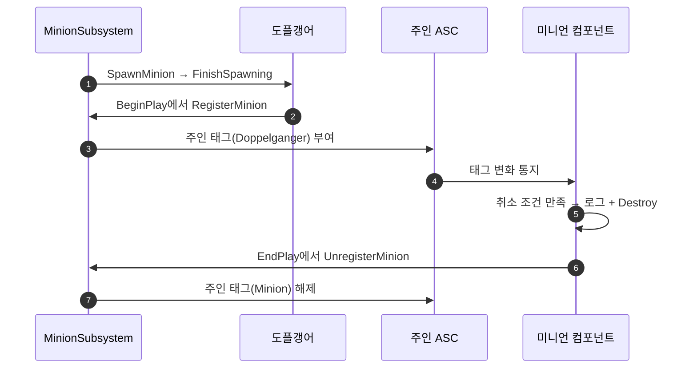

# 소환물 조건 분리 — 소환 가능 조건 / 소환 취소 조건

## 계획

### 목표
도플갱어를 소환하면 기존 미니언이 사라지고, 도플갱어가 있는 동안에는 미니언을 소환할 수 없게 한다. 후자는 기존 주인 태그 조건으로 이미 되지만 그 조건은 소환하는 순간에만 검사해서 전자가 안 된다. 주인 태그 조건을 소환 가능 조건과 소환 취소 조건 둘로 나눠, 둘 다 사라지는 쪽 BP에 선언하게 한다.

### 수정 범위
| 파일 | 수정할 내용 | 구분 |
|---|---|---|
| `WxCombat/Public/Minion/WxMinionComponent.h`·`.cpp` | 기존 조건을 `SummonMasterTagRequirements`로 개명, `CancelMasterTagRequirements` 추가, 주인 태그 변화 구독과 취소 처리 | 수정 |
| `WxCombat/Public/Minion/WxMinionSubsystem.h` | `SpawnMinion` 주석을 두 조건 기준으로 정정 | 수정 |
| `Config/DefaultEngine.ini` | 개명한 프로퍼티의 리다이렉트 | 수정 |

### 접근 방식
- **두 조건의 역할**: 소환 가능 조건은 소환하는 순간에만 보고, 취소 조건은 소환된 동안 계속 본다. 엔진 GE의 Application/RemovalTagRequirements 쌍과 같은 구도다.
- **취소 조건은 소환도 막는다**: 엔진 RemovalTagRequirements와 같은 규칙이다. 이게 없으면 소환 직후 바로 취소되는데, 그 전에 상한 정리가 같은 종류의 기존 소환물을 먼저 지워 둘 다 잃는다.
- **감시는 소환물이 한다**: 소환물로 등록된 뒤 권위에서만 주인 ASC의 태그 변화를 구독한다. 조건을 만족하면 이유를 로그로 남기고 스스로 파괴한다. 사망하면 로스터에서 내려가 더 이상 소환물이 아니므로 그때 구독을 끊는다.
- **개명은 리다이렉트로**: 사용자가 BP_Minion에 저작해 둔 소환 가능 조건 값이 사라지지 않게 프로퍼티 리다이렉트를 둔다.

---

## 완료

### 수정한 파일
| 파일 | 수정한 내용 | 구분 |
|---|---|---|
| `WxCombat/Public/Minion/WxMinionComponent.h`·`.cpp` | 소환 가능 조건 개명, 취소 조건 추가, 소환 판정에 취소 조건 반영, 주인 태그 변화 구독·취소·해제 | 수정 |
| `WxCombat/Public/Minion/WxMinionSubsystem.h` | `SpawnMinion` 주석을 두 조건 기준으로 정정 | 수정 |
| `Content/Character/Minion/BP_Minion.uasset` | 취소 조건에 도플갱어 태그를 넣고 새 이름으로 다시 저장 | 수정 |

### 구현·결정과 그 이유
- **이름은 [효과]+[누구의 태그]+TagRequirements로 지었다**: 조건만 보면 소환물 자기 태그를 검사한다고 오해하기 쉬워 `Master`를 넣었다. 두 이름은 첫 단어만 달라 한 쌍으로 읽힌다.
- **취소 조건이 소환도 막는다**: 소환 가능 조건만 통과시키면, 상한 정리가 같은 종류의 기존 소환물을 먼저 지운 뒤 새 소환물마저 곧바로 취소돼 둘 다 잃는다. 엔진 RemovalTagRequirements와 같은 규칙이다.
- **주인 태그 변화는 전체를 구독한다**: 태그마다 구독하면 두 조건과 쿼리에서 태그를 모아 핸들을 여러 개 들고 있어야 한다. 전체 구독은 핸들 하나로 끝나고, 서버에서만 걸리며 평가 비용도 작다. 엔진이 전체 델리게이트를 값으로 복사해 호출하므로, 통지 도중 자기를 파괴하며 구독을 끊어도 안전하다.
- **사망 시에도 구독을 끊는다**: 사망하면 로스터에서 내려가 더 이상 소환물이 아니다. 시체가 도플갱어 소환에 휩쓸려 사망 연출 도중 사라지지 않게 한다.
- **주인 ASC는 들고 있지 않는다**: 해제할 때 Instigator에서 다시 구한다. 주인 소멸 정리로 불리는 EndPlay에서도 주인은 아직 살아 있다.

### 계획 대비 달라진 점
- 프로퍼티 리다이렉트는 남기지 않고 지웠다. 옛 이름으로 저장된 값은 커밋 전 작업본의 BP_Minion에만 있었고, 이 파일을 리다이렉트로 불러 새 이름으로 다시 저장했다. 이후 전 에셋과 HEAD 버전을 확인해 옛 이름이 남은 곳이 없음을 확인했다.
- 계획에 없던 DebugGame 타깃 빌드를 시도했다. 사용자 에디터가 `-skipcompile`로 옛 DLL을 쓰고 있어, 그 상태로 BP_Minion을 저장하면 두 조건 값이 사라지기 때문이다. 사용자 에디터의 Live Coding에 막혀 실패했다.

### 후속 과제
- 없음. 사용자가 DebugGame을 재빌드한 뒤 PIE에서 도플갱어 소환 시 미니언이 사라지는 것을 확인했다. 새 DLL이 두 조건을 읽는 것도 MCP로 확인했다.
