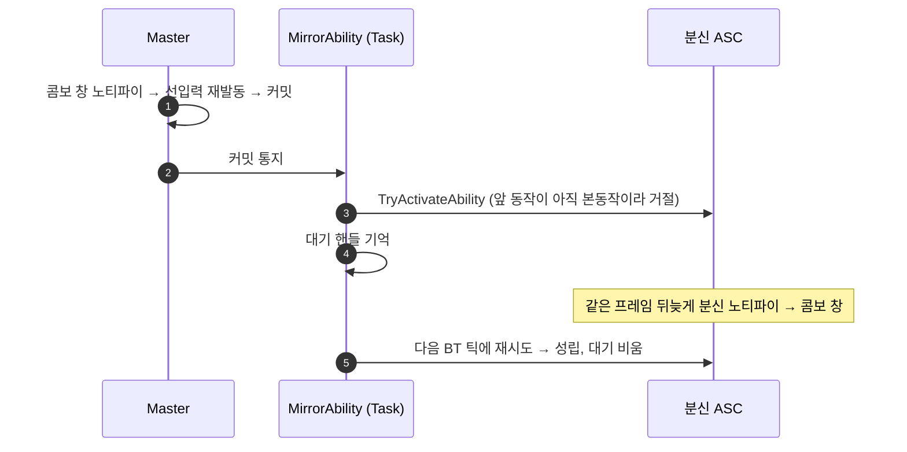

# 도플갱어 미러 발동 거절 시 재시도

## 계획

### 목표
분신은 Master가 어빌리티를 커밋할 때 한 번만 따라 쓰려 하고, 거절되면 버린다. 플레이어가 콤보를 미리 누르면 선입력이 Master 몽타주의 콤보 창 노티파이 안에서 곧바로 다음 단계를 발동한다. 이때 분신 메시는 같은 프레임에 아직 틱하지 않아 본동작 상태이고, 배타 판정에 거절돼 그 단계를 건너뛴다. 거절된 따라 쓰기를 짧게 다시 시도해, 분신이 한 프레임 늦게라도 같은 단계를 쓰게 한다.

### 수정 범위
| 파일 | 수정할 내용 | 구분 |
|---|---|---|
| `WxAI/Public/WxBTTask_MirrorAbility.h` | 재시도 시간 저작 프로퍼티, 대기 핸들과 경과 시간 | 수정 |
| `WxAI/Private/WxBTTask_MirrorAbility.cpp` | 거절된 발동을 대기로 기억하고 매 BT 틱 재시도, 만료·스펙 회수 때 비움 | 수정 |

### 접근 방식
- **재시도는 BT 틱에서 한다**: 분신의 캔슬 창 전이 이벤트는 분신 어빌리티가 발동하는 도중에도 방송된다. 그래서 거기서 발동하면 발동 안에서 다시 발동하게 된다. 캔슬 창 없이 끝나는 앞 동작을 잡으려면 종료 구독도 따로 필요하다. BT 틱은 어떤 어빌리티 호출 스택 밖에서 돌고, 두 경우를 한 경로로 받는다. 대가는 한 프레임 지연이다. 분신의 노티파이는 앞 프레임에 이미 처리됐으므로 첫 재시도에서 보통 성립한다.
- **대기는 한 건이고 최신 커밋이 정한다**: 따라 쓰기가 성립하면 대기를 비우고, 거절되면 대기를 그것으로 바꾼다. Master가 다음 동작으로 넘어갔으면 앞 동작은 낡은 것이다. 선입력 버퍼와 같은 규칙이다.
- **재시도 시간은 선입력 버퍼와 같은 0.4초**: 지나면 버린다. 오래 막혀 있다가 풀린 뒤 옛 동작이 튀어나오지 않게 한다.

---

## 완료

### 수정한 파일
| 파일 | 수정한 내용 | 구분 |
|---|---|---|
| `WxAI/Public/WxBTTask_MirrorAbility.h` | 재시도 시간 저작 프로퍼티(기본 0.4초), 대기 핸들과 경과 시간 | 수정 |
| `WxAI/Private/WxBTTask_MirrorAbility.cpp` | 따라 쓰기 결과로 대기를 비우거나 바꾸고, BT 틱마다 재시도·만료 처리, 스펙 회수 때 대기도 비움 | 수정 |

### 구현·결정과 그 이유
- **만료는 시도보다 먼저 본다**: 재시도 시간을 0으로 두면 한 번도 다시 시도하지 않는다. 이렇게 저작으로 기능을 끌 수 있다.
- **스펙 회수가 대기도 비운다**: Master 교체와 태스크 정리가 모두 스펙을 회수하는 같은 함수를 지난다. 그래서 회수된 핸들로 재시도하는 경로가 없다.
- **재시도 결과도 Verbose 로그로 남긴다**: 거절된 커밋 로그와 짝지어 보면, 몇 초 뒤에 성립했는지 만료됐는지 알 수 있다.

### 계획 대비 달라진 점
- 계획대로.

### 검증
- UE 5.8 `WxEditor Win64 Development` 빌드 성공(`Result: Succeeded`, 태스크 cpp 컴파일 확인).
- PIE 미실시.

### 후속 과제
- PIE 확인: `log LogWxAI Verbose`를 켜고 약공격 콤보를 미리 눌러 이어 친다. 분신이 매 단계를 같이 치는지, 거절된 커밋 다음에 `Mirror retry … accepted`가 찍히는지 본다.
- 범위 밖: 가드가 분신에 남아 배타 발동을 모두 막는 문제는 재시도로 풀리지 않는다. 0.4초가 지나면 만료될 뿐이다.
