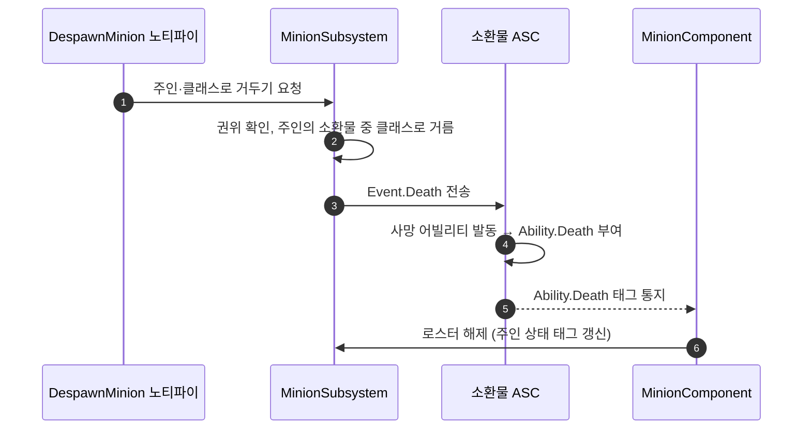

# 소환물 사망 노티파이 — 몽타주에서 소환물을 사망으로 거두기

## 계획

### 목표
지금은 소환 노티파이만 있고 몽타주에서 소환물을 거두는 수단이 없다. 소환 노티파이와 같은 모양의 거두기 노티파이를 만들되, 파괴가 아니라 소환물의 사망 어빌리티를 발동시켜 사망 연출과 시체 수명을 거치게 한다.

### 수정 범위
| 파일 | 수정할 내용 | 구분 |
|---|---|---|
| `WxCombat/Public/AnimNotify/WxAnimNotify_DespawnMinion.h` | 노티파이 선언, 거둘 소환물 클래스 필드 | 신규 |
| `WxCombat/Private/AnimNotify/WxAnimNotify_DespawnMinion.cpp` | 소유 폰을 주인으로 서브시스템에 넘김, 노티파이 표시 이름 | 신규 |
| `WxCombat/Public/Minion/WxMinionSubsystem.h`·`.cpp` | 주인의 소환물 중 지정 클래스에 사망을 보내는 공개 함수 추가 | 수정 |

### 접근 방식
- **노티파이는 소환 노티파이와 같은 두께로**: 메시 소유 폰을 주인으로 보고 서브시스템에 넘기기만 한다. 권위 판정은 소환과 똑같이 서브시스템이 한다.
- **거둘 대상은 주인의 소환물 중 지정 클래스(하위 포함)**: 소환 노티파이의 클래스 필드와 짝을 이뤄 "이 몽타주가 부른 그 소환물"을 지목한다. 비우면 아무것도 하지 않는다. 대상 목록은 기존 수집 함수가 복사본으로 주므로 순회 도중 사망으로 로스터가 바뀌어도 안전하다.
- **사망 발동은 `Event.Death` 이벤트로**: 사망 어빌리티의 유일한 트리거가 이 이벤트라, AttributeSet이 HP 0에서 하는 것과 같은 방식으로 소환물 ASC에 보낸다. 사망 어빌리티는 서버 개시형이라 서버에서 보내면 된다.
- **추가 가드 없음**: 이미 죽은 소환물은 소환물 컴포넌트가 사망 태그를 보고 로스터에서 내리므로 목록에 잡히지 않는다. 로스터 해제와 주인 상태 태그 갱신도 그 기존 경로가 처리한다.
- 소환물은 HP가 남은 채 죽는다. 사망 상태의 기준은 `Ability.Death` 태그라 판정에는 영향이 없다.

---

## 완료

### 수정한 파일
| 파일 | 수정한 내용 | 구분 |
|---|---|---|
| `WxCombat/Public/AnimNotify/WxAnimNotify_DespawnMinion.h` | 노티파이 선언, 거둘 소환물 클래스 필드 | 신규 |
| `WxCombat/Private/AnimNotify/WxAnimNotify_DespawnMinion.cpp` | 소유 폰을 주인으로 서브시스템에 넘김, 타임라인 표시 이름 | 신규 |
| `WxCombat/Public/Minion/WxMinionSubsystem.h`·`.cpp` | 주인의 소환물 중 지정 클래스에 `Event.Death`를 보내는 공개 함수, 게임플레이 태그 include | 수정 |

### 구현·결정과 그 이유
- **거두기 로직을 서브시스템에 뒀다**: 소환과 마찬가지로 권위 판정과 로스터 조회가 서브시스템 몫이다. 로스터 수집 함수를 공개로 풀지 않고 거두기 함수 하나만 열어, 노티파이는 소환 노티파이와 같은 두께로 남았다.
- **파괴가 아니라 사망 이벤트로**: 사망 어빌리티가 몽타주·래그돌 폴백·시체 수명·AI 정지를 이미 다 하므로, 그 트리거 이벤트를 보내는 것만으로 소환물이 일반 사망과 같은 길을 밟는다. 로스터 해제와 주인 상태 태그 갱신도 소환물 컴포넌트의 기존 사망 구독이 처리해 따로 부르지 않는다.
- **표시 이름에 접두어**: 소환 노티파이가 클래스 이름만 띄우므로, 같은 소환물을 가리키는 두 노티파이가 타임라인에서 구별되게 `Despawn`을 붙였다.

### 계획 대비 달라진 점
- 검증 구성이 달라졌다. 사용자 에디터(Development)가 Live Coding으로 떠 있어 Development 빌드가 막혔고, 에디터를 닫지 않고 DebugGame 구성으로 컴파일을 확인했다(`Result: Succeeded`, 새 노티파이·서브시스템 cpp 컴파일 포함).

### 후속 과제
- Development 바이너리는 아직 옛 코드다. 에디터를 닫고 Development로 다시 빌드해야 노티파이가 에디터에 보인다.
- 몽타주에 노티파이를 배치하는 에셋 작업과 PIE 동작 확인이 남았다.
