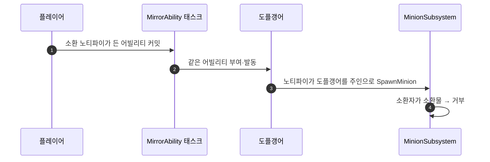

# 소환물의 소환 차단 — 도플갱어가 있는 동안 미니언이 나오는 문제

## 계획

### 목표
도플갱어가 있는 동안 미니언이 소환되지 않게 한다. 플레이어가 직접 부르는 소환은 어제 넣은 조건으로 이미 막히지만, 도플갱어가 주인의 소환 동작을 따라 하면서 자기가 주인이 되어 미니언을 부르는 길이 열려 있다.

### 수정 범위
| 파일 | 수정할 내용 | 구분 |
|---|---|---|
| `WxCombat/Private/Minion/WxMinionSubsystem.cpp` | 소환 요청 첫 가드에 "소환자가 소환물이면 거부" 추가 | 수정 |
| `WxCombat/Public/Minion/WxMinionSubsystem.h` | `SpawnMinion` 주석에 위 규칙 한 줄 | 수정 |
| `Content/Character/HGTest/Abilities/Skill_1/GA_HGTest_Skill_1.uasset` | 발동 차단 태그에 도플갱어 주인 태그 추가 | 수정 |

### 접근 방식
- **원인**: 소환 조건은 주인 ASC의 태그로 평가한다. 도플갱어 보유 태그는 플레이어에게만 붙으므로, 미러링으로 소환 몽타주를 재생한 도플갱어가 주인 자격으로 요청하면 조건을 통과한다.
- **소환물은 소환하지 못한다**: 소환 요청 맨 앞에서 소환자 자신이 소환물인지 보고 거부한다. 소환물 여부는 Instigator가 이미 답하므로 새 필드나 태그가 필요 없다. 미러된 몽타주는 그대로 재생되고 스폰만 빠진다. 미러링 때마다 불리는 경로라 로그는 남기지 않는다.
- **미러 제외 목록으로는 못 막는다**: 같은 소환 노티파이가 약공격 4타와 회피 반격에도 있어, 제외하면 도플갱어가 그 공격들을 아예 따라 하지 못한다.
- **E 스킬은 발동부터 막는다**: 지금은 도플갱어가 있을 때 E를 누르면 소환은 안 되는데 몽타주가 재생되고 MP와 쿨다운만 나간다. 차단 태그는 부모로 넓히지 않고 BP_Minion에 저작된 조건과 같은 태그를 명시한다.

---

## 완료

### 수정한 파일
| 파일 | 수정한 내용 | 구분 |
|---|---|---|
| `WxCombat/Private/Minion/WxMinionSubsystem.cpp` | 소환자가 소환물이면 소환을 거부하는 가드 추가 | 수정 |
| `WxCombat/Public/Minion/WxMinionSubsystem.h` | `SpawnMinion` 주석에 위 규칙 한 줄 | 수정 |
| `Content/Character/HGTest/Abilities/Skill_1/GA_HGTest_Skill_1.uasset` | 발동 차단 태그에 도플갱어 주인 태그 추가, 컴파일 후 저장 | 수정 |

### 구현·결정과 그 이유
- **규칙을 소환 요청 입구에 뒀다**: 소환 경로가 노티파이 하나로 모여 서브시스템을 지나므로, 어느 몽타주에서 오든 한 곳에서 걸린다. 같은 규칙으로 도플갱어가 궁극기를 따라 해 자기 분신을 부르는 길도 함께 닫힌다.
- **조건 저작으로 풀지 않았다**: 소환 조건은 주인 ASC의 태그를 보는데, 분신에게는 자기가 소환물임을 알리는 태그가 없다. 그 태그를 새로 만들어 소환물마다 조건에 적게 하는 것보다, 이미 Instigator가 답하는 사실을 입구에서 한 번 묻는 편이 작다.
- **권위·클래스 검사와 합치지 않고 따로 뒀다**: 이유가 다른 거부라 주석을 붙일 자리가 필요했다.

### 계획 대비 달라진 점
- 계획대로.

### 후속 과제
- 사용자 에디터는 DebugGame 타깃을 `-skipcompile`로 띄운 상태라, 이번 Development 빌드는 컴파일 확인일 뿐 실행 중인 에디터에 반영되지 않는다. Live Coding이나 DebugGame 재빌드 후 PIE 확인이 남았다. 어빌리티 차단 태그는 에셋이라 바로 적용된다.
- 진단은 코드와 에셋 값을 따라가 내린 것이고 런타임으로 재현해 보지는 않았다.
