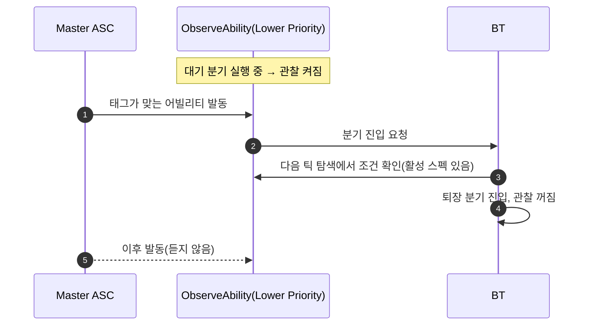

# 어빌리티 관찰 데코레이터로 미니언 반응 전환

## 계획

### 목표
미니언이 [공격 → Death] 분기를 도는 중에 Master가 반응 스킬을 다시 쓰면 감지 서비스가 루트부터 재선택을 강제해 Death가 밀린다. 서비스와 Master 전용 데코레이터를 걷고, 블랙보드 키로 지목한 아무 액터의 어빌리티 실행을 스스로 관찰하는 범용 데코레이터로 바꿔 엔진 기본 Observer aborts 규칙에 재진입을 맡긴다.

### 수정 범위
| 파일 | 수정할 내용 | 구분 |
|---|---|---|
| `WxAI/Public/WxBTDecorator_ObserveAbility.h`, `Private/...cpp` | 대상 액터가 태그에 맞는 어빌리티를 실행 중인지 조건 + 발동·종료 관찰 | 신규 |
| `WxAI/.../WxBTService_ObserveMasterAbility.*` | BT 재구성 후 삭제 | 삭제 |
| `WxAI/.../WxBTDecorator_MasterAbility.*` | BT 재구성 후 삭제 | 삭제 |
| `WxAI/.../WxBTTask_FollowMasterAbility.*` | 경유했던 안, BT 재구성 후 삭제 | 삭제 |
| `WxAI/.../WxBlackboardKeys.*` | Follow만 쓰던 Master 읽기 accessor 삭제 | 수정 |
| `WxAI/README.md` | 소환수 계열 설명 갱신 | 수정 |
| `Content/Character/Minion/BT_Minion.uasset` | 사용자가 재구성 | 수정 |

### 접근 방식
- **상태 조건**: "대상 ASC에 태그가 맞는 활성 스펙이 있다". 대기 요청·소비 같은 상태 장치가 없고, 소환 직후 따라잡기는 첫 탐색이 해 준다.
- **관찰은 엔진이 켜고 끈다**: 데코레이터가 관찰 구간에 들어오면 대상 ASC의 발동·종료 통지와 블랙보드 키 변경을 구독하고, 나가면 해제한다. Lower Priority는 자기 분기가 실행되는 동안 관찰이 꺼지므로, 들어간 퇴장 분기는 Master의 이후 발동에 끊기지 않는다.
- **발동 통지는 진입 요청만**: 엔진이 발동 통지를 활성 카운트 증가 전에 보내므로 그 자리에서 조건을 평가하지 않고 분기 진입만 요청한다. 조건은 다음 탐색이 확인한다.
- **퇴장 분기 묶음**: 형제 분기로 두면 더 높은 쪽 관찰이 낮은 쪽 실행을 끊으므로, 퇴장 스킬들을 한 데코레이터 아래 묶고 안쪽은 조건 전용으로 고른다.
- **2단계 진행**: 에셋이 옛 네이티브 클래스를 참조한 채 로드되지 않게, 새 데코레이터를 먼저 넣고 BT 재구성 뒤 옛 클래스를 지운다.

---

## 완료

### 수정한 파일
| 파일 | 수정한 내용 | 구분 |
|---|---|---|

### 구현·결정과 그 이유

### 계획 대비 달라진 점

### 후속 과제
