# <제목>

> 전체 1~2페이지를 넘기지 않는다. (이 안내 줄과 꺾쇠 플레이스홀더는 작성 시 지운다.)

## 계획

### 목표
<무엇을, 왜. 1~3문장.>

### 수정 범위
| 모듈 | 파일 | 수정할 내용 |
|---|---|---|
| `<모듈>` | `<파일>` | <무엇을 어떻게> |

### 접근 방식
<핵심 메커니즘 위주로 설명>

<!--
산문은 무엇을 왜 바꾸는지(의도·메커니즘)를 우선한다.
식별자·파일·줄번호 인용은 흐름에 꼭 필요한 핵심만 남긴다 — 한 문장에 백틱을 여러 개 박지 않는다.
구체적 위치·시그니처는 「완료」의 수정 파일 표나 코드 자체에 맡기고, 긴 코드 블록은 넣지 않는다(불가피하면 한두 줄).

글보다 그림이 더 잘 읽히는 구조면 다이어그램을 넣는다.
예: 모듈·컴포넌트 관계와 경계를 넘는 데이터/델리게이트, 데이터·이벤트 흐름, 상태 전이, 호출 순서, 클래스/상속 관계.
단순하거나 글로 충분하면 생략한다.
아래는 예시이므로 실제 설계에 맞는 형태로 교체한다.
-->

```mermaid
flowchart LR
    subgraph WxInventory
        EC[WxEquipmentComponent]
    end
    subgraph WxGame
        Char[WxCharacterBase] --> WA[WeaponActor]
    end
    EC -- "OnEquipVisualChanged&#40;USkeletalMesh*, FName&#41;" --> Char
```

---

## 완료

### 수정한 파일
| 모듈 | 파일 | 수정 내용 |
|---|---|---|
| `<모듈>` | `<파일>` | <수정 요약 / 신규·삭제 명시> |

### 구현·결정과 그 이유
<!-- "왜"에 집중한다. 식별자 인용은 절제하고 근거를 산문으로 쓴다. -->
- **<결정>**: <왜 이렇게 했는가>

### 계획 대비 달라진 점
- <무엇이, 왜 달라졌는가> (없으면 "계획대로")

### 후속 과제
- <남은 일·미검증 항목> (없으면 "없음")
