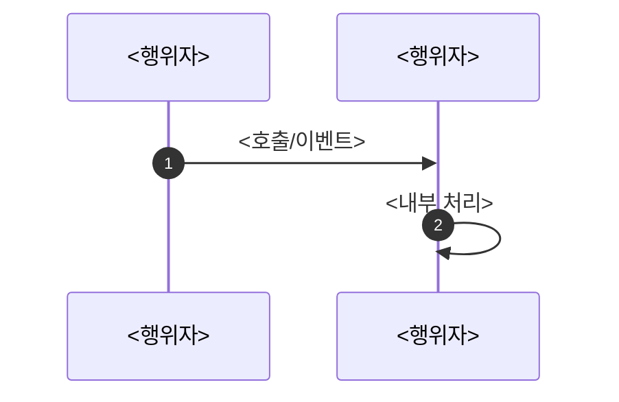

# <제목>

> 전체 1~2페이지를 넘기지 않는다. (이 안내 줄과 꺾쇠 플레이스홀더는 작성 시 지운다.)

## 계획

### 목표
<무엇을, 왜. 1~3문장.>

### 수정 범위
| 파일 | 수정할 내용 | 구분 |
|---|---|---|
| `<파일>` | <무엇을 어떻게> | <신규·수정·삭제 명시> |

### 접근 방식
- **<방식>**: <핵심 메커니즘 위주로 설명>

<!--
단순하거나 글로 충분할 때만 생략한다.
아래는 예시이므로 실제 설계에 맞는 형태로 교체한다.
-->

---

## 완료

### 수정한 파일
| 파일 | 수정한 내용 | 구분 |
|---|---|---|
| `<파일>` | <수정 요약> | <신규·수정·삭제 명시> |

### 구현·결정과 그 이유
<!-- "왜"에 집중한다. 식별자 인용은 절제하고 근거를 간결하게 쓴다. -->
- **<결정>**: <왜 이렇게 했는가>

### 계획 대비 달라진 점
- <무엇이, 왜 달라졌는가> (없으면 "계획대로")

### 후속 과제
- <남은 일·미검증 항목> (없으면 "없음")