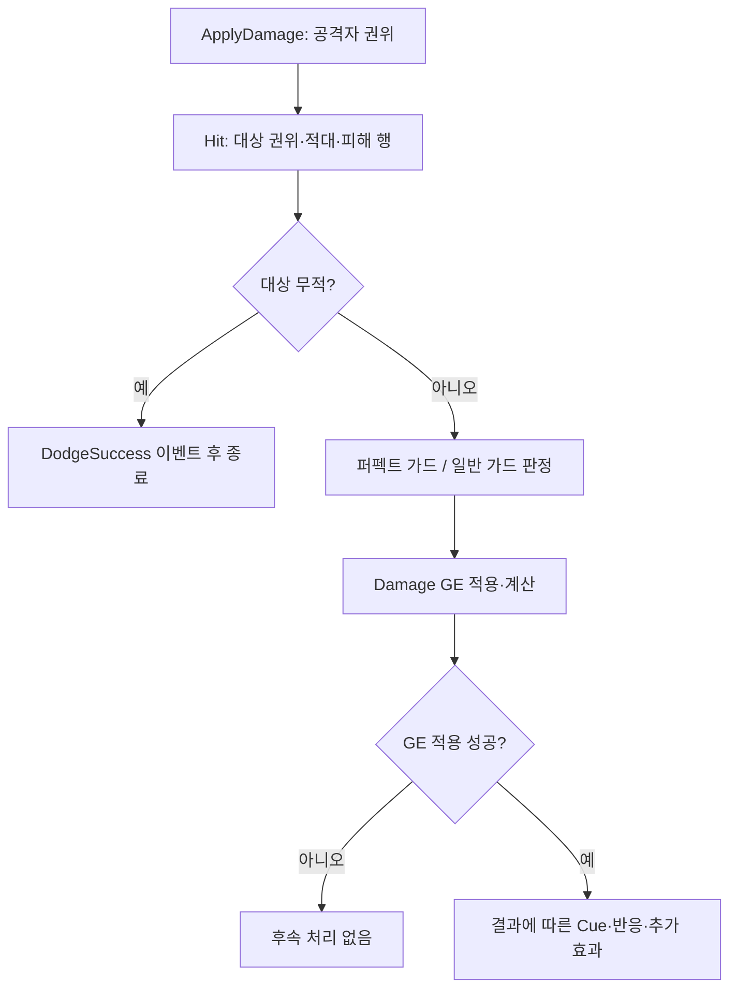

# 피해 처리와 전투 연출

피해는 서버 권한·적대·무적·가드 검사를 거쳐 자원에 반영되고, 그 결과로 피격 반응과 Cue를 발행한다.

## 처리 순서

`ApplyDamage`는 공격자 또는 그 Owner의 ASC와 대상 ASC를 찾고 공격자 권위를 검사한다. Hit 컴포넌트는 대상 권위·유효한 피해 행·적대를 검사한다. 팀 인터페이스가 없거나 중립/우호인 대상을 일반 적대 피해로 처리하지 않는다.

사망 태그 `Ability.Death`는 Damage GE의 적용을 거부한다. Hit Wrapper가 받아들여진 사실만으로 실제 피해 적용 성공을 판단하지 않는다.

## 결과별 자원과 반응

| 결과 | 자원 반영 | 후속 처리 |
|---|---|---|
| 일반 양수 피해 | HP 차감 후 GP 증가 | 공격 피해 태그가 있으면 피격·DamageDealt 이벤트 |
| 일반 가드 | 경감된 양으로 SP, HP, GP 순서 | 차감 전 SP 이하 판정으로 GuardBreak 표시 |
| 퍼펙트 가드 | 대상 HP/SP/GP 피해 없음, 반사 메타 출력 | PerfectGuard 이벤트, 공격자 GP 반사, 허용된 경우 Parry 반응 |

이미 그로기인 대상에게는 일반 피해의 GP 누적을 하지 않는다. 반사 대상인 공격자가 그로기일 때도 GP를 더하지 않는다. `Damage.CanParry`는 반사 GP 자체가 아니라 패리 리액션을 제어한다. 반사량 0도 실행 기록은 남아 퍼펙트 가드 연출을 유지한다.

## 계산과 순서의 이유

피해량은 `Round(Max(ATK × CoeffATK × K / (K + DEF), 0) × 크리배율 × 가드배율)`이다. K는 DefenseConstant를 작은 양수 이상으로 제한한 값이다. 크리 배율은 `1 + CritDMG/100`, 크리 확률은 `Clamp(CritRate/100, 0, 1)`이다. 일반 가드 배율은 `1 − Clamp(GuardReductionScale, 0, 1)`이며 퍼펙트 가드는 크리·일반 가드 경감 없이 반사량을 계산한다.

HP를 GP보다 먼저 반영해 사망 이벤트가 그로기 이벤트보다 앞서도록 한다. `IncomingDamage`는 실행 후 기본값을 읽고 초기화하며 HP 기본값에서 뺀다. 현재값을 기본값에 다시 쓰면 지속형 보정이 영구화될 수 있기 때문이다.

가드 불가 공격은 피격 이벤트 전에 가드를 취소한다. GuardBreak 태그가 있어도 같은 타격에서 그로기가 가드를 끊었다면 일반 Hit 이벤트로 보낸다. 추가 효과 Spec의 소스 태그는 반응 이벤트 전에 캡처한다. 퍼펙트 가드는 추가 효과를 적용하지 않는다.

## 결과 해석

`ApplyDamage`의 성공은 GE 적용 성공이며 양수 피해를 뜻하지 않는다. 피해 숫자는 남은 HP 차이가 아니라 실행 기록의 피해량을 사용한다. [Hit 컴포넌트](../../../Plugins/WxCombat/Source/WxCombat/Private/AbilitySystem/Effect/WxEffectComponent_Hit.cpp)와 [계산](../../../Plugins/WxCombat/Source/WxCombat/Private/AbilitySystem/Effect/WxEffect_Damage.cpp)이 규칙 변경의 중심이다. 실제 몽타주·Cue·멀티플레이 연출은 별도 검증 대상이다.

## 관련 문서

- [[combat|WxCombat — 전투 시스템]] ([WxCombat — 전투 시스템](../topics/combat.md))
- [[combat-abilities|전투 어빌리티와 이펙트]] ([전투 어빌리티와 이펙트](../concepts/combat-abilities.md))
- [[combat-groggy|그로기]] ([그로기](../concepts/combat-groggy.md))
- [[combat-resources|전투 자원과 현광의 예외]] ([전투 자원과 현광의 예외](../concepts/combat-resources.md))

## Sources

- [근거 1](../../raw/notes/2026-09-22-current-damage.md)
- [근거 2](../../raw/notes/2026-09-22-current-foundation.md)

출처·검증 및 참고 정보

2026-09-22 현재 작업 트리 정적 조사·재편찬. 기준 HEAD `fe8c943f49401326e1007fedd78a937c9e66db47`에 미커밋 문서·도구 변경을 포함하며, 정확한 입력은 출처의 파일별 SHA-256과 발췌 범위로 식별한다. 문서의 `confidence: medium`은 제한된 정적 근거에 대한 표시다. `verified`는 순정 규칙에 따른 편찬일이다.

빌드·게임 실행·멀티플레이·BP/WBP·DataTable·BT/StateTree 바이너리 내부는 이번에 검증하지 않았다. 기획·회의 보고·확정 판단·코드 관찰을 서로 대체하지 않는다.

