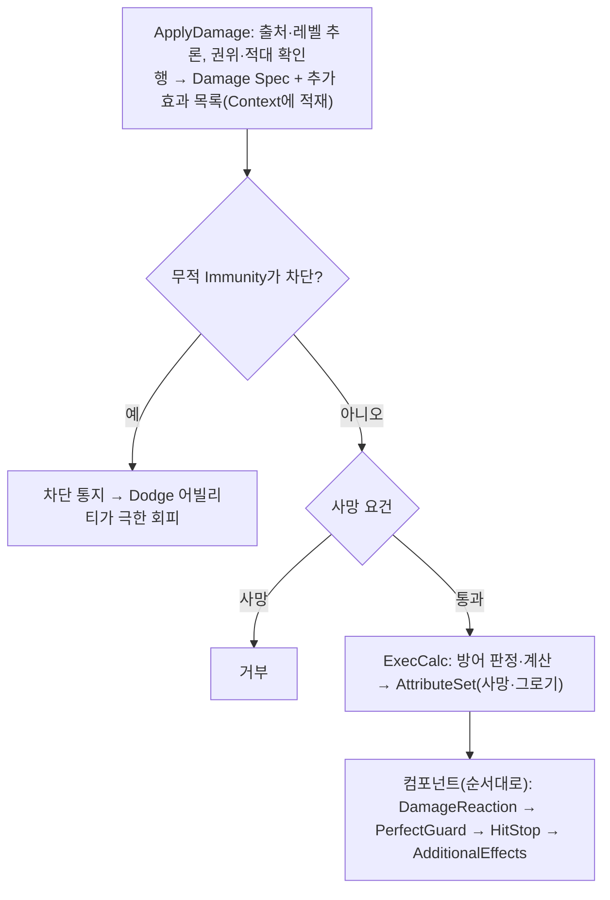

# 피해 처리와 전투 연출

피해는 서버 권한·적대·무적·가드 검사를 거쳐 자원에 반영되고, 그 결과로 피격 반응과 Cue를 발행한다.

## 처리 순서

C++과 Blueprint 모두 `ApplyDamage(Causer, Target, DamageTableRow, HitResult)` 하나로 피해를 요청한다. `ApplyDamage`는 입력 조립(출처·레벨·Context·Spec)과 권위·적대 확인만 하고, 게임 규칙은 Damage GE 안에서 처리한다. 결과는 앞으로만 흐른다.

적대는 GE 요건이 아니라 `ApplyDamage`에서 거른다. 엔진이 무적 Immunity 쿼리를 GE 적용 요건보다 먼저 돌려, GE 요건으로 두면 아군 공격에도 회피 통지가 나가기 때문이다. 사망은 사망 어빌리티가 `Ability.*`를 취소해 Dodge가 비활성이므로 Damage GE의 TargetTagRequirements만으로 충분하다. 반응은 실행 기록(`GetModifiedAttribute`)을 가진 `OnGameplayEffectExecuted`에서 낸다.

무적(`UWxEffect_Invincible`)의 Immunity는 `UWxEffect_Damage` 클래스만 막는다. 추가 효과로 이미 걸린 지속 피해 GE나 치트 `UWxEffect_AddIncomingDamage`는 무적 중에도 들어간다.

## 출처와 레벨

Causer의 ASC를 출처로 쓰고, 없으면 Causer의 Owner ASC를 쓴다. 투사체는 저장된 발사 레벨을 쓰고 Ability를 연결하지 않는다. 반사로 Owner가 바뀌어도 레벨은 유지하며 능력치 전체를 발사 시점에 고정하지 않는다. 그 외 Causer는 현재 AnimatingAbility와 그 레벨(없으면 1)을 쓴다.

## 판정과 전달

피해 행은 요청마다 한 번 읽는다. `MakeDamageSpec`이 계수(SetByCaller)와 공격 태그를 Damage GE Spec에 싣고, 추가 효과 GE 목록을 입력 전용 `FWxDamageEffectContext`에 싣는다. 방어 판정은 ExecCalc가 실행 시점의 대상 태그와 `Damage.CanGuard`로 한 번 내리고 `Damage.Guarded`/`Damage.PerfectGuarded` 결과 태그를 붙인다(크리티컬·가드 브레이크와 같은 방식). 마지막 컴포넌트 `_AdditionalEffects`가 퍼펙트 가드가 아니면 반응이 끝난 뒤의 출처 상태로 추가 효과 Spec을 만들어 적용한다.

| 결과 | 자원 반영 | 후속 처리 |
|---|---|---|
| 일반 양수 피해 | HP 차감 후 GP 증가 | 피격·DamageDealt 이벤트 |
| 일반 가드 | 경감된 양으로 SP, HP, GP 순서 | 차감 전 SP 이하 판정으로 GuardBreak 표시 |
| 퍼펙트 가드 | 대상 HP/SP/GP 피해 없음, 반사 메타 출력 | PerfectGuard 이벤트, 공격자 GP 반사, 허용된 경우 Parry 반응 |

이미 그로기인 대상에게는 일반 피해의 GP 누적을 하지 않는다. 반사 대상인 공격자가 그로기일 때도 GP를 더하지 않는다. `Damage.CanParry`는 반사 GP 자체가 아니라 패리 리액션을 제어한다. 반사량 0인 퍼펙트 가드도 판정 태그로 식별되어 연출을 유지한다.

## 계산과 순서의 이유

피해량은 `Round(Max(ATK × CoeffATK × K / (K + DEF), 0) × 크리배율 × 가드배율)`이다. K는 DefenseConstant를 작은 양수 이상으로 제한한 값이다. 크리 배율은 `1 + CritDMG/100`, 크리 확률은 `Clamp(CritRate/100, 0, 1)`이다. 일반 가드 배율은 `1 − Clamp(GuardReductionScale, 0, 1)`이며 퍼펙트 가드는 크리·일반 가드 경감 없이 반사량을 계산한다.

HP를 GP보다 먼저 반영해 사망 이벤트가 그로기 이벤트보다 앞서도록 한다. 사망·그로기 발행은 AttributeSet에 있어 치트·AddGP 같은 직접 자원 경로도 공유한다. `IncomingDamage`는 실행 후 기본값을 읽고 초기화하며 HP 기본값에서 뺀다. 현재값을 기본값에 다시 쓰면 지속형 보정이 영구화될 수 있기 때문이다.

반응 순서는 플로터 → Hit Cue → 가드 취소 → 피격 → 가해 → 퍼펙트 가드(투사체 되돌림 포함) → 히트스톱 → 추가 효과다. 반응은 Damage GE에 붙은 `UWxEffectComponent_DamageReaction`·`_PerfectGuard`·`_HitStop`·`_AdditionalEffects`가 생성자에서 추가된 순서대로 `OnGameplayEffectExecuted`에서 처리한다. 히트스톱은 Hit Cue와 같은 조건(피해 > 0 또는 퍼펙트 가드)에서만 원인 액터(무기·투사체)의 설정값을 읽어 공격자·피격자에게 걸며, 범위 공격·피니셔처럼 그 외 원인은 걸지 않는다. 플로터·Hit Cue는 `_DamageReaction`이 서버에서 빈 예측 키로 발행하므로 공격자 클라이언트도 서버 판정 뒤에 받는다. 가드 불가 공격은 피격 이벤트 전에 가드를 취소한다. GuardBreak 태그가 있어도 같은 타격에서 그로기가 가드를 끊었다면 일반 Hit 이벤트로 보낸다.

## 결과 해석

`ApplyDamage`는 Damage GE 적용 여부(bool)만 돌려준다. 양수 피해가 아니어도 true이고 무적·사망·거부면 false다. 적용 결과에 따른 후속(회피·반응·히트스톱·퍼펙트 가드 되돌림)은 모두 GAS 안에서 처리되며 운영 호출부는 반환값을 쓰지 않는다. 일반 가드와 퍼펙트 가드는 서로 배타적이며 Spec 태그로만 존재한다. 반응과 플로터는 실행 기록의 피해량을 쓴다(남은 HP로 제한한 실제 감소량이 아님).

ExecCalc가 0 피해로 출력 없이 끝난 타격(반올림 0, 완전 경감 가드)은 적용은 됐지만 타격이 아니다. 플로터·Hit Cue·피격 이벤트·가드 SP 차감·히트스톱이 모두 빠지고, 피해 없는 디버프 행을 위해 추가 효과만 적용된다. 무적·사망·비적대처럼 GE가 적용되지 않은 경우는 추가 효과까지 모두 빠진다.

투사체는 서버·클라이언트 모두 피해 적용 전에 대상의 무적 태그를 보고 통과를 정한다(회피 반응이 무적을 걷어낼 수 있어 적용 전에 본다). 퍼펙트 가드로 막히면 `_PerfectGuard` 컴포넌트가 원인 투사체를 방어자 Pawn 쪽으로 되돌린다(투사체의 `bCanReflect`가 false면 무시). 투사체는 피해 호출 뒤 Owner가 방어자로 바뀌었으면 되돌려진 것으로 보고 파괴하지 않는다. 서버 Overlap FX는 피해 호출 뒤 재생한다.

[진입점](../../../Plugins/WxCombat/Source/WxCombat/Private/WxCombatLibrary.cpp), [반응](../../../Plugins/WxCombat/Source/WxCombat/Private/AbilitySystem/Effect/WxEffectComponent_DamageReaction.cpp), [계산](../../../Plugins/WxCombat/Source/WxCombat/Private/AbilitySystem/Effect/WxEffect_Damage.cpp)이 규칙 변경의 중심이다. 실제 몽타주·Cue·멀티플레이 연출은 별도 검증 대상이다.

## 관련 문서

- [[combat|WxCombat — 전투 시스템]] ([WxCombat — 전투 시스템](../topics/combat.md))
- [[combat-abilities|전투 어빌리티와 이펙트]] ([전투 어빌리티와 이펙트](../concepts/combat-abilities.md))
- [[combat-groggy|그로기]] ([그로기](../concepts/combat-groggy.md))
- [[combat-resources|전투 자원과 현광의 예외]] ([전투 자원과 현광의 예외](../concepts/combat-resources.md))

## Sources

- [근거 1](../../raw/notes/2026-09-22-current-damage.md)
- [근거 2](../../raw/notes/2026-09-22-current-foundation.md)
- [피해 결과 반환 계약](../../raw/notes/2026-09-23-damage-result-contract.md)
- [명시적 요청과 BP 호환 계약](../../raw/notes/2026-09-23-damage-request-contract.md)
- [타격별 실행 정의의 초기 구현](../../raw/notes/2026-09-23-damage-definition-snapshot.md)
- [입력 보관 구조 단순화](../../raw/notes/2026-09-23-damage-definition-simplification.md)
- [Hit 함수별 책임](../../raw/notes/2026-09-23-hit-processing-functions.md)
- [Context 미사용·중복 데이터 제거](../../raw/notes/2026-09-23-damage-context-cleanup.md)
- [Result 필드 평탄화](../../raw/notes/2026-09-23-damage-result-flat.md)
- [ApplyDamage API 통합](../../raw/notes/2026-09-23-apply-damage-unification.md)
- [단일 요청 진입점의 중간 구현](../../raw/notes/2026-09-23-damage-single-entry.md)
- [정방향 흐름 재설계](../../raw/notes/2026-09-23-damage-forward-flow.md)
- [네 인자 인터페이스 복원](../../raw/notes/2026-09-23-damage-four-arguments.md)
- [0 피해 히트스톱 조건과 주석 정정](../../raw/notes/2026-09-23-zero-damage-hitstop.md)

출처·검증 및 참고 정보

2026-09-23 커밋 `855ec2eb3` 기준으로 본문 전체(처리 순서·출처·판정·계산·결과 해석)를 코드와 대조했다. 전체 WxEditor 빌드는 통과했고, 피해 파이프라인 자동화 테스트(`Wx.Combat.Damage.Result`)는 사용자 지시로 삭제되어 이후 회귀 검증은 빌드와 플레이로만 한다. 극한 회피·히트스톱·퍼펙트 가드 되돌림·추가 효과 시점·멀티플레이 연출은 플레이 미검증이다. 근거와 남은 과제는 [작업 자료](../../../.agents/workflow/tasks/damage-pipeline-structure-review.md)에 있다.

2026-09-23 `zero-damage-hitstop` 반영분(히트스톱 조건·0 피해 타격·Hit Cue 발행 주체·무적 범위)은 해당 코드와 대조했고 전체 WxEditor 빌드가 통과했다. 플레이는 미검증이다.

원자료 중 Hit Wrapper GE·`FWxHitEffectContext`·`FWxDamageRequest`·`FWxDamageResult`를 다루는 노트는 재설계 전 단계의 이력이며 현재 구조가 아니다.

2026-09-22 현재 작업 트리 정적 조사·재편찬. 기준 HEAD `fe8c943f49401326e1007fedd78a937c9e66db47`에 미커밋 문서·도구 변경을 포함하며, 정확한 입력은 출처의 파일별 SHA-256과 발췌 범위로 식별한다. 문서의 `confidence: medium`은 제한된 정적 근거에 대한 표시다. `verified`는 순정 규칙에 따른 편찬일이다.

빌드·게임 실행·멀티플레이·BP/WBP·DataTable·BT/StateTree 바이너리 내부는 이번에 검증하지 않았다. 기획·회의 보고·확정 판단·코드 관찰을 서로 대체하지 않는다.

