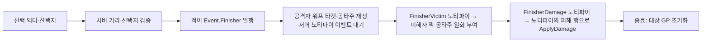

# 그로기 피니시와 뒤잡

피니시는 서버 상호작용에서 발동하며, 현재 구현과 원 기획서의 미결정 규칙을 구분해 관리한다.

## 현재 구현 경로

활성화 검사 실패·몽타주 실패 등은 종료 경로로 빠질 수 있다. 이 그림은 현재 C++의 책임 순서이며 아래 기획 미결정의 확정 답을 나타내지 않는다. 두 노티파이가 불리는 순서는 몽타주 배치가 정한다.

1. 적의 `GetInteractionOptions`는 적대·생존·짝 몽타주 비활성을 확인한다. 그로기라면 허용하고, 그 밖에는 비전투 상태와 후방 원뿔 조건으로 뒤잡을 허용한다. 선택지 문구는 넘겨받은 상호작용자가 가진 Finisher 어빌리티의 `InteractionPrompt`이며, 그 어빌리티가 없으면 선택지를 내지 않는다.
2. 스캐너가 선택 액터·선택지 값을 서버에 보낸다. `UWxAbility_Interact`는 쿼리 콜리전 거리와 대상이 지금 내는 선택지에 그 값이 있는지 다시 확인한다.
3. 적의 `OnInteracted`가 `Event.Finisher`(Instigator는 상호작용자, Target은 적)를 공격자에게 보낸다. 앞잡(그로기)과 뒤잡(비전투 후방)은 같은 Finisher 어빌리티와 몽타주 한 벌로 처리하며, 둘의 구분은 1단계의 선택지 조건에만 있다.
4. 공격자는 ServerInitiated/Override로 활성화되고 무적 효과를 소유한다. 공격자에게 `Finisher` 워프 타겟을 등록하고 `GetMontage()`의 몽타주를 재생한다. 서버는 `Event.PlayFinisherVictimMontage`와 `Event.ApplyFinisherDamage`를 각각 한 번 기다리는 태스크를 건다.
5. 공격자 몽타주의 `UWxAnimNotify_FinisherVictim`이 이벤트를 보내면, 서버의 Finisher 어빌리티가 피해자에게 `UWxAbility_PlayMontageOnce`를 일회 부여·발동해 노티파이의 `VictimMontage`를 재생한다. 0초에 둔 노티파이도 첫 틱에 불리므로 피해자는 공격자보다 한 틱 늦게 시작한다.
6. `UWxAnimNotify_FinisherDamage`가 이벤트를 보내면, 서버의 Finisher 어빌리티가 그 노티파이의 `DamageDataRow`로 `ApplyDamage`를 부른다. 두 노티파이는 자기 자신을 이벤트의 `OptionalObject`에 실어 보낼 뿐이고, 대상은 어빌리티가 쥔다.
7. 종료 때 서버에서 대상 GP 초기화 효과를 적용하며, 노티파이 대기는 태스크와 함께 끝난다. GP 초기화는 이 C++ 경로상 피해 노티파이 순간이 아니라 어빌리티 종료에 놓여 있으며 취소 종료도 포함한다.

2026-09-24 이전에는 플레이어의 `UWxFinisherDamageComponent`가 어빌리티의 대상과 피해 행을 복사해 들고 수명을 맞췄다. 이 컴포넌트는 제거했다(커밋 `4c1bf3e52`). 같은 날 앞잡·뒤잡 변형 구조체와 `bBackstab`, 적이 이벤트에 싣던 대상 태그(`TargetTags`)를 지우고 짝 몽타주·피해 행을 노티파이로 옮겼다(커밋 `64483ab39`). 원자료에는 이 변경 뒤의 전반적인 사용자 플레이 확인만 있고, 처형 피해와 짝 몽타주를 따로 확인한 기록은 없다.

공격자 몽타주의 Motion Warping 설정이 실제 위치 조정을 결정한다. C++은 대상 위치·회전의 워프 타겟을 제공하므로 에셋 내부를 확인하지 않고 최종 이동 궤적을 단정하지 않는다.

## 피해 데이터 연결

피해 행은 `GA_Shared_Finisher`가 아니라 공격자 몽타주 `AM_Shared_Finisher`의 `UWxAnimNotify_FinisherDamage`가 담는다. [작업 기록](../../../.agents/workflow/tasks/ability-table-driven.md)의 1-2단계 설계상 이 노티파이의 행은 `DT_Damage`의 `AM_Shared_Finisher`이고, 원자료 기준 같은 몽타주 0초에 `UWxAnimNotify_FinisherVictim`이 있다. 피해 노티파이가 없으면 피해 이벤트가 오지 않고, 행이 비었거나 없으면 `ApplyDamage`가 false로 거부한다. 행 이름을 바꾸면 이 노티파이의 `DamageDataRow`를 함께 고쳐야 한다. 뒤잡 전용이던 `AM_Shared_BackstabFinisher`는 참조처가 없다(원자료 기준). 2026-09-23의 `AM_Finisher` 참조 복구는 옛 Variant 구조 기준의 이력이다.

## 유지되는 기획 미결정

| 항목 | 원자료의 충돌 | 현재 코드에서 확인한 범위 |
|---|---|---|
| Q-001 대상 우선순위 | 3.1절은 가까운 적, 흐름도는 락온된 그로기 적 우선 | 스캐너는 신규 후보를 거리순으로 붙이고 기존 목록 순서를 유지한다. 확인한 경로에는 피니시·락온 전용 우선순위가 없다. |
| Q-002 위치 조정 주체 | 3.2절은 적이 PC 근처로 이동, 흐름도는 PC 이동 | 공격자에 워프 타겟을 등록한다. 최종 애니메이션 배선은 미확인이다. |

두 질문은 기존 검토에서 승계했고 이번에 [원 기획서](../../../Docs/CombatDesign/그로기_피니시_시스템_기획서.md)를 다시 대조했다. 결정자·확정 답변은 확인되지 않았다. 현재 코드가 존재한다는 사실을 기획 승인으로 취급하지 않는다. 게이지 증감 정지·피해 직후 다운·좁은 지형 복구 등 나머지 기획도 에셋과 실제 실행에서 확인해야 한다.

진입점: [적 상호작용](../../../Source/WxGame/Character/WxEnemyCharacter.cpp), [서버 검증](../../../Source/WxGame/AbilitySystem/Ability/WxAbility_Interact.cpp), [피니시 어빌리티](../../../Plugins/WxCombat/Source/WxCombat/Private/AbilitySystem/Ability/WxAbility_Finisher.cpp), [피해 노티파이](../../../Plugins/WxCombat/Source/WxCombat/Private/AnimNotify/WxAnimNotify_FinisherDamage.cpp), [짝 몽타주 노티파이](../../../Plugins/WxCombat/Source/WxCombat/Private/AnimNotify/WxAnimNotify_FinisherVictim.cpp).

## 관련 문서

- [[combat|WxCombat — 전투 시스템]] ([WxCombat — 전투 시스템](../topics/combat.md))
- [[combat-groggy|그로기]] ([그로기](../concepts/combat-groggy.md))
- [[game|WxGame — 게임 조립과 실행 흐름]] ([WxGame — 게임 조립과 실행 흐름](../topics/game.md))
- [[world|WxWorld — 장치와 상호작용]] ([WxWorld — 장치와 상호작용](../topics/world.md))

## Sources

- [근거 1](../../raw/notes/2026-09-22-current-finisher.md)
- [근거 2](../../raw/notes/2026-09-22-current-groggy.md)
- [피해 행 참조 복구](../../raw/notes/2026-09-23-finisher-damage-row.md)
- [처형 피해 어빌리티 직접 적용](../../raw/notes/2026-09-24-wxcombat-cleanup.md)
- [상호작용 계약을 선택지 하나로 통합](../../raw/notes/2026-09-24-interaction-contract-options-only.md) — 처형 선택지의 계약
- [어빌리티 규칙 변경과 몽타주 섹션 모델](../../raw/notes/2026-09-25-ability-montage-section-model.md) — 처형 한 벌 통합, 짝 몽타주·피해 행을 담는 노티파이

출처·검증 및 참고 정보

2026-09-22 현재 작업 트리 정적 조사·재편찬. 기준 HEAD `fe8c943f49401326e1007fedd78a937c9e66db47`에 미커밋 문서·도구 변경을 포함하며, 정확한 입력은 출처의 파일별 SHA-256과 발췌 범위로 식별한다. 문서의 `confidence: medium`은 제한된 정적 근거에 대한 표시다. `verified`는 순정 규칙에 따른 편찬일이다.

초기 정적 조사에서는 빌드·게임 실행·바이너리 내부를 검증하지 않았다. 2026-09-23 추가 확인은 위 피니셔 BP의 피해 행과 DT_Damage에 한정된다. 2026-09-24에 처형 피해 적용 주체(커밋 `4c1bf3e52`)를 HEAD `ca84c9aac` 코드와 대조해 현재 구현 경로를 고쳤다. 기획·회의 보고·확정 판단·코드 관찰을 서로 대체하지 않는다.

2026-09-25: 처형 한 벌 통합(커밋 `64483ab39`)을 HEAD `d63ce0630`의 `UWxAbility_Finisher`·두 노티파이·`AWxEnemyCharacter`·`UWxCombatLibrary::ApplyDamage` 코드와 대조해 구현 경로와 피해 데이터 절을 고쳤고, 노티파이 배치와 행 값은 원자료·작업 기록에 기대며(`AM_Shared_Finisher` 파일 문자열 검색으로는 두 노티파이 클래스와 `DT_Damage` 이름의 존재만 봤다) 처형 피해·짝 몽타주의 인게임 동작은 AI가 확인하지 않았다.

