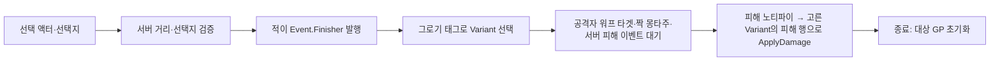

# 그로기 피니시와 뒤잡

피니시는 서버 상호작용에서 발동하며, 현재 구현과 원 기획서의 미결정 규칙을 구분해 관리한다.

## 현재 구현 경로

활성화 검사 실패·몽타주 실패 등은 종료 경로로 빠질 수 있다. 이 그림은 현재 C++의 책임 순서이며 아래 기획 미결정의 확정 답을 나타내지 않는다.

1. 적의 `GetInteractionOptions`는 적대·생존·짝 몽타주 비활성을 확인한다. 그로기라면 허용하고, 그 밖에는 비전투 상태와 후방 원뿔 조건으로 뒤잡을 허용한다. 선택지 문구는 넘겨받은 상호작용자가 가진 Finisher 어빌리티의 `InteractionPrompt`이며, 그 어빌리티가 없으면 선택지를 내지 않는다.
2. 스캐너가 선택 액터·선택지 값을 서버에 보낸다. `UWxAbility_Interact`는 쿼리 콜리전 거리와 대상이 지금 내는 선택지에 그 값이 있는지 다시 확인한다.
3. 적이 `Event.Finisher`에 대상 태그를 실어 공격자에게 보낸다. Finisher 어빌리티는 그로기 태그 유무로 일반 피니시와 뒤잡 Variant를 구분한다.
4. 공격자는 ServerInitiated/Override로 활성화되고 무적 효과를 소유한다. 서버는 피해자에게 짝 몽타주 어빌리티를 일회 부여하고, `Event.ApplyFinisherDamage`를 한 번 기다리는 태스크를 건다. 공격자에게 `Finisher` 워프 타겟을 등록한다.
5. 공격자 몽타주의 `UWxAnimNotify_FinisherDamage`가 이벤트를 보내면, 서버의 Finisher 어빌리티가 발동 순간 고른 Variant의 `DamageDataRow`로 `ApplyDamage`를 부른다. 대상 상태는 이후 바뀌므로 피해 시점에 Variant를 다시 고르지 않는다. 노티파이는 이벤트만 보내고 대상·피해 행은 어빌리티가 쥔다.
6. 종료 때 서버에서 대상 GP 초기화 효과를 적용하며, 피해 대기는 태스크와 함께 끝난다. GP 초기화는 이 C++ 경로상 피해 노티파이 순간이 아니라 어빌리티 종료에 놓여 있으며 취소 종료도 포함한다.

2026-09-24 이전에는 플레이어의 `UWxFinisherDamageComponent`가 어빌리티의 대상과 피해 행을 복사해 들고 수명을 맞췄다. 이 컴포넌트는 제거했다(커밋 `4c1bf3e52`). 인게임 처형 피해는 이 변경 뒤 확인하지 않았다.

공격자 몽타주의 Motion Warping 설정이 실제 위치 조정을 결정한다. C++은 대상 위치·회전의 워프 타겟을 제공하므로 에셋 내부를 확인하지 않고 최종 이동 궤적을 단정하지 않는다.

## 피해 데이터 연결

현재 `GA_Shared_Finisher`의 일반 피니셔·뒤잡은 모두 `DT_Damage.AM_Shared_Finisher`를 참조한다. 몽타주가 재생되어도 피해 행이 없으면 HP 피해 요청은 거부된다. 행 이름 변경 시 두 Variant의 `DamageDataRow`를 함께 확인해야 한다. 2026-09-23에 존재하지 않는 `AM_Finisher` 참조를 복구하고 Blueprint 컴파일·저장·별도 프로세스 재로딩을 확인했다. 실제 플레이 HP 감소 재확인은 별도다.

## 유지되는 기획 미결정

| 항목 | 원자료의 충돌 | 현재 코드에서 확인한 범위 |
|---|---|---|
| Q-001 대상 우선순위 | 3.1절은 가까운 적, 흐름도는 락온된 그로기 적 우선 | 스캐너는 신규 후보를 거리순으로 붙이고 기존 목록 순서를 유지한다. 확인한 경로에는 피니시·락온 전용 우선순위가 없다. |
| Q-002 위치 조정 주체 | 3.2절은 적이 PC 근처로 이동, 흐름도는 PC 이동 | 공격자에 워프 타겟을 등록한다. 최종 애니메이션 배선은 미확인이다. |

두 질문은 기존 검토에서 승계했고 이번에 [원 기획서](../../../Docs/CombatDesign/그로기_피니시_시스템_기획서.md)를 다시 대조했다. 결정자·확정 답변은 확인되지 않았다. 현재 코드가 존재한다는 사실을 기획 승인으로 취급하지 않는다. 게이지 증감 정지·피해 직후 다운·좁은 지형 복구 등 나머지 기획도 에셋과 실제 실행에서 확인해야 한다.

진입점: [적 상호작용](../../../Source/WxGame/Character/WxEnemyCharacter.cpp), [서버 검증](../../../Source/WxGame/AbilitySystem/Ability/WxAbility_Interact.cpp), [피니시 어빌리티](../../../Plugins/WxCombat/Source/WxCombat/Private/AbilitySystem/Ability/WxAbility_Finisher.cpp), [피해 노티파이](../../../Plugins/WxCombat/Source/WxCombat/Private/AnimNotify/WxAnimNotify_FinisherDamage.cpp).

## 관련 문서

- [[combat|WxCombat — 전투 시스템]] ([WxCombat — 전투 시스템](../topics/combat.md))
- [[combat-groggy|그로기]] ([그로기](../concepts/combat-groggy.md))
- [[game|WxGame — 게임 조립과 실행 흐름]] ([WxGame — 게임 조립과 실행 흐름](../topics/game.md))
- [[world|WxWorld — 장치와 상호작용]] ([WxWorld — 장치와 상호작용](../topics/world.md))

## Sources

- [근거 1](../../raw/notes/2026-09-22-current-finisher.md)
- [근거 2](../../raw/notes/2026-09-22-current-groggy.md)
- [피해 행 참조 복구](../../raw/notes/2026-09-23-finisher-damage-row.md)
- [처형 피해 어빌리티 직접 적용](../../raw/notes/2026-09-24-wxcombat-cleanup.md)

출처·검증 및 참고 정보

2026-09-22 현재 작업 트리 정적 조사·재편찬. 기준 HEAD `fe8c943f49401326e1007fedd78a937c9e66db47`에 미커밋 문서·도구 변경을 포함하며, 정확한 입력은 출처의 파일별 SHA-256과 발췌 범위로 식별한다. 문서의 `confidence: medium`은 제한된 정적 근거에 대한 표시다. `verified`는 순정 규칙에 따른 편찬일이다.

초기 정적 조사에서는 빌드·게임 실행·바이너리 내부를 검증하지 않았다. 2026-09-23 추가 확인은 위 피니셔 BP의 피해 행과 DT_Damage에 한정된다. 2026-09-24에 처형 피해 적용 주체(커밋 `4c1bf3e52`)를 HEAD `ca84c9aac` 코드와 대조해 현재 구현 경로를 고쳤다. 기획·회의 보고·확정 판단·코드 관찰을 서로 대체하지 않는다.

