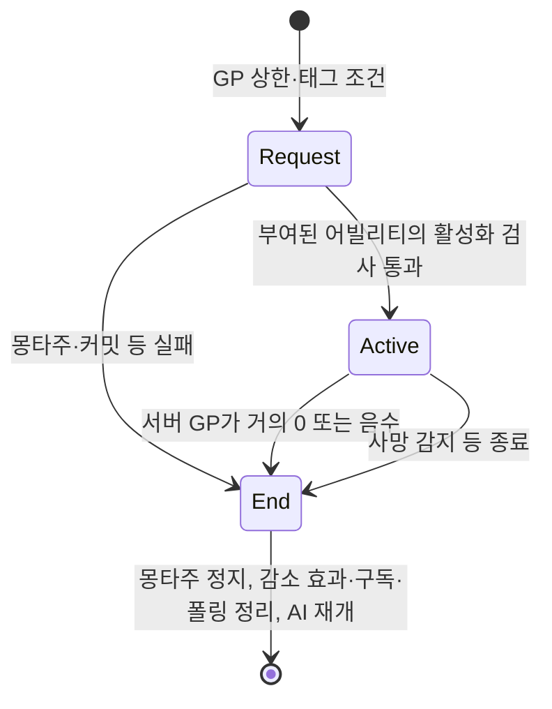

# 그로기

GP 상한은 그로기 이벤트를 발생시키며, 실제 유지·종료는 어빌리티와 서버의 GP 감소 경로가 맡는다.

## 기획과 구현

[기획 초안](../../../Docs/CombatDesign/그로기_시스템.md)은 최대 스태거에서 그로기에 진입하고 이동·공격을 막으며 받는 피해를 30% 증가시키고, 게이지가 0이 되면 종료한다고 설명한다. 이 요구 전체가 현재 에셋에 반영되었다고 판정하지 않는다. 특히 공통 피해 계산의 그로기 분기는 GP 누적 억제이며, 그 분기만으로 30% 증가를 구현했다고 볼 수 없다.

`PostGameplayEffectExecute`는 MaxGP > 0, GP >= MaxGP, `Ability.Groggy` 부재일 때 `Event.Groggy`를 보낸다. 이벤트 발행과 어빌리티 활성화 성공은 구분한다. 사망 태그는 어빌리티를 차단하고, 몽타주 미지정·커밋 실패·ASC 부재도 활성화 종료 경로다.

## 수명과 정리

그로기는 ServerInitiated/ServerOnly 보안 정책을 사용한다. 서버가 GP 변경을 구독하고 몽타주 길이를 감소 효과의 Duration으로 잠가 설정한다. AI Brain을 일시정지하고 0.1초 폴링으로 몽타주 상태를 확인한다. 다른 몽타주가 있으면 그로기 몽타주를 덮지 않고, 사망 태그를 확인하면 종료한다.

`EndAbility`는 폴링·GP 구독·감소 GE를 해제하고 AI를 재개한다. 그로기 몽타주는 ASC의 현재 몽타주인지와 관계없이 AnimInstance에서 직접 정지한다. 가산 슬롯 피격 몽타주가 ASC의 현재 몽타주 자리를 차지하면 `StopMontageIfCurrent`로는 그 아래에서 루프 중인 그로기 몽타주를 멈추지 못했기 때문이다(커밋 `c2b1088a0`). [그로기 어빌리티](../../../Plugins/WxCombat/Source/WxCombat/Private/AbilitySystem/Ability/WxAbility_Groggy.cpp)의 수명과 실제 AbilitySet·몽타주를 함께 확인해야 적별 동작을 판단할 수 있다.

## 관련 문서

- [[ai|WxAI — AI 인지와 행동]] ([WxAI — AI 인지와 행동](../topics/ai.md))
- [[combat|WxCombat — 전투 시스템]] ([WxCombat — 전투 시스템](../topics/combat.md))
- [[combat-damage|피해 처리와 전투 연출]] ([피해 처리와 전투 연출](../concepts/combat-damage.md))
- [[combat-finisher|그로기 피니시와 뒤잡]] ([그로기 피니시와 뒤잡](../concepts/combat-finisher.md))

## Sources

- [근거 1](../../raw/notes/2026-09-22-current-groggy.md)
- [근거 2](../../raw/notes/2026-09-22-current-damage.md)
- [그로기 종료 시 몽타주 정지 경로 수정 조사](../../raw/notes/2026-09-22-groggy-montage-stop-fix.md) — 가산 피격 중 몽타주 정지 수정

출처·검증 및 참고 정보

2026-09-22 현재 작업 트리 정적 조사·재편찬. 기준 HEAD `fe8c943f49401326e1007fedd78a937c9e66db47`에 미커밋 문서·도구 변경을 포함하며, 정확한 입력은 출처의 파일별 SHA-256과 발췌 범위로 식별한다. 그로기 몽타주 정지 경로는 HEAD `60c324c714b1dab10cd48d36cabad63ace232716`(해당 파일 마지막 변경 `c2b1088a0`) 기준으로 갱신했다. 문서의 `confidence: medium`은 제한된 정적 근거에 대한 표시다. `verified`는 순정 규칙에 따른 편찬일이다.

빌드·게임 실행·멀티플레이·BP/WBP·DataTable·BT/StateTree 바이너리 내부는 이번에 검증하지 않았다. 기획·회의 보고·확정 판단·코드 관찰을 서로 대체하지 않는다.

