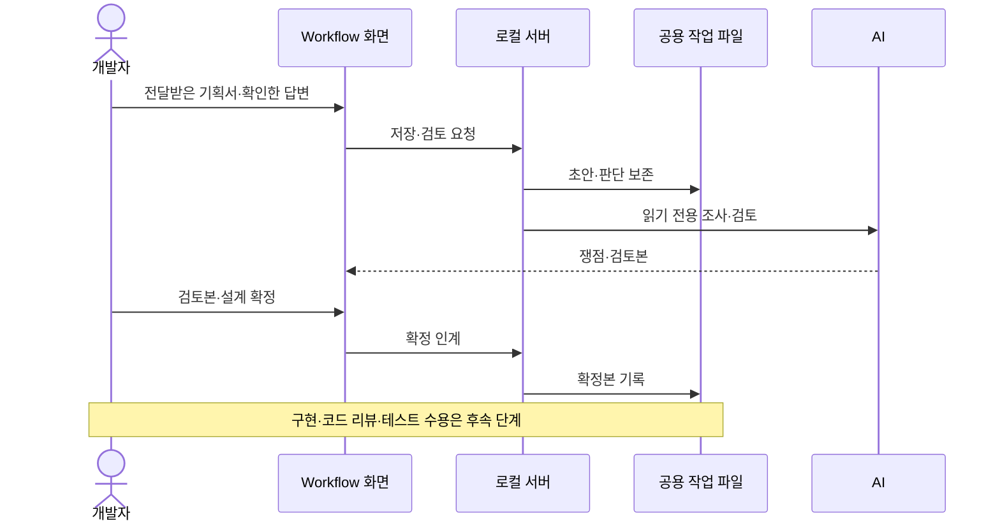

# Wiki·Workflow 도구 구조

Wiki는 프로젝트 지식의 정본이고 Workflow는 사람의 판단·확정본·실행 상태의 정본이다.

## 파일과 화면

| 대상 | 정본 | 생성·접속 경로 |
|---|---|---|
| 프로젝트 지식 | `.wiki/` Markdown과 출처 | Export-Wiki.ps1 → Saved/Wiki/knowledge.html |
| 작업·판단·확정본 | `.agents/workflow/tasks/` | Workflow 화면 Saved/Wiki/index.html |
| AI 연결·런타임 파일 | Saved/Wiki의 로컬 파일 | OpenWorkflow.bat와 로컬 서버 |

생성 HTML은 정본이 아니다. Wiki 뷰어는 편찬 문서·안내·색인을 표시하고 raw 자료와 개인 런타임 상태를 독서 목록에서 제외한다. Wiki 내용을 다시 작성하려면 원자료 수집·편찬 작업이 필요하며 HTML 재생성만으로 지식이 최신화되지는 않는다.

## 판단과 실행

기획서 검토→설계·구현→테스트→완료의 각 단계에서 AI는 조사·구현·검증·기록을 수행하고 사람은 필요한 판단을 확정한다. 개발자는 툴 밖에서 작성된 기획서를 받아 검토하며, AI는 누락·충돌·구현 영향을 조사한다. 기획 판단은 담당자와 확인한 답으로 기록하고 없는 기획·수치를 임의로 만들지 않는다. 개별 질문 답변, 단계 확정, 코드 리뷰 수용, 테스트 수용은 서로 다른 근거다. 최신 문서라는 이유로 과거 승인을 새 코드에 적용하지 않는다.

현재 Workflow는 문서 검색 진입을 제거했고 Wiki 검색은 유지한다. 화면의 기획서 검토 명칭과 달리 기존 `planning` 저장 키와 인계 구조는 유지한다. 이 변경에 관한 별도 사용자 결정 원자료를 재생성 중 발견하여 보존·통합했다.

웹 작업의 task/current/planning/implementation/execution 파일은 초안·유효 확정본·실행 상태를 나눈다. 작업 재개 시 `node .agents/scripts/Wiki-AI.cjs --current "작업 제목"`으로 변경 연결의 최신 확정본과 pending 범위를 읽는다. 일반 대화 작업을 이 조회를 위해 웹 작업으로 만들 필요는 없다.

## 단계별 일감 대시보드

왼쪽 메뉴는 작업 현황 대시보드·새 작업 만들기·기존 작업 이어하기·사용 방법 안내·LLM 위키 검색으로 구성한다. 대시보드는 공용 작업을 기획 검토·설계·구현·코드 리뷰·테스트·정리 대기·완료로 묶어 건수와 제목·상태를 보여준다. 유효한 기획·설계 확정과 실행 상태로 분류하며, 검증 중단은 테스트에 남기고 후속 변경으로 인계된 작업은 별도 구역에 둔다. 테스트 수용은 정리 대기로 표시하며, 지식·자료 정리 결과를 명시적으로 기록한 뒤 최종 완료한다.

카드를 선택하면 현재 입력을 저장하고 공용 상태를 다시 조회해 작업을 연다. 연결 대기와 실제 빈 목록을 구분한다. 모의 DOM 회귀 테스트로 분류·확정 무효·빈 상태를 확인했으며 실제 브라우저 육안 검증은 포함하지 않는다.

## 로컬 서비스 경계

`Wiki-AI.cjs`는 127.0.0.1:18743에 바인딩하고 Host·Origin·토큰을 검사한다. `/tasks`, `/task`, `/handoff`, `/change`, `/execution` 등이 작업 저장과 실행에 쓰인다. 기획·설계 분석과 실제 구현 실행은 별도 경로다. 구현 실행기는 Codex의 workspace-write 모드를 사용한다.

`Workflow-Execution.cjs`는 검증 시작·재시도와 테스트 수용 시 현재 코드 버전을 최신 코드 리뷰 승인 버전과 대조한다. 다르면 구현 재검토·인간 리뷰를 다시 요구한다.

테스트 수용은 cleanup 상태를 저장한다. AI가 지식·자료 정리를 수행한 뒤 정리 화면에 Wiki 반영 근거 또는 생략 사유와 자료 정리 결과를 남기고 정리 완료(finish)를 선택하면 complete가 된다. 정리 확인자·시각·수용 버전도 closure에 남는다. Wiki 편찬·자료 정리를 자동 실행하는 기능은 아니다.

코드 리뷰·테스트 수용은 직접 입력한 승인자 이름을 필수로 decisions.actor에 기록한다. 이는 계정 인증이 아니며 과거 누락된 승인자는 추정하지 않는다. 과거 complete에 closure가 없으면 원본을 보존한 채 정리 대기로 해석한다. 실행 잠금·개정 검사·재시도 정책의 전체 회귀는 이번 문서 조사로 다시 검증하지 않았다.

진입점: [내보내기](../../../.agents/scripts/Export-Wiki.ps1), [AI 서버](../../../.agents/scripts/Wiki-AI.cjs), [실행 서비스](../../../.agents/scripts/Workflow-Execution.cjs), [공통 절차](../../../.agents/workflow/process/index.md).

## 관련 문서

- [[editor-tools|편집기 도구 — WxEditor·WxToolset·BoxComponentVisualizer]] ([편집기 도구 — WxEditor·WxToolset·BoxComponentVisualizer](../references/editor-tools.md))
- [[wiki-operation|WX Wiki 운영과 재생성]] ([WX Wiki 운영과 재생성](../references/wiki-operation.md))

## Sources

- [승인 버전·정리 완료·승인자 기록 개선](../../raw/notes/2026-09-22-workflow-closure.md)

- [단계별 대시보드 요청·구현·검증](../../raw/notes/2026-09-22-workflow-dashboard.md)

- [근거 1](../../raw/notes/2026-09-22-current-workflow.md)
- [기획서 검토 전환 결정](../../raw/notes/2026-09-22-workflow-review.md)

출처·검증 및 참고 정보

2026-09-22 현재 작업 트리 정적 조사·재편찬. 기준 HEAD `fe8c943f49401326e1007fedd78a937c9e66db47`에 미커밋 문서·도구 변경을 포함하며, 정확한 입력은 출처의 파일별 SHA-256과 발췌 범위로 식별한다. 문서의 `confidence: medium`은 제한된 정적 근거에 대한 표시다. `verified`는 순정 규칙에 따른 편찬일이다.

빌드·게임 실행·멀티플레이·BP/WBP·DataTable·BT/StateTree 바이너리 내부는 이번에 검증하지 않았다. 기획·회의 보고·확정 판단·코드 관찰을 서로 대체하지 않는다.

