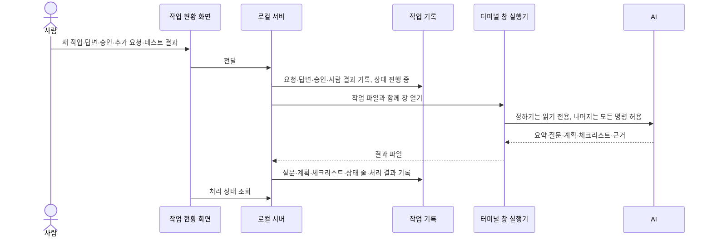

# Wiki·Workflow 도구 구조

Wiki는 프로젝트 지식의 정본이고 Workflow는 작업 절차와 사람의 판단·작업 상태의 정본이다. Workflow는 정하기·만들기·확인하기 3단계로 진행하고, 확인은 코드 리뷰를 포함한 AI·사람 담당 테스트 체크리스트로 한다. 작업 현황은 각 기록 제목 아래 상태 줄에서 만든다. 작업은 대시보드의 새 작업·작업 진행이나 AI 대화 어느 쪽에서도 시작하고 이어가며, 둘 다 같은 기록 절을 주고받는다.

## 파일과 화면

| 대상 | 정본 | 생성·접속 경로 |
|---|---|---|
| 프로젝트 지식 | `.wiki/` Markdown과 출처 | Export-Wiki.ps1 → Saved/Wiki/knowledge.html |
| 작업 절차·기록·판단 | `.agents/workflow/process/index.md`와 `.agents/workflow/tasks/` | Workflow 화면 Saved/Wiki/index.html |
| AI 연결·런타임 파일 | Saved/Wiki의 로컬 파일 | OpenWorkflow.bat와 로컬 서버 |

생성 HTML은 정본이 아니다. Wiki 뷰어는 편찬 문서·안내·색인을 표시하고 raw 자료와 개인 런타임 상태를 독서 목록에서 제외한다. Wiki 내용을 다시 작성하려면 원자료 수집·편찬 작업이 필요하며 HTML 재생성만으로 지식이 최신화되지는 않는다.

## 판단과 실행

절차는 [작업 절차](../../../.agents/workflow/process/index.md) 한 장이다. AI는 조사·구현·검증·기록을 맡고, 사람은 정하기 끝과 확인하기 끝에서 판단한다.

| 단계 | AI | 사람 |
|---|---|---|
| 정하기 | 조사하고 구현에 필요한 질문을 추가 질문이 없을 때까지 한다 | 답변 → 구현 승인 |
| 만들기 | 구현하고 빌드·테스트로 자체 검증한다 | — |
| 확인하기 | 테스트 체크리스트를 만들고 AI 항목을 직접 테스트한다 | 코드 리뷰·사람 항목 테스트 |

작업 절차의 도식은 단계 상자(① 정하기·② 만들기·③ 확인하기) 안에 AI(초록) → 사람(주황)을 한 줄로 둔다. 화살표는 정하기 안의 답변·추가 요청, 구현 승인, 구현 중 질문(만들기 → 정하기), 실패·추가 요청(확인하기 → 만들기), 모두 통과(→ 완료, 이어서 Wiki 정리)다. 질문에 답하면 AI가 매번 다시 조사하므로 답변과 구현 승인 사이에는 항상 AI 처리가 있다. Mermaid로 이 배치를 유지하려면 화살표를 상자(서브그래프)끼리 잇고 상자를 아래 단계부터 선언해야 한다. 노드끼리 이으면 상자 안 가로 방향이 무시되고 화살표가 단계 제목을 가로지르며, 위 단계부터 선언하면 되돌림 화살표 때문에 순서가 뒤섞였다(렌더 비교로 확인). 뷰어 설정에서 단계 제목은 마크다운 문자열로 굵게만 할 수 있고 글자 크기는 적용되지 않는다.

사람이 구현을 승인하기 전에는 구현하지 않는다. 구현 내용을 명확히 지시한 요청은 승인으로 보고, 이미 승인된 범위 안의 수정은 만들기부터 시작한다. 다만 명확한 지시를 승인으로 보는 지름길은 AI 대화에서만 동작한다. 웹 새 작업은 항상 읽기 전용 정하기로 시작해 구현 승인을 받고, 웹 추가 요청도 범위를 바꾸면 새 계획을 다시 승인받는다. 코드 리뷰는 체크리스트의 사람 항목이며, 구현 승인·코드 리뷰·사람 항목 테스트는 서로를 대신하지 않는다. 코드를 바꾼 AI가 영향받는 사람 항목을 대기로 되돌린다.

`.agents/workflow/tasks/`의 기록 파일 하나에 제목, 상태 두 줄, 결정, `## 요청`·`## 질문`·`## 구현 계획`·`## 테스트 체크리스트` 절(필요한 것만, 이 순서)을 두고 이력을 아래에 쌓는다. 질문은 `| ID | 질문 | 선택지 | 추천 | 답변 |` 표이고 답변 칸이 비면 미답변이다. 구현 계획 절의 `구현 승인: 이름 날짜` 줄이 승인이며 계획이 바뀌면 승인도 다시 받는다. 대화로 진행하는 작업도 같은 절을 쓰면 대시보드에서 이어서 답하고 승인할 수 있다.

## 작업 현황 대시보드

각 기록 제목 바로 아래의 `상태: <확인 대기|진행 중|완료> · 설명`과 `다음 행동:` 두 줄이 작업 상태의 정본이다. 대시보드, 로컬 서버, `node .agents/scripts/Wiki-AI.cjs --tasks`가 같은 해석기([task-records.js](../../../.agents/scripts/wiki-viewer/task-records.js))로 이 줄을 읽어 목록을 만들므로, 목록을 따로 적는 파일은 없고, 기록 폴더의 안내 문서(`tasks/index.md`)도 2026-09-26 사용자 요청으로 지웠다. 앞의 `- ` 표기는 허용하고, 상태 단어가 셋 중 하나가 아닌 자유 형식 줄은 상태로 보지 않는다.

분류는 확인 대기·진행 중·완료와, 상태 줄이 없는 기록(모듈 리뷰 보고서, 다른 작업이 이어받은 기록)을 모은 리뷰·참고다. 대시보드 머리에 새 작업 버튼이 있다. 목록 행의 버튼은 분류마다 다르다. 확인 대기·진행 중은 작업 진행과 AI 처리 상태 배지만, 완료와 리뷰·참고는 기록 열기만 있다. 완료 작업의 새 문제는 새 작업으로 요청한다. 확인된 범위는 체크리스트가 있으면 "체크리스트 n/m 통과", 없으면 상태 줄의 설명이다. 목록은 최근 수정 순이다. 서버가 없으면 생성된 문서로 목록을 만들고, 연결되면 서버의 최신 목록으로 바꾼다. 표시 내용은 기록 당시 확인 범위이며 현재 코드의 통과 여부가 아니다.

왼쪽 메뉴는 작업 현황 대시보드·작업 절차·LLM 위키 검색 세 개다. Workflow 화면은 문서 검색을 제공하지 않는다. 문서 본문은 생성 HTML이라 기록을 고친 뒤 `OpenWorkflow.bat`을 다시 실행해야 화면에 반영된다.

## 웹에서 새 작업과 이어하기

작업 진행 패널은 지금 사람이 할 일 하나를 보여준다. 미답변 질문이 있으면 질문 카드, 없고 미승인 계획이 있으면 구현 계획과 구현 승인, 그 다음은 테스트 체크리스트다. AI에게 추가 요청·터미널에서 이어하기·최신 상태 불러오기는 늘 있고, 처리 중에는 경과 분을 보여주며 입력을 막는다. 새 작업은 제목·요청을 받아 `## 요청` 절만 있는 기록을 만든 뒤 정하기를 맡긴다. 기록 이름은 제목 그대로다(글자·숫자가 아닌 문자는 `-`, 같은 이름이 있으면 `-2`, 예: `보스-체력바-지연-감소.md`). 이름에 접수 식별자가 없으므로 같은 접수의 재전송은 처리 이력에서 찾아 같은 기록을 돌려준다.

| 사람의 전달 | AI에게 맡기는 일 | AI 권한 |
|---|---|---|
| 새 작업, 질문 답변 | 조사해 새 질문이나 구현 계획을 돌려준다(정하기) | 읽기 전용 |
| 구현 승인 | 계획대로 구현·자체 검증하고 체크리스트를 만든다 | 모든 명령 허용 |
| 추가 요청 | 범위 안이면 고치고, 범위를 바꾸면 질문·새 계획으로 답한다 | 모든 명령 허용 |
| 테스트 결과 | 실패가 있으면 고친 뒤 재확인 항목을 돌려준다. 실패 없이 일부만 통과면 AI를 부르지 않고, 모두 통과면 즉시 완료한 뒤 Wiki를 정리한다 | 모든 명령 허용 |

권한은 사용자 결정(2026-09-25)이다. 읽기 전용은 Codex `--sandbox read-only`, Claude Code `--tools Read,Glob,Grep`(dontAsk), Gemini CLI 쓰기·셸 도구 제외다. 모든 명령 허용은 Codex `danger-full-access`, Claude Code `bypassPermissions`, Gemini CLI `yolo`다. 커밋·푸시·관리자 정책과 CLI 설정 변경, 작업 기록 직접 수정은 처리 지시로 막는다.

2026-09-26 점검에서 미결 두 가지를 확인했다. 정하기 중(미답변 질문이나 미승인 계획)에 보낸 추가 요청도 모든 명령 허용으로 실행되므로, 승인 전 구현 금지는 처리 지시에만 기댄다. 완료 직후 열려 있는 작업 진행 패널에서는 완료 뒤 정리가 끝나면 추가 요청 전달이 다시 켜진다. 대시보드는 완료 행에 작업 진행을 주지 않는다. 조치는 사용자가 정하지 않았다.

AI 처리는 새 터미널 창에서 보이며 실행된다. 서버가 `Saved/Wiki/jobs/`에 작업 파일을 만들고 `cmd start`로 [실행기](../../../.agents/scripts/Workflow-Runner.cjs) 창을 연다. 실행기가 AI 결과를 결과 파일로 남기면 서버가 읽어 기록에 반영하고 작업 파일을 지운다. Codex는 출력을, Claude Code는 stream-json 진행 이벤트(AI 문장·도구 호출)를 한 줄씩 보여주고, Gemini CLI는 끝난 결과만 보여준다. 창은 60초 또는 Enter로 닫힌다. 처리 중 상태 줄은 `진행 중 · AI 조사 중`처럼 바뀌고, 결과 없이 끝나면 `확인 대기 · AI 처리 실패`(서버 재시작이면 `중단`)가 된다.

터미널에서 이어하기는 고른 AI의 대화 창을 기록 경로가 든 고정 영어 요청문으로 연다. 사람이 입력한 글은 넣지 않고, 권한 확인은 평소 CLI 설정을 따르며, AI가 처리 중인 기록에서는 열지 않는다.

AI가 사람에게 넘기는 것은 질문·구현 계획·테스트 체크리스트 셋뿐이다. 단계마다 AI 결과 칸이 정해져 있다: 정하기는 질문·계획, 구현과 수정은 변경·질문·체크리스트, 추가 요청은 변경·질문·계획·체크리스트, 완료 뒤 정리는 변경뿐이며 모두 요약·근거를 포함한다. CLI에 넘기는 스키마도 단계별이고 서버는 허용된 칸만 읽으므로, AI가 다른 칸을 채워도 기록에 들어가지 않는다(첫 실제 처리에서 정리 결과의 계획 칸 문장이 승인 없는 계획 절이 된 사례). 구현 중 판단이 필요하면 질문으로 묻고, 답하면 정하기로 돌아가 새 계획과 승인을 거친다. AI가 돌려준 질문은 미답변으로 붙이고 겹치는 ID는 새 번호를 준다. 계획의 `#` 줄과 `구현 승인:` 줄은 목록 항목으로 바꿔 절 구조를 깨거나 AI가 스스로 승인할 수 없다.

## 테스트 체크리스트와 결과 전달

확인하기에서 AI는 작업 기록에 `## 테스트 체크리스트` 절을 만들고 `| 항목 | 확인 방법 | 담당 | 결과 | 근거 |` 표를 쓴다. 담당은 AI 또는 사람이고, 결과는 대기·통과·실패·미실행이다. 빌드·자동화 테스트·헤드리스 실행처럼 AI가 직접 돌릴 수 있는 것은 AI 항목으로 테스트한다. 화면·조작감처럼 AI가 볼 수 없는 것은 재현 순서·기대 결과를 적어 사람 항목으로 넘긴다. 이번 작업에서 코드를 바꿨으면 담당 사람의 `코드 리뷰` 항목을 두고 변경 파일과 볼 점을 적는다. 파서가 머리글과 행 형식을 엄격히 검사하므로 셀에 `|`와 줄바꿈을 쓰지 않는다.

체크리스트 단계는 사람 항목을 먼저 보여주고 AI 항목은 결과만 붙인다. 사람은 항목마다 이번에 확인 안 함·통과·실패를 고르고, 실패면 문제 상황과 재현 방법을 적는다. 이름과 처리할 AI(연결된 Codex·Claude Code·Gemini CLI)를 골라 전달하면, 서버가 담당이 사람인 행의 결과를 즉시 작업 기록 표와 이력에 쓴다. 실패가 있으면 AI 수정을 시작하고, 실패 없이 일부만 통과했으면 그대로 끝나며, 모두 통과하면 바로 완료한 뒤 AI가 Wiki를 정리한다. 정리는 상태를 바꾸지 않고, 정리가 실패하거나 끊겨도 완료는 유지된다. 체크리스트가 없는 기록은 다음 행동(없으면 제목)을 사람 항목 하나로 보여주고 첫 전달 때 표를 만든다.

AI는 전체 체크리스트를 보고서의 `checklist`로 돌려주고 서버가 기록한다. AI가 사람 항목을 통과로 바꾸거나 지우거나 담당을 바꾸면 서버가 되돌린다. AI의 미실행·대기 항목은 사람 항목으로 넘기고, 사람 항목이 하나도 없으면 결과 확인 항목을 더해 완료는 항상 사람이 확인한다. 상태는 기록의 질문·계획·체크리스트에서만 정한다: 미답변 질문이면 질문 답변 필요, 미승인 계획이면 구현 승인 필요, 모든 항목이 통과하면 완료, 실패 행이 있으면 실패 확인 필요, 나머지는 사람 확인 필요이며 이 순서로 판정한다. 사람이 적은 실패는 바로 AI 수정으로 이어지지만, AI 항목의 실패는 자동으로 고치지 않고 실패 확인 필요에서 멈추며 사람이 추가 요청으로 방향을 정한다. 서버는 판정에 맞춰 기록의 상태 두 줄을 고치고, 상태 줄이 없던 기록에는 제목 아래에 만든다. 처리 중 작업 기록이 바뀌면 AI 결과를 반영하지 않고 기록 충돌로 둔다. 자유 형식의 남은 확인과 검사 상태는 없다. 여러 세션이 한 체크아웃을 고쳐 AI가 이 작업의 변경만 가려낼 수 없으므로, 무관한 문제는 요약에만 적고 관련 여부 판단이 상태를 바꾸지 않게 했다(첫 실제 처리에서 다른 세션 원자료의 일시적 lint 경고가 완료를 막은 사례).

접수 이력은 기록과 같은 폴더의 `test_feedback_*.json`에 보존하고, 사람 결과와 AI 결과는 기록 끝에 덧붙인다. 입력 초안과 응답을 받지 못한 요청은 브라우저에 보존하며 같은 접수의 재전송은 중복 실행하지 않는다. 처리 실패·중단은 저장된 결과로 다른 AI를 골라 재시도할 수 있고 이전 AI와 결과를 이력에 남긴다. 연결되지 않은 AI 선택을 다른 AI로 자동 대체하지 않는다.

진입점: [접수 서비스](../../../.agents/scripts/Workflow-TestFeedback.cjs), [입력 화면](../../../.agents/scripts/wiki-viewer/test-feedback.js), [작업 절차](../../../.agents/workflow/process/index.md).

## 로컬 서비스 경계

`Wiki-AI.cjs`는 127.0.0.1:18743에 바인딩하고 Host·Origin·토큰을 검사하며 `/health`와 `/test-feedback`만 받는다(protocol 4). `/test-feedback`의 동작은 list·read·create·answer·approve·request·submit·retry·terminal이다. `Start-WikiAI.ps1`은 서버 코드·설정·해석기·실행기 파일 일곱 개의 해시가 바뀌었고 서버가 쉬고 있을 때만 서버를 다시 띄운다. AI는 CLI 로그인과 관리자 정책을 그대로 쓰고, 수행하지 못한 검증·정리를 결과에 남긴다. AI 처리는 한 번에 하나만 실행하고 같은 접수는 한 번만 처리한다.

코드 식별값 검사는 없다. 여러 세션이 한 체크아웃을 동시에 고치는 환경에서 저장소 전체 식별값은 관련 없는 변경에도 전달을 거절하거나 재확인으로 끝냈고, 사람이 실제로 테스트한 빌드도 보장하지 못했다. 대신 코드를 바꾼 AI가 영향받는 사람 항목과 코드 리뷰를 대기로 되돌린다. 전달과 처리 중에는 작업 기록의 해시만 대조한다. 다른 작업의 코드 변경은 자동으로 감지하지 않으며 그 작업의 체크리스트가 확인한다.

진입점: [내보내기](../../../.agents/scripts/Export-Wiki.ps1), [AI 서버](../../../.agents/scripts/Wiki-AI.cjs), [AI 실행](../../../.agents/scripts/Wiki-AI-Providers.cjs).

## 이전 구조

2026-09-25까지 Workflow에는 웹 화면에서 기획서 검토→설계→구현→코드 리뷰→테스트→정리 대기→완료를 버튼으로 확정하는 새 작업 경로가 있었다. 승인 버전 대조·정리 완료 분리·승인자 기록도 이 경로의 기능이었다. 저장 파일이 한 건도 없고 모든 작업이 대화로 진행돼 사용자 결정으로 폐지했다. 경로 전용 파일 일부는 삭제 승인을 기다리며 남아 있지만 현재 코드는 참조하지 않는다. 같은 날 사용자 요청으로 웹 새 작업을 다시 넣었지만, 옛 경로의 단계별 승인 화면이 아니라 3단계 절차의 요청·질문·계획·체크리스트를 작업 기록 절로 주고받는 방식이다. 테스트 결과 처리 권한은 그 전까지 한 가지(Codex workspace-write, Claude acceptEdits, Gemini auto_edit)였다.

## 관련 문서

- [[editor-tools|편집기 도구 — WxEditor·WxToolset·DataTableRowFixup·BoxComponentVisualizer]] ([편집기 도구 — WxEditor·WxToolset·DataTableRowFixup·BoxComponentVisualizer](../references/editor-tools.md))
- [[wiki-operation|WX Wiki 운영과 재생성]] ([WX Wiki 운영과 재생성](../references/wiki-operation.md))

## Sources

- [작업 절차 도식 교체와 서버 동작 점검](../../raw/notes/2026-09-26-workflow-process-diagram.md) — 도식 구조·Mermaid 배치·명확한 지시 지름길의 채널·미결 두 가지

- [기록 작성 규칙 링크와 tasks 안내 문서 삭제](../../raw/notes/2026-09-26-workflow-tasks-guide-removed.md)

- [상태는 질문·계획·체크리스트에서만: 단계별 결과 칸·즉시 완료·정리 분리](../../raw/notes/2026-09-26-workflow-state-from-record-only.md) — 현재 상태 판정·결과 칸 기준

- [AI 결과의 질문·계획을 받는 동작과 완료 목록 배지](../../raw/notes/2026-09-26-workflow-result-fields-by-kind.md)

- [웹 처리 첫 실제 실행과 무관한 경고 처리 규칙](../../raw/notes/2026-09-26-workflow-first-real-run.md)

- [행 버튼 최종 결정·버튼 줄 정렬·사이드바 문구 제거](../../raw/notes/2026-09-26-workflow-row-actions-final.md) — 현재 행 버튼 기준

- [대시보드 분류별 기록 버튼 결정](../../raw/notes/2026-09-26-workflow-dashboard-row-actions.md) — 진행 중 행 버튼은 최종 결정으로 바뀜

- [웹 새 작업의 한글 기록 이름·재전송 확인·이어하기 이름 제한 제거](../../raw/notes/2026-09-26-workflow-korean-record-names.md)

- [웹 새 작업·이어하기·터미널 창 실행과 권한 결정](../../raw/notes/2026-09-26-workflow-web-tasks.md) — 작업 진행 패널·기록 절 형식·실행기·권한 인자·검증 범위

- [편의 점검 근거와 기록 상태 줄·코드 리뷰 항목·식별값 검사 제거](../../raw/notes/2026-09-25-workflow-convenience-review.md) — 현재 작업 현황 생성·판단 지점·서버 경계

- [3단계 단순화·구현 승인·테스트 체크리스트 결정과 구현 관찰](../../raw/notes/2026-09-25-workflow-simplification.md) — 현재 절차·상태·체크리스트·서버 경계, 웹 경로 폐지

- [처리 AI 선택·실행 모드·재시도 이력과 검증](../../raw/notes/2026-09-25-workflow-feedback-providers.md)

- [기존 작업의 테스트 결과 접수·AI 실행·검증 범위](../../raw/notes/2026-09-25-workflow-test-feedback.md)

- [작업 기록 현황의 표시 원본·화면·검증 범위](../../raw/notes/2026-09-25-workflow-task-records.md)

- [승인 버전·정리 완료·승인자 기록 개선](../../raw/notes/2026-09-22-workflow-closure.md) — 폐지한 웹 경로의 이력

- [단계별 대시보드 요청·구현·검증](../../raw/notes/2026-09-22-workflow-dashboard.md) — 폐지한 웹 경로의 이력

- [근거 1](../../raw/notes/2026-09-22-current-workflow.md)
- [기획서 검토 전환 결정](../../raw/notes/2026-09-22-workflow-review.md)

출처·검증 및 참고 정보

2026-09-26 사용자 요청으로 작업 절차 도식을 단계 상자 배치로 바꾸고, 서버·화면 코드와 대조한 점검 결과를 편찬했다. 점검 결과는 답변마다 정하기 재실행, AI 항목 실패는 추가 요청 대기, 명확한 지시 지름길은 AI 대화 전용, 미결 두 가지다. Export-Wiki 뒤 TestWikiViewer·TestWikiSpaces와 링크 검사를 통과했고, 헤드리스 Edge로 Workflow 화면의 작업 절차 도식을 1440px·420px로 확인했다. 사람의 화면 확인은 하지 않았다.

2026-09-26 사용자 요청으로 대시보드의 기록 작성 규칙 링크와 기록 폴더 안내 문서 삭제를 편찬했다.

2026-09-26 사용자 승인으로 상태를 질문·계획·체크리스트에서만 정하고, 단계별 AI 결과 칸 제한·즉시 완료·완료 뒤 정리 분리·미실행 항목 넘김을 편찬했다. 기준 HEAD `6eb5200de`에 미커밋 변경을 포함한다. TestWorkflowTestFeedback·TestWorkflowFeedbackUI를 통과했고 실제 AI 요청으로는 다시 돌리지 않았다.

2026-09-26 AI 결과의 질문·계획을 정하기·추가 요청에서만 받게 한 서버 수정과 완료 목록의 AI 상태 배지 제거를 편찬했다. TestWorkflowTestFeedback·TestWikiViewer를 통과했다.

2026-09-26 웹 작업 진행의 첫 실제 Codex 처리(AnimNotify 테스트 결과) 관찰과, 무관한 경고를 요약에만 적게 한 처리 지시 변경을 편찬했다. TestWorkflowTestFeedback을 통과했고 서버를 수정본으로 다시 띄워 파일 해시 일치를 확인했다.

2026-09-26 사용자 결정에 따라 대시보드 목록 행 버튼을 분류별로 나눈 내용을 편찬했다(확인 대기·진행 중은 작업 진행만, 완료·리뷰·참고는 기록 열기만). TestWikiViewer로 분류별 버튼 구성을, 헤드리스 Edge로 배지가 있는 행까지 버튼 줄이 맞는 것을 확인했다.

2026-09-26 사용자 질문에 따라 웹 새 작업의 기록 이름을 해시 대신 한글 제목으로 바꾼 내용을 편찬했다. TestWorkflowTestFeedback을 통과했고 실제 `cmd start` 창에서 한글 기록 경로 인자 전달을 확인했다. Git은 기본 설정에서 한글 경로를 escape해 보여준다.

2026-09-26 웹 새 작업·이어하기(작업 진행 패널, 질문·구현 계획 절, 터미널 창 실행기, 정하기 읽기 전용·구현과 수정 모든 명령 허용)를 편찬했다. 기준 HEAD `1689d999f`에 미커밋 변경을 포함한다. TestWorkflowTestFeedback·TestWorkflowFeedbackUI·TestWikiProviders·TestWikiViewer·TestWikiSpaces와 링크 검사를 통과했다. 가짜 AI로 실제 터미널 창 표시·결과 수신·이어하기 인자 전달을 확인했고, Claude Code 권한 인자는 연결 불가 주소로 초기화 이벤트만 확인했다. 헤드리스 Edge로 새 작업 폼과 작업 진행 단계를 캡처했다. 실제 AI 요청으로 새 작업을 끝까지 돌리지 않았고 사람의 화면 확인은 하지 않았다.

2026-09-25 편의 점검 뒤 개선(기록 상태 줄 기반 작업 현황, 코드 리뷰 체크리스트 항목, 코드 식별값 검사 제거)을 편찬했다. 기준 HEAD `c9e2efec6`에 미커밋 변경을 포함한다. 같은 테스트 5개와 링크 검사를 통과했고, 헤드리스 Edge로 대시보드 네 분류·체크리스트 창·작업 절차 도식을 확인했다. 실제 AI 처리 요청과 사람의 화면 확인은 하지 않았다.

2026-09-25 Workflow 3단계 단순화·구현 승인·테스트 체크리스트를 편찬하고 폐지한 웹 경로 설명을 이전 구조로 줄였다. 기준 HEAD `c9e2efec6`에 미커밋 변경을 포함한다. TestWorkflowTestFeedback·TestWorkflowFeedbackUI·TestWikiProviders·TestWikiViewer·TestWikiSpaces와 링크 검사를 통과했고, 헤드리스 Edge로 대시보드·체크리스트 창·작업 절차 도식 표시를 확인했다. 실제 AI 처리 요청과 사람의 화면 확인은 하지 않았다.

2026-09-25 작업 기록 표시 변경을 추가 편찬했다. TestWikiViewer·TestWikiSpaces·TestWikiTasks·TestWorkflowExecution과 링크 검사를 수행했다. 브라우저 육안 확인은 로컬 파일 URL 보안 정책으로 수행하지 못했다. 이번 날짜 갱신은 기존 전체 설명의 실행 재검증을 뜻하지 않는다.

2026-09-22 현재 작업 트리 정적 조사·재편찬. 기준 HEAD `fe8c943f49401326e1007fedd78a937c9e66db47`에 미커밋 문서·도구 변경을 포함하며, 정확한 입력은 출처의 파일별 SHA-256과 발췌 범위로 식별한다. 문서의 `confidence: medium`은 제한된 정적 근거에 대한 표시다. `verified`는 순정 규칙에 따른 편찬일이다.

빌드·게임 실행·멀티플레이·BP/WBP·DataTable·BT/StateTree 바이너리 내부는 이번에 검증하지 않았다. 기획·회의 보고·확정 판단·코드 관찰을 서로 대체하지 않는다.

