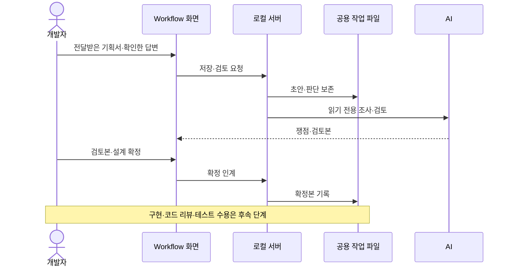

# Wiki·Workflow 도구 구조

Wiki는 프로젝트 지식의 정본이고 Workflow는 사람의 판단·확정본·실행 상태의 정본이다.

## 파일과 화면

| 대상 | 정본 | 생성·접속 경로 |
|---|---|---|
| 프로젝트 지식 | `.wiki/` Markdown과 출처 | Export-Wiki.ps1 → Saved/Wiki/knowledge.html |
| 작업·판단·확정본 | `.agents/workflow/tasks/` | Workflow 화면 Saved/Wiki/index.html |
| AI 연결·런타임 파일 | Saved/Wiki의 로컬 파일 | OpenWorkflow.bat와 로컬 서버 |

생성 HTML은 정본이 아니다. Wiki 뷰어는 편찬 문서·안내·색인을 표시하고 raw 자료와 개인 런타임 상태를 독서 목록에서 제외한다. Wiki 내용을 다시 작성하려면 원자료 수집·편찬 작업이 필요하며 HTML 재생성만으로 지식이 최신화되지는 않는다.

## 판단과 실행

기획서 검토→설계·구현→테스트→완료의 각 단계에서 AI는 조사·구현·검증·기록을 수행하고 사람은 필요한 판단을 확정한다. 개발자는 툴 밖에서 작성된 기획서를 받아 검토하며, AI는 누락·충돌·구현 영향을 조사한다. 기획 판단은 담당자와 확인한 답으로 기록하고 없는 기획·수치를 임의로 만들지 않는다. 개별 질문 답변, 단계 확정, 코드 리뷰 수용, 테스트 수용은 서로 다른 근거다. 최신 문서라는 이유로 과거 승인을 새 코드에 적용하지 않는다.

현재 Workflow는 문서 검색 진입을 제거했고 Wiki 검색은 유지한다. 화면의 기획서 검토 명칭과 달리 기존 `planning` 저장 키와 인계 구조는 유지한다. 이 변경에 관한 별도 사용자 결정 원자료를 재생성 중 발견하여 보존·통합했다.

웹 작업의 task/current/planning/implementation/execution 파일은 초안·유효 확정본·실행 상태를 나눈다. 작업 재개 시 `node .agents/scripts/Wiki-AI.cjs --current "작업 제목"`으로 변경 연결의 최신 확정본과 pending 범위를 읽는다. 일반 대화 작업을 이 조회를 위해 웹 작업으로 만들 필요는 없다.

## 단계별 일감 대시보드

대시보드 상단은 대화 작업 기록을 플레이 확인·에디터 확인·개선 판단·완료 기록으로 나누어 보여준다. 분류 버튼의 건수와 각 작업의 확인 범위·다음 행동을 보고 상세 기록을 연다. 표시 원본은 [작업 현황](../../../.agents/workflow/tasks/index.md)의 네 표이며, 별도 현황 JSON은 없다. AI는 단계 완료·인계 시 상세 Task와 이 표를 함께 갱신하고 `OpenWorkflow.bat`으로 뷰어를 다시 만든다.

작업 기록 조회는 생성된 문서만 사용하므로 AI 서버 연결 전에도 가능하다. 이는 기록 당시 확인 범위이며 현재 코드의 통과 여부나 새로운 실행 승인을 뜻하지 않는다. 완료 기록도 원문에 남은 제약을 유지한다. 웹에서 생성한 작업은 아래의 기존 실행 단계 대시보드에 표시하며, 웹 작업이 없으면 빈 단계 칸은 표시하지 않는다. 새 작업 만들기·기존 작업 이어하기에서는 기록 현황을 숨긴다.

왼쪽 메뉴는 작업 현황 대시보드·새 작업 만들기·기존 작업 이어하기·사용 방법 안내·LLM 위키 검색으로 구성한다. 대시보드는 공용 작업을 기획 검토·설계·구현·코드 리뷰·테스트·정리 대기·완료로 묶어 건수와 제목·상태를 보여준다. 유효한 기획·설계 확정과 실행 상태로 분류하며, 검증 중단은 테스트에 남기고 후속 변경으로 인계된 작업은 별도 구역에 둔다. 테스트 수용은 정리 대기로 표시하며, 지식·자료 정리 결과를 명시적으로 기록한 뒤 최종 완료한다.

카드를 선택하면 현재 입력을 저장하고 공용 상태를 다시 조회해 작업을 연다. 연결 대기와 실제 빈 목록을 구분한다. 모의 DOM 회귀 테스트로 분류·확정 무효·빈 상태를 확인했으며 실제 브라우저 육안 검증은 포함하지 않는다.

## 기존 작업의 테스트 결과 전달

기록의 **테스트 결과**에서 처리할 AI(Codex·Claude Code·Gemini CLI 중 연결된 서비스)를 고르고 확인자·확인한 항목을 적은 뒤 **이상 없음 / 이상 있음** 중 하나를 선택한다. 이상 있음에만 문제 상황·재현 방법을 입력하며 **AI에게 전달**하면 원래 Task의 최신 결정에 따라 처리를 이어간다. 기획서를 다시 등록할 필요는 없다.

이상 없음은 AI가 확인 범위와 남은 일을 대조하고 지식·자료 정리를 수행한다. 이상 있음은 합의 범위 안에서 수정·검증한 뒤 재확인 항목을 돌려준다. 일부 테스트 수용을 전체 완료·코드 리뷰 승인으로 확대하지 않으며, 코드 변경·미실행·남은 사람 확인은 재확인, 실패 검사·미결정은 확인 필요로 남긴다. 남은 항목 없이 검증·정리가 끝난 경우에만 완료 기록으로 옮긴다.

접수 이력은 Task와 같은 폴더의 `test_feedback_*.json`에 보존하고, 서버가 원문과 AI 결과를 원래 Task에 추가하며 목차를 갱신한다. 대시보드 상태·처리 결과는 자동 조회하며 상세 기록 본문은 `OpenWorkflow.bat` 재실행으로 갱신한다. 입력과 응답 유실 요청은 브라우저에 보존하고 같은 접수의 재전송은 중복 실행하지 않는다. 처리 실패·중단은 저장된 결과로 재시도하지만 코드가 변경되었으면 새 결과가 필요하다.

이 경로의 버전 식별은 Markdown·Wiki 정리를 제외하며 HEAD 변경은 감지한다. 기존 웹 작업의 코드 리뷰·테스트 수용 기록과 버전 검사는 별도 경로로 유지한다. UI 모의 검사와 임시 저장소·모의 실행기의 HTTP 회귀를 통과했으며 실제 AI·브라우저 육안·게임 실행 검증과는 구분한다.

처리 AI 선택도 초안·접수·재전송·결과에 보존한다. 실패·중단 후 AI를 바꿔 재시도할 수 있고 이전 AI와 결과를 이력에 남긴다. 과거 접수에 AI가 없으면 기존 Codex 경로로 해석하며, 연결되지 않은 선택을 다른 AI로 자동 대체하지 않는다. 실제 서버가 반환한 처리 가능 목록을 사용하므로 이전 서버에서는 Codex만 표시한다.

진입점: [접수 서비스](../../../.agents/scripts/Workflow-TestFeedback.cjs), [입력 화면](../../../.agents/scripts/wiki-viewer/test-feedback.js), [사용 방법](../../../.agents/workflow/usage.md).

## 로컬 서비스 경계

`Wiki-AI.cjs`는 127.0.0.1:18743에 바인딩하고 Host·Origin·토큰을 검사한다. `/tasks`, `/task`, `/handoff`, `/change`, `/execution`, `/test-feedback` 등이 작업 저장과 실행에 쓰인다. 기획·설계 분석은 읽기 전용이며 별도 구현 실행의 기본은 Codex workspace-write다. 테스트 결과는 선택한 Codex workspace-write·Claude acceptEdits·Gemini auto_edit로 처리한다. CLI·관리자 권한을 유지하고 수행할 수 없는 검증·정리를 결과에 남긴다. 로컬 서버를 통한 분석·실행은 동시에 시작하지 않는다.

`Workflow-Execution.cjs`는 검증 시작·재시도와 테스트 수용 시 현재 코드 버전을 최신 코드 리뷰 승인 버전과 대조한다. 다르면 구현 재검토·인간 리뷰를 다시 요구한다.

기획·설계를 확정한 웹 작업의 테스트 수용은 cleanup 상태를 저장한다. AI가 지식·자료 정리를 수행한 뒤 정리 화면에 Wiki 반영 근거 또는 생략 사유와 자료 정리 결과를 남기고 정리 완료(finish)를 선택하면 complete가 된다. 정리 확인자·시각·수용 버전도 closure에 남는다. 이 수용 버튼은 Wiki 편찬·자료 정리를 자동 실행하지 않는다. 위의 기존 작업 기록에서 테스트 결과를 AI에게 전달하는 경로는 제출 후 AI 정리를 실행한다.

코드 리뷰·테스트 수용은 직접 입력한 승인자 이름을 필수로 decisions.actor에 기록한다. 이는 계정 인증이 아니며 과거 누락된 승인자는 추정하지 않는다. 과거 complete에 closure가 없으면 원본을 보존한 채 정리 대기로 해석한다. 실행 잠금·개정 검사·재시도 정책의 전체 회귀는 이번 문서 조사로 다시 검증하지 않았다.

진입점: [내보내기](../../../.agents/scripts/Export-Wiki.ps1), [AI 서버](../../../.agents/scripts/Wiki-AI.cjs), [실행 서비스](../../../.agents/scripts/Workflow-Execution.cjs), [공통 절차](../../../.agents/workflow/process/index.md).

## 관련 문서

- [[editor-tools|편집기 도구 — WxEditor·WxToolset·DataTableRowFixup·BoxComponentVisualizer]] ([편집기 도구 — WxEditor·WxToolset·DataTableRowFixup·BoxComponentVisualizer](../references/editor-tools.md))
- [[wiki-operation|WX Wiki 운영과 재생성]] ([WX Wiki 운영과 재생성](../references/wiki-operation.md))

## Sources

- [처리 AI 선택·실행 모드·재시도 이력과 검증](../../raw/notes/2026-09-25-workflow-feedback-providers.md)

- [기존 작업의 테스트 결과 접수·AI 실행·검증 범위](../../raw/notes/2026-09-25-workflow-test-feedback.md)

- [작업 기록 현황의 표시 원본·화면·검증 범위](../../raw/notes/2026-09-25-workflow-task-records.md)

- [승인 버전·정리 완료·승인자 기록 개선](../../raw/notes/2026-09-22-workflow-closure.md)

- [단계별 대시보드 요청·구현·검증](../../raw/notes/2026-09-22-workflow-dashboard.md)

- [근거 1](../../raw/notes/2026-09-22-current-workflow.md)
- [기획서 검토 전환 결정](../../raw/notes/2026-09-22-workflow-review.md)

출처·검증 및 참고 정보

2026-09-25 작업 기록 표시 변경을 추가 편찬했다. TestWikiViewer·TestWikiSpaces·TestWikiTasks·TestWorkflowExecution과 링크 검사를 수행했다. 브라우저 육안 확인은 로컬 파일 URL 보안 정책으로 수행하지 못했다. 이번 날짜 갱신은 기존 전체 설명의 실행 재검증을 뜻하지 않는다.

2026-09-22 현재 작업 트리 정적 조사·재편찬. 기준 HEAD `fe8c943f49401326e1007fedd78a937c9e66db47`에 미커밋 문서·도구 변경을 포함하며, 정확한 입력은 출처의 파일별 SHA-256과 발췌 범위로 식별한다. 문서의 `confidence: medium`은 제한된 정적 근거에 대한 표시다. `verified`는 순정 규칙에 따른 편찬일이다.

빌드·게임 실행·멀티플레이·BP/WBP·DataTable·BT/StateTree 바이너리 내부는 이번에 검증하지 않았다. 기획·회의 보고·확정 판단·코드 관찰을 서로 대체하지 않는다.

