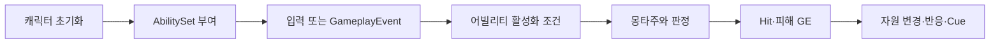

# WxCombat — 전투 시스템

WxCombat은 GAS의 어빌리티·자원·피해 처리와 전투 연출을 제공하고, 캐릭터 조립은 WxGame이 맡는다.

## 시스템 경계

ASC·AbilitySet·AttributeSet이 전투의 공통 기반이다. 어빌리티는 발동과 수명을, Hit/GameplayEffect 경로는 피해 판정과 자원 변화를 담당한다. 무기·투사체·소환물·타겟팅·모션 워핑·GameplayCue는 이 전투 흐름에 참여한다. 개별 캐릭터의 몽타주·수치·AbilitySet은 에셋 저작이므로 클래스 존재만으로 플레이 가능한 조합이 완성되지는 않는다.

WxCombat은 WxCore·GAS·MotionWarping·TargetingSystem 등에 의존한다. 퀘스트 진행이나 인벤토리 소유, 화면 레이어는 이 모듈의 책임이 아니다. 캐릭터의 ASC 생성·빙의 초기화·입력 연결은 WxGame에서 읽는다.

## 핵심 흐름

ASC의 `GiveAbilitySets`는 재빙의로 같은 AbilitySet이 중복 부여되지 않도록 플래그를 둔다. 초기 속성은 최대값을 먼저, 현재값을 나중에 기록한다. 반대 순서는 현재값 클램프와 최대값 비례 조정 때문에 초기값을 왜곡할 수 있다.

## 수정 위치

| 변경 목적 | 진입점 |
|---|---|
| 어빌리티 배타·캔슬 창·코스트 | `UWxAbilityBase`, `FWxAbilityTableRow` |
| 입력 전달·부여·공격 속도 | `UWxAbilitySystemComponent`, `UWxAbilitySet` |
| HP/SP/GP/MP/UP 및 최대값 | `UWxCombatAttributeSet` |
| 적대·권한·Hit 진입 | `UWxCombatLibrary::ApplyDamage` |
| 피해·가드·반사 | `UWxCombatLibrary::ApplyDamage`, `UWxExecCalc_Damage`, `UWxEffectComponent_DamageReaction`·`_PerfectGuard`·`_HitStop` |

일반 어빌리티의 기본 정책은 LocalPredicted지만 피니시·그로기는 ServerInitiated이며 상호작용은 WxGame의 ServerOnly 어빌리티다. 전투 전체를 단일 네트워크 정책으로 설명하지 않는다. [전투 모듈 소스](../../../Plugins/WxCombat/Source/WxCombat)에서 담당 경로를 추적한다.

## 관련 문서

- [[combat-abilities|전투 어빌리티와 이펙트]] ([전투 어빌리티와 이펙트](../concepts/combat-abilities.md))
- [[combat-damage|피해 처리와 전투 연출]] ([피해 처리와 전투 연출](../concepts/combat-damage.md))
- [[combat-finisher|그로기 피니시와 뒤잡]] ([그로기 피니시와 뒤잡](../concepts/combat-finisher.md))
- [[combat-groggy|그로기]] ([그로기](../concepts/combat-groggy.md))
- [[combat-resources|전투 자원과 현광의 예외]] ([전투 자원과 현광의 예외](../concepts/combat-resources.md))
- [[foundation|WxCore — 공용 계약과 설정]] ([WxCore — 공용 계약과 설정](../topics/foundation.md))
- [[game|WxGame — 게임 조립과 실행 흐름]] ([WxGame — 게임 조립과 실행 흐름](../topics/game.md))

## Sources

- [근거 1](../../raw/notes/2026-09-22-current-combat.md)
- [근거 2](../../raw/notes/2026-09-22-current-foundation.md)

출처·검증 및 참고 정보

2026-09-22 현재 작업 트리 정적 조사·재편찬. 기준 HEAD `fe8c943f49401326e1007fedd78a937c9e66db47`에 미커밋 문서·도구 변경을 포함하며, 정확한 입력은 출처의 파일별 SHA-256과 발췌 범위로 식별한다. 문서의 `confidence: medium`은 제한된 정적 근거에 대한 표시다. `verified`는 순정 규칙에 따른 편찬일이다.

빌드·게임 실행·멀티플레이·BP/WBP·DataTable·BT/StateTree 바이너리 내부는 이번에 검증하지 않았다. 기획·회의 보고·확정 판단·코드 관찰을 서로 대체하지 않는다.

