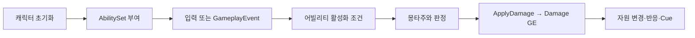

# WxCombat — 전투 시스템

WxCombat은 GAS의 어빌리티·자원·피해 처리와 전투 연출을 제공하고, 캐릭터 조립은 WxGame이 맡는다.

## 시스템 경계

ASC·AbilitySet·AttributeSet이 전투의 공통 기반이다. 어빌리티는 발동과 수명을, `ApplyDamage`와 Damage GE 경로는 피해 판정과 자원 변화를 담당한다. 무기·투사체·소환물·타겟팅·모션 워핑·GameplayCue는 이 전투 흐름에 참여한다.

어빌리티 하나는 데이터 전용 GA_ 에셋 하나다. C++ 파생 클래스는 타입으로서 생성자에서 태그 관계·발동 그룹 같은 규칙 기본값을 정하고, GA_가 몽타주·입력·비용·쿨다운·표시를 채운다. GE의 수치와 표시(`UWxEffectComponent_UIData`)도 GE_ 에셋에 둔다. `DT_Ability`·`DT_Effect`는 지웠고, 데이터 테이블은 여러 곳이 골라 쓰는 정의(`DT_Damage`)와 레벨별 수치(`FScalableFloat`+CurveTable)에만 쓴다(2026-09-25 사용자 결정). 개별 캐릭터의 GA_·AbilitySet은 에셋 저작이므로 클래스 존재만으로 플레이 가능한 조합이 완성되지는 않는다. 어빌리티 규칙과 몽타주 섹션 규칙의 상세는 [전투 어빌리티와 이펙트](../concepts/combat-abilities.md)에 있다.

WxCombat은 WxCore·GAS·MotionWarping·TargetingSystem·StateTree 등에 의존한다. 퀘스트 진행이나 인벤토리 소유, 화면 레이어는 이 모듈의 책임이 아니다. 락온 대상 선택과 카메라는 WxCombat이 맡지만, 대상 위의 Reticle·Nameplate는 WxGame NameplateManager가 로컬에서 붙인다([UI](ui.md)). 락온 대상은 `UWxLockOnComponent` 하나가 들고, 카메라·캐릭터 회전 태스크는 그 값을 매 틱 읽는다. AI 트리의 정지·잠금은 `AWxAIController`만 한다. 사망은 `OnDeath`로 정지하고 그로기는 `Ability.Groggy` 태그로 잠그며, 전투 어빌리티와 돌진 modifier는 트리를 건드리지 않는다. 캐릭터의 ASC 생성·빙의 초기화·입력 연결은 WxGame에서 읽는다.

## 핵심 흐름

ASC의 `GiveAbilitySets`는 등록된 권위 ASC에서만 실행된다. 최초에는 속성·GE와 능력을 부여하고, 이후에는 누락된 능력만 보충한다. 플래그는 속성·GE 초기화를 한 번으로 제한한다. `UWxAbilitySet`은 `GrantedAbilities`의 클래스마다 `FGameplayAbilitySpec(클래스, 1)`을 준다. ASC에 같은 클래스가 이미 있으면 런타임에서 조용히 건너뛴다. 중복 경고는 에디터 `IsDataValid`에서 제공한다. 세트 사이에 같은 어빌리티가 겹치면 이벤트로 도는 어빌리티가 한 이벤트에 두 번 반응하기 때문이다. 초기 속성은 최대값을 먼저, 현재값을 나중에 기록한다. 반대 순서는 현재값 클램프와 최대값 비례 조정 때문에 초기값을 왜곡할 수 있다.

## 수정 위치

| 변경 목적 | 진입점 |
|---|---|
| 어빌리티 배타·캔슬 창·코스트·쿨다운·표시 | `UWxAbilityBase`(규칙 기본값은 C++ 타입 생성자, 값은 GA_ 에셋) |
| 입력 전달·부여·공격 속도 | `UWxAbilitySystemComponent`, `UWxAbilitySet::GrantedAbilities` |
| HP/SP/GP/MP/UP 및 최대값 | `UWxCombatAttributeSet` |
| 피해 요청(입력 조립·권한·적대) | `UWxCombatLibrary::ApplyDamage`, `FWxDamageTableRow::MakeDamageSpec`, `FWxDamageEffectContext` |
| 방어 판정·피해 계산 | `UWxEffect_Damage`, `UWxExecCalc_Damage` |
| 피격 반응(그로기 중 넉 계열 → `HitReact.Normal` 강등 포함)·퍼펙트 가드·히트스톱·추가 효과 | `UWxEffectComponent_DamageReaction`·`_PerfectGuard`·`_HitStop`·`_AdditionalEffects` |
| GE 표시(제목·설명·아이콘) | `UWxEffectComponent_UIData` |
| 콤보·패턴 단계와 방향·반응 섹션 선택 | `UWxAbility_Combo::ComboMontages`·`ComboIndex`·`GetMontage`, `UWxAbilityBase::PlayMontage`, 각 타입의 섹션 상수 |
| 공중 몽타주의 착지 섹션 | WxGame `UWxCharacterMovementComponent::JumpToLandingSection`(재생 중인 모든 몽타주 인스턴스에서 `UWxAbilityBase::LandingSectionName`을 찾음) |
| 회피(극한 회피) | `UWxEffect_Invincible`의 Immunity 차단 통지를 구독하는 `UWxAbility_Dodge` |
| 몽타주 구간 상태 GE(무적·퍼펙트 가드) | `UWxAnimNotifyState_ApplyGameplayEffect`, `UWxCombatLibrary::ApplyEffect` |
| 처형 짝 몽타주·피해 | `UWxAbility_Finisher`(권위에서 `Event.PlayFinisherVictimMontage`·`Event.ApplyFinisherDamage` 대기), 몽타주 노티파이 `UWxAnimNotify_FinisherVictim`·`UWxAnimNotify_FinisherDamage` |
| 궁극기 컷신·컷신 중 입력 차단 | `UWxAbility_Ultimate`(몽타주의 `UWxAnimNotify_SkillCutscene` 표식에서 시퀀스를 읽음), `UWxSkillCutsceneComponent`(서버 세션 동안 모든 플레이어 ASC에 `UWxEffect_SkillCutscene`) |
| 시체 수명 | WxGame `AWxCharacterBase::CorpseLifeSpan` |
| 락온 대상·카메라 | `UWxLockOnComponent`, `UWxAbility_LockOn`, `UWxAbilityTask_LockOnCamera` |
| 소환 상한·주인 태그(`Master.*`) | `UWxMinionComponent::MasterStateTag`, `UWxMinionSubsystem`(권위 머신에서 주인 ASC에 TagOnly 복제 loose 태그) |
| StateTree에서 캐릭터 몽타주 1회 재생(장치 당사자 등) | `FWxStateTreeTask_PlayMontageOnce`(권위에서 `UWxAbility_PlayMontageOnce` 1회 부여·발동, 장치 트리 규칙은 [WxWorld](world.md)) |

일반 어빌리티의 기본 정책은 LocalPredicted지만 피니시·그로기는 ServerInitiated이며 상호작용은 WxGame의 ServerOnly 어빌리티다. 전투 전체를 단일 네트워크 정책으로 설명하지 않는다. [전투 모듈 소스](../../../Plugins/WxCombat/Source/WxCombat)에서 담당 경로를 추적한다.

## 관련 문서

- [[combat-abilities|전투 어빌리티와 이펙트]] ([전투 어빌리티와 이펙트](../concepts/combat-abilities.md))
- [[combat-damage|피해 처리와 전투 연출]] ([피해 처리와 전투 연출](../concepts/combat-damage.md))
- [[combat-finisher|그로기 피니시와 뒤잡]] ([그로기 피니시와 뒤잡](../concepts/combat-finisher.md))
- [[combat-groggy|그로기]] ([그로기](../concepts/combat-groggy.md))
- [[combat-resources|전투 자원과 현광의 예외]] ([전투 자원과 현광의 예외](../concepts/combat-resources.md))
- [[foundation|WxCore — 공용 계약과 설정]] ([WxCore — 공용 계약과 설정](../topics/foundation.md))
- [[game|WxGame — 게임 조립과 실행 흐름]] ([WxGame — 게임 조립과 실행 흐름](../topics/game.md))
- [[ui|WxUI — 화면 레이어와 표시 수명]] ([WxUI — 화면 레이어와 표시 수명](../topics/ui.md))
- [[world|WxWorld — 장치와 상호작용]] ([WxWorld — 장치와 상호작용](../topics/world.md))

## Sources

- [재등록 수정과 콤보 배열 계약 확인](../../raw/notes/2026-09-26-module-review-contracts.md) — 누락 능력 재부여와 콤보 배열 진입점

- [근거 1](../../raw/notes/2026-09-22-current-combat.md)
- [근거 2](../../raw/notes/2026-09-22-current-foundation.md)
- [Damage 정방향 흐름](../../raw/notes/2026-09-23-damage-forward-flow.md)
- [WxCombat 정리 네 건](../../raw/notes/2026-09-24-wxcombat-cleanup.md)
- [Nameplate·Reticle을 로컬 NameplateManager로](../../raw/notes/2026-09-24-nameplate-manager.md)
- [NameplateManager를 WxGame으로](../../raw/notes/2026-09-24-nameplate-manager-wxgame.md)
- [WxCombat 불필요한 장치 정리](../../raw/notes/2026-09-24-wxcombat-machinery-cleanup.md)
- [소환물 주인 태그 이름 변경](../../raw/notes/2026-09-24-master-tag-rename.md) — `State.MinionMaster.*` → `Master.*`
- [AI 트리 정지·잠금 컨트롤러 단독화](../../raw/notes/2026-09-24-ai-brain-control-single-owner.md) — 그로기 잠금 이동, 돌진 제어 제거
- [장치 StateTree 정리](../../raw/notes/2026-09-24-device-statetree-cleanup.md) — 몽타주 1회 재생 태스크를 WxWorld에서 이관
- [어빌리티 규칙 변경과 몽타주 섹션 모델](../../raw/notes/2026-09-25-ability-montage-section-model.md) — 그로기 강등·착지 섹션·시체 수명·컷신 입력 차단 이동, 섹션 모델, 처형·궁극기 노티파이
- [어빌리티·GE 데이터를 에셋 한 곳으로](../../raw/notes/2026-09-25-ability-data-on-ga.md) — GA_ 복귀, `DT_Ability`·`DT_Effect` 제거, AbilitySet 중복 건너뜀, `UWxEffectComponent_UIData`

출처·검증 및 참고 정보

2026-09-22 현재 작업 트리 정적 조사·재편찬. 기준 HEAD `fe8c943f49401326e1007fedd78a937c9e66db47`에 미커밋 문서·도구 변경을 포함하며, 정확한 입력은 출처의 파일별 SHA-256과 발췌 범위로 식별한다. 문서의 `confidence: medium`은 제한된 정적 근거에 대한 표시다. `verified`는 순정 규칙에 따른 편찬일이다.

빌드·게임 실행·멀티플레이·BP/WBP·DataTable·BT/StateTree 바이너리 내부는 이번에 검증하지 않았다. 기획·회의 보고·확정 판단·코드 관찰을 서로 대체하지 않는다.

2026-09-23: 시스템 경계와 핵심 흐름의 피해 경로 표현(삭제된 Hit GE)만 현재 코드(`ApplyDamage` → `UWxEffect_Damage`)와 대조해 정정했다. 나머지 본문은 재확인하지 않았다.

2026-09-24: 락온 표시 경계와 수정 위치 표의 구간 GE·처형 피해·락온 행을 HEAD `ca84c9aac` 코드와 대조해 추가했다. 같은 날 락온 대상 소유와 사망 시 BT 정지 주체를 미커밋 작업 트리 코드와 대조해 추가했다(빌드 통과, 인게임 미검증). 두 번째 refresh에서 소환 상한·주인 태그 행을 HEAD `d76e48717` 코드와 대조해 추가했다(커밋 `c4dee8382`의 태그 이름 변경, 인게임 미검증). 이어 AI 트리 제어 주체를 컨트롤러 단독으로 넓힌 작업 트리 코드와 대조해 경계 문장을 고쳤다(빌드 통과, 사용자 인게임 확인). 세 번째 refresh에서 WxWorld에서 옮겨 온 몽타주 1회 재생 태스크 행과 StateTree 의존을 HEAD `142fab5d6` 코드와 대조해 추가했다(커밋 `f6b4af9d4`, 인게임 미검증).

2026-09-25: 어빌리티 데이터 배치·AbilitySet 중복 건너뜀·수정 위치 표(삭제된 `FWxAbilityTableRow` 제거와 그로기 강등·GE 표시·섹션 선택·착지·처형 노티파이·궁극기 컷신과 입력 차단·시체 수명 행)를 HEAD `d63ce0630` 코드와 대조했고(`DT_Ability`·`DT_Effect` 부재는 파일 목록으로만 확인), GA_·GE_·몽타주 에셋 내부 값과 인게임 동작은 원자료 기록에만 기대며 직접 검증하지 않았다.

2026-09-26: ad0db6de0 작업 트리의 AbilitySet 최초 초기화·후속 능력 보충과 콤보 몽타주 배열 진입점만 정적으로 재대조했다. 실행 검증은 추가하지 않았다.

