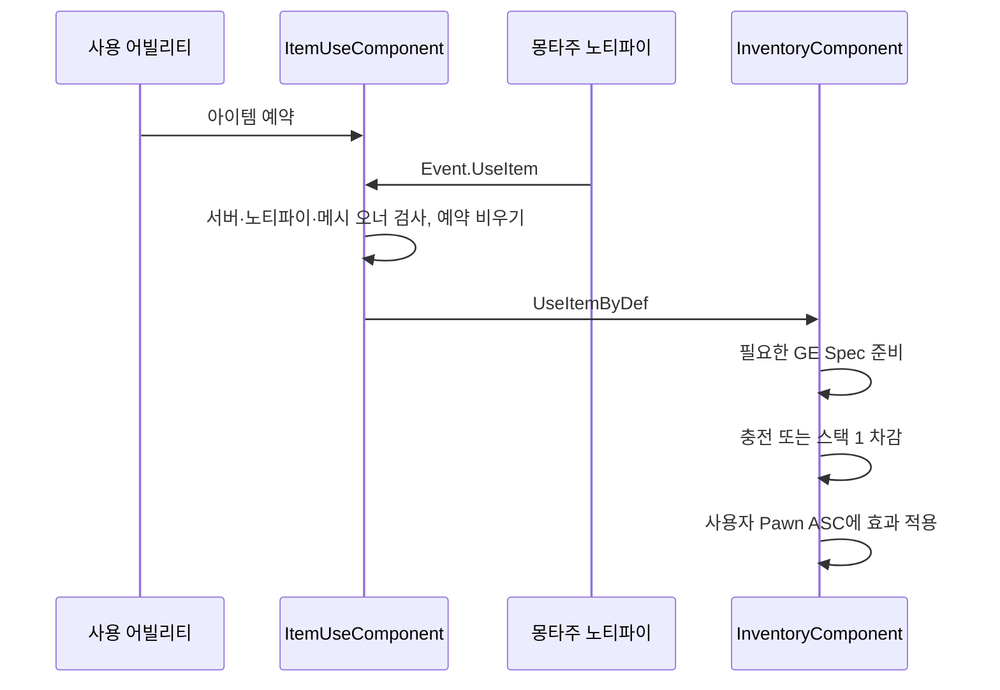

# WxInventory — 아이템 소유와 사용

WxInventory는 서버에서 아이템 소유·소비·충전을 변경하고 인벤토리와 인스턴스를 복제한다.

## 정의·인스턴스·소유

`UWxItemDefinition`은 정적 데이터, `UWxItemInstance`는 런타임 식별·충전 상태, `UWxInventoryComponent`는 소유와 변경의 중심이다. WxGame의 PlayerController가 인벤토리를 소유한다. 목록은 FastArray이며 아이템 인스턴스는 복제 서브오브젝트로 등록한다. 시작 아이템은 서버 BeginPlay에서 지급한 뒤 준비 통지를 발행한다.

Fragment는 정의에 붙은 공유 객체다. Usable은 사용 효과, Charges는 개별 인스턴스 충전, Stackable은 슬롯당 스택 한도, Pickup은 월드 픽업 데이터, Grade는 등급 표시를 제공한다. 개별 아이템의 가변 상태를 공유 Fragment에 저장하지 않는다.

## 사용 흐름

`CanUseItemByDef`는 Usable과 사용 가능한 인스턴스를 검사한다. HP 부족량은 이 함수의 조건이 아니다. Charges가 있으면 충전만 감소하고 아이템은 남는다. Charges가 없으면 정의 기준으로 수량 1을 소비한다. 효과가 지정되지 않은 Usable도 소비 경로를 지날 수 있다. GE가 필요하면 ASC·Spec 준비가 먼저지만, 차감 후 효과 적용의 실제 성공을 소비 취소와 연결한 트랜잭션으로 해석하지 않는다.

## 보상과 네트워크 제약

Add/Consume/Use/Refill은 서버 호출 계약이다. 클라이언트 표시와 사용 요청 전달은 별도 경로를 사용한다. StateTree의 GiveRewards/RefillItemCharges는 초기 진입과 비권위 실행을 건너뛰며 0번 PlayerController를 대상으로 한다. 이 구현을 플레이어별 보상 귀속 정책 완성으로 해석하지 않는다.

외부 기능이 이미 아이템을 소비했다면 `UseItemByDef`를 다시 호출해 효과만 적용할 수는 없다. 소비가 다시 발생하므로 외부 섭취 결과에 연결하는 설계는 경계를 별도로 정해야 한다.

진입점: [InventoryComponent](../../../Plugins/WxInventory/Source/WxInventory/Private/Inventory/WxInventoryComponent.cpp), [Fragment](../../../Plugins/WxInventory/Source/WxInventory/Public/Items/WxItemFragment.h), [ItemUseComponent](../../../Plugins/WxInventory/Source/WxInventory/Private/Inventory/WxItemUseComponent.cpp). 실제 아이템 에셋·픽업 배선·복제 타이밍은 미검증이다.

## 관련 문서

- [[combat-resources|전투 자원과 현광의 예외]] ([전투 자원과 현광의 예외](../concepts/combat-resources.md))
- [[game|WxGame — 게임 조립과 실행 흐름]] ([WxGame — 게임 조립과 실행 흐름](../topics/game.md))
- [[quests|WxQuest — 퀘스트 실행과 저널]] ([WxQuest — 퀘스트 실행과 저널](../topics/quests.md))
- [[ui|WxUI — 화면 레이어와 표시 수명]] ([WxUI — 화면 레이어와 표시 수명](../topics/ui.md))
- [[world|WxWorld — 장치와 상호작용]] ([WxWorld — 장치와 상호작용](../topics/world.md))

## Sources

- [근거 1](../../raw/notes/2026-09-22-current-inventory.md)
- [근거 2](../../raw/notes/2026-09-22-current-foundation.md)

출처·검증 및 참고 정보

2026-09-22 현재 작업 트리 정적 조사·재편찬. 기준 HEAD `fe8c943f49401326e1007fedd78a937c9e66db47`에 미커밋 문서·도구 변경을 포함하며, 정확한 입력은 출처의 파일별 SHA-256과 발췌 범위로 식별한다. 문서의 `confidence: medium`은 제한된 정적 근거에 대한 표시다. 인간 검증일 `verified`는 새로 부여하지 않았다.

빌드·게임 실행·멀티플레이·BP/WBP·DataTable·BT/StateTree 바이너리 내부는 이번에 검증하지 않았다. 기획·회의 보고·확정 판단·코드 관찰을 서로 대체하지 않는다.

