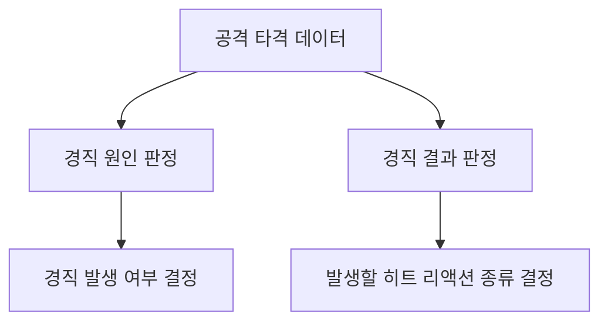
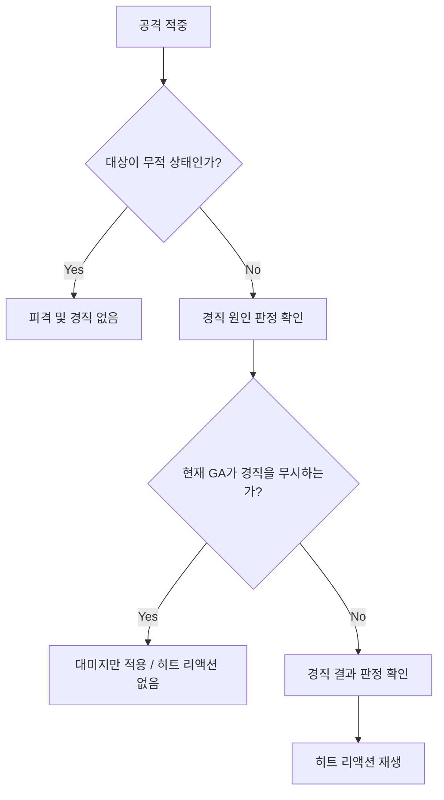
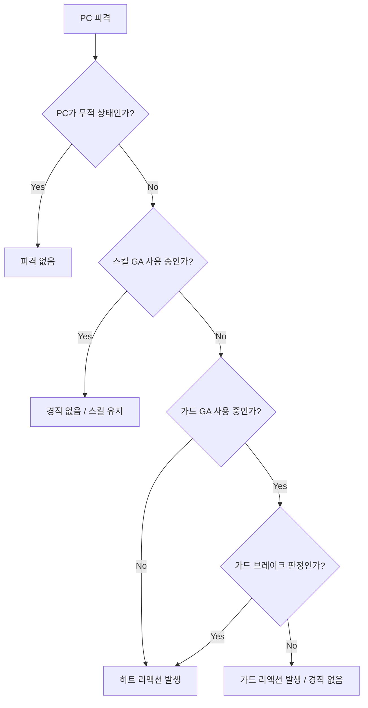
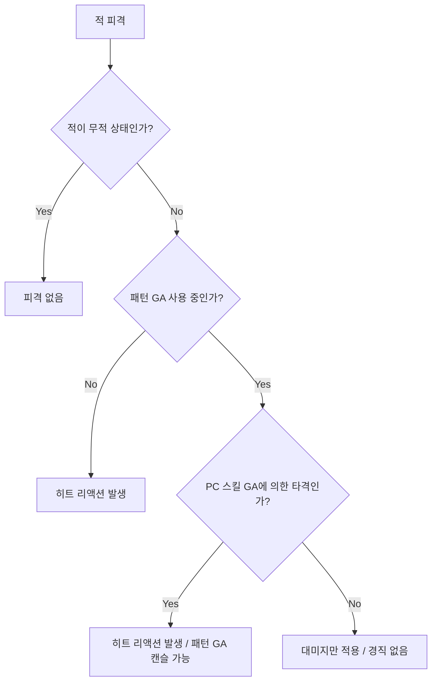
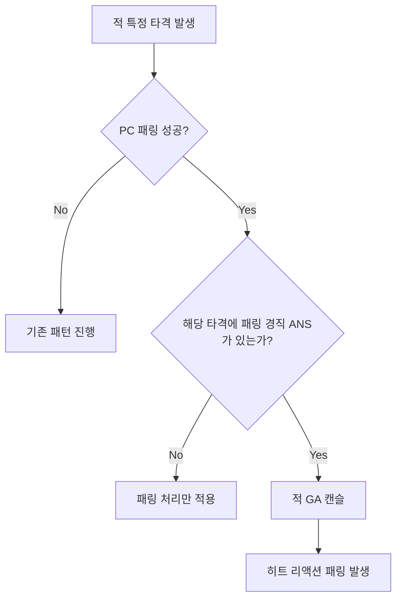

# 히트 리액션 시스템

## 1. 문서 목적

이 문서는 히트 리액션과 관련된 전투 규칙을 정의하기 위한 문서이다.

본 문서에서는 다음 내용을 정리한다.

1. 히트 리액션과 관련된 개념을 정의한다.
2. GA와 판정의 종류를 정리한다.
3. PC와 적의 경직 규칙을 정의한다.
4. 특수 상황인 패링 경직 규칙을 정의한다.

---

## 2. 핵심 개념

히트 리액션은 캐릭터가 공격에 피격되었을 때 재생되는 피격 반응이다.

히트 리액션 발생 여부는 다음 요소를 기준으로 판정한다.

| 구분 | 설명 |
|---|---|
| GA 종류 | 현재 캐릭터가 어떤 어빌리티를 사용 중인지 |
| 경직 원인 판정 | 가드 브레이크 여부 |
| 경직 결과 판정 | 경직 발생 시 어떤 히트 리액션을 재생할지 |
| 무적 상태 | 피격 및 경직을 무시하는 상태인지 |
| 특수 예외 | 패턴 GA, 스킬 GA 사용 중, 가드 GA 사용 중 등 예외 처리 여부 |

---

## 3. GA 종류

| GA 종류 | 사용 주체 | 태그 | 설명 |
|---|---|---|---|
| 일반 공격 GA | PC | `Ability.Attack` | PC가 사용하는 약공격, 강공격, 콤보 공격을 포함한 GA |
| 패턴 GA | 적 | `Ability.Pattern` | 적의 공격 패턴에 사용되는 GA |
| 스킬 GA | PC | `Ability.Skill` | PC가 MP를 사용하여 발동하는 스킬 GA |
| 가드 GA | PC | `ABILITY.GUARD` | PC가 가드 또는 패링 시 사용하는 GA |
| 회피 GA | PC | `ABILITY.DODGE` | PC가 회피할 때 사용하는 GA. 극한 회피 성공 시 무적 적용 |
| 궁극기 GA | PC | `ABILITY.ULTIMATE` | PC가 궁극기를 사용할 때 사용하는 GA. 사용 중 무적 적용 |

---

## 4. 판정 종류

공격의 판정은 크게 **경직 원인 판정**과 **경직 결과 판정**으로 나눈다.

각 타격은 두 판정을 모두 가져야 한다.

---

### 4.1 경직 원인 판정

경직 원인 판정은 가드 브레이크 판정 여부를 결정한다.

| 경직 원인 판정 | 사용 주체 | 설명 |
|---|---|---|
| 일반 타격 판정 | PC / 적 | 가장 일반적인 경직 원인 판정 |
| 가드 브레이크 판정 | 적 | 가드 GA를 무시하고 경직을 발생시키는 판정 |

---

### 4.2 경직 결과 판정

경직 결과 판정은 경직이 발생했을 때 어떤 히트 리액션을 재생할지 결정하는 판정이다.

| 경직 결과 판정 | 발생 히트 리액션 | 설명 |
|---|---|---|
| 일반 경직 판정 | 히트 리액션 노멀 | 기본 피격 반응 |
| 넉백 판정 | 히트 리액션 넉백 | 대상을 밀어내는 피격 반응 |
| 넉업 판정 | 히트 리액션 넉업 | 대상을 공중으로 띄우는 피격 반응 |
| 넉다운 판정 | 히트 리액션 넉다운 | 대상을 넘어뜨리는 피격 반응 |

---

## 5. 기본 히트 리액션 처리 흐름

---

## 6. PC 경직 규칙

PC는 무적 상태와 아래 예외 상황을 제외하면, 모든 타격에 경직이 발생한다.

### 6.1 PC 기본 규칙

| 상황 | 처리 |
|---|---|
| 일반 공격 GA 사용 중 피격 | 일반 공격 GA 캔슬 후 히트 리액션 발생 |
| 스킬 GA 사용 중 피격 | 경직 발생하지 않음 |
| 궁극기 GA 사용 중 피격 | 무적 상태로 처리 |
| 회피 GA 중 극한 회피 성공 | 무적 상태로 처리 |
| 가드 GA 사용 중 일반 타격 판정 피격 | 가드 리액션 발생 / 경직 없음 |
| 가드 GA 사용 중 가드 브레이크 판정 피격 | 히트 리액션 발생 |
| 이외의 모든 상황 | 히트 리액션 발생 |

### 6.2 PC 피격 처리 흐름

---

## 7. 적 경직 규칙

적은 무적 상태와 아래 예외 상황을 제외하면, 모든 타격에 경직이 발생한다.

### 7.1 적 기본 규칙

| 상황 | 처리 |
|---|---|
| 패턴 GA 미사용 중 피격 | 히트 리액션 발생 |
| 패턴 GA 사용 중 일반 공격 GA에 의한 타격 피격 | 경직 발생하지 않음 |
| 패턴 GA 사용 중 PC 스킬 GA에 의한 타격 피격 | 히트 리액션 발생 / 패턴 GA 캔슬 가능 |
| 무적 상태 | 피해 및 경직 없음 |

### 7.2 적 피격 처리 흐름

---

## 8. 패링 경직

패링 경직은 특수한 히트 리액션이다.

적의 공격 중 특정 타격을 PC가 패링하면, 적의 GA가 끊기고 **히트 리액션 패링**이 발생할 수 있다.

이 판정은 적의 AM에서 ANS로 관리한다.

| 항목 | 설명 |
|---|---|
| 발생 조건 | 적의 특정 타격을 PC가 패링 성공 |
| 관리 위치 | 적 AM의 ANS |
| 결과 | 적 GA 캔슬 가능 |
| 발생 리액션 | 히트 리액션 패링 |

---

## 9. 통합 판정 요약

| 피격 대상 | 현재 상황 | 공격 판정 / 공격 종류 | 결과 |
|---|---|---|---|
| PC | 스킬 GA 사용 중 | 모든 경직 원인 판정 | 경직 없음 |
| PC | 가드 GA 사용 중 | 일반 타격 판정 | 가드 리액션 발생 / 경직 없음 |
| PC | 가드 GA 사용 중 | 가드 브레이크 판정 | 히트 리액션 발생 |
| 적 | 패턴 GA 사용 중 | 일반 공격 GA에 의한 타격 | 경직 없음 |
| 적 | 패턴 GA 사용 중 | PC 스킬 GA에 의한 타격 | 히트 리액션 발생 / 패턴 GA 캔슬 가능 |
| 적 | 특정 타격 피패링 | 패링 경직 ANS 있음 | 히트 리액션 패링 발생 |
| PC | 스킬, 가드GA, 무적 상태 이외 | 모든 경직 원인 판정 | 히트 리액션 발생 |
| 적| 패턴 GA 미사용 중 피격 | 히트 리액션 발생 |

---

## 10. 최종 정리

히트 리액션 시스템은 GA 종류와 경직 판정을 기준으로 처리한다.

PC는 스킬 GA 사용 중에는 경직이 발생하지 않는다.  
가드 GA 사용 중에는 일반 타격 판정에 대해 히트 리액션 대신 가드 리액션이 발생하며, 경직은 발생하지 않는다.

가드 GA 사용 중 가드 브레이크 판정에 피격되면 히트 리액션이 발생한다.

적은 패턴 GA 사용 중 일반 공격 GA에 의한 타격으로는 경직되지 않는다.  
단, PC의 스킬 GA에 의한 타격은 적의 패턴 GA를 캔슬하고 히트 리액션을 발생시킬 수 있다.

또한 특정 타격을 패링했을 경우, 적 AM의 ANS 설정에 따라 히트 리액션 패링이 발생할 수 있다.
