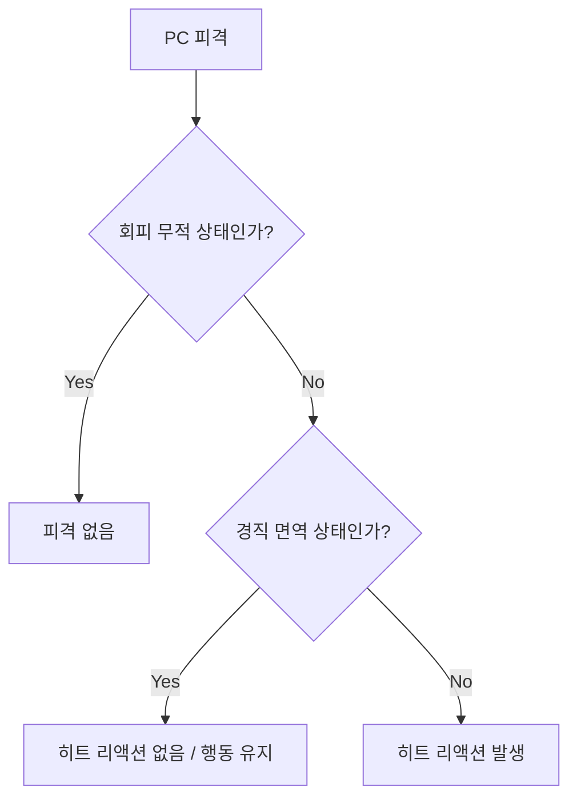
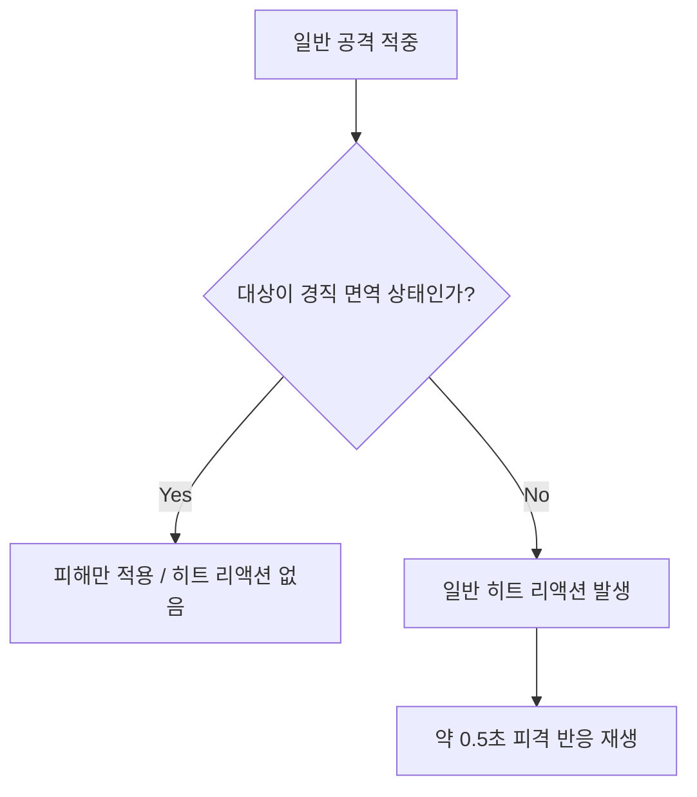
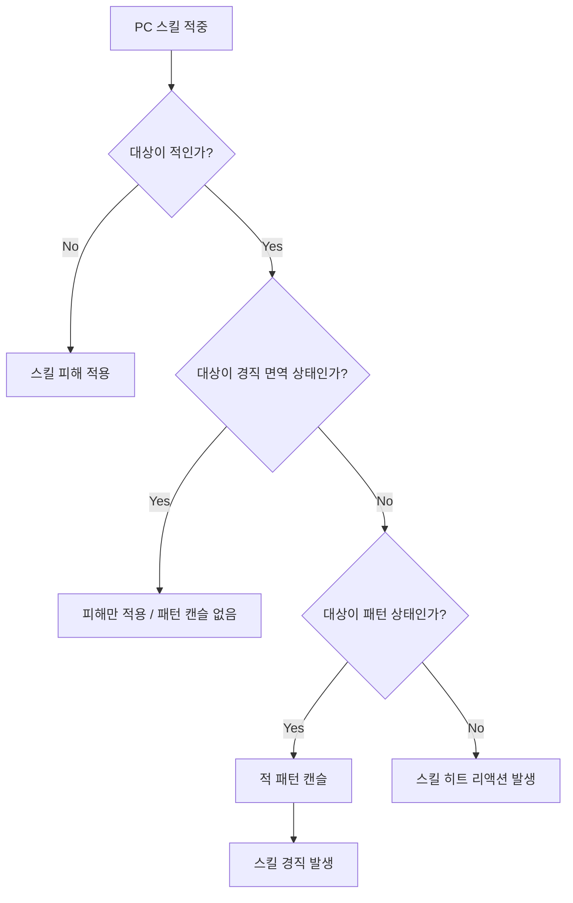
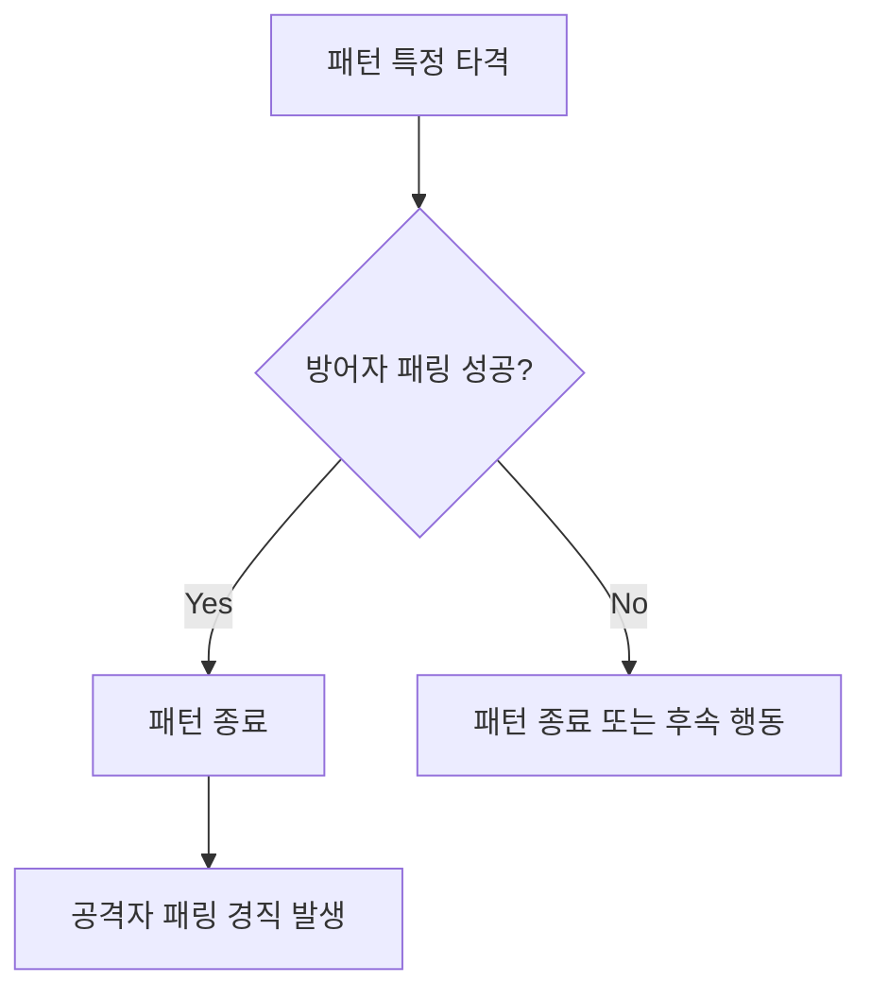
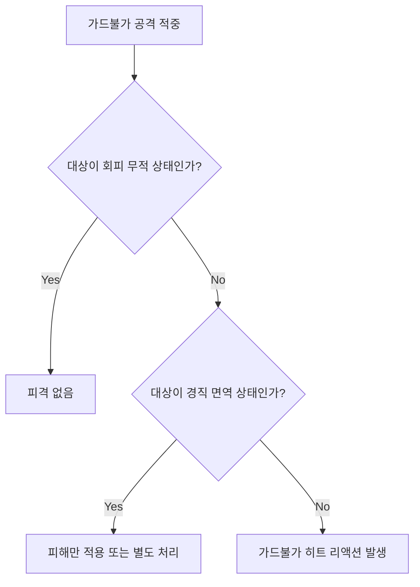

# 캐릭터 경직 / 히트 리액션 통합 시스템

## 1. 문서 개요

이 문서는 PC와 적을 포함한 모든 캐릭터의 **경직 / 히트 리액션 규칙**을 정의하기 위한 문서이다.

본 문서에서 다루는 경직은 공격에 피격되었을 때 발생하는 짧은 행동 중단 또는 피격 반응을 의미한다.

본 시스템에서는 더 이상 `PP`를 사용하지 않는다.  
대신 캐릭터의 현재 상태에 따라 경직 발생 여부를 결정한다.

캐릭터의 경직 상태는 크게 다음 3가지로 구분한다.

| 상태 | 사용 대상 | 설명 |
|---|---|---|
| 일반 상태 | PC / 적 | 일반 공격에 피격되면 히트 리액션이 발생하는 상태 |
| 패턴 상태 | 적 | 적이 공격 패턴을 시전 중인 상태. PC의 스킬로만 캔슬 가능 |
| 경직 면역 상태 | PC / 적 | 일반 공격, 스킬 경직 등으로 경직되지 않는 상태 |

단, 다음 요소는 본 문서에서 다루지 않는다.

| 항목 | 처리 |
|---|---|
| DP 감소 | 별도 DP / 그로기 시스템에서 관리 |
| DP 0으로 인한 그로기 | 별도 DP / 그로기 시스템에서 관리 |
| 스태거 / 그로기 상태 | 별도 문서에서 정의 |
| 그로기 중 특수 처형 / 추가 공격 | 별도 문서에서 정의 |

> **정리**  
> 본 문서는 “피격 시 짧게 흔들리는가 / 행동이 끊기는가”를 다룬다.  
> “DP가 무너져 큰 빈틈 상태가 되는가”는 별도 그로기 시스템에서 다룬다.

---

## 2. 핵심 용어

| 용어 | 설명 |
|---|---|
| 캐릭터 | PC와 적을 모두 포함하는 전투 대상 |
| 경직 | 피격 시 짧게 행동이 중단되거나 피격 반응이 재생되는 상태 |
| 히트 리액션 | 경직 발생 시 재생되는 피격 애니메이션 |
| 일반 히트 리액션 | 일반 공격에 의해 발생하는 짧은 피격 반응 |
| 스킬 경직 | PC의 스킬에 의해 적의 패턴을 끊는 경직 |
| 패링 경직 | 패턴 특정 타격을 패링했을 때 공격자에게 발생하는 짧은 경직 |
| AM | Animation Montage. 히트 리액션, 공격, 스킬 등에 사용되는 애니메이션 단위 |
| 일반 상태 | 일반 공격으로 히트 리액션이 발생할 수 있는 상태 |
| 패턴 상태 | 적이 공격 패턴을 시전 중인 상태 |
| 경직 면역 상태 | 경직이 발생하지 않는 상태 |
| 패턴 캔슬 | 적의 패턴 상태가 스킬 경직에 의해 중단되는 것 |

---

## 3. 전체 설계 방향

캐릭터 경직 시스템은 PC와 적을 완전히 다른 규칙으로 나누지 않고,  
동일한 상태 개념을 기준으로 판정한다.

다만 PC와 적이 사용할 수 있는 상태가 다르다.

| 대상 | 사용 상태 |
|---|---|
| PC | 일반 상태, 경직 면역 상태 |
| 적 | 일반 상태, 패턴 상태, 경직 면역 상태 |

PC는 패턴 상태를 사용하지 않는다.  
PC는 스킬, 궁극기, 극한 회피, 가드, 패링 상태 이외에는 모두 일반 상태로 취급한다.

반면 적은 패턴을 사용하지 않을 때는 일반 상태이며,  
패턴을 시전 중일 때는 패턴 상태가 된다.

적의 필살기, 페이즈 전환, 보스 핵심 패턴처럼 반드시 보호해야 하는 패턴은  
경직 면역 상태로 설정할 수 있다.

---

## 4. 문서 범위

| 항목 | 포함 여부 | 비고 |
|---|---:|---|
| 캐릭터 일반 공격 피격 경직 | 포함 | PC / 적 공통 |
| PC 스킬 사용 중 경직 면역 | 포함 | PC 스킬 보호 |
| 적 패턴 상태 | 포함 | PC 스킬로만 캔슬 가능 |
| 적 경직 면역 상태 | 포함 | 필살기 / 중요 패턴 보호 |
| 패링 성공 시 짧은 경직 | 포함 | 패턴 특정 타격 대응 보상 |
| 연속 피격 설계 | 포함 | 연속 공격 제작 기준 |
| DP 감소 / 그로기 | 제외 | 별도 시스템 |
| 그로기 상태 후속 처리 | 제외 | 별도 시스템 |

---

## 5. 삭제된 개념

본 문서에서는 더 이상 `PP`를 사용하지 않는다.

| 삭제 개념 | 삭제 이유 |
|---|---|
| PP | 캐릭터의 경직 저항 수치를 사용하지 않음 |
| PP 1 / PP 2 | 경직 내성 등급을 상태 기반 구조로 대체 |
| PP 증가 어빌리티 | PC 스킬 사용 중 경직 면역 상태로 대체 |
| 공격 경직치와 PP 비교 | 경직 판정은 캐릭터 상태와 공격 종류로 처리 |

PP를 사용하지 않는 대신, 경직 여부는 다음 요소로 판단한다.

| 판단 요소 | 설명 |
|---|---|
| 대상 상태 | 일반 상태 / 패턴 상태 / 경직 면역 상태 |
| 공격 종류 | 일반 공격 / PC 스킬 / 가드불가 공격 / 특수 공격 |
| 패턴 설정 | 해당 패턴이 패턴 상태인지, 경직 면역 상태인지 여부 |
| 패링 여부 | 패턴 특정 타격을 패링했는지 여부 |

---

# 1부. 캐릭터 상태 규칙

## 6. 캐릭터 상태 종류

### 6.1 일반 상태

일반 상태는 가장 기본적인 상태이다.

일반 상태의 캐릭터는 일반 공격에 피격될 경우 히트 리액션이 발생한다.

| 대상 | 일반 상태 예시 |
|---|---|
| PC | PC는 스킬, 궁극기, 극한 회피, 가드, 패링 상태 이외의 상태 |
| 적 | 대기 중, 이동 중, 추적 중, 패턴을 시전하지 않는 상태 |

일반 히트 리액션은 약 `0.5초`로 짧게 제작한다.  
따라서 일반 공격으로 인한 경직은 타격감을 제공하지만, 전투 흐름을 과도하게 끊지 않는다.

---

### 6.2 패턴 상태

패턴 상태는 적 전용 상태이다.

적이 공격 패턴을 시전 중일 때 패턴 상태가 된다.  
패턴 상태의 적은 일반 공격으로도 짧은 히트 리액션을 받을 수 있지만, 패턴 캔슬은 발생하지 않는다.

패턴 상태를 캔슬할 수 있는 수단은 PC의 스킬이다.

| 항목 | 처리 |
|---|---|
| 사용 대상 | 적 |
| 일반 공격 피격 | 짧은 히트 리액션 발생 가능 |
| 일반 공격에 의한 패턴 캔슬 | 불가 |
| PC 스킬에 의한 패턴 캔슬 | 가능 |
| 패링에 의한 패턴 캔슬 | 불가 |
| 패턴 특정 타격 패링 | 패턴 종료 후 짧은 패링 경직 발생 |

> **중요**  
> 패턴 상태의 적이 일반 공격에 맞으면 짧은 히트 리액션은 발생할 수 있다.  
> 하지만 일반 공격으로 적의 패턴 자체가 캔슬되지는 않는다.

---

### 6.3 경직 면역 상태

경직 면역 상태는 경직을 받지 않는 상태이다.

PC는 스킬 사용 중 경직 면역 상태가 된다.  
적은 필살기, 페이즈 전환, 보스 핵심 패턴 등 중요한 패턴 중 경직 면역 상태가 될 수 있다.

| 대상 | 경직 면역 상태 예시 |
|---|---|
| PC | 스킬 사용 중 |
| 적 | 필살기, 페이즈 전환, 기믹 패턴, 보스 핵심 패턴 |

경직 면역 상태에서는 일반 공격과 스킬 경직에 의한 히트 리액션이 발생하지 않는다.  
다만 피해 적용 여부는 공격과 상태별로 별도 설정한다.

---

## 7. 대상별 사용 상태

| 대상 | 일반 상태 | 패턴 상태 | 경직 면역 상태 |
|---|---:|---:|---:|
| PC | 사용 | 사용 안 함 | 사용 |
| 적 | 사용 | 사용 | 사용 |

PC는 패턴 상태를 사용하지 않는다.

PC의 기본 행동은 대부분 일반 상태로 처리한다.  
스킬 사용 중에는 경직 면역 상태로 처리한다.

적은 패턴을 사용하지 않는 동안 일반 상태이며,  
패턴 사용 중에는 패턴 상태가 된다.

적의 필살기나 중요한 패턴은 경직 면역 상태로 처리한다.

---

# 2부. PC 경직 규칙

## 8. PC 상태 규칙

PC는 다음 2가지 상태만 사용한다.

| PC 상태 | 설명 |
|---|---|
| 일반 상태 | 일반 공격에 피격되면 히트 리액션이 발생하는 상태 |
| 경직 면역 상태 | 히트 리액션이 발생하지 않는 상태 |

PC는 패턴 상태를 사용하지 않는다.

---

## 9. PC 일반 상태

PC는 다음 상태를 제외한 모든 상황을 일반 상태로 취급한다.

| 예외 상태 | 처리 |
|---|---|
| 스킬 사용 중 | 경직 면역 상태 |
| 궁극기 사용 중 | 경직 면역 상태 |
| 극한 회피 중 | 회피 / 무적 상태 |
| 가드 중 | 가드 상태 |
| 패링 중 | 패링 상태 |

위 예외 상태에 해당하지 않는 경우, PC는 모두 일반 상태로 처리한다.

| 상황 | 상태 | 피격 시 처리 |
|---|---|---|
| 공격하지 않는 상태 | 일반 상태 | 히트 리액션 발생 |
| 이동 중 | 일반 상태 | 히트 리액션 발생 |
| 대기 중 | 일반 상태 | 히트 리액션 발생 |
| 일반 공격 콤보 중 | 일반 상태 | 일반 공격 캔슬 후 히트 리액션 발생 |
| 방어 실패 후 피격 | 일반 상태 | 히트 리액션 발생 |
| 패링 실패 후 피격 | 일반 상태 | 히트 리액션 발생 |
| 회피 실패 후 피격 | 일반 상태 | 히트 리액션 발생 |

PC가 일반 상태에서 공격에 피격되면 히트 리액션이 발생한다.

PC의 일반 공격 콤보 중에도 일반 상태로 취급하므로,  
적의 공격에 피격되면 콤보가 캔슬되고 히트 리액션이 재생된다.

즉, PC는 스킬, 궁극기, 극한 회피, 가드, 패링 상태가 아닌 모든 상황에서 일반 상태로 취급된다.
---

## 10. PC 경직 면역 상태

PC는 스킬 또는 궁극기 사용 중 경직 면역 상태가 된다.

| 상황 | 상태 | 피격 시 처리 |
|---|---|---|
| 스킬 사용 중 | 경직 면역 상태 | 히트 리액션 없음 / 스킬 유지 |
| 궁극기 사용 중 | 경직 면역 상태 | 히트 리액션 없음 / 궁극기 유지 |
| 필살기 또는 컷신성 공격 | 경직 면역 상태 가능 | 연출 보호 |

PC의 스킬 또는 궁극기 사용 중에는 일반 공격에 피격되어도 히트 리액션이 발생하지 않는다.  
따라서 스킬 또는 궁극기가 중단되지 않고 끝까지 재생될 수 있다.

단, 피해를 받을지 여부는 스킬 또는 궁극기별로 별도 설정한다.

> **주의**  
> PC의 경직 면역은 히트 리액션 발생 여부에만 관여한다.  
> 피해 감소 또는 피해 무효 여부는 스킬 또는 궁극기별로 별도 설정한다.

---

## 11. PC 피격 판정 흐름



```text
PC 피격
↓
회피 무적 상태인가?
↓
Yes: 피격 없음
No: 상태 확인
↓
경직 면역 상태인가?
↓
Yes: 히트 리액션 없음 / 행동 유지
No: 히트 리액션 발생
```

---

# 3부. 적 경직 규칙

## 12. 적 상태 규칙

적은 다음 3가지 상태를 사용할 수 있다.

| 적 상태 | 설명 |
|---|---|
| 일반 상태 | 패턴을 사용하지 않는 상태 |
| 패턴 상태 | 공격 패턴을 시전 중인 상태 |
| 경직 면역 상태 | 필살기나 중요한 패턴 중 경직을 받지 않는 상태 |

---

## 13. 적 일반 상태

적이 패턴을 사용하지 않는 상태는 일반 상태이다.

| 상황 | 상태 | 피격 시 처리 |
|---|---|---|
| 대기 중 | 일반 상태 | 일반 히트 리액션 발생 |
| 이동 중 | 일반 상태 | 일반 히트 리액션 발생 |
| 추적 중 | 일반 상태 | 일반 히트 리액션 발생 |
| 패턴 종료 후 빈틈 | 일반 상태 | 일반 히트 리액션 발생 |

적이 일반 상태일 때 일반 공격에 피격되면 히트 리액션이 발생한다.

---

## 14. 적 패턴 상태

적이 패턴을 사용 중일 때는 패턴 상태이다.

패턴 상태의 적은 일반 공격에 피격되면 짧은 히트 리액션을 받을 수 있다.  
하지만 일반 공격으로 패턴이 캔슬되지는 않는다.

패턴 상태를 캔슬할 수 있는 기본 수단은 PC의 스킬이다.

| 공격 / 대응 | 패턴 상태 적에게 적용되는 처리 |
|---|---|
| 일반 공격 | 짧은 히트 리액션 발생 가능 / 패턴 캔슬 불가 |
| PC 스킬 | 패턴 캔슬 가능 |
| 패링 | 패턴 캔슬 불가 |
| 패턴 특정 타격 패링 | 패턴 종료 후 공격자에게 짧은 패링 경직 발생 |

즉, 패턴 상태의 적도 일반 공격에 반응은 하지만,  
패턴의 구조 자체는 유지된다.

---

## 15. 적 경직 면역 상태

적의 필살기나 중요한 패턴은 경직 면역 상태로 설정할 수 있다.

경직 면역 상태의 적은 일반 공격과 스킬 경직으로 히트 리액션이 발생하지 않는다.

| 패턴 유형 | 경직 면역 이유 |
|---|---|
| 페이즈 전환 패턴 | 연출과 전투 흐름 유지 |
| 필살기 패턴 | 반드시 회피나 기믹으로 대응해야 함 |
| 튜토리얼성 패턴 | 특정 대응법을 학습시키기 위함 |
| 기믹 패턴 | 경직으로 끊기면 전투 구조가 무너짐 |
| 보스 핵심 패턴 | 보스의 정체성을 보여주는 주요 공격 |

경직 면역 상태를 너무 자주 사용하면 플레이어의 공격 반응성이 약해질 수 있으므로,  
중요 패턴에 제한적으로 사용한다.

---

# 4부. 경직 종류

## 16. 경직 종류

| 경직 종류 | 발생 조건 | 패턴 캔슬 여부 | 설명 |
|---|---|---:|---|
| 일반 히트 리액션 | 일반 상태 또는 패턴 상태에서 일반 공격 피격 | 불가 | 약 `0.5초`의 짧은 피격 반응 |
| 스킬 경직 | 패턴 상태의 적에게 PC 스킬 적중 | 가능 | 적의 패턴을 끊는 전술적 수단 |
| 패링 경직 | 패턴 특정 타격 패링 성공 | 패턴 종료 후 발생 | 패턴 대응 성공 보상 |
| 넉백 | 밀어내는 공격 피격 | 설정에 따름 | 대상과 거리를 벌림 |
| 넉다운 | 강한 공격 또는 마무리 공격 피격 | 설정에 따름 | 대상이 바닥에 쓰러짐 |
| 넉업 | 올려치는 공격 피격 | 설정에 따름 | 대상이 공중으로 띄워진 뒤 넘어짐 |
| 특수 히트 리액션 | 잡기, 기믹, 연출 공격 피격 | 설정에 따름 | 전용 연출 사용 |

---

## 17. 일반 히트 리액션 규칙

일반 공격이 캐릭터에게 적중하면 짧은 히트 리액션이 발생한다.

이 규칙은 PC와 적 모두에게 적용된다.



```text
일반 공격 적중
↓
대상이 경직 면역 상태인가?
↓
Yes: 피해만 적용 / 히트 리액션 없음
No: 일반 히트 리액션 발생
↓
약 0.5초 피격 반응 재생
```

일반 히트 리액션은 전투 흐름을 과도하게 끊지 않기 위해 짧게 제작한다.  
기준 길이는 약 `0.5초`로 한다.

---

## 18. 스킬 경직 규칙

PC의 스킬은 적의 패턴 상태를 캔슬할 수 있다.



```text
PC 스킬 적중
↓
대상이 적인가?
↓
Yes
↓
대상이 경직 면역 상태인가?
↓
Yes: 피해만 적용 / 패턴 캔슬 없음
No: 패턴 상태 확인
↓
대상이 패턴 상태인가?
↓
Yes: 적 패턴 캔슬 + 스킬 경직 발생
No: 스킬 히트 리액션 발생
```

스킬 경직은 일반 히트 리액션보다 강한 경직으로 처리한다.  
이를 통해 스킬은 단순 피해 수단이 아니라, 위험한 패턴을 끊는 전술적 수단으로 사용할 수 있다.

---

## 19. 패링 경직 규칙

모든 패턴은 특정 타격이 패링되었을 경우,  
공격자에게 짧은 패링 경직을 발생시킨다.



```text
패턴 특정 타격
↓
방어자 패링 성공
↓
패턴 종료
↓
공격자 패링 경직 발생
```

이 경직은 방어자가 패턴을 끝까지 읽고 정확히 대응했을 때 주어지는 보상이다.

단, 패링 경직은 패턴을 중간에 캔슬하는 수단이 아니다.  
패턴의 특정 타격을 패링했을 때, 패턴 종료 후 발생하는 보상 경직이다.

---

## 20. 가드불가 공격 규칙

가드불가 공격은 가드와 패링으로 대응할 수 없는 공격이다.

가드불가 공격은 일반 히트 리액션보다 강한 피격 반응을 발생시킬 수 있다.

| 항목 | 설명 |
|---|---|
| 대응 방식 | 회피 또는 기믹으로 대응 |
| 가드 | 불가 |
| 패링 | 불가 |
| 히트 리액션 | 일반 히트 리액션 또는 전용 히트 리액션 |
| 경직 면역 상태 | 상태별 설정에 따라 무시 가능 |



---

# 5부. 경직 우선순위

## 21. 경직 우선순위

경직 판정이 여러 개 동시에 발생할 수 있으므로,  
우선순위를 명확히 정해야 한다.

| 우선순위 | 판정 |
|---:|---|
| 1 | 회피 무적 |
| 2 | 경직 면역 상태 |
| 3 | 가드불가 공격 판정 |
| 4 | 패링 / 가드 성공 |
| 5 | PC 스킬에 의한 패턴 캔슬 |
| 6 | 패링 경직 |
| 7 | 일반 히트 리액션 |
| 8 | 피해만 적용 |

> **주의**  
> 본 문서에서의 가드불가 공격은 가드뿐 아니라 패링으로도 대응할 수 없는 공격을 의미한다.  
> 따라서 가드불가 공격 판정은 패링 / 가드 성공 판정보다 먼저 처리한다.

---

# 6부. 연속 공격과 연속 피격 설계

## 22. 연속 공격 설계 문제

일반 히트 리액션은 약 `0.5초`로 짧지만,  
연속 공격 간격이 너무 짧으면 첫 타 피격 후 후속타가 모두 확정으로 적중할 수 있다.

이 경우 다음과 같은 문제가 발생할 수 있다.

| 문제 | 설명 |
|---|---|
| 조작권 상실 | 첫 타를 맞은 뒤 회피, 방어, 패링을 입력할 기회가 없음 |
| 전타 확정 피격 | 한 번의 실수가 연속 공격 전체 피격으로 이어짐 |
| 불공정한 피격감 | 플레이어가 대응할 수 없는 피해처럼 느껴짐 |
| 패턴 학습 방해 | 어느 타이밍에 다시 조작 가능한지 알기 어려움 |

---

## 23. 연속 공격 기본 원칙

연속 공격은 첫 타 피격 후 모든 후속타가 확정으로 적중하지 않도록 설계한다.

의도적으로 2타 이상을 확정 피격시키는 패턴이 아니라면,  
연속 공격 간격은 대상의 일반 히트 리액션 AM보다 길게 설정한다.

의도적으로 2타 이상을 확정 피격시키는 공격이라면,  
첫 타의 히트 리액션 종류와 후속타 확정 수를 패턴 문서에 명시한다.

필요한 경우 첫 타를 넉백 히트 리액션으로 설정하여 후속타 연출과 위치를 맞춘다.

이를 통해 대상이 첫 타를 맞은 후에도 다음 공격에 대해  
회피, 방어, 패링을 시도할 수 있도록 한다.

> **핵심 규칙**  
> 후속 공격 간격이 대상의 히트 리액션 AM보다 짧으면 후속타가 확정 피격될 수 있다.  
> 의도된 연속 피격이 아니라면, 후속 공격 간격은 대상의 히트 리액션 AM보다 길게 잡는다.

---

## 24. 연속 공격 문서화 항목

패턴 문서에는 연속 피격 여부를 명확히 기록한다.

| 항목 | 설명 |
|---|---|
| 연속 공격 여부 | 단타 / 연속 공격 |
| 타격 수 | 총 몇 타로 구성되는지 |
| 타격 간격 | 각 타격 사이 시간 |
| 첫 타 피격 시 후속타 확정 여부 | 첫 타를 맞으면 다음 타가 확정인지 여부 |
| 의도된 연속 피격 수 | 최대 몇 타까지 확정으로 맞게 할 것인지 |
| 히트 리액션 후 회피 가능 여부 | 피격 후 다음 공격 전에 회피 가능한지 |
| 히트 리액션 후 방어 가능 여부 | 피격 후 다음 공격 전에 방어 가능한지 |
| 히트 리액션 후 패링 가능 여부 | 피격 후 다음 공격 전에 패링 가능한지 |
| 다운 / 넉백 여부 | 연속 피격 후 어떤 상태로 전환되는지 |

---

# 7부. 최종 정의

## 25. 최종 정의

캐릭터 경직 시스템은 PC와 적을 구분하지 않고,  
일반 상태 / 패턴 상태 / 경직 면역 상태를 기준으로 판정한다.

PC는 일반 상태와 경직 면역 상태만 사용한다.  
PC는 패턴 상태를 사용하지 않는다.

PC는 스킬, 궁극기, 극한 회피, 가드, 패링 상태를 제외한 모든 상황에서 일반 상태로 취급한다.  
이 상태에서 공격에 피격되면 히트 리액션이 발생한다.

PC는 스킬 또는 궁극기 사용 중 경직 면역 상태가 되며,  
해당 상태에서는 히트 리액션이 발생하지 않는다.

극한 회피 중에는 회피 / 무적 상태로 처리하며,  
가드와 패링 중에는 각각 가드 상태와 패링 상태로 처리한다.

적은 일반 상태, 패턴 상태, 경직 면역 상태를 모두 사용할 수 있다.

적이 패턴을 사용하지 않는 상태는 일반 상태이며,  
이 상태에서 일반 공격에 피격되면 짧은 히트 리액션이 발생한다.

적이 패턴 사용 중일 때는 패턴 상태이며,  
일반 공격에 피격되면 짧은 히트 리액션은 발생할 수 있지만 패턴 캔슬은 발생하지 않는다.

패턴 상태의 적을 캔슬할 수 있는 기본 수단은 PC의 스킬이다.

적의 필살기나 중요한 패턴은 경직 면역 상태로 설정할 수 있으며,  
이 상태에서는 일반 공격과 스킬 경직에 의해 경직되지 않는다.

일반 히트 리액션은 약 `0.5초`로 짧게 제작하여,  
타격감을 제공하면서도 전투 흐름을 과도하게 끊지 않도록 한다.

---

## 26. 요약

| 구분 | 정의 |
|---|---|
| 일반 상태 | 일반 공격에 피격되면 히트 리액션이 발생하는 상태 |
| 패턴 상태 | 적 전용 상태. 일반 공격에는 반응하지만 PC 스킬로만 캔슬 가능 |
| 경직 면역 상태 | 일반 공격과 스킬 경직으로 경직되지 않는 상태 |
| PC 상태 | 일반 상태, 경직 면역 상태만 사용. 스킬, 궁극기, 극한 회피, 가드, 패링 상태 외에는 일반 상태로 처리 |
| 적 상태 | 일반 상태, 패턴 상태, 경직 면역 상태 모두 사용 |
| 일반 히트 리액션 | 일반 공격 피격 시 발생하는 약 `0.5초`의 짧은 피격 반응 |
| 스킬 경직 | PC 스킬로 적의 패턴 상태를 캔슬하는 전술적 경직 |
| 패링 경직 | 패턴 특정 타격 패링 성공 후 발생하는 보상 경직 |
| 가드불가 공격 | 가드와 패링으로 대응할 수 없는 공격 |
| 연속 피격 설계 | 히트 리액션 AM과 후속 공격 간격을 비교하여 확정 피격 여부 결정 |
| 그로기 | 일반 경직과 별개의 DP 시스템 결과 |
