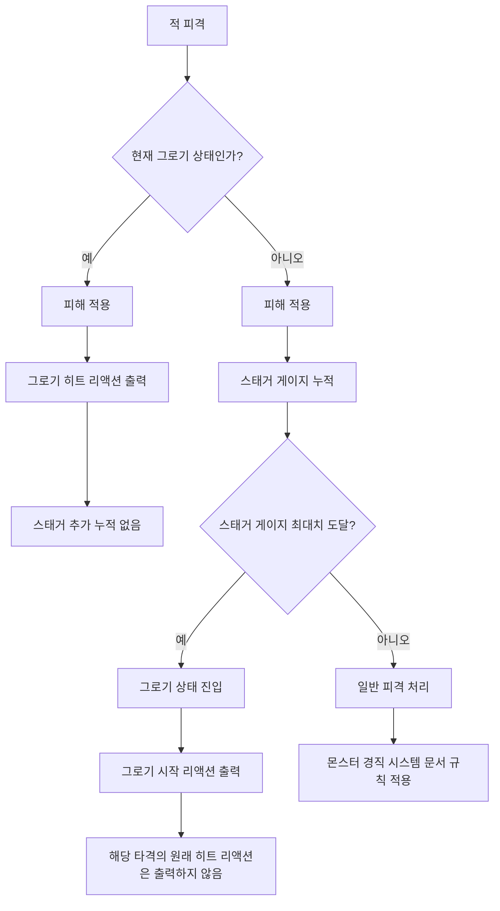

# 그로기 시스템 초안

## 1. 문서 목적

본 문서는 WX의 **그로기 시스템** 규칙을 정리하기 위한 초안이다.

그로기는 적의 스태거 게이지가 최대치에 도달했을 때 발생하는 무력화 상태이며, 플레이어에게 짧은 공격 보상 시간을 제공하기 위한 시스템이다.

본 문서에서는 **공통 그로기 규칙**만 다룬다.

---

## 2. 용어 정의

| 용어 | 설명 |
|---|---|
| 스태거 게이지 | 공격 또는 패링 성공 등에 의해 누적되는 그로기 발생용 게이지 |
| 그로기 | 스태거 게이지가 최대치에 도달했을 때 발생하는 적의 무력화 상태 |
| 그로기 시작 리액션 | 적이 그로기 상태에 진입할 때 출력되는 전용 반응 |
| 그로기 히트 리액션 | 그로기 상태의 적이 피격될 때 출력되는 전용 피격 반응 |
| 히트 리액션 | 경직, 넉다운, 에어본 등 피격 시 발생하는 반응 |
| 몬스터 경직 시스템 | 그로기가 발생하지 않았을 때 일반 피격 반응을 처리하는 별도 시스템 |

---

## 3. 기본 규칙

### 3.1 그로기 발생 조건

- 적의 스태거 게이지가 최대치에 도달하면 그로기 상태에 진입한다.
- 스태거 게이지 최대치는 적마다 다르게 설정할 수 있다.
- 스태거 누적량은 공격, 패링 성공, 개별 기믹 등에 따라 다르게 설정할 수 있다.
- 구체적인 스태거 누적량은 개별 적 문서에서 정의한다.

### 3.2 그로기 상태 효과

그로기 상태에 진입한 적은 아래 규칙을 따른다.

| 항목 | 규칙 |
|---|---|
| 이동 | 불가능 |
| 공격 | 불가능 |
| 받는 피해 | 30% 증가 |
| 스태거 게이지 | 서서히 감소 |
| 스태거 추가 누적 | 불가능 |
| 피격 반응 | 그로기 히트 리액션만 발생 |

---

## 4. 몬스터 경직 시스템과의 관계

그로기 시스템과 몬스터 경직 시스템은 서로 다른 역할을 가진다.

| 구분 | 그로기 시스템 | 몬스터 경직 시스템 |
|---|---|---|
| 목적 | 스태거 누적에 따른 무력화 상태 발생 | 일반 피격 반응 처리 |
| 주요 결과 | 그로기 상태 진입 | 경직, 넉다운, 에어본 등 |
| 처리 기준 | 스태거 게이지 최대치 도달 여부 | 별도 경직 시스템 규칙 |
| 문서 역할 | 그로기 발생, 유지, 종료 규칙 정의 | 일반 피격 반응 규칙 정의 |

### 4.1 우선순위

- 하나의 타격으로 스태거 게이지가 최대치에 도달하면, 해당 타격의 원래 히트 리액션은 출력하지 않는다.
- 대신 그로기 상태에 진입하고, 그로기 시작 리액션을 출력한다.
- 예를 들어 넉다운 판정 공격으로 스태거 게이지가 최대치에 도달한 경우, 넉다운이 아니라 그로기 상태에 진입한다.

---

## 5. 그로기 중 피격 규칙

그로기 상태의 적은 피격 시 해당 공격의 원래 히트 리액션 판정을 따르지 않는다. 또한 피격으로 인해 적의 위치가 움직이지 않는다.

- 경직 판정 공격을 맞아도 일반 경직이 발생하지 않는다.
- 넉다운 판정 공격을 맞아도 넉다운이 발생하지 않는다.
- 에어본 판정 공격을 맞아도 에어본이 발생하지 않는다.
- 대신 항상 그로기 히트 리액션만 출력한다.

이를 통해 그로기 상태 중 적의 자세와 딜타임이 과도하게 흔들리지 않도록 한다.

---

## 6. 그로기 종료 규칙

### 6.1 기본 종료 조건

- 그로기 상태 중 스태거 게이지는 서서히 감소한다.
- 스태거 게이지가 0이 되면 그로기 상태를 종료한다.
- 그로기 종료 후 적은 전투 상태로 복귀한다.

### 6.2 종료 후 처리

그로기 종료 시 아래 처리가 필요하다.

| 항목 | 처리 |
|---|---|
| 상태 | 그로기 상태 해제 |
| 이동 | 다시 가능 |
| 공격 | 다시 가능 |
| 받는 피해 증가 | 해제 |
| 스태거 게이지 | 0부터 시작 |
| 다음 행동 | 개별 적 BT 규칙에 따라 선택 |

---

## 7. 적 피격 판정 시퀀스

적이 공격에 피격되었을 때, 그로기 판정과 피격 반응은 아래 순서로 처리한다.

### 7.1 처리 순서 요약

1. 적이 현재 그로기 상태인지 확인한다.
2. 그로기 상태라면 피해를 적용하고, 해당 공격의 판정과 무관하게 그로기 히트 리액션만 출력한다.
3. 그로기 상태에서는 스태거 게이지를 추가로 누적하지 않는다.
4. 그로기 상태가 아니라면 피해를 적용하고 스태거 게이지를 누적한다.
5. 스태거 게이지가 최대치에 도달하면 그로기 상태에 진입한다.
6. 그로기 상태로 진입시킨 공격의 원래 히트 리액션은 출력하지 않는다.
7. 대신 그로기 시작 리액션만 출력한다.
8. 스태거 게이지가 최대치에 도달하지 않았다면, 이후 처리는 몬스터 경직 시스템 문서의 규칙을 따른다.
