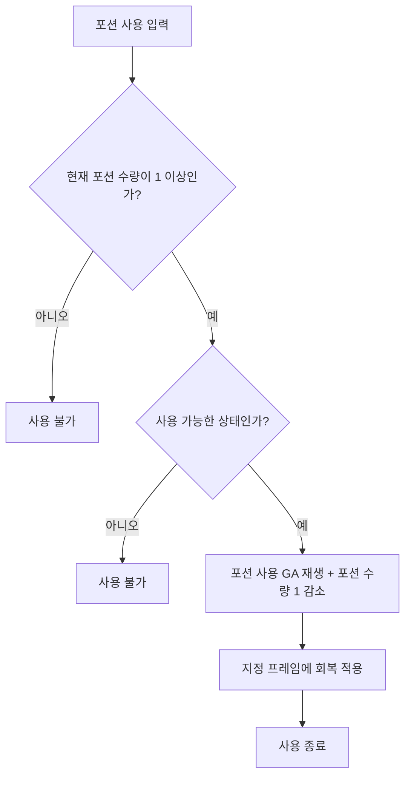

# 포션 시스템 초안

## 1. 개요

포션은 전투 중 플레이어가 체력을 회복할 수 있는 제한 자원이다.  
일반적인 소비형 아이템이 아니라, 특정 지점에서 다시 충전되는 전투용 회복 수단으로 사용한다.

현재 단계에서는 성장 요소를 포함하지 않는다.  
따라서 포션의 최대 소지 수량 증가, 회복량 증가, 강화 단계 등은 후순위로 미룬다.

---

## 2. 시스템 목적

| 목적 | 설명 |
|---|---|
| 전투 지속성 확보 | 실수 1~2번으로 바로 사망하지 않도록 완충 장치를 제공한다. |
| 보스전 난이도 조절 | 플레이어가 보스 패턴을 학습할 시간을 확보한다. |
| 리스크/리턴 제공 | 포션 사용 중 빈틈을 만들어 안전한 타이밍 판단을 요구한다. |
| 성장 요소 확장 가능성 확보 | 추후 최대 소지량/회복량 증가 시스템으로 확장할 수 있도록 한다. |

---

## 3. 기본 규칙

| 항목 | 내용 |
|---|---|
| 포션 이름 | 임시명: 회복통 |
| 사용 대상 | PC |
| 기본 소지 수량 | 4 |
| 회복량 | 최대 체력의 40% |
| 사용 방식 | 버튼 입력 시 포션 사용 애니메이션 재생 |
| 충전 방식 | 보스 재도전, 화톳불에서 최대 수량으로 회복 |
| 소비 방식 | 포션 사용 GA 실행 시 현재 포션 수량 1 감소 |
| 수량 0일 때 | GA 실행되지 않음|
| 성장 요소 | 추후 추가 예정 |

---

## 4. 수치

| 항목 | 추천값 |
|---|---|
| 최대 소지 수량 | 4개 |
| 회복량 | 최대 체력의 40% |
| 이동 가능 여부 | 걷기, 대시 모두 가능 |
| 캔슬 가능 여부 | 기본적으로 캔슬 불가 |
| 피격 시 중단 여부 | 회복 적용 전 피격 시 실패 |

---

## 5. 사용 흐름

---

## 6. 회복 적용 타이밍

애니메이션 프레임에 따른다.

---

## 7. 포션 사용 가능 상태

| 상태 | 포션 사용 가능 여부 |
|---|---|
| 일반 이동 중 | 가능 |
| 달리기 중 | 가능 |
| 기본 공격 중 | 불가 |
| 강공격 중 | 불가 |
| 스킬 사용 중 | 불가 |
| 회피 중 | 불가 |
| 가드 중 | 불가 |
| 패링 중 | 불가 |
| 피격 리액션 중 | 불가 |
| 다운 상태 | 불가 |
| 사망 상태 | 불가 |

---

## 8. 포션 사용 중 가능 행동

| 항목 | 처리 |
|---|---|
| 이동 | 가능 |
| 달리기 중 | 가능 |
| 공격 | 불가 |
| 스킬 | 불가 |
| 회피 | 불가 |
| 가드 | 불가 |
| 피격 | 가능 |
| 사망 | 가능 |
| 포션 중복 사용 | 불가 |

---

## 9. 피격 시 포션 처리

포션 사용 GA 실행 즉시 포션이 소비된다.  
포션 사용 GA 실행 중 피격되면 경직이 발생하여 GA가 캔슬된다.  
포션 회복 프레임에 도달하기 전에 피격되면 회복되지 않는다.
| 상황 | 처리 |
|---|---|
| 회복 적용 전 피격 | 포션 사용 실패 |
| 회복 적용 후 피격 | 회복은 적용되고 피격 리액션 발생 |
| 회복 적용 전 회피/캔슬 입력 | 기본적으로 불가 |
| 사망 피해를 받은 경우 | 사망 처리 우선 |

---

## 10. 충전 규칙

포션은 아래 상황에서 최대 수량으로 충전된다.

| 상황 | 처리 |
|---|---|
| 화톳불 | 최대 수량으로 충전 |
| 보스전 재도전 | 최대 수량으로 충전 |
| 사망 후 재시작 | 최대 수량으로 충전 |

---

## 11. 정리

핵심은 다음과 같다.

- 전투 중 제한된 횟수만 사용할 수 있다.
- 사용 중에는 이동 이외의 행동에 제한이 생긴다.
- 회복은 즉시 적용되지 않고, 애니메이션 중간 이후에 적용된다.
- 회복 적용 전 피격당하면 실패한다.
- 보스 재도전이나 화톳불에서 최대 수량으로 충전된다.
- 최대 수량 증가와 회복량 증가는 추후 성장 요소로 분리한다.
