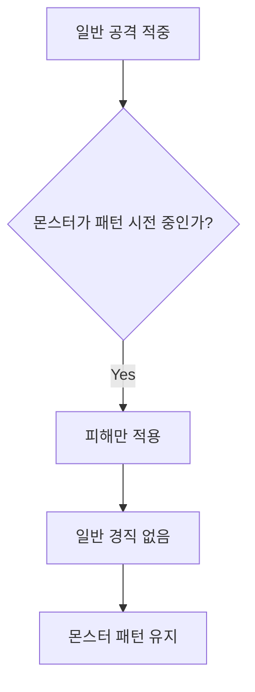
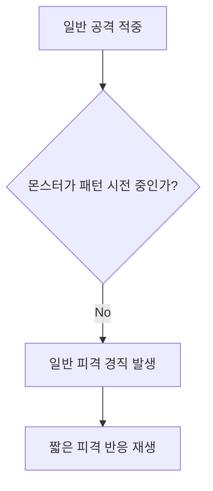
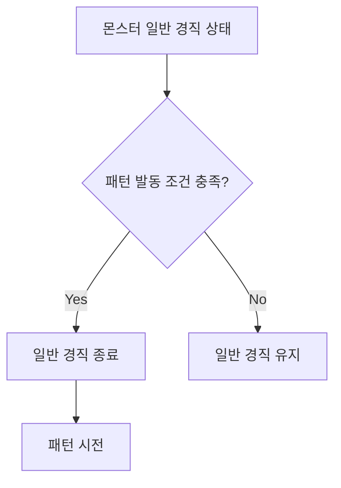
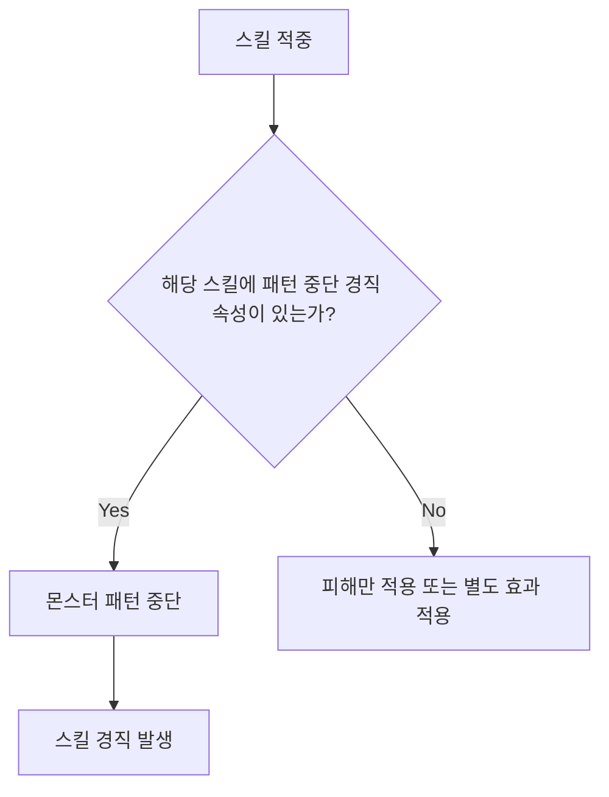
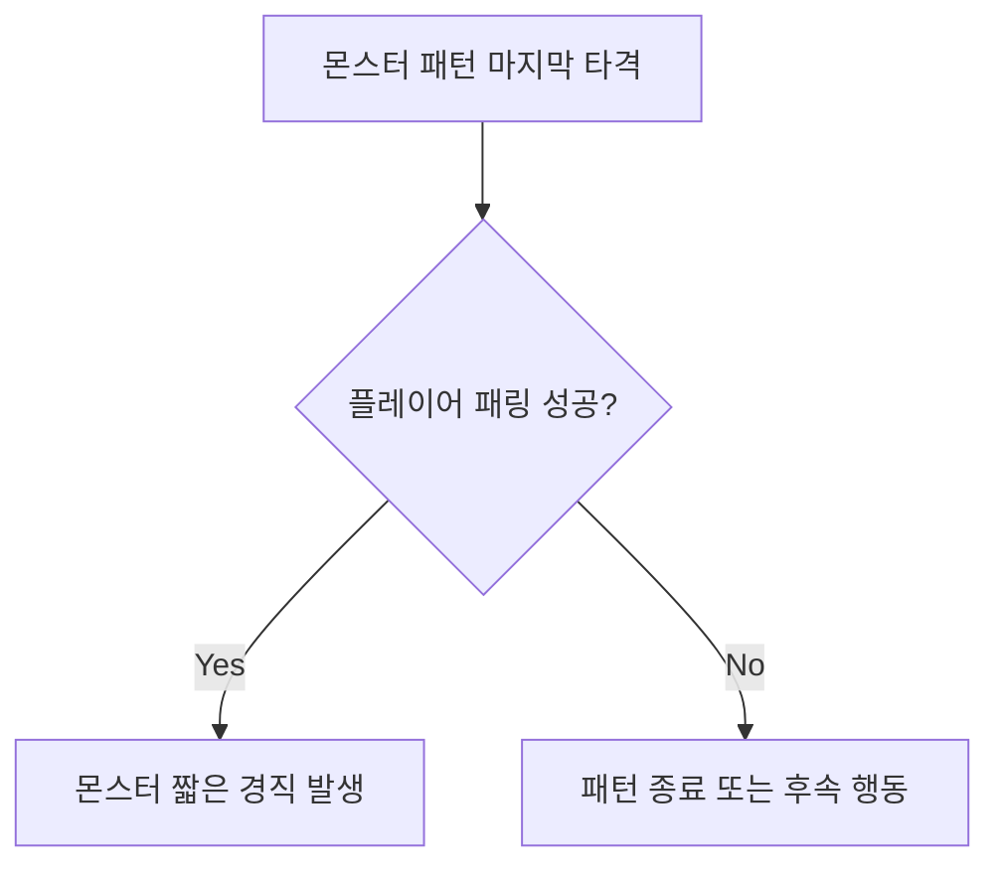
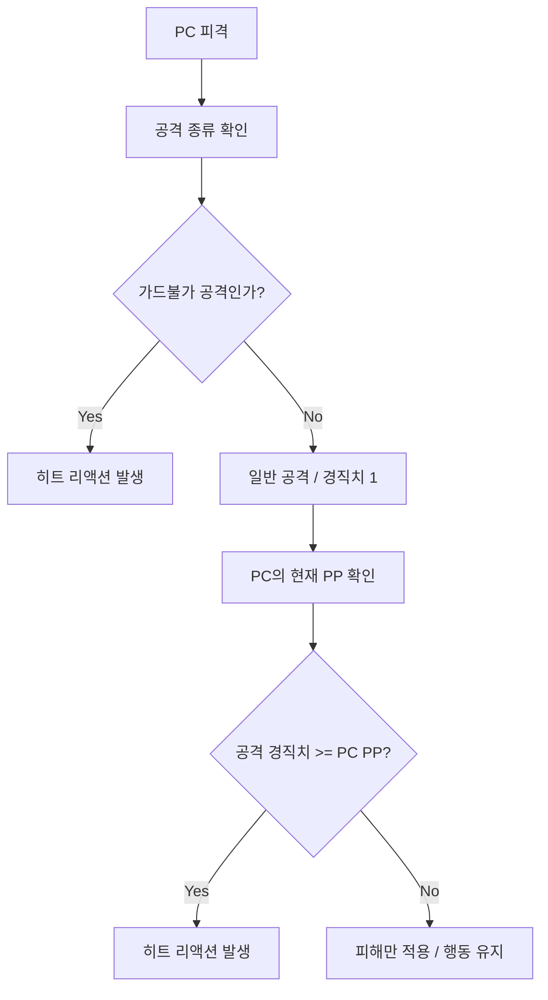

# 경직 / 히트 리액션 통합 시스템

## 1. 문서 개요

이 문서는 몬스터와 PC의 **경직 / 히트 리액션 규칙**을 통합해서 정의하기 위한 문서이다.

본 문서에서 다루는 경직은 공격에 피격되었을 때 발생하는 짧은 행동 중단 또는 피격 반응을 의미한다.

단, 다음 요소는 본 문서에서 다루지 않는다.

| 항목 | 처리 |
|---|---|
| DP 감소 | 별도 DP / 그로기 시스템에서 관리 |
| DP 0으로 인한 그로기 | 별도 DP / 그로기 시스템에서 관리 |
| 스태거 / 그로기 상태 | 별도 문서에서 정의 |
| 그로기 중 특수 처형 / 추가 공격 | 별도 문서에서 정의 |

> **정리**  
> 본 문서는 “피격 시 짧게 흔들리는가 / 행동이 끊기는가”를 다룬다.  
> “DP가 무너져 큰 빈틈 상태가 되는가”는 별도 그로기 시스템에서 다룬다.

---

## 2. 핵심 용어

| 용어 | 설명 |
|---|---|
| 경직 | 피격 시 짧게 행동이 중단되거나 피격 반응이 재생되는 상태 |
| 히트 리액션 | 경직 발생 시 재생되는 피격 애니메이션 |
| PP | 경직 저항 수치 |
| 경직치 | 공격이 가진 경직 발생 수치 |
| AM | Animation Montage. 히트 리액션, 공격, 스킬 등에 사용되는 애니메이션 단위 |
| 패턴 시전 중 | 몬스터가 공격 패턴을 실행 중인 상태 |
| 경직 면역 | 특정 상태 또는 패턴 중 경직을 받지 않는 속성 |
| 패턴 중단 | 경직으로 인해 몬스터의 현재 패턴이 끊기는 것 |

---

## 3. 전체 설계 방향


몬스터와 PC의 경직 규칙은 서로 다르게 설계한다.

| 대상 | 설계 방향 |
|---|---|
| 몬스터 | 일반 공격 경직은 타격감용 연출로 사용하고, 패턴 주도권은 유지한다. |
| PC | 회피, 방어, 패링에 실패하면 기본적으로 히트 리액션이 발생한다. |

몬스터는 패턴 안정성이 중요하므로 일반 공격만으로 패턴이 쉽게 끊기지 않아야 한다.

반대로 PC는 적의 공격을 제대로 대응하지 못했을 때 명확한 피격 페널티를 받아야 한다.  
따라서 PC는 기본적으로 적 공격에 피격되면 히트 리액션이 발생한다.

---

## 4. 문서 범위

| 항목 | 포함 여부 | 비고 |
|---|---:|---|
| 몬스터 일반 공격 피격 경직 | 포함 | 타격감용 경직 |
| 몬스터 스킬 경직 | 포함 | 패턴 중단 가능 |
| 몬스터 패링 경직 | 포함 | 패턴 대응 보상 |
| 몬스터 경직 면역 패턴 | 포함 | 중요 패턴 보호 |
| PC 기본 피격 경직 | 포함 | 회피 / 방어 실패 페널티 |
| PC PP 증가 상태 | 포함 | 특정 어빌리티 중 경직 내성 |
| PC 연속 피격 설계 | 포함 | 보스 연속 공격 제작 기준 |
| DP 감소 / 그로기 | 제외 | 별도 시스템 |
| 그로기 상태 후속 처리 | 제외 | 별도 시스템 |

---

# 1부. 몬스터 경직 규칙

## 5. 몬스터 경직 설계 방향

기존 몬스터 일반 경직은 `Max PP / PP` 방식으로 동작했다.

기존 방식에서는 몬스터가 최대 PP를 가지고 있으며, 공격을 받을 때마다 PP가 감소한다.  
PP가 0이 되는 순간 일반 경직이 발생한다.

하지만 이 방식은 다음 문제가 있다.

| 문제 | 설명 |
|---|---|
| 패턴 안정성 저하 | 패링이나 그로기 이외의 수단으로 몬스터 패턴이 끊길 수 있다. |
| 유저 혼란 발생 | PP는 유저에게 보이지 않는 내부 수치이므로, 왜 경직이 발생했는지 알기 어렵다. |
| 보이는 게이지와 혼동 | DP / 그로기 게이지와 달리 PP는 시각적으로 확인할 수 없다. |
| 보스 패턴 설계 방해 | 일반 공격 누적으로 보스의 핵심 패턴이 끊길 수 있다. |

따라서 몬스터의 일반 경직은 PP 누적 감소 방식이 아니라,  
몬스터의 현재 상태에 따라 경직 가능 여부를 결정하는 방식으로 사용한다.

몬스터의 일반 경직은 **패턴을 끊는 제어 수단**이 아니라,  
몬스터가 패턴을 시전 중이 아닐 때 발생하는 **연출적 피격 반응**이다.

---

## 6. 몬스터 경직 기본 규칙

| 번호 | 규칙 |
|---:|---|
| 1 | 몬스터가 패턴 시전 중일 때는 일반 공격으로 경직이 발생하지 않는다. |
| 2 | 몬스터가 패턴 시전 중이 아니라면 일반 공격 또는 스킬로 경직이 발생할 수 있다. |
| 3 | 몬스터가 패턴 시전 중이어도 경직 속성이 있는 스킬은 경직을 발생시킬 수 있으며, 패턴을 끊을 수 있다. |
| 4 | 일반 공격으로 발생한 경직 상태에서도 몬스터의 패턴 발동 조건이 충족되면 패턴을 시작할 수 있다. |
| 5 | 모든 패턴의 마지막 타격이 패링되면 몬스터는 짧은 패링 경직을 가진다. |
| 6 | 몇몇 중요한 패턴은 경직이 발생하지 않는다. |

---

## 7. 몬스터 경직 종류

| 경직 종류 | 발생 조건 | 패턴 중단 여부 | 설명 |
|---|---|---:|---|
| 일반 피격 경직 | 패턴 시전 중이 아닐 때 일반 공격 적중 | 불가 | 타격감을 위한 짧은 피격 반응 |
| 스킬 경직 | 경직 속성이 있는 스킬 적중 | 가능 | 위험한 패턴을 끊는 능동적 수단 |
| 패링 경직 | 패턴 마지막 타격 패링 성공 | 가능 | 패턴 대응 성공 보상 |
| 경직 면역 | 특정 중요 패턴 시전 중 | 불가 | 반드시 회피, 패링, 기믹 등으로 대응해야 하는 패턴 |

---

## 8. 몬스터 일반 공격 경직 규칙

### 8.1 몬스터가 패턴 시전 중인 경우

몬스터가 패턴을 시전 중일 때는 일반 공격으로 경직이 발생하지 않는다.



```text
일반 공격 적중
↓
몬스터가 패턴 시전 중인가?
↓
Yes
↓
피해만 적용
↓
일반 경직 없음
↓
몬스터 패턴 유지
```

이 경우 플레이어의 공격은 피해를 줄 수 있지만,  
몬스터의 패턴을 끊지는 못한다.

---

### 8.2 몬스터가 패턴 시전 중이 아닌 경우

몬스터가 대기 상태, 이동 상태 등 패턴 시전 중이 아닌 상태라면  
일반 공격으로 짧은 경직이 발생할 수 있다.



```text
일반 공격 적중
↓
몬스터가 패턴 시전 중인가?
↓
No
↓
일반 피격 경직 발생
↓
짧은 피격 반응 재생
```

이 경직은 타격감을 위한 연출이며,  
몬스터의 패턴 발동 자체를 막는 강한 제어 효과는 아니다.

---

## 9. 몬스터 일반 경직 중 패턴 발동 규칙

일반 공격으로 몬스터가 경직 중이더라도,  
몬스터의 패턴 발동 조건이 충족되면 경직을 무시하고 패턴을 시작할 수 있다.



```text
몬스터 일반 경직 상태
↓
패턴 발동 조건 충족
↓
일반 경직 종료
↓
패턴 시전
```

즉, 일반 경직은 몬스터의 행동을 잠깐 멈추게 하는 연출이지만,  
몬스터의 공격 턴 자체를 봉쇄하는 기능은 아니다.

---

## 10. 몬스터 스킬 경직 규칙

스킬 경직은 일반 공격 경직과 다르게 처리한다.

몬스터가 패턴 시전 중이더라도,  
스킬에 경직 효과가 설정되어 있다면 몬스터의 패턴을 끊을 수 있다.



```text
스킬 적중
↓
해당 스킬에 패턴 중단 경직 속성이 있는가?
↓
Yes
↓
몬스터 패턴 중단
↓
스킬 경직 발생
```

이를 통해 스킬은 단순 피해 수단이 아니라,  
위험한 패턴을 끊는 전술적 수단으로 사용할 수 있다.

---

## 11. 몬스터 패링 경직 규칙

몬스터의 모든 패턴은 마지막 타격이 패링되었을 경우,  
짧은 패링 경직을 가진다.



```text
몬스터 패턴 마지막 타격
↓
플레이어 패링 성공
↓
몬스터 짧은 경직 발생
```

이 경직은 플레이어가 패턴을 끝까지 읽고 정확히 대응했을 때 주어지는 보상이다.

단, 모든 타격마다 경직을 주는 것이 아니라,  
**패턴의 마지막 타격 패링 성공 시점**에만 짧은 경직을 부여한다.

이렇게 하면 패링이 너무 강력해지는 것을 막으면서도,  
패턴 대응에 성공했다는 명확한 보상을 줄 수 있다.

---

## 12. 몬스터 경직 면역 패턴

일부 중요한 패턴은 경직이 발생하지 않도록 설정할 수 있다.

| 패턴 유형 | 경직 면역 이유 |
|---|---|
| 페이즈 전환 패턴 | 연출과 전투 흐름 유지 |
| 필살기 패턴 | 반드시 회피나 기믹으로 대응해야 함 |
| 튜토리얼성 패턴 | 특정 대응법을 학습시키기 위함 |
| 기믹 패턴 | 경직으로 끊기면 전투 구조가 무너짐 |
| 보스 핵심 패턴 | 보스의 정체성을 보여주는 주요 공격 |

경직 면역 패턴은 스킬 경직과 패링 경직까지 무시할지 여부를 별도로 설정한다.

---

## 13. 몬스터 경직 우선순위

경직 판정이 여러 개 동시에 발생할 수 있으므로,  
우선순위를 명확히 정해야 한다.

| 우선순위 | 판정 |
|---:|---|
| 1 | 경직 면역 패턴 |
| 2 | 패링 경직 |
| 3 | 스킬 경직 |
| 4 | 일반 피격 경직 |
| 5 | 경직 없음 |

패링은 플레이어가 몬스터의 패턴을 정확히 읽고 대응한 결과이므로,  
스킬 경직보다 높은 우선순위를 가진다.

다만 특정 스킬이 보스의 패턴을 끊기 위한 핵심 시스템이라면,  
스킬 경직과 패링 경직의 우선순위는 개별 캐릭터 또는 몬스터 설계에 따라 조정할 수 있다.

---

# 2부. PC 경직 규칙

## 14. PC 경직 설계 방향

PC는 몬스터와 다르게, 회피와 방어에 실패했을 때 명확한 피격 페널티를 받아야 한다.

다만 본 게임은 비교적 쉬운 전투 경험을 지향하므로,  
PC가 특정 어빌리티를 사용하는 동안에는 경직 내성을 넉넉하게 부여한다.

따라서 PC의 피격 판정은 **약한 공격 / 강한 공격**이 아니라,  
**일반 공격 / 가드불가 공격**을 기준으로 구분한다.

| 공격 구분 | 경직치 | 설명 |
|---|---:|---|
| 일반 공격 | 1 | 가드 가능한 대부분의 공격 |
| 가드불가 공격 | 2 이상 | 가드 또는 PP 2 상태를 무시하고 히트 리액션을 발생시키는 공격 |

PC는 기본적으로 `PP 1`을 가진다.  
따라서 일반 상태에서는 일반 공격에 피격되어도 히트 리액션이 발생한다.

반면 특정 어빌리티 사용 중 `PP 2`가 되면,  
일반 공격에는 경직되지 않고 행동을 유지할 수 있다.

단, 가드불가 공격은 `PP 2` 상태에서도 히트 리액션을 발생시킨다.

---

## 15. PC 기본 규칙

PC는 일반적으로 `PP 1`을 가진다.

적의 일반 공격은 대부분 `경직치 1`로 제작한다.  
따라서 PC가 기본 상태에서 일반 공격에 피격되면 히트 리액션이 재생된다.

PC는 특정 어빌리티 사용 중 `PP 2`로 증가하여 경직 내성을 얻을 수 있다.  
`PP 2` 상태에서는 일반 공격에 의한 히트 리액션을 무시할 수 있다.

단, 가드불가 공격은 `경직치 2 이상`으로 제작한다.  
따라서 `PP 2` 상태에서도 가드불가 공격에 피격되면 히트 리액션이 발생한다.

| 상태 | PP | 일반 공격 피격 | 가드불가 공격 피격 |
|---|---:|---|---|
| 기본 상태 | 1 | 히트 리액션 발생 | 히트 리액션 발생 |
| 특정 어빌리티 사용 중 | 2 | 경직 무시 / 행동 유지 | 히트 리액션 발생 |

> **정리**  
> 가드불가 공격을 제외한 대부분의 적 공격은 `경직치 1`로 제작한다.  
> PC가 `PP 2` 상태라면 일반 공격에는 경직되지 않지만, 가드불가 공격에는 경직된다.

---

## 16. PC 경직 판정

PC의 경직은 공격의 경직치와 PC의 PP를 비교하여 판정한다.



```text
PC 피격
↓
공격 종류 확인
↓
가드불가 공격인가?
↓
Yes: 히트 리액션 발생
No: 일반 공격으로 처리
↓
공격 경직치와 PC PP 비교
↓
공격 경직치 >= PC PP
↓
히트 리액션 발생
```

기본 상태의 PC는 `PP 1`이므로,  
경직치 1의 일반 공격에 피격되면 히트 리액션이 발생한다.

특정 어빌리티 사용 중 PC가 `PP 2`가 되면,  
경직치 1의 일반 공격은 버틸 수 있다.

하지만 가드불가 공격은 `경직치 2 이상`으로 처리되므로,  
`PP 2` 상태에서도 히트 리액션이 발생한다.

---

## 17. PC 피격 처리 규칙

| 상황 | 처리 |
|---|---|
| 회피 실패 후 일반 공격 피격 | 히트 리액션 발생 |
| 방어 실패 후 일반 공격 피격 | 히트 리액션 발생 |
| 패링 실패 후 일반 공격 피격 | 히트 리액션 발생 |
| 일반 공격 중 피격 | 일반 공격 캔슬 후 히트 리액션 발생 |
| 스킬 사용 중 일반 공격 피격 | 스킬의 PP 증가 여부에 따라 경직 발생 여부 결정 |
| PP 2 상태에서 일반 공격 피격 | 경직 무시 가능 |
| PP 2 상태에서 가드불가 공격 피격 | 히트 리액션 발생 |
| 회피 무적 구간 중 피격 | 피격 없음 |
| 가드 성공 | 히트 리액션 대신 가드 리액션 발생 |
| 패링 성공 | PC 피격 없음, 몬스터에게 패링 처리 적용 |

---

## 18. PC 어빌리티 중 경직 내성

일부 어빌리티는 사용 중 PC의 PP를 증가시켜 경직 내성을 부여할 수 있다.

| 어빌리티 상태 | PP 변화 | 설명 |
|---|---:|---|
| 일반 공격 | PP 1 유지 | 적 공격에 피격 시 대부분 끊김 |
| 일반 스킬 | 스킬별 설정 | 스킬 성격에 따라 경직 내성 부여 여부 결정 |
| MP 소모 스킬 | PP 2 가능 | 일반 공격에 끊기지 않고 스킬 유지 |
| 패링 반격 | 별도 설정 | 연출 보호가 필요하면 경직 면역 또는 PP 증가 가능 |
| 필살기 / 컷신성 공격 | 별도 설정 | 연출 보호 필요 시 경직 면역 가능 |

모든 어빌리티에 PP 증가를 부여하지 않는다.

기본적으로 MP를 소모하는 스킬은 사용 중 `PP 2`를 부여하여,  
일반 공격에 대한 경직 내성을 제공한다.

단, 가드불가 공격은 `PP 2` 상태를 무시하고 히트 리액션을 발생시킬 수 있다.

> **주의**  
> PP 증가는 히트 리액션 발생 여부에만 관여한다.  
> 피해 감소 여부는 어빌리티별로 별도 설정한다.

---

## 19. PC 히트 리액션 종류

PC의 히트 리액션은 공격의 성격에 따라 구분한다.

| 히트 리액션 종류 | 발생 조건 | 설명 |
|---|---|---|
| 일반 히트 리액션 | 일반 공격 피격 | 짧은 경직, 다음 공격에 대응 가능 |
| 넉백 | 중간급 공격 피격 | 비교적 긴 경직, 다음 공격 대응 어려움 |
| 넉다운 | 강한 공격 또는 마무리 공격 피격 | 큰 밀림, 넘어짐 |
| 넉업 | 올려치는 공격 피격 | 공중으로 띄워진 뒤 넘어짐. 넉다운과는 연출 방식만 다름 |
| 가드불가 히트 리액션 | 가드불가 공격 피격 | PP 2 상태에서도 발생하는 강제 피격 반응 |

---

# 3부. 연속 공격과 연속 피격 설계

## 20. 연속 공격 설계 문제

PC는 스킬 사용 중이 아닌 경우, 회피와 방어에 실패하면 대부분의 공격에 의해 경직된다.

따라서 몬스터의 연속 공격을 설계할 때 주의가 필요하다.

PC의 히트 리액션 AM이 너무 길고, 몬스터의 연속 공격 간격이 너무 짧다면  
플레이어는 첫 타 피격 이후 아무 조작도 하지 못한 채 후속타를 모두 맞게 된다.

이 경우 다음과 같은 문제가 발생할 수 있다.

| 문제 | 설명 |
|---|---|
| 조작권 상실 | 첫 타를 맞은 뒤 회피, 방어, 패링을 입력할 기회가 없음 |
| 전타 확정 피격 | 한 번의 실수가 연속 공격 전체 피격으로 이어짐 |
| 불공정한 피격감 | 플레이어가 대응할 수 없는 피해처럼 느껴짐 |
| 패턴 학습 방해 | 어느 타이밍에 다시 조작 가능한지 알기 어려움 |

---

## 21. 연속 공격 기본 원칙

몬스터의 연속 공격은 첫 타 피격 후 모든 후속타가 확정으로 적중하지 않도록 설계한다.

의도적으로 2타 이상을 확정 피격시키는 패턴이 아니라면,  
몬스터의 연속 공격 간격은 PC의 일반 히트 리액션 AM보다 길게 설정한다.

의도적으로 2타 이상을 확정 피격시키는 공격이라면,  
첫 타의 히트 리액션 종류와 후속타 확정 수를 패턴 문서에 명시한다.

필요한 경우 첫 타를 넉백 히트 리액션으로 설정하여 후속타 연출과 위치를 맞춘다.

이를 통해 플레이어가 첫 타를 맞은 후에도 다음 공격에 대해  
회피, 방어, 패링을 시도할 수 있도록 한다.

> **핵심 규칙**  
> 후속 공격 간격이 PC 히트 리액션 AM보다 짧으면 후속타가 확정 피격될 수 있다.  
> 의도된 연속 피격이 아니라면, 후속 공격 간격은 PC 히트 리액션 AM보다 길게 잡는다.

---

# 4부. 몬스터와 PC 경직 차이

## 22. 대상별 경직 비교

| 구분 | 몬스터 | PC |
|---|---|---|
| 기본 방향 | 패턴 안정성 우선 | 대응 실패 페널티 우선 |
| 일반 공격 피격 | 패턴 중이 아니면 경직 가능 | 대부분 히트 리액션 발생 |
| 패턴 / 스킬 중 피격 | 일반 공격으로는 경직되지 않음 | PP 증가가 없으면 경직 가능 |
| 스킬에 의한 경직 | 패턴 중단 가능 | 스킬별 PP 증가 여부에 따라 경직 여부 결정 |
| 패링 성공 시 | 패턴 마지막 타격이면 짧은 경직 | PC 피격 없음 / 몬스터에게 패링 처리 적용 |
| 가드불가 공격 피격 | 몬스터 대상 규칙 아님 | PP 2 상태에서도 히트 리액션 발생 |
| 경직 면역 | 중요 패턴에 제한적으로 사용 | 필살기 / 특수 연출에 제한적으로 사용 |
| 그로기와의 관계 | 별도 시스템 | 별도 시스템 |

---

## 23. 경직 우선순위 통합 기준

### 23.1 몬스터 대상 경직 우선순위

| 우선순위 | 판정 |
|---:|---|
| 1 | 경직 면역 패턴 |
| 2 | 패링 경직 |
| 3 | 스킬 경직 |
| 4 | 일반 피격 경직 |
| 5 | 경직 없음 |

### 23.2 PC 대상 경직 우선순위

| 우선순위 | 판정 |
|---:|---|
| 1 | 회피 무적 |
| 2 | 경직 면역 상태 |
| 3 | 패링, 가드 성공 |
| 4 | 가드불가 공격 |
| 5 | PP 증가에 의한 경직 무시 |
| 6 | 히트 리액션 |
| 7 | 피해만 적용 |

---

## 24. 최종 정의

몬스터의 일반 경직은 패턴을 끊는 제어 수단이 아니라,  
패턴 시전 중이 아닐 때 발생하는 연출적 피격 반응이다.

몬스터가 패턴을 시전 중일 경우 일반 공격으로는 경직이 발생하지 않는다.  
단, 경직 속성이 있는 스킬이나 패턴 마지막 타격에 대한 패링 성공은 몬스터의 패턴을 중단시키고 짧은 경직을 발생시킬 수 있다.

PC는 기본적으로 `PP 1`을 가지며, 적의 일반 공격에 피격될 경우 히트 리액션이 발생한다.  
특정 어빌리티 사용 중에는 PC의 PP가 `2`로 증가하여 일반 공격에 대한 경직 내성을 얻을 수 있다.

본 게임에서는 가드불가 공격을 제외한 대부분의 적 공격을 `경직치 1`로 제작한다.  
따라서 `PP 2` 상태의 PC는 일반 공격에 경직되지 않고 어빌리티를 유지할 수 있다.

단, 가드불가 공격은 `경직치 2 이상`으로 제작하며,  
`PP 2` 상태에서도 PC의 히트 리액션을 발생시킨다.

다만 PC는 회피와 방어에 실패하면 대부분의 공격에 의해 경직되므로,  
몬스터의 연속 공격은 첫 타 피격 후 모든 후속타가 확정으로 적중하지 않도록 설계해야 한다.

의도적으로 연속 피격을 유도하는 패턴이 아니라면,  
몬스터의 연속 공격 간격은 PC의 히트 리액션 AM보다 길게 설정하여 플레이어가 다음 공격에 회피, 방어, 패링으로 대응할 수 있도록 한다.

---

## 25. 요약

| 구분 | 정의 |
|---|---|
| 몬스터 일반 공격 경직 | 패턴 중이 아닐 때 발생하는 타격감용 피격 반응 |
| 몬스터 스킬 경직 | 패턴 중단이 가능한 전술적 경직 |
| 몬스터 패링 경직 | 패턴 마지막 타격 패링 성공 보상 |
| 몬스터 경직 면역 | 중요 패턴 보호 규칙 |
| PC 기본 경직 | 회피 / 방어 / 패링 실패 시 발생하는 히트 리액션 |
| PC PP 증가 | 특정 어빌리티 중 일반 공격에 대한 경직 내성 |
| 가드불가 공격 | PP 2 상태에서도 PC 히트 리액션을 발생시키는 공격 |
| 연속 피격 설계 | 히트 리액션 AM과 후속 공격 간격을 비교하여 확정 피격 여부 결정 |
| 그로기 | 일반 경직과 별개의 DP 시스템 결과 |
