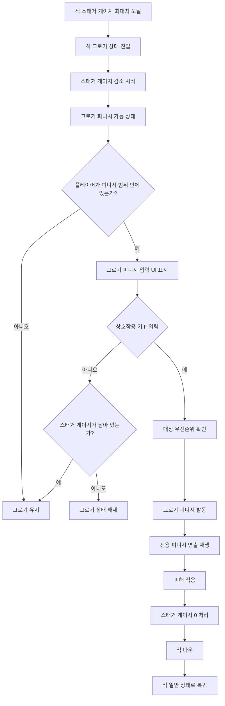

# 그로기 피니시 시스템 기획서

## 1. 개요

**그로기 피니시**는 스태거 게이지가 최대치에 도달해 **그로기 상태**가 된 적에게 사용할 수 있는 특수 공격이다.

플레이어가 그로기 상태의 적 근처에서 상호작용 키를 입력하면 강력한 전용 공격이 발동한다.  
그로기 피니시가 적중하면 적에게 큰 피해를 주고, 해당 적은 **스태거 게이지가 전부 제거된 뒤 다운**된다.

즉, 그로기 피니시는 단순한 추가 공격이 아니라 **그로기 상태를 소비하는 강력한 마무리 공격**이다.

---

## 2. 시스템 목적

| 목적 | 설명 |
|---|---|
| 그로기 보상 강화 | 스태거를 끝까지 쌓은 결과로 강력한 보상 공격을 제공한다. |
| 전투 리듬 정리 | 그로기 상태의 종료 시점을 플레이어가 능동적으로 결정할 수 있게 한다. |
| 숙련도 차이 제공 | 초보자는 바로 사용하고, 숙련자는 그로기 중 최대한 딜을 넣은 뒤 마지막에 사용할 수 있다. |
| 연출 보상 제공 | 보스전에서 큰 타격감과 성취감을 주는 전용 연출을 제공한다. |

---

## 3. 기본 규칙

### 3.1 그로기 피니시는 그로기 상태에서만 사용할 수 있다

적이 스태거 게이지 최대치에 도달하면 그로기 상태에 진입한다.

그로기 상태 중에는 스태거 게이지가 시간에 따라 감소한다.  
스태거 게이지가 남아 있는 동안 플레이어는 적 근처에서 상호작용 키를 입력해 그로기 피니시를 사용할 수 있다.

```text
스태거 게이지 > 0
→ 그로기 피니시 사용 가능
```

---

### 3.2 그로기 피니시 사용 시 그로기 상태가 즉시 종료된다

그로기 피니시가 적중하면 적에게 큰 피해를 주고, 적의 스태거 게이지는 전부 제거된다.  
이후 적은 다운 상태가 되며, 다운 상태가 종료되면 일반 상태로 복귀한다.

```text
그로기 피니시 적중
→ 큰 피해 적용
→ 스태거 게이지 제거
→ 다운
→ 적 일반 상태로 복귀
```

---

### 3.3 스태거 게이지가 0이 되면 사용할 수 없다

플레이어가 그로기 피니시를 사용하지 않은 채 스태거 게이지가 모두 감소하면, 적은 자동으로 그로기 상태에서 해제된다.

이 경우 그로기 피니시는 사용할 수 없다.

```text
스태거 게이지 0
→ 그로기 상태 해제
→ 그로기 피니시 사용 불가
```

---

## 4. 의도된 플레이 흐름

그로기 피니시는 그로기 발생 직후 바로 사용할 수도 있고, 스태거 게이지가 감소하는 동안 다른 공격을 먼저 사용한 뒤 마지막에 사용할 수도 있다.

### 4.1 초보자 플레이

```text
그로기 발생
→ 바로 그로기 피니시 사용
→ 안정적인 큰 피해
```

초보자는 그로기 상태를 길게 활용하지 못해도, 그로기 피니시를 통해 확실한 보상을 받을 수 있다.

---

### 4.2 숙련자 플레이

```text
그로기 발생
→ 일반 공격 / 강공격 / 스킬 / 궁극기 사용
→ 스태거 게이지가 거의 소진되기 직전 그로기 피니시 사용
→ 최대 피해 확보
```

숙련자는 그로기 시간을 최대한 활용한 뒤, 마지막에 그로기 피니시를 사용해 더 높은 피해를 노릴 수 있다.

---

### 4.3 실패 상황

```text
그로기 발생
→ 공격을 더 넣으려다 시간이 지남
→ 스태거 게이지 0
→ 그로기 상태 해제
→ 그로기 피니시 기회 상실
```

플레이어가 욕심을 내면 그로기 피니시 사용 기회를 놓칠 수 있다.  
이를 통해 그로기 상태에서도 시간 관리와 판단을 요구한다.

---

## 5. 발동 조건

그로기 피니시는 아래 조건을 모두 만족할 때 발동할 수 있다.

| 조건 | 설명 |
|---|---|
| 대상이 그로기 상태 | 대상이 그로기 상태여야 한다. |
| 스태거 게이지가 남아 있음 | 대상의 스태거 게이지가 0보다 커야 한다. |
| 플레이어가 일정 거리 안에 있음 | 대상의 그로기 피니시 가능 범위 안에 있어야 한다. |
| 플레이어가 조작 가능 상태 | 사망, 피격, 강제 이동, 다른 강제 연출 중에는 사용할 수 없다. |
| 지정 키 입력 | `F` 상호작용 키를 입력한다. |

---

## 6. 대상 우선순위 규칙

그로기 피니시는 상호작용 키를 사용하는 액션이므로, 주변에 여러 대상이 있을 때 우선순위 규칙이 필요하다.

### 6.1 그로기 상태의 적이 다수 있을 경우

주위에 그로기 상태의 적이 여러 명 있을 경우, 상호작용 키 입력 시 **플레이어와 가장 가까운 그로기 상태의 적**을 대상으로 그로기 피니시가 발동한다.

```text
그로기 상태 적 A / B / C 존재
→ F 입력
→ 플레이어와 가장 가까운 적에게 그로기 피니시 발동
```

---

### 6.2 상호작용 오브젝트와 그로기 상태 적이 같이 있을 경우

주위에 아이템 습득, 장치 조작 등 상호작용 가능한 오브젝트와 그로기 상태의 적이 동시에 있을 경우, **그로기 피니시를 우선한다.**

```text
상호작용 오브젝트 + 그로기 상태 적 존재
→ F 입력
→ 그로기 피니시 우선 발동
```

이 규칙은 전투 중 플레이어가 그로기 피니시 기회를 놓치지 않도록 하기 위한 것이다.

---

## 7. 발동 흐름



---

## 8. 입력 방식

그로기 피니시는 상호작용 키 입력으로 처리한다.

추천 입력은 `F` 키이다.

| 키 | 용도 |
|---|---|
| `F` | 상호작용 / 그로기 피니시 |

그로기 피니시가 가능한 상태에서는 대상 근처에 UI를 표시한다.

```text
[F] 그로기 피니시
```

스태거 게이지가 얼마 남지 않은 경우에는 UI 점멸, 사운드, 이펙트 등으로 플레이어에게 시간이 얼마 남지 않았음을 알려줄 수 있다.

---

## 9. 위치 판정

플레이어가 그로기 상태의 적과 약 3m 이내에 있으면 그로기 피니시를 발동할 수 있다.

발동 시에는 연출이 자연스럽게 보이도록 플레이어와 적의 위치를 피니시 연출에 맞게 정렬한다.

### 9.1 추천 방식

```text
입력 조건은 널널하게,
연출 위치는 정해진 위치로 정렬한다.
```

| 항목 | 설명 |
|---|---|
| 발동 거리 | 대상 중심 기준 약 3m 이내 |
| 방향 조건 | 초기 버전에서는 정면 조건을 엄격하게 두지 않음 |
| 위치 정렬 | 발동 시 플레이어와 적을 피니시 연출에 맞게 정렬 |
| 보스 처리 | 보스는 전용 피니시 위치를 사용 |

---

## 10. 피해량

피해량은 임시 기준으로 공격력의 1500%로 설정한다.  
해당 수치는 추후 전투 밸런싱 과정에서 조정한다.

---

## 11. 캔슬 규칙

그로기 피니시는 강력한 보상 공격이자 전용 연출 공격이므로 기본적으로 캔슬 불가로 처리한다.

| 행동 | 가능 여부 |
|---|---|
| 회피 캔슬 | 불가 |
| 가드 캔슬 | 불가 |
| 약공격 캔슬 | 불가 |
| 강공격 캔슬 | 불가 |
| 스킬 캔슬 | 불가 |
| 궁극기 캔슬 | 불가 |

그로기 피니시 발동 중에는 다른 행동으로 전환할 수 없다.

---

## 12. 피격 처리

그로기 피니시는 보상 연출 성격이 강하므로, 발동 중에는 플레이어에게 **완전 무적**을 부여한다.

그로기 피니시 발동 중인 플레이어는 아래 요소에 모두 면역된다.

| 항목 | 처리 |
|---|---|
| 피해 | 받지 않음 |
| 경직 | 발생하지 않음 |
| 넉백 / 에어본 | 발생하지 않음 |
| 상태이상 | 적용되지 않음 |
| 잡기 | 적용되지 않음 |
| 강제 이동 | 적용되지 않음 |

이 규칙은 그로기 피니시가 전투 보상 연출로 안정적으로 작동하도록 하기 위한 것이다.

---

## 13. 최종 정리

그로기 피니시는 그로기 상태의 적에게 사용하는 강력한 마무리 공격이다.

플레이어는 그로기 상태 동안 일반 공격, 강공격, 스킬, 궁극기 등으로 추가 피해를 넣을 수 있다.  
그리고 스태거 게이지가 완전히 소진되기 전에 그로기 피니시를 사용하면 큰 피해를 주고 그로기 상태를 즉시 종료시킨다.

즉, 그로기 피니시는 다음과 같은 구조를 가진다.

```text
그로기 발생
→ 스태거 게이지 감소
→ 플레이어가 자유롭게 추가 공격
→ 종료 직전 그로기 피니시 사용 가능
→ 큰 피해
→ 스태거 게이지 제거
→ 적 다운
```

이 시스템의 핵심은 **그로기 상태를 얼마나 활용하고, 언제 피니시로 마무리할지 판단하게 만드는 것**이다.
