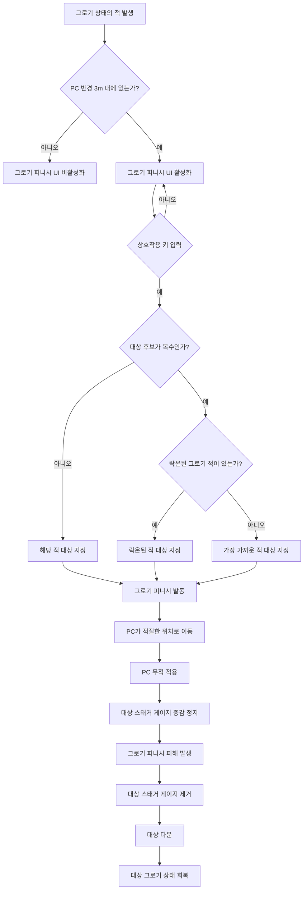

# 그로기 피니시 시스템 기획서

## 1. 그로기 피니시란?

그로기 피니시는 그로기 상태의 적에게 사용하는 강력한 공격이다.

그로기 피니시를 당한 적은 큰 피해를 입으며 다운되고, 스태거 게이지가 제거되어 그로기 상태에서 회복된다.

---

## 2. 레퍼런스 영상

[레퍼런스 영상](https://youtu.be/T9UKUzDkPNI?si=bgX5gTy07flMeBOm&t=2634)

---

## 3. 규칙

### 3.1 발동 전 조건

다른 GA를 발동하고 있지 않거나 GA발동 중에도 후딜레이 상태에서 반경 3m 내에 그로기 상태의 적이 있으면 그로기 피니시 UI가 활성화된다.

그로기 피니시 UI는 화면 6시 방향에 출력된다.  
이미지는 추후 추가한다.

UI가 활성화된 상태에서 상호작용 키(F)를 누르면 그로기 피니시가 발동된다.

3m 이내에 그로기 상태의 적이 복수 존재할 경우, 발동 대상은 아래 우선순위를 따른다.

1. 3m이내의 적
2. 락온된 적
3. 가장 가까운 적

주변에 아이템 습득 등 상호작용 가능한 오브젝트와 그로기 상태의 적이 함께 있을 경우, 그로기 피니시를 우선한다.

### 3.2 발동 중 규칙

1. 그로기 피니시를 발동하면 PC가 몬스터 근처로 이동, 위치가 조정된다.
2. 그로기 피니시가 발동되면 적의 스태거 게이지 증감이 멈춘다.
3. 그로기 피니시 발동 중 PC는 무적 상태가 된다.
4. 그로기 피니시의 피해 발생 후 적의 스태거 게이지가 전부 제거된다.
5. 그로기 피니시의 피해 발생 후 적은 다운된다.

---

## 4. 플로우 차트

---

## 5. 데이터

| 항목 | 내용 |
|---|---|
| 에셋 태그 | `Ability.GroggyFinish` |
| 태그 있는 능력 차단 | `Ability` |
| 활성화 차단된 태그 | `State.Dead` |

---

## 6. 예외 처리

1. 낭떠러지에서 발동할 경우 바닥 유무와 상관없이 그로기 피니시를 전부 발동한 후 중력 처리를 진행한다.
2. 그로기 피니시 발동 중 적이 도트 데미지 등으로 사망하는 경우에도 그로기 피니시 애니메이션은 모두 재생된다.
3. 좁은 길에서 그로기 피니시로 발동 후 다른 오브젝트에 PC와 적이 끼일 경우 발동 전 위치로 이동 시킨다.

