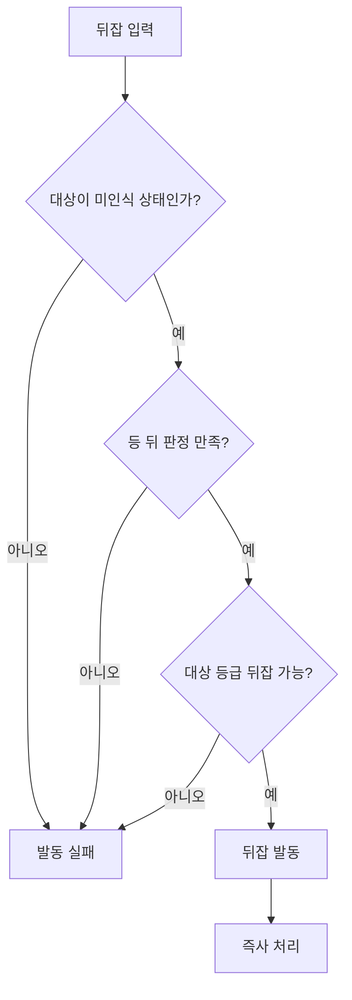

# 뒤잡 시스템 초안

## 1. 문서 목적

본 문서는 WX의 **뒤잡 시스템** 규칙을 정리하기 위한 초안이다.

뒤잡은 **적에게 인식되지 않은 상태에서 등 뒤로 접근해 발동하는 기습 공격**이며, 전투를 유리하게 시작하기 위한 *선택지*로 제공된다(핵심 루프가 아님).

본 문서에서는 **공통 뒤잡 규칙**만 다룬다. 대상별 가능 여부·구체적 수치는 개별 적 문서(적 규격서 등)에서 정의한다.

> 설계 기반: `Docs/8.레벨디자인 분석`의 「뒤잡 비교 분석」 — 핵심 원칙 = 뒤잡은 (1) 인지 모델, (2) 공간 어휘, (3) 페이싱 비용을 함께 설계해야 '치트'가 아닌 '선택'이 된다.

---

## 2. 용어 정의

| 용어 | 설명 |
|---|---|
| 뒤잡 | 미인식 상태의 적을 등 뒤에서 기습하는 공격 |
| 미인식 | 적이 플레이어를 인식하지 못한 상태 (인식 규칙은 `Nameplate_System` 계승) |
| 등 뒤 판정 | 뒤잡 발동을 위한 위치 조건 (각도·거리는 §3에서 정의) |
| 발각 | 뒤잡 시도 중/직전 적이 플레이어를 인식하게 되는 것 |

---

## 3. 발동 조건

두 조건을 **동시에(AND)** 만족할 때만 발동한다.

| 조건 | 규칙 |
|---|---|
| 위치 (등 뒤) | 적 기준 후방 150° 이내 · 거리 1M 이내 |
| 상태 (미인식) | 적이 플레이어를 인식하지 않은 상태 |

- **미인식 전용**이므로 뒤잡은 *전투가 시작되기 전에만* 가능하다. 전투 중(인식 상태)에는 발동하지 않는다.
- **입력**: 위 두 조건을 만족한 상태에서 **상호작용 키(F)** 로 발동한다. 상호작용 키를 공유하되, 두 조건을 만족하면 **뒤잡이 상호작용보다 우선**한다.

---

## 4. 대상 규칙

| 적 등급 | 뒤잡 가능 여부 | 발동 결과 |
|---|---|---|
| 일반 | 가능 | 즉사 |
| 엘리트 | 불가 | — |
| 보스 | 불가 | — |

---

## 5. 접근 보조 (잠입 어휘)

- 잠입 어휘 없이 단순히 대상의 뒤로 돌아가는 것으로 작동

---

## 6. 페이싱·밸런스

뒤잡이 정공법을 밀어내지 않도록 하는 장치.

- **발각 페널티(함정 축)는 두지 않는다.** 미인식 전용 발동이 전투 중 남용을 이미 막고, 적을 빼돌려 다시 미인식 상태로 만든 뒤의 재기습은 *의도된 보상*으로 허용한다.
- **실행 중 무적**: 뒤잡 발동부터 모션 종료까지 플레이어는 무적이다(군집 한복판에서 발동해도 다른 적의 난입에 끊기지 않음).
- 대상 등급 제한(§4) 외 별도 쿨다운·자원 비용은 두지 않는다(미인식 전용이라 남용 위험이 없음).

---

## 7. 발동 판정 시퀀스

---

## 8. 연출·피드백

- **뒤잡 가능 표시**: 등 뒤·미인식 조건이 충족되면 상호작용 프롬프트 **`F - 암살`** 을 표시한다(`Nameplate_System` 연계).
- **모션**: 등 뒤 기습 전용 모션 1종. 별도 카메라 연출은 없다.
- **결과 처리**: 모션이 끝나는 시점에 대상이 사망한다. 별도 타격 이펙트는 두지 않는다.
- 실패(조건 미충족) 시 별도 피드백은 없다.

---

## 9. 미해결·오픈 이슈

- 레벨디자인 배치 가이드(유도 배치)는 분량에 따라 `Docs/Leveldesign`로 분리 검토
