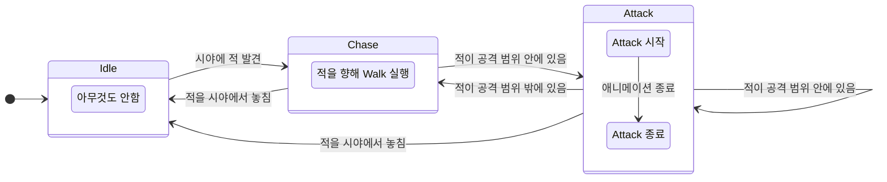
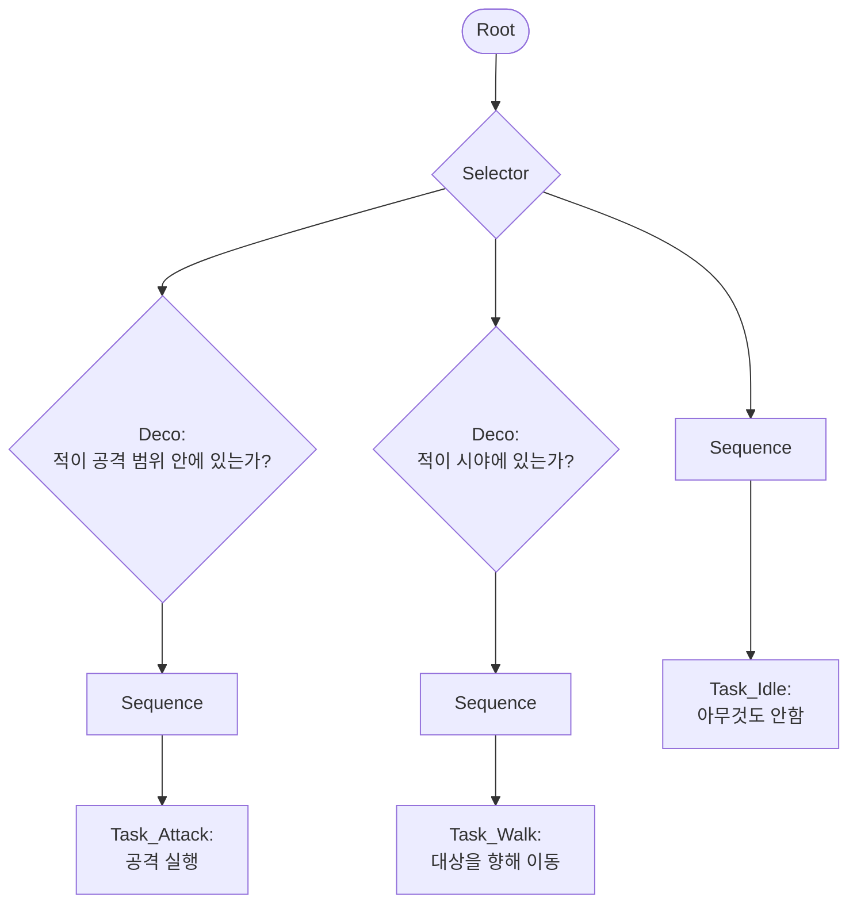

# State Machine, Behavior Tree, State Tree 비교 분석

State Machine(SM), Behavior Tree(BT), State Tree(ST) 의 핵심 개념을 정리하고, 각 방식의 장단점을 알아봅니다.

---

# 1. 기초 개념

## 1-1. 사용 목적

게임 개발에 있어서 SM, BT, ST는 주로 캐릭터나 물체의 상태에 맞는 동작을 제어하기 위해 사용됩니다.  

예를 들어, 적 캐릭터는 다음과 같은 다양한 동작을 취할 수 있을 것입니다.

> * Idle
> * Walk
> * Run
> * Jump
> * Attack
> * Hit
> * Dead
> (기타 등등...)

적 캐릭터가 취할 수 있는 동작의 개수는 무수히 많을 것인데, 적 AI가 상황에 맞는 동작을 취하게 하려면 규칙을 어떻게 정의해야할까요?

이러한 규칙을 정의하는데 사용되는 것이 바로 SM, BT, ST 입니다. 

---

# 2. 세부 설명
## 2-1. State Machine

State Machine은 대상이 현재 어떤 상태(State)인지를 중심으로 동작을 제어합니다.
State Machine에서는 캐릭터가 한 번에 하나의 상태를 가지며, 조건에 따라 다른 상태로 전환됩니다.

#### 개념
| 용어 | 설명 |
| -- | -- |
| State      | 대상의 현재 상태입니다. 하나의 상태만 보유할 수 있습니다. |
| Transition | 조건에 따라 상태를 다른 상태로 전환합니다. |

#### 예시
간단한 적 AI를 State Machine으로 만든다면 이렇게 구성할 수 있습니다



#### 장단점

| 구분 | 설명 |
| -- | -- |
| 장점 | 상태 흐름 이해가 직관적입니다. |
| 단점 | 상태가 많아지고 전환 조건이 복잡해지면 선이 얽혀서 관리가 어려워집니다.<br>(UE) ABP에서만 제한적으로 사용됩니다. |

## 2-2. Behavior Tree

적 AI의 의사결정 과정에 대한 우선순위 기반 트리 구조입니다.

#### 개념
| 용어        | 설명                                                          |
| ---------- | ------------------------------------------------------------- |
| Root       | Behavior Tree의 시작점. DFS* 탐색으로 자식 노드를 탐색합니다.  |
| Composite  | 노드의 분기점(branch). 어떤 자식 노드가 실행될지 흐름을 결정합니다. Sequence와 Selector가 있습니다. |
| Sequence   | 성공하면 다음 자식으로 가고, 실패하면 부모로 되돌아갑니다. 모든 자식이 성공해야 Sequence가 성공합니다. (AND 논리) |
| Selector   | 성공하면 부모로 되돌아가고, 실패하면 다음 자식으로 갑니다. 자식 중 하나라도 성공하면 Selector가 성공합니다. (OR 논리) |
| Task       | 노드의 끝점(leaf). 대상이 수행할 동작입니다. 지연(InProgress)될 수 있으며 끝날 시 성공(Success) 또는 실패(Failed)를 반환합니다. |
| Decorator  | 노드에 붙일 수 있는 조건. 진입 가능한지 판단(Condition)하거나, 실행 중인 브랜치를 중단(Abort)할 수 있습니다. |
| Service    | 해당 노드가 활성화된 동안 주기적으로 실행되어 데이터를 갱신합니다. |
| BlackBoard | BT가 판단하기 위해 필요한 데이터를 기록하는 공용 데이터 저장소입니다. |

*DFS: 깊이 우선 탐색(Depth-First Search). 갈림길에서 한 방향으로 가장 깊게 들어간 후, 막히면 이전 갈림길로 돌아와 다음 경로를 들어간다.

#### 예시



#### 장단점

| 구분 |설명 |
| -- | -- |
| 장점 | 복잡한 AI 의사결정 구조를 계층적으로 정리할 수 있습니다.<br>조건과 동작을 노드 단위로 분리할 수 있어 재사용성이 좋습니다.<br>(UE) 게임 개발 레퍼런스가 풍부하며, 에디터 디버거를 제공해줍니다. |
| 단점 | 초기 학습 진입 장벽이 있습니다.<br>현재 상태 단위의 동작을 명확하게 표현하는 데는 State Machine보다 직관성이 떨어집니다.<br>(UE) 캐릭터 AI 이외의 게임 로직에서 범용적으로 사용되지는 않는 편입니다. |

## 2-3. State Tree

State Tree는 State Machine과 Behavior Tree의 특징을 결합한 방식입니다.

State Machine처럼 대상의 현재 상태(State)를 중심으로 동작을 제어하지만, Behavior Tree처럼 상태를 트리 구조로 계층화할 수 있으며, 조건에 따라 적절한 하위 상태를 선택할 수 있습니다.

#### 개념

| 용어          | 설명                                                                        |
| ----------- | ------------------------------------------------------------------------- |
| State       | 대상의 현재 상태입니다. 트리 구조로 구성할 수 있으며, 상위/하위 상태를 통해 계층적으로 표현할 수 있습니다. |
| Task        | State가 활성화되었을 때 실행되는 동작입니다. 예를 들어 이동, 공격, 대기 등의 실제 행동을 수행합니다. |
| Transition  | 조건에 따라 다른 State로 전환합니다. State Machine의 Transition과 유사합니다. |
| Condition   | State에 진입할 수 있는지, 또는 Transition이 가능한지 판단하는 조건입니다. |
| Evaluator   | State Tree가 판단에 사용할 데이터를 갱신하거나 계산합니다. 예를 들어 타겟 거리, 시야 여부 등을 갱신할 수 있습니다. |
| Global Task | 특정 State에 종속되지 않고 State Tree 전체에서 실행되는 공통 작업입니다. |
| Parameter   | State Tree 외부에서 주입할 수 있는 입력값입니다. 같은 State Tree를 여러 대상이 재사용할 때 사용할 수 있습니다. |

#### 예시

적 AI를 State Tree로 만든다면 이렇게 구성할 수 있습니다.

```text
Root
├─ Alive
│  ├─ Transition: 체력이 0 이하 → Dead
│  │
│  ├─ Idle
│  │  ├─ Task: 아무것도 안함
│  │  └─ Transition: 시야에 적 발견 → Combat
│  │
│  └─ Combat
│     ├─ Condition: 시야에 적 발견
│     ├─ Transition: 적을 시야에서 놓침 → Idle
│     │
│     ├─ Chase
│     │  ├─ Task: 적을 향해 Walk 실행
│     │  └─ Transition: 적이 공격 범위 안에 있음 → Attack
│     │
│     └─ Attack
│        ├─ Condition: 적이 공격 범위 안에 있음
│        ├─ Task: Attack 실행
│        └─ Transition: 적이 공격 범위 밖에 있음 → Chase
│
└─ Dead
   └─ Task: Dead 처리
```

#### 장단점

| 구분 |설명 |
| -- | -- |
| 장점 | State Machine보다 복잡한 상태 구조를 계층적으로 정리하기 좋습니다.<br>Behavior Tree보다 현재 상태 중심의 흐름을 표현하기 쉽습니다.<br>(UE) AI뿐만 아니라 일반 게임플레이 로직에도 사용할 수 있는 범용성이 있습니다.<br>(UE) StateTree 에셋과 디버깅 도구를 제공해줍니다. |
| 단점 | State Machine보다 개념이 많아 초기 이해가 필요합니다.<br>(UE) Behavior Tree보다 축적된 예제나 레퍼런스가 상대적으로 적습니다. |

---

# 3. 마무리

SM, BT, ST는 모두 대상의 동작을 제어하기 위한 구조이지만, 바라보는 관점이 다릅니다.  
어떤 방식이 항상 더 좋다고 말하기보다는, 제어하려는 로직의 성격에 맞는 방식을 선택하는 것이 중요합니다.

#### 비교 분석 표

| 방식           | 로직 | 적합한 케이스 |
| ------------- | -- | -- |
| State Machine | “현재 어떤 상태인가?”에 따라 동작 실행 | 단순하고 직관적인 상태 흐름 |
| Behavior Tree | “지금 무엇을 우선적으로 할 것인가?”를 우선순위 기반의 트리 탐색으로 판단 | 복잡한 AI 의사결정 |
| State Tree    | State Machine 구조와 Behavior Tree의 구조를 결합 | 계층적인 상태 표현이나 범용 게임플레이 로직 |

---

### 참고 문헌

* 언리얼 도큐먼트 - 스테이트 머신
https://dev.epicgames.com/documentation/unreal-engine/state-machines-in-unreal-engine

* 언리얼 도큐먼트 - 비헤이비어 트리
https://dev.epicgames.com/documentation/unreal-engine/behavior-trees-in-unreal-engine

* 언리얼 도큐먼트 - 스테이트 트리
https://dev.epicgames.com/documentation/unreal-engine/state-tree-in-unreal-engine