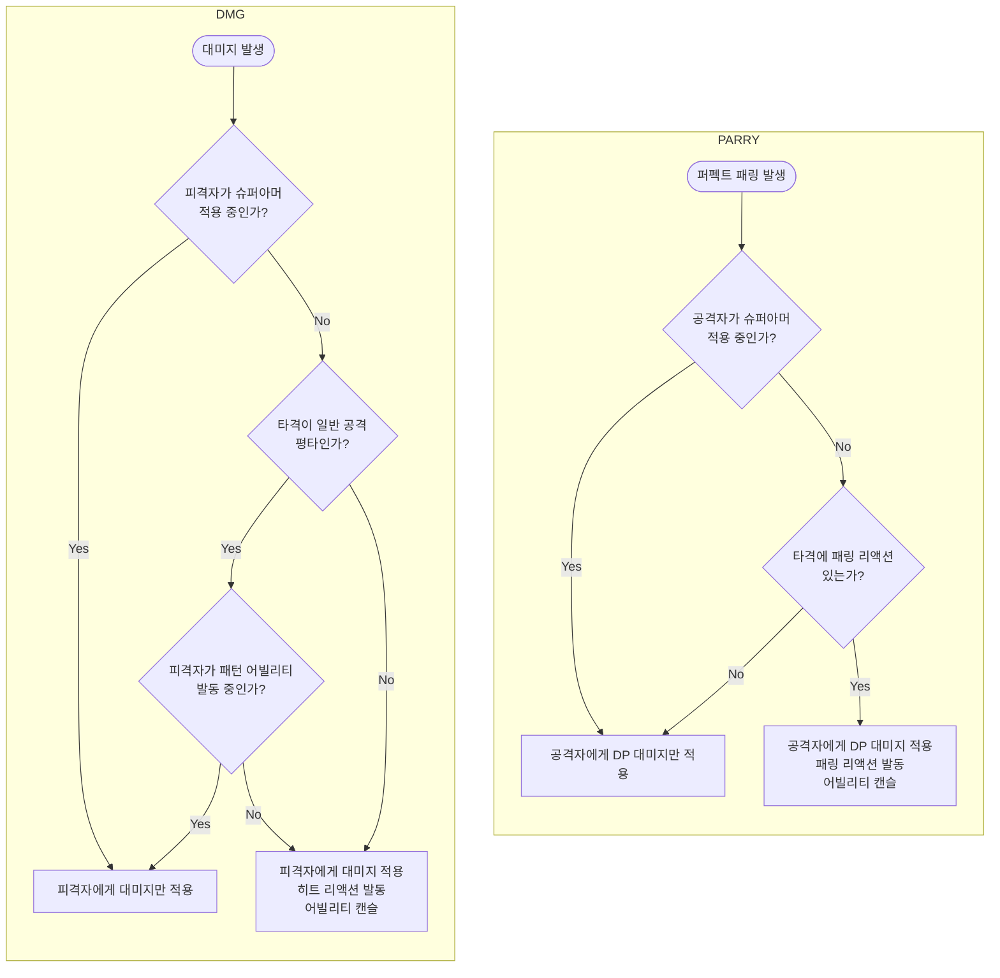

# 히트리액션(피격 경직) 관련 피드백 2차

* 관련 문서
  * https://github.com/Woogl/ProjectWx/blob/main/Docs/CombatDesign/CombatCommon/%EC%BA%90%EB%A6%AD%ED%84%B0_%EA%B2%BD%EC%A7%81.md

> **📝 종합 의견**  
> 독자에게 고통을 주는 문서입니다.  
> 지나치게 많은 항목으로 쪼개어져 있으며, 앞에서 이미 설명했던 것을 반복 재정의하며, 다이어그램을 파편화해서 그리고, 틀린 개념도 포함되어 있습니다.

# 🕵️ 문제점 지적

## 문제점 1. 목차 구성

* 총 7부/26개의 목차로 매우 거대하게 구성되어 있습니다. 지나치게 내용이 길어서 핵심 규칙을 찾기 힘듭니다.

* 경직 시스템은 PC와 적을 다른 규칙으로 나누지 않는다고 설명해놓고서는(목차 3), 정작 본문에서는 PC 항목과 적 항목을 별도로 나누어 설명하여 헷갈림을 유발합니다.

* 목차 인덴팅 규칙이 일관되지 않습니다.
  * 예: "경직 면역 상태"를 설명할 때 PC 항목에서는 소목차인 6.3을 사용했지만, 적 항목에서는 대목차인 15를 사용.

## 문제점 2. 내용 중복

* 앞에서 이미 설명한 내용을 잠시 후에 다시 재정의하거나, 조금씩 다르게 설명하여 독자에게 피로감과 혼동을 줍니다.

| 반복 항목 | 등장 횟수 | 비고 |
|---|---:|---|
| "일반 상태" 정의 | 8회 | 1·2·6·9·12·13·25·26 목차 |
| `PC는 패턴 상태를 사용하지 않는다.` | 4회 | 3·7·8·25 목차에 거의 동일 문장 |
| "스킬·궁극기·극한 회피·가드·패링" 5개 예외 나열 | 5회 | 표현만 미세 변경 |
| "0.5초" 수치 | 8회 | 고정할 필요도 없고, 중요한 내용도 아님 |
| "PC 스킬로 패턴 캔슬" | 7회 | |
| "필살기·페이즈 전환·보스 핵심 패턴 = 경직 면역" | 6회 | |

## 문제점 3. 내용 오류

* "상태" 관련
  * 문서에 "상태" 라는 단어가 **총 208번** 등장합니다.
  * 하지만 "상태"에 대한 개념 정의가 우리 게임 구조와 맞지 않습니다. (슈퍼아머는 ANS이며, 패턴 어빌리티는 GA)
  * 심지어 문서 중간부터는 "가드 상태", "패링 상태", "극한 회피 상태" 라는 개념도 등장합니다.
  * 따라서 `PC는 2개, 적은 3개의 상태만 사용한다` 라는 서술 자체에 모순이 있다는 것을 독자가 감지하게 됩니다.
  * 결국 "상태"가 무엇을 의미하는지 아무도 이해할 수 없습니다.
  * 이는 본 문서의 가장 치명적인 결함으로, 문서의 설명 기준이 모호한 "상태"라는 것에 얽매여 설명이 모호하고 복잡해졌습니다.
  
* "경직 우선순위" 관련
  * 한 데미지 이벤트에 대한 분기 순서는 흐름도로 표현해야 할 내용이며, 별도 우선순위 표(21장)는 흐름도와 이중화되어 있습니다.
  * 우선순위 표의 각 항목이 같은 축에 있지도 않습니다. 회피 무적·슈퍼아머는 데미지 차단 여부, 가드불가는 공격 측 속성, 패링/가드는 방어 측 입력 결과로, 한 표에 늘어놓을 수 없는 항목들입니다.
  * 애초에 "우선순위"라는 표현 자체가 부적절합니다. 대미지 프로세스는 동기적(Synchronous)으로 실행되므로 경직 판정이 동시에 다중으로 발생하지도 않기 때문입니다. 

* "패턴 캔슬 여부" 관련
  * `히트 리액션은 발생할 수 있지만 패턴 캔슬은 발생하지 않는다.` 는 저와 논의한 결론과 반대되는 서술이며, 우리 게임의 애니메이팅 어빌리티의 구조와 안맞습니다.
  * 히트리액션 애니메이션이 재생되면 직전의 애니메이션 몽타주가 캔슬되므로, 직전의 애니메이팅 어빌리티도 함께 캔슬됩니다.
  * 우리 게임의 일반 히트 리액션 애니메이션은 Additive 방식으로 재생되지 않으며, ABP Slot 단위의 애니메이션 재생도 사용하지 않고 있습니다.

* "경직 종류" 관련
  * 16장 표의 분류 축이 두 가지로 뒤섞여 있습니다.
    * 발생 원인 축: 일반 히트 리액션 / 스킬 경직 / 패링 경직 / 특수 히트 리액션
    * 결과 모션 축: 넉백 / 넉다운 / 넉업
  * 두 축을 한 표에 늘어놓으면 "스킬 경직을 작업하라" 는 지시를 받은 작업자가 어떤 애니메이션을 만들어야 하는지 알 수 없습니다.

## 문제점 4. 다이어그램 오남용

* 1개의 통합 다이어그램으로 설명 가능한 부분을, 5개의 다이어그램으로 쪼개어놓았습니다.

* 다이어그램이 하나의 부에 모여 있는 것도 아닐 뿐더러, 이곳 저곳에 파편화되어 있어서 한눈에 파악할 수 없고, 다이어그램의 내용끼리 중복되기도 합니다.

* 다이어그램에 포함된 질의에 일관성이 없습니다. 같은 규칙을 말만 바꿔서 다르게 설명하고 있는 것인지, 아니면 진짜로 규칙을 다르게 처리해야할 필요가 있는 부분인지 파악하기 어렵습니다.
  * 회피 무적 상태인가? (11)
  * 경직 면역 상태인가? (11)
  * 대상이 경직 면역 상태인가? (17)
  * 대상이 적인가? (18)
  * 대상이 경직 면역 상태인가? (18)
  * 대상이 패턴 상태인가? (18)
  * 방어자 패링 성공? (19)
  * 대상이 회피 무적 상태인가? (20)
  * 대상이 경직 면역 상태인가? (20)

---

# 🧑‍🏫 개선 방안 제안

## 개선 방안 1. 목차 재구성

제가 예시를 드리겠습니다. 그대로 쓰셔도 되고, 수정해서 쓰셔도 됩니다.

```markdown
# 1. 경직 시스템이란?
 - 정의
 - 본 문서의 범위

# 2. 흐름도
 - 통합 다이어그램 (1, 2개)

# 3. 예시
 - 각 어빌리티와 대미지에 대한 데이터 예시 1개씩만 작성

## 3-1. PC
### 3-1-1. 평타
### 3-1-2. 스킬
### 3-1-3. 궁극기

## 3-2. 적
### 3-2-1. 평범한 패턴
### 3-2-2. 캔슬되면 안되는 특수 패턴
 ```

## 개선 방안 2. 내용 중복

* 위 목차를 참고하여 작성하시면 중복되는 내용이 없을 것입니다.

## 개선 방안 3. 오개념 제거

"상태"라는 개념은 모두 제거 바랍니다.
* 패턴은 어빌리티(GA)이며, 경직 면역은 슈퍼아머(ANS)입니다.
* 근본적으로 서로 다른 개념을 무리하게 신규 개념으로 묶으려고 시도할 필요가 없습니다.
 
"상태" 개념 없이도, 이하 다이어그램의 몇가지 질문으로 분류 가능합니다.

## 개선 방안 4. 통합 다이어그램 사용

다이어그램은 글 전체 내용을 한눈에 파악할 수 있게 하는데 목적이 있습니다.

우리 게임은 PC와 적의 데미지 파이프라인 및 경직 규칙이 똑같기 때문에 통합 설명 가능합니다.

예시 다이어그램 공유드립니다.


