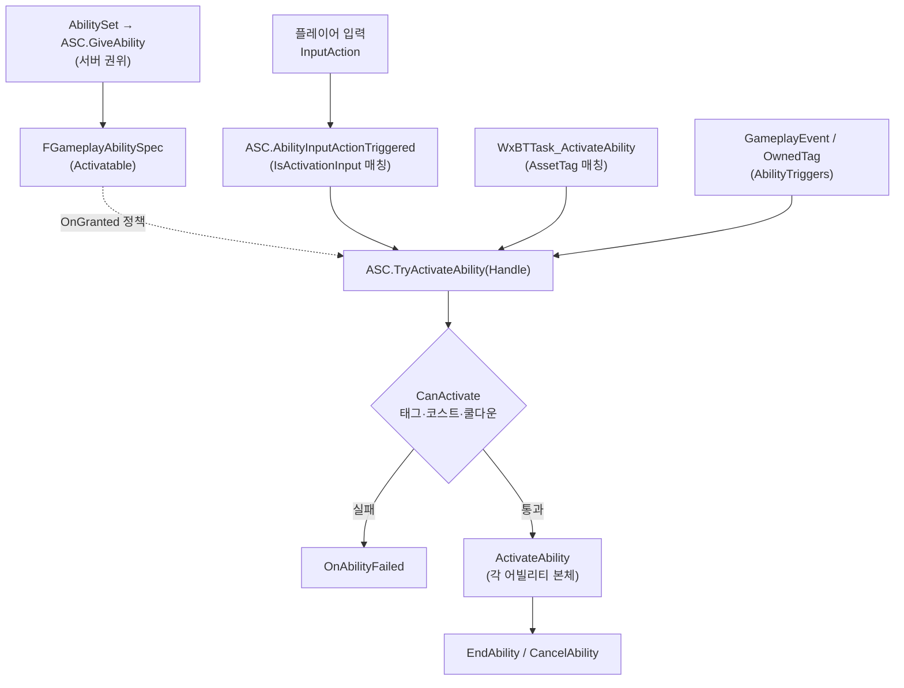

# Ability System — 어빌리티 발동(Activation) 흐름

어빌리티가 어떻게 부여(grant)되고, 어떤 트리거로 활성화(activate)되며, 활성화 시 어떤 공통 파이프라인(코스트/쿨다운/태그/네트워크)을 거쳐 EndAbility까지 가는지의 전체 경로를 다룬다.

---

## 한 문장 요약

> 모든 어빌리티는 `UWxAbilityBase`(GAS `UGameplayAbility` 파생)이며, `UWxAbilitySet`을 통해 **서버 권위**로 ASC에 일괄 부여된 뒤, 세 종류의 트리거 중 하나로 `TryActivateAbility`되어 `UWxAbilityBase`가 강제하는 공통 코스트/쿨다운/태그 파이프라인 위에서 실행된다.

이 시스템을 가르는 두 축:

- **활성화 트리거** — ① 플레이어 입력(InputAction 라우팅) / ② AI BehaviorTree(AssetTag 매칭) / ③ 게임플레이 이벤트·태그 반응(`AbilityTriggers`)
- **부여 시점 정책 (`EWxAbilityActivationPolicy`)** — `OnTriggered`(트리거 대기: 입력·이벤트·AI) / `OnGranted`(부여 즉시 자동 활성화, 패시브용)

---

## 전체 그림

부여는 한 경로(AbilitySet → ASC), 활성화는 세 트리거가 모두 ASC의 `TryActivateAbility`로 수렴한 뒤 `UWxAbilityBase`의 공통 파이프라인을 탄다.

---

## 부여(Grant) — 모듈과 권위

- ASC(`UWxAbilitySystemComponent`)와 AttributeSet은 **`AWxCharacterBase`가 직접 소유**(`CreateDefaultSubobject`). PlayerState를 쓰지 않는다(리스폰 시 스탯 재초기화 전제).
- 부여는 `AWxCharacterBase::InitAbilitySystem()`에서 일어난다. 서버는 `PossessedBy`에서, 클라이언트는 `OnRep_PlayerState`(플레이어) 경로로 호출한다. 실제 `GiveAbility`는 `if (HasAuthority())` 안에서만 실행되고 클라이언트에는 복제된다 — **부여는 서버 권위**.
- `UWxAbilitySet`(EditDefaultsOnly로 BP에 지정한 `UPrimaryDataAsset`)이 단일 출처다. `GiveToAbilitySystem()`이 ① AttributeInitRow로 어트리뷰트 초기값 세팅, ② `GrantedEffects` 적용, ③ `GrantedAbilities` 부여를 한다.
- **입력 라우팅 키**: 라우팅 키는 어빌리티 CDO의 `UWxAbilityBase::ActivationInputAction`이 보유한다(부여 시 별도 등록 없음 — CDO 디폴트라 서버·클라 양쪽에 존재). ASC는 이 `ActivationInputAction`을 `IsActivationInput`으로 대조한다. 입력으로 발동하지 않는 어빌리티(AI 패턴, 반응형)는 `ActivationInputAction`을 비워둔다.
- `OnGiveAbility`(Base 오버라이드)에서 `ActivationPolicy == OnGranted`이면 그 자리에서 `TryActivateAbility`를 호출한다. 쿨다운/코스트 수치는 `AbilityDataRow`에서 필요 시점에 온디맨드로 읽으므로 부여 시 별도 복사가 없다.

---

## 트리거 3종 — 활성화 진입점

세 경로 모두 최종적으로 엔진 `UAbilitySystemComponent::TryActivateAbility(Handle)`로 수렴한다. 차이는 "어떤 Spec을 고르느냐"의 매칭 키다.

| 트리거 | 진입 함수 | Spec 매칭 키 | 모듈 |
| --- | --- | --- | --- |
| **플레이어 입력** | `UWxAbilitySystemComponent::AbilityInputActionTriggered` | `IsActivationInput` 매칭 (활성 어빌리티의 관찰 입력은 `OnInputActionTriggered` 방송 구독) | WxGame→WxCombat |
| **AI BehaviorTree** | `UWxBTTask_ActivateAbility::ExecuteTask` | `Spec.Ability->GetAssetTags().HasTag(AbilityTag)` | WxAI(엔진 경유) |
| **이벤트·태그 반응** | 엔진 내부(`AbilityTriggers`) | `GameplayEvent` 태그 / `OwnedTagPresent` | WxCombat |

### ① 플레이어 입력 (InputAction 라우팅)

체인: 바인딩할 InputAction 목록은 `AWxPlayerCharacter::SetupPlayerInputComponent`가 `UWxAbilitySystemComponent::GetAbilityInputActions`로 파생한다(ASC→`AbilitySet`→부여 대상 어빌리티 CDO의 `GetInputActions`, 발동 IA는 어빌리티 CDO가 단일 원천으로 보유). → Enhanced Input의 `Started`/`Triggered`/`Completed`를 `AbilityInputStarted/Triggered/Released(const UInputAction*)`에 바인딩(액션을 payload로) → ASC의 같은 이름 진입점.

`Started`는 최근 입력 기록과 입력 대기 방송만 맡는다. 어빌리티 라우팅은 `AbilityInputActionTriggered`가 전담한다 — `Pressed` 트리거는 두 이벤트가 같은 프레임에 들어오므로(엔진이 `None → Triggered` 전이에서 `Started`도 함께 발화한다), 라우팅을 양쪽에 두면 한 번의 입력이 두 번 처리된다.

`AbilityInputActionStarted`:
1. `SetLastPressedInputAction(Action)` — Attack 콤보의 L/H 판별 등이 참조할 "마지막 눌린 액션"을 저장(클라면 Server RPC로 동기화).
2. `OnInputActionTriggered.Broadcast(Action)` — 활성 어빌리티의 입력 대기 태스크에 눌린 액션을 방송한다. 반격 윈도우는 새로 누른 입력에만 반응해야 하므로 조건 충족(`Triggered`)이 아니라 누름(`Started`)이 옳다.

`AbilityInputActionTriggered` — 라우팅의 유일한 진입점:
1. `GetActivatableAbilities()` 순회 → `IsActivationInput(Action)` 매칭(자기 발동 입력만).
2. **이미 돌고 있으면서 이미 눌려 있던** spec은 건너뛴다. 홀드형 트리거가 눌려 있는 동안 매 프레임 내는 반복분이며, 이걸 넘기면 가드가 매 프레임 재발동된다(`Spec.InputPressed`는 릴리즈 진입점이 `false`로 되돌린다). 아직 발동하지 못한 spec은 반복분도 받아, 차단이 풀리는 순간 쥐고 있던 입력이 발동한다.
3. `TryActivateAbility(Spec.Handle)` 성공 시 `break`. **신규 발동과 콤보 재발동은 같은 호출**이다 — 엔진이 `bRetriggerInstancedAbility`로 가른다.
4. 실패했는데 여전히 활성이면 → 재발동을 받지 않는 어빌리티다. `AbilitySpecInputPressed` + `InvokeReplicatedEvent(InputPressed)`로 활성 인스턴스에 입력을 넘긴다(락온 토글 해제, 패링 중 가드 복귀).

> 가드/회피의 반격처럼 활성 중 자기 발동 입력이 아닌 입력을 감지하려면, 어빌리티가 `UWxAbilityTask_WaitInputActionTriggered`를 띄운다. 이 태스크는 ASC의 `OnInputActionTriggered` 방송을 구독해 지정 InputAction과 일치할 때만 반응한다(`IsLocallyControlled()` 게이트). 라우팅 판정을 어빌리티에 두지 않고 감지를 태스크가 자기완결한다.

### ② AI BehaviorTree

`UWxBTTask_ActivateAbility`는 **WxCombat에 의존하지 않는다**(WxAI.Build.cs는 `GameplayAbilities` + `WxCore`만 참조). Pawn에서 `UAbilitySystemBlueprintLibrary::GetAbilitySystemComponent`로 엔진 ASC를 얻고, `GetActivatableAbilities()`에서 `Ability->GetAssetTags().HasTag(AbilityTag)`로 매칭해 `TryActivateAbility`한다. AI 패턴 어빌리티는 입력 액션을 안 쓰므로 **AssetTag**가 매칭 키다.

엣지 케이스 두 가지가 코드에 명시돼 있다: (a) `TryActivateAbility`가 동기적으로 끝나버리면(예: CommitAbility 실패) `Spec->IsActive()`가 false → 즉시 `Failed` 반환해 BT 영구 정지를 회피. (b) 종료 콜백은 `ASC->OnAbilityEnded`를 구독해 `bWasCancelled`로 `Succeeded`/`Failed`를 결정. `AbortTask`는 델리게이트를 먼저 떼고 `CancelAbilities(&Tags)`.

### ③ 게임플레이 이벤트·태그 반응

반응형 어빌리티는 생성자에서 `AbilityTriggers`를 등록해 입력 없이 활성화된다.

- **`GameplayEvent`** (`WxAbility_HitReact`): 데미지 계산(`WxExecCalc_Damage`)이 `Event.HitReact.*` 이벤트를 대상에게 보내면, 매칭 트리거가 `TryActivateAbility`를 발화하고 `TriggerEventData`로 페이로드를 전달. HitReact는 부모 태그 `Event.HitReact` 하나만 등록한다 — ASC가 이벤트 태그의 부모 체인을 거슬러 트리거를 조회하므로 자식 종류가 전부 걸린다.
- **`GameplayEvent`** (`WxAbility_Death`, `WxAbility_Groggy`): `WxCombatAttributeSet`이 HP==0에서 `Event.Death`를, DP==MaxDP에서 `Event.Groggy`를 송출한다. 두 어빌리티의 활성 태그(`Ability.Death`/`Ability.Groggy`)가 곧 사망·그로기 상태이며, 재송출을 막는 가드도 그 태그를 본다.

---

## 공통 파이프라인 — `UWxAbilityBase`가 강제하는 것

활성화 게이트와 커밋은 엔진 GAS가 돌리되, Base가 코스트/쿨다운 구현을 갈아끼운다.

**1. 활성화 게이트 (`CanActivateAbility`, 엔진)** — Spec/태그/`CanActivate` 조건을 본다. Base는 다음 태그 컨테이너로 거른다(각 구체 어빌리티 생성자에서 설정):
- `ActivationBlockedTags` — 이 태그가 소유돼 있으면 활성화 거부. 거의 모든 어빌리티가 `Ability.Death`를 넣는다.
- `ActivationOwnedTags` — 활성 동안 소유자에게 부여되는 태그. **모든 어빌리티가 자기 식별 태그(`Ability.X`)를 여기 넣는다** — 곧 「`Ability.X`가 소유돼 있다 = 그 어빌리티가 지금 돌고 있다」가 성립한다. 분류 마커 `Ability.Exclusive`는 넣지 않는다(후딜 진입이 차단만 풀고 이 컨테이너는 `EndAbility`까지 남아 두 진실이 어긋난다). 조건 태그는 여기 넣지 않는다 — 활성 구간에 묶이는 조건은 아래 `ActivationOwnedEffects`가 GE로 발행한다.
- `ActivationOwnedEffects` — 활성 동안 소유자에게 유지되는 GE 목록. Base가 `ActivateAbility`에서 걸고 `EndAbility`에서 걷으므로 구체 어빌리티는 클래스만 나열한다. 가드(`Effect.Guard`)·궁극(`Effect.SuperArmor`)·처형(`Effect.Invincible`)이 쓴다. 제거는 부여 태그가 아니라 GE 정의로 조회하므로 같은 태그를 발행하는 다른 GE를 건드리지 않는다(같은 GE를 구간 길이로 건 노티파이 인스턴스는 함께 걷히지만, 자기 연출의 잔여 구간을 정리하는 방향이라 무해하다). 구간 도중에 조건만 먼저 떼야 하면 `RemoveActivationOwnedEffect()`를 쓴다(가드 브레이크가 유일한 사례 — 브레이크 연출은 완주해야 하므로 어빌리티는 살려 두고 방어 판정만 걷는다).
- `BlockAbilitiesWithTag` / `CancelAbilitiesWithTag` — 활성 동안 다른 어빌리티를 하드 차단/캔슬. **기본은 `Ability.Exclusive` 하나만 지목한다.** 이 태그는 「액션 슬롯을 점유한다」는 표식이고, 붙은 어빌리티끼리만 서로 막고 끊으므로 어빌리티가 서로를 이름으로 지목하지 않는다. 공격·스킬·회피·가드·궁극·아이템·스프린트·상호작용·AI 패턴이 표식을 갖고, 반응·상태형(피격·그로기·사망·처형·락온)은 갖지 않아 무엇에도 막히거나 끊기지 않는다. 루트 `Ability`는 식별 태그의 부모일 뿐 차단·캔슬에 쓰이지 않는다. **예외는 피격의 캔슬 하나뿐이다** — 마커로 끊으면 마커를 가진 적 패턴이 평타 피격에 중단되므로, 피격만 `Ability.Attack`\`Ability.Skill`을 좁게 지목해 플레이어 액션만 끊는다(차단은 마커 그대로). 캐릭터별 차이는 규칙의 예외가 아니라 BP 데이터로 표현한다 — `GA_HitReact_Custer`는 두 컨테이너가 비어 있어 피격에도 패턴이 이어진다.

**2. 커밋 (`CommitAbility` → CheckCost/CheckCooldown → ApplyCost/ApplyCooldown)** — Base가 4개 함수를 모두 오버라이드한다. 핵심은 **공용 GE를 CDO 단위로 구분**하는 설계:
- 코스트: `AbilityDataRow`의 `MPCost`/`UPCost`로 공용 `UWxEffect_Cost`에 모디파이어를 채워 반환. `CheckCost`는 엔진 순정 사용. `ApplyCost`는 엔진이 GE의 `GetClass()` CDO로 스펙을 다시 만드는 탓에 인스턴스가 무시되므로, 인스턴스 Def로 직접 스펙을 만드는 얇은 오버라이드.
- 쿨다운: `AbilityDataRow`의 `CooldownTime`/`MaxRecharges`로 공용 `UWxEffect_Cooldown` 사용. 소스 어빌리티 CDO로 개별 쿨다운을 구분하고, 소모 충전 1개당 GE 1개를 적용해 자연 만료로 충전 회복(`QueryActiveCooldowns`). `Get...TimeRemaining`도 CDO 쿼리 기반으로 재구현(순정은 GrantedTags 기반이라 무태그 GE에서 0 반환).
- `CooldownGameplayEffectClass`/`CostGameplayEffectClass`의 기본값은 각 공용 GE(`UWxEffect_Cooldown`/`UWxEffect_Cost`)를 가리키는 **마커**다. 마커 그대로면 위 프로젝트 경로, 다른 GE로 바꾸면 그 어빌리티만 엔진 순정 GE 경로로 폴백(`if (HasCustomCooldownGE()) return Super::...`). 디테일 패널에서 프로젝트/커스텀 여부가 바로 읽힌다.

> 커밋은 각 구체 어빌리티의 `ActivateAbility`에서 명시 호출하는 패턴이다(예: `WxAbility_Attack`은 `if (!CommitAbility(...)) { EndAbility(...); return; }`). 실패 시 즉시 종료. 콤보는 단계마다 재발동되므로 단계마다 커밋이 새로 걸린다.

**3. 활성화 본체 (`ActivateAbility`)** — Base는 `ActivationOwnedEffects`를 걸고 엔진 순정 구현(BP 이벤트 포함)으로 넘긴다. 구체 어빌리티가 그 위에 몽타주 재생/입력 대기/이벤트 구독을 얹는다. 크기를 스펙에 실어야 하는 GE는 클래스 목록으로 표현할 수 없으므로 그 어빌리티가 직접 적용·제거한다(스프린트의 이동 속도 배율·SP 소모).

**4. 네트워크** — Base 생성자: `InstancingPolicy = InstancedPerActor`, `NetExecutionPolicy = LocalPredicted`(입력형). 반응형(`WxAbility_HitReact/Death/Groggy`)은 생성자에서 `ServerInitiated`로 덮어쓴다(서버가 권위적으로 발화). 플레이어 ASC는 `Mixed` 리플리케이션 모드.

**5. 종료 (`EndAbility` / `CancelAbility`)** — 엔진이 `ActivationOwnedTags` 제거, `BlockAbilitiesWithTag` 차단 해제를 자연 복원하고, Base가 `ActivationOwnedEffects`를 걷는다. 구체 어빌리티는 `EndAbility` 오버라이드에서 자기 태스크 정리. `StartRecovery()`(후딜=캔슬 가능 구간)는 자기가 건 `BlockAbilitiesWithTag`만 풀어 다른 어빌리티로 캔슬 진입을 허용하되, 비용/쿨다운/`ActivationBlockedTags`는 여전히 검사된다.

---

## 구체 어빌리티가 공통 위에서 더하는 것 (대표 예시)

| 어빌리티 | 트리거 | 공통 위에 더하는 핵심 |
| --- | --- | --- |
| `WxAbility_Attack` | 입력(AssetTag `Ability.Attack`) | 발동 시 아바타 태그로 콤보 세트 선택(`FWxComboMontageSelector`) → `ANS_ComboWindow` 입력 → EndAbility 후 **동일 Spec 재발동**(`Reactivate`)으로 세트 내 다음 인덱스. 단계마다 재커밋. `WxAbility_Skill`도 같은 선택기를 쓴다. |
| `WxAbility_Guard` | 입력(AssetTag `Ability.Guard`) | `ActiveMontage`로 페이즈 전환(가드/피격/브레이크/카운터). `InputReleased`/`InputPressed` 오버라이드, PerfectGuard 이벤트 구독. |
| `WxAbility_HitReact` | GameplayEvent `Event.HitReact.*` | 부모 태그 `Event.HitReact` 단일 등록으로 자식 전체 수신, 종류 분기는 페이로드의 리프 태그로. `bRetriggerInstancedAbility`로 재진입. 새 액션(`Ability.Exclusive`)은 차단하고, 진행 중인 것 중에서는 공격·스킬만 캔슬한다(적 패턴은 지목 밖이라 유지). 차단만으로는 부족한데, 공격·스킬의 콤보 재발동 분기가 `Super`를 타지 않아 차단 태그 검사를 건너뛰기 때문이다. |
| `WxAbility_Death` | Event `Event.Death` | 몽타주 유효 시 사망 포즈, 무효 시 지연 후 래그돌 — 서버가 `Event.Ragdoll` 루스 태그 발행(TagOnly 복제), 전 머신의 캐릭터가 감지해 자체 `EnterRagdoll` 수행. 액션 전체 차단. **연출이 끝나도 종료하지 않는다** — 활성 태그 `Ability.Death`가 곧 사망 상태다. |
| `WxAbility_Pattern` | AI BT(AssetTag) | 단일 몽타주 재생→종료. 입력/UI 미사용. 쿨다운/충전은 Base 프로퍼티로만. |

> WxGame 측 `UWxAbility_UseItem`/`UWxAbility_Interact`도 `UWxAbilityBase`를 상속해 동일 파이프라인을 탄다(WxGame→WxCombat 의존 방향 예시).

---

## 모듈 경계

플러그인 규칙: WxCore를 제외한 플러그인 간 참조 금지. 어빌리티 발동의 의존 방향은 단방향이다.

- **WxCombat (도메인)** — `UWxAbilityBase`(InputAction 보유), `UWxAbilitySystemComponent`, `UWxAbilitySet`, 입력 폴링 태스크, 모든 전투 어빌리티가 여기 산다. ASC·AbilitySet·InputAction 라우팅의 본거지.
- **WxGame (게임 모듈)** — `AWxCharacterBase`(ASC 소유), `AWxPlayerCharacter`(입력 바인딩), `UWxInputConfig`, WxGame 전용 어빌리티. WxCombat을 참조한다(게임 모듈 → 도메인, 허용 방향).
- **WxAI (도메인)** — WxCombat을 **참조하지 않는다**. 어빌리티 활성화를 엔진 GAS API(`UAbilitySystemBlueprintLibrary`, `UAbilitySystemComponent`)와 GameplayTag만으로 수행 — 도메인 간 직접 의존 회피.

---

## 데이터 / 설정

| 설정 | 위치 | 의미 |
| --- | --- | --- |
| `UWxAbilitySet` | 캐릭터 BP의 ASC `AbilitySet` 프로퍼티 | 부여할 어빌리티/이펙트/어트리뷰트 초기값 묶음 |
| `UWxAbilityBase.ActivationInputAction` | 어빌리티 BP (Wx/Input 카테고리) | 입력 라우팅 키(빈 값=비입력형). 어빌리티가 갖는 유일한 입력 필드다 |
| (바인딩할 어빌리티 InputAction 목록) | 별도 설정 없음 — `UWxAbilitySet::GetInputActions`가 AbilitySet의 어빌리티 CDO들에서 파생 | 위 두 설정(AbilitySet 구성 + 어빌리티 IA)만 채우면 자동 |
| `ActivationPolicy` | 어빌리티 BP(`Wx`) | `OnTriggered`/`OnGranted` |
| `CooldownTime`/`MaxRecharges`/`MPCost`/`UPCost` | `AbilityDataRow`가 가리키는 DataTable Row(`FWxAbilityTableRow`) | 커밋 수치. 어빌리티에 `AbilityDataRow`만 지정하면 이 Row에서 읽는다 |
| `AbilityTag` | `WxBTTask_ActivateAbility` 노드 | AI가 매칭할 AssetTag |

---

## 주의할 점

- **부여는 서버에서만.** `GiveAbility`는 `HasAuthority()` 게이트 안에 있다. 클라이언트는 복제 수신. 클라이언트 어빌리티 부재는 보통 ActorInfo/복제 타이밍 문제다.
- **AI는 AssetTag, 플레이어는 ActivationInputAction으로 매칭.** 같은 어빌리티라도 AI가 발동하려면 `SetAssetTags`로 AssetTag가, 플레이어가 발동하려면 어빌리티 CDO의 `ActivationInputAction`이 있어야 한다. 둘은 별개 키다.
- **`TryActivateAbility`가 동기 종료할 수 있다.** 커밋 실패 등으로 활성화 직후 EndAbility가 호출되면, 종료 델리게이트를 나중에 붙여도 콜백이 안 온다(`WxBTTask_ActivateAbility`의 `IsActive()` 가드 참고).
- **반응형은 `ServerInitiated`, 입력형은 `LocalPredicted`.** NetExecutionPolicy를 Base 기본값(LocalPredicted)으로 두면 반응형이 클라 예측으로 잘못 발화될 수 있다 — 반응형 생성자에서 반드시 덮어쓴다.
- **쿨다운/코스트는 공용 GE를 CDO로 구분.** `GetCooldownTimeRemaining` 등 순정 BP 노드를 그냥 쓰면 0이 나온다(무태그 GE라서). Base가 이미 CDO 쿼리로 재구현했으니 순정 API를 그대로 호출하면 된다.

---

### 참조 코드

| 타입 | 모듈 | 역할 |
| --- | --- | --- |
| `AWxCharacterBase` (`Source\WxGame\Character\WxCharacterBase.h/.cpp`) | WxGame | ASC 소유, `InitAbilitySystem`에서 서버 권위 부여 |
| `AWxPlayerCharacter` (`Source\WxGame\Character\WxPlayerCharacter.h/.cpp`) | WxGame | Enhanced Input → InputAction → ASC 라우팅 |
| `UWxInputConfig` (`Source\WxGame\Input\WxInputConfig.h`) | WxGame | IMC + 직접 바인딩 입력(이동/시선/점프 등) DA. 어빌리티 IA 목록은 보유 안 함 |
| `UWxAbilitySystemComponent` (`Plugins\WxCombat\Source\WxCombat\...\WxAbilitySystemComponent.h/.cpp`) | WxCombat | `GiveAbilitySet`, `CollectAbilityInputActions`, `AbilityInputActionTriggered/Released`, LastPressedInputAction |
| `UWxAbilitySet` (`Plugins\WxCombat\Source\WxCombat\...\WxAbilitySet.h/.cpp`) | WxCombat | 부여 묶음(`GrantedAbilities`는 어빌리티 클래스 배열, 입력 키는 어빌리티 CDO가 보유) |
| `UWxAbilityBase` (`Plugins\WxCombat\Source\WxCombat\...\Ability\WxAbilityBase.h/.cpp`) | WxCombat | 공통 베이스: 코스트/쿨다운/태그/ActivationPolicy |
| `FWxAbilityTableRow` (`Plugins\WxCombat\Source\WxCombat\...\Ability\WxAbilityTableRow.h`) | WxCombat | 쿨다운/코스트 밸런스 수치 DataTable Row |
| `UWxAbilityTask_WaitInputActionTriggered` (`Plugins\WxCombat\Source\WxCombat\...\Task\`) | WxCombat | 어빌리티 자기완결 입력 감지(ASC `OnInputActionTriggered` 구독, InputAction 필터) |
| `UWxAbility_Attack` / `_Guard` / `_HitReact` / `_Death` / `_Pattern` (`Plugins\WxCombat\Source\WxCombat\...\Ability\`) | WxCombat | 트리거 3종·공통 위 변주의 대표 예시 |
| `UWxBTTask_ActivateAbility` (`Plugins\WxAI\Source\WxAI\...\WxBTTask_ActivateAbility.h/.cpp`) | WxAI | AI 트리거: AssetTag 매칭 + 엔진 ASC 경유(WxCombat 무의존) |
| `UWxAbility_UseItem` / `_Interact` (`Source\WxGame\AbilitySystem\Ability\`) | WxGame | WxGame→WxCombat 의존 예시(Base 상속) |
