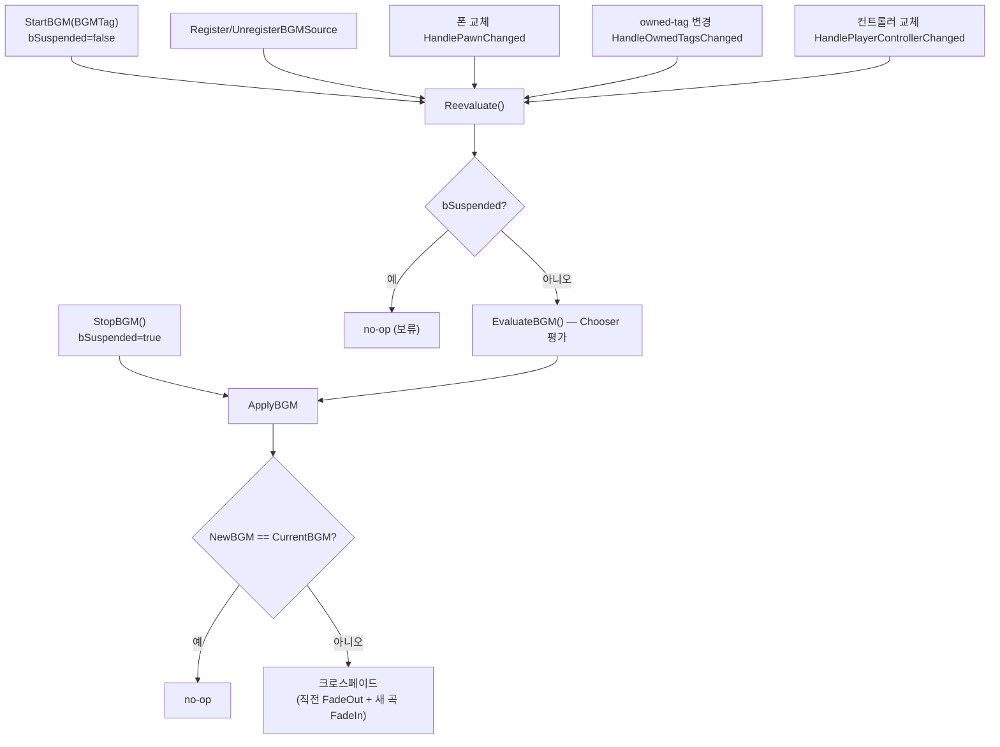
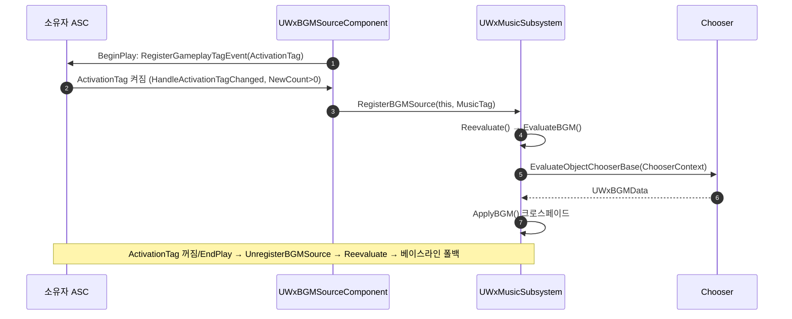

<!--
BGM 선택·재생 흐름 분석. 시드: WxSound 플러그인.
-->

# WxSound BGM 시스템 — 소스 등록부터 곡 선택·크로스페이드 재생까지

BGM 분류 태그·플레이어 상태를 입력으로 Chooser 테이블을 평가해 곡을 고르고, 곡이 바뀔 때만 크로스페이드로 재생하는 로컬 전용 파이프라인 전체를 추적한다.

---

## 한 문장 요약

> 게임/BP가 켠 BGM 분류 태그(`BGMTag`)와 로컬 플레이어 ASC의 owned-tag, 그리고 활성 상태 기반 소스가 기여한 `MusicTag`를 `FWxBGMChooserContext`에 채워 Chooser 테이블을 평가하고(`UWxBGMData` 반환), 선택 곡이 직전과 다를 때만 크로스페이드한다. 완전 로컬 전용 — 데디케이티드 서버에서는 no-op이고 로컬 플레이어의 상태만 읽는다.

이 시스템을 가르는 축.

- **분류 태그의 두 소스** — BP가 주입하는 베이스라인 `BGMTag`(폴백) / 상태 기반 소스가 기여하는 `MusicTag`(활성 소스가 있으면 승리). `GetTopSource`가 있으면 소스 쪽, 없으면 베이스라인.
- **무엇이 재평가를 트리거하나** — 완전 이벤트 구동. `StartBGM` 주입 · 소스 등록/해제 · 폰 교체 · 폰 ASC owned-tag 변경 · 컨트롤러 교체. 주기 폴링/타이머 없음.
- **선택 vs 적용** — `EvaluateBGM`(Chooser 평가로 곡 결정) / `ApplyBGM`(직전과 다르면 크로스페이드, 같으면 no-op).

---

## 전체 그림

모든 트리거는 `Reevaluate`로 수렴하고, 거기서 `EvaluateBGM → ApplyBGM` 두 단계로 갈린다. 유일한 예외는 `StopBGM`으로, `bSuspended`를 세운 뒤 `Reevaluate`를 거치지 않고 곧장 페이드아웃한다.

---

## 핵심 로직: Reevaluate → EvaluateBGM → ApplyBGM

세 함수 모두 `UWxMusicSubsystem`(WorldSubsystem)에 있다.

1. **`Reevaluate()` — 수렴점.** `bSuspended`면 즉시 반환(StopBGM 이후 보류). 아니면 `ApplyBGM(EvaluateBGM())` 한 줄. 모든 입력 이벤트 콜백이 마지막에 이 함수를 부른다.
2. **`EvaluateBGM()` — 컨텍스트 구성 + Chooser 평가.** 멤버 `ChooserContext`를 매번 새로 채운다. `Chooser`가 없으면 nullptr 반환.
   - `PlayerStateTags` ← `BoundASC`의 `GetOwnedGameplayTags` 스냅샷(로컬 폰 ASC).
   - 승자 소스 결정 `GetTopSource()`: 있으면 `BGMTag ← TopSource->MusicTag`, `SourceOwner ← TopSource->Owner`; 없으면 `BGMTag ← 베이스라인 BGMTag`, `SourceOwner ← nullptr`.
   - `UChooserFunctionLibrary::EvaluateObjectChooserBase(...)`에 `AddStructParam(ChooserContext)`로 전달, 결과를 `UWxBGMData`로 캐스팅.
3. **`ApplyBGM(NewBGM)` — 적용.** `NewBGM == CurrentBGM`이면 no-op. 다르면 남아있던 `PreviousComponent` 즉시 Stop(스택 방지) → `CurrentComponent`를 `CurrentBGM->FadeOutTime`으로 FadeOut하고 `PreviousComponent`로 이동 → `CurrentBGM = NewBGM` → `NewBGM->Sound`가 있으면 `SpawnSound2D` 후 `FadeIn(NewBGM->FadeInTime)`.

| 승자 판정 (`GetTopSource`) | 조건 | 컨텍스트 결과 |
| --- | --- | --- |
| **활성 소스 있음** | `ActiveSources` 뒤→앞으로 훑어 `Source.IsValid() && MusicTag.IsValid()`인 첫 항목 | `BGMTag`=소스 `MusicTag`, `SourceOwner`=소스 소유자 |
| **없음/전부 무효** | 유효 소스 없음 | `BGMTag`=BP 베이스라인, `SourceOwner`=nullptr |

> `GetTopSource`가 정하는 것은 "**어느 소스가 컨텍스트를 채우나**"(최근성)뿐이다. Chooser Row 간 **우선순위 해소는 테이블 Row 순서**가 담당한다. 무효/빈 `MusicTag`를 건너뛰는 이유는 빈 태그가 베이스라인 폴백을 덮어쓰지 않게 하기 위함이다.

---

## Chooser의 역할

`FWxBGMChooserContext`의 세 멤버가 Chooser 테이블 컬럼에 바인딩되고, Row를 위→아래로 평가해 **첫 매치가 이긴다(= Row 순서가 곧 우선순위)**. 결과 타입은 `UWxBGMData`.

| 컨텍스트 멤버 | 컬럼 타입 | 의미 |
| --- | --- | --- |
| `PlayerStateTags` | Gameplay Tag | 로컬 플레이어 ASC owned-tag 스냅샷 (`State.Dead`/`State.LockOn`/`State.Groggy` 등) |
| `BGMTag` | Gameplay Tag | 분류 키(탐험/전투/보스/마을 등). 승자 소스의 `MusicTag` 또는 BP 베이스라인 |
| `SourceOwner` | Object Class | 승자 소스의 소유자 액터 클래스로 필터(예: `AWxBossCharacter` → 보스곡). 소스 없으면 null |

멤버가 컬럼 바인딩 대상이 되려면 모두 `UPROPERTY`로 노출돼야 한다. 새 입력 키는 여기 멤버 추가 → `EvaluateBGM`에서 채움 → 컬럼 바인딩 순으로 확장한다.

---

## 소스 등록 → 재생 (시간순 협력)

`UWxBGMSourceComponent`는 보스 등 소유 액터에 붙어, 소유자 ASC의 `ActivationTag`(예: `State.InCombat`)가 켜지는 동안만 자신의 `MusicTag`를 서브시스템에 기여한다.

- **자기완결 활성 감지** — 컴포넌트가 `BeginPlay`에서 소유자 ASC를 `GetAbilitySystemComponent(GetOwner())`로 자동 해석하고 `ActivationTag` 이벤트를 구독한다. 캐릭터 코드 수정 없이, 전투 시스템이 이미 부여하는 태그를 재활용한다. 트리거는 오버랩/볼륨이 아니라 소유자 상태.
- **가드** — `NetMode == NM_DedicatedServer`거나 `ActivationTag`/`MusicTag`가 무효면 아무것도 등록하지 않는다(빈 `MusicTag`인 트래시 몹이 선택을 오염시키지 않게).
- **등록 갱신 = 최근화** — `RegisterBGMSource`는 같은 소스의 기존 항목을 먼저 제거 후 재삽입(`AddDefaulted_GetRef`)해 배열 뒤=최근으로 만든다. 소스가 컴포넌트면 그 소유자를 미리 해석해 `Request.Owner`에 담는다(Chooser의 Object Class 필터용).
- **해제/폴백** — `ActivationTag`가 꺼지거나 `EndPlay`면 `UnregisterBGMSource → Reevaluate`. 활성 소스가 사라지면 자동으로 베이스라인 `BGMTag`로 되돌아간다.

---

## 부트스트랩과 재바인딩 (늦은 스폰을 폴링 없이)

로컬 플레이어/PC/폰/ASC는 서브시스템 시작 시점에 아직 없을 수 있다. `OnWorldBeginPlay`가 델리게이트 체인을 걸어 이후 스폰을 이벤트로 잡는다.

1. **`OnWorldBeginPlay`** — 데디 서버면 반환. `DefaultBGMChooser`를 `LoadSynchronous`. 기존 로컬 플레이어마다 `HandleLocalPlayerAdded` 호출 + `OnLocalPlayerAddedEvent` 구독(앞으로 추가될 플레이어용).
2. **`HandleLocalPlayerAdded`** — 이미 PC가 있으면 `HandlePlayerControllerChanged` 즉시 호출 + `OnPlayerControllerChanged` 구독.
3. **`HandlePlayerControllerChanged`** — 이전 PC의 `OnPossessedPawnChanged` 해제 후 새 PC로 재바인딩(`BoundController` 갱신). 이미 물고 있는 폰이 있을 수 있어 `RebindAbilitySystem(PC->GetPawn())` 후 `Reevaluate`.
4. **`HandlePawnChanged`** — 폰 교체 시 `RebindAbilitySystem(NewPawn) → Reevaluate`.
5. **`RebindAbilitySystem`** — 새/옛 ASC가 같으면 no-op. 다르면 옛 ASC의 `RegisterGenericGameplayTagEvent` 구독 해제, 새 ASC에 `HandleOwnedTagsChanged` 구독, `BoundASC` 갱신. 이로써 owned-tag 변경이 곧 재평가를 부른다.

각 단계가 즉시 반영 + 이후 델리게이트 구독을 동시에 하는 패턴이라, 컴포넌트가 이미 있든 나중에 생기든 동일 경로로 흡수된다. `Deinitialize`가 이 모든 구독(`OnLocalPlayerAddedEvent`, 각 로컬 플레이어의 `OnPlayerControllerChanged`, `BoundController`의 `OnPossessedPawnChanged`, `BoundASC`의 generic tag 이벤트)을 해제하고 재생 컴포넌트를 Stop한다.

---

## 데이터 / 설정

| 설정 | 위치 | 의미 |
| --- | --- | --- |
| `DefaultBGMChooser` | Project Settings > Wx > *Wx Music Settings* (`UWxMusicSettings`) | 선택 테이블. Result Class=`UWxBGMData`, Parameter=`FWxBGMChooserContext` |
| `Sound` / `FadeInTime` / `FadeOutTime` | `UWxBGMData` 에셋 (Chooser Row 결과) | 트랙 사운드 + 곡별 페이드 길이(기본 2초). 루프는 Sound Cue/Wave에서 |
| `MusicTag` / `ActivationTag` | `UWxBGMSourceComponent` 인스턴스(EditAnywhere) | 기여할 분류 태그 / 감시할 소유자 상태 태그 |
| `BGMTag` | 런타임, BP `StartBGM(태그)` 주입 | 활성 소스 없을 때의 베이스라인 분류 |

---

## 주의할 점

- **StopBGM은 Reevaluate를 우회한다** — `bSuspended=true` 후 직접 `ApplyBGM(nullptr)`로 페이드아웃한다(보류 가드를 거치면 아무것도 안 되므로 우회). 보류 해제는 오직 `StartBGM`. 보류 중에는 소스 등록/폰 교체 등 다른 트리거가 와도 `Reevaluate`가 조기 반환한다.
- **크로스페이드 GC 보호** — 페이드아웃 중 곡은 `PreviousComponent`에 붙잡아 GC를 막는다. 연속 전환 시 남은 `PreviousComponent`는 다음 `ApplyBGM`에서 즉시 Stop해 스택을 방지한다.
- **상태 판정은 이 모듈의 책임이 아니다** — 전투/보스/지역 등은 별도 감지 배선 없이 플레이어 ASC의 owned-tag로만 읽는다. 새 상태를 BGM에 반영하려면 그 상태를 ASC에 GameplayTag로 부여하면 `PlayerStateTags`로 자동 유입되어 재평가까지 트리거된다. 태그 부여 주체는 `WxCombat` 등 도메인 모듈.
- **플러그인 의존 제약** — `WxSound`는 `WxCore` 외 다른 Wx 플러그인을 참조하지 않는다. 그래서 상태 감지를 특정 전투 시스템에 묶지 않고 플레이어/소유자 ASC의 GameplayTag(엔진 `GameplayAbilities`)만으로 다룬다. 이 설계가 `PlayerStateTags`(플레이어 ASC)와 소스 컴포넌트의 `ActivationTag`(소유자 ASC) 두 경로로 나뉜 근거다.

---

### 참조 코드

| 타입 | 모듈 | 역할 |
| --- | --- | --- |
| `UWxMusicLibrary` | `WxSound` | BP 진입점 `StartBGM`/`StopBGM`, 서브시스템으로 위임하는 thin wrapper |
| `UWxMusicSubsystem` | `WxSound` | 이벤트 수렴·선택·재생 엔진. `Reevaluate`/`EvaluateBGM`/`ApplyBGM`·델리게이트 체인 |
| `UWxBGMSourceComponent` | `WxSound` | 소유자 `ActivationTag` 감시 → `RegisterBGMSource`/`UnregisterBGMSource` |
| `FWxBGMChooserContext` | `WxSound` | Chooser 평가 입력 struct(`PlayerStateTags`/`BGMTag`/`SourceOwner`) |
| `FWxBGMSourceRequest` | `WxSound` | 활성 소스 등록 1건(Source/Owner/MusicTag). 배열 순서로 최근성 표현 |
| `UWxBGMData` | `WxSound` | BGM 트랙 정의 겸 Chooser 결과(`Sound`/`FadeInTime`/`FadeOutTime`) |
| `UWxMusicSettings` | `WxSound` | 프로젝트 설정. `DefaultBGMChooser` 지정 |

| 파일 | 역할 |
| --- | --- |
| `Plugins/WxSound/Source/WxSound/Public/WxMusicLibrary.h` · `Private/WxMusicLibrary.cpp` | BP 진입점 |
| `Plugins/WxSound/Source/WxSound/Public/System/WxMusicSubsystem.h` · `Private/System/WxMusicSubsystem.cpp` | 재평가·선택·재생 중심 |
| `Plugins/WxSound/Source/WxSound/Public/WxBGMSourceComponent.h` · `Private/WxBGMSourceComponent.cpp` | 상태 기반 소스 등록 |
| `Plugins/WxSound/Source/WxSound/Public/WxBGMChooserContext.h` | Chooser 입력 컨텍스트 |
| `Plugins/WxSound/Source/WxSound/Public/WxBGMData.h` | 곡 + 페이드 데이터 애셋 |
| `Plugins/WxSound/Source/WxSound/Public/System/WxMusicSettings.h` | Chooser 테이블 설정 |
