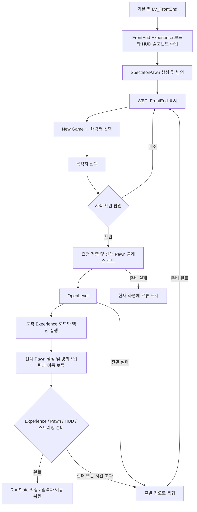

# FrontEnd에서 게임 플레이 시작까지의 흐름 분석

분석일: 2026-09-06 · 기준 커밋: `d3f5246f`

작성 중 별도 작업으로 체크포인트 관련 미커밋 변경이 추가된 것을 최종 확인했다. 본문은 위 커밋에서 추적한 흐름을 기준으로 한다. 확인 시점의 추가 변경은 `HandleAssetsLoaded`에서 새 게임 OpenLevel 직전 `ResetCheckpoint()` 호출, `AWxGameMode::RestartPlayer`에서 유효한 체크포인트가 있으면 해당 Transform을 사용하고 없으면 기존 PlayerStart 경로를 사용하는 처리다. 이 변경은 이번 문서 작업에서 구현·빌드 검증하지 않았다.

## 1. 분석 범위와 결론

현재 FrontEnd의 게임 접속은 **캐릭터와 목적지를 선택하고, 선택 Pawn 클래스를 비동기 로드한 뒤 `OpenLevel`로 싱글플레이 월드를 여는 과정**이다. 이 경로에는 계정 인증, 서버 검색, 온라인 세션 생성·참가가 없다. `RequestNewGame`은 `NM_Standalone`에서만 요청을 받는다.

접속 완료는 맵 파일 로드 완료와 다르다. GameFlow는 도착 맵의 Experience, 로컬 PlayerController와 Pawn, HUD, World Partition 스트리밍을 확인하고 선택 상태를 확정한 뒤 입력과 이동을 복원한다.

이 문서는 C++·ini 정적 분석과 Unreal MCP를 통한 실제 에셋 기본값·Blueprint 그래프 읽기 결과다. 기존 [캐릭터 선택·월드 진입 설계](FrontEnd_캐릭터선택_월드진입_설계.md)를 보완하는 구현 흐름 문서이며, 이번 분석에서 PIE 실행, 빌드, Cook 검증은 수행하지 않았다. 맵별 WorldSettings의 Experience 지정은 기존 설계 문서의 기록을 인용했다. 이번에는 맵을 전환해 해당 인스턴스를 다시 조회하지 않았다.

## 2. 전체 흐름

다이어그램의 복귀 대상은 일반적인 FrontEnd 출발 상황이다. 실제 코드는 고정된 FrontEnd 맵이 아니라 요청 당시 출발 맵을 기억한다. 도착 Experience 처리와 `PostLoadMapWithWorld`는 별도 이벤트 경로이며, 위 그림은 단계의 의존 관계를 나타낸다.

## 3. 구성 요소와 수명

| 구성 | 책임 | 상태의 수명 |
| --- | --- | --- |
| `WBP_FrontEnd` | 페이지, 임시 선택 인덱스, 팝업, 포커스, 오류 문구와 버튼 활성 상태 | 위젯 인스턴스 |
| `UWxFrontEndLibrary` | Blueprint에서 GameFlow로 요청·상태 조회 전달 | 별도 상태 없음 |
| `UWxGameFlowSubsystem` | 검증, 선택 클래스 로딩, 전환 상태, 도착 대기, 실패 복구 | GameInstance: 맵 전환 후에도 유지 |
| `AWxGameMode` | Experience 결정, 스폰 지연, 선택 Pawn 클래스 적용 | 월드 |
| `AWxGameState`의 `UWxExperienceManagerComponent` | Experience 번들, GameFeature, 액션 실행과 완료 통지 | 월드 |
| `UWxUIManagerSubsystem` | PrimaryGameLayout, HUD 클래스 전달값, 팝업 관리 | GameInstance |
| `UWxHUDComponent` | 로컬 Controller의 Pawn 빙의를 따라 HUD 비동기 표시 | 주입된 Controller 컴포넌트 |

UIManager 자체는 유지되지만 Controller가 교체되면 기존 PrimaryGameLayout을 제거하고 새 Controller용으로 재생성한다. 이전 월드의 HUD 컴포넌트는 `EndPlay`에서 대기 중인 HUD 로드를 취소하고 위젯을 비활성화한다.

## 4. 게임 실행 → FrontEnd 표시

### 4.1 시작 설정과 실제 에셋 연결

`DefaultEngine.ini`의 `GameDefaultMap`과 `EditorStartupMap`은 모두 `/Game/Maps/LV_FrontEnd.LV_FrontEnd`, `GlobalDefaultGameMode`는 `/Game/Framework/GM_Combat.GM_Combat_C`다. EditorStartupMap은 에디터의 시작 맵 설정이며, 다른 맵에서 직접 PIE를 시작하는 경우까지 FrontEnd를 강제하지 않는다.

| 에셋·설정 | 확인한 값 |
| --- | --- |
| `GM_Combat.GameStateClass` | `AWxGameState` |
| `GM_Combat.PlayerControllerClass` | `BP_PlayerController` |
| `GM_Combat.PlayerStateClass` | `AWxPlayerState` |
| `GM_Combat.SpectatorClass` | 엔진 `SpectatorPawn` |
| `EXP_FrontEnd` | 기본 Pawn 없음, ActionSets = `WAS_FrontEnd` |
| `WAS_FrontEnd` | `UWxHUDComponent` 주입, GameHUDClass = `WBP_FrontEnd` |
| `EXP_Combat` | 기본 Pawn = `BP_Player`, ActionSets = `WAS_CombatCore` |
| `WAS_CombatCore` | GameHUDClass = `WBP_GameHUD`, 컴포넌트 주입 및 초기 인벤토리 아이템 액션 |
| UI `LayoutClass` | `/WxUI/WBP_PrimaryGameLayout.WBP_PrimaryGameLayout_C` |
| UI `ConfirmationPopupClass` | `/Game/UI/Widget/WBP_ConfirmationPopup.WBP_ConfirmationPopup_C` |

조회한 두 Experience와 두 ActionSet의 `GameFeaturesToEnable`은 모두 비어 있다. 현재 이 구성은 별도 콘텐츠 GameFeature 활성 대기 없이 Experience 액션 실행으로 진행한다. `WAS_CombatCore` 주입 목록은 Inventory, InteractionScanner, Quest, DialogueSession, HUD 컴포넌트다.

기존 설계 문서에는 `LV_DevCombat`과 `LV_OpenWorld`의 WorldSettings에 `EXP_Combat`이 지정되어 있다고 기록되어 있다.

### 4.2 Experience 선택과 FrontEnd HUD 표시

1. `AWxGameMode::InitGameState`에서 Experience를 결정한다. 우선순위는 URL의 `?Experience=이름` → `AWxWorldSettings.GameplayExperience`다. 둘 다 없으면 유효하지 않은 ID로 실패하며 GameMode 기본 Pawn으로 우회하지 않는다.
2. ExperienceManager는 AssetManager에 등록된 ID를 경로로 바꿔 Definition을 동기 로드한다. Definition과 ActionSet의 Client/Server 번들은 이후 비동기로 준비한다. 관련 PrimaryAsset 스캔 위치는 `/Game/Framework`, CookRule은 `AlwaysCook`이다.
3. 필요한 GameFeature 활성화와 액션 실행을 마친 뒤, ActionSets에서 처음 발견한 비어 있지 않은 `GameHUDClass`를 UIManager에 전달한다. 이후 `Loaded`로 바꾸고 완료 델리게이트를 발행한다.
4. GameMode는 Experience 완료 전 새 플레이어 스폰을 보류한다. 완료 콜백은 아직 Pawn이 없고 재시작 가능한 Controller를 다시 시작시킨다.
5. `EXP_FrontEnd.DefaultPawnClass`가 비어 있으므로 `SpectatorClass`를 사용해 Pawn을 생성·빙의한다. 이것은 HUD를 띄우는 공통 빙의 경로를 사용하기 위한 처리다.
6. 주입된 `UWxHUDComponent`가 빙의를 감지하고 UIManager의 HUD 클래스를 `UI.Layer.Game`에 비동기로 push한다. 이때 표시되는 콘텐츠가 `WBP_FrontEnd`다.

UIManager는 LocalPlayer 추가 및 Controller 교체를 구독해 레이아웃을 생성한다. HUDComponent는 `BeginPlay` 때 이미 빙의된 Pawn도 즉시 확인하므로 컴포넌트 주입과 빙의의 순서 차이를 보완한다.

## 5. FrontEnd에서 캐릭터·맵 선택

실제 `WBP_FrontEnd`는 `PageSwitcher`의 세 페이지와 고정 버튼으로 구성되어 있다. 현재 그래프는 배열을 순회해 목록을 생성하지 않고 캐릭터 인덱스 `0`, 목적지 인덱스 `0`·`1`을 각 핸들러에서 지정한다. 따라서 선택지 배열에 항목을 추가하는 것만으로 새 버튼이 생기지는 않는다.

| 순서 | 호출·조건 | 결과 |
| --- | --- | --- |
| Construct | `ShowMain` | 페이지 0, 두 인덱스 -1, PopupOpen false, NewGame 포커스 |
| NewGame 클릭 | `HandleNewGame`: 페이지 0이고 Busy·PopupOpen이 모두 false | `ShowCharacters`, 페이지 1, 선택 초기화, CharacterButton 포커스 |
| 캐릭터 클릭 | `HandleSelectCharacter`: 페이지 1과 입력 가능 상태 확인 | CharacterIndex = 0, `ShowLevels`, 페이지 2, CombatButton 포커스 |
| Combat Test 클릭 | `HandleSelectCombat`: 페이지 2와 입력 가능 상태 확인 | DestinationIndex = 0, 시작 확인 |
| Open World 클릭 | `HandleSelectOpenWorld`: 동일 조건 | DestinationIndex = 1, 시작 확인 |
| 팝업 표시 | `ShowStartConfirmation` | PopupOpen true, 버튼 비활성화, `OkCancel` 팝업 |
| 확인 | `HandleStartResult` | PopupOpen 해제, 선택 참조로 `RequestNewGame`, 상태 갱신 |
| 취소 | `HandleStartResult` | `ShowMain`으로 돌아가 두 선택 인덱스 초기화 |

목록 데이터는 `FWxFrontEndOption`의 `PawnClass`, `Level`, `Title`, `Description`이다. 현재 기본값은 다음과 같다.

| 배열 | 인덱스 | 표시 이름 | 전달 참조 |
| --- | --- | --- | --- |
| CharacterOptions | 0 | Player | `/Game/Character/Player/BP_Player.BP_Player_C` |
| DestinationOptions | 0 | Combat Test | `/Game/Maps/LV_DevCombat.LV_DevCombat` |
| DestinationOptions | 1 | Open World | `/Game/Maps/LV_OpenWorld.LV_OpenWorld` |

팝업 제목은 `Start Game`이며 선택한 캐릭터·레벨의 Title과 시작 질문을 표시한다. UIManager가 `UI.Layer.Modal`에 팝업을 push하고 결과 델리게이트를 돌려준다. `BP_GetDesiredFocusTarget`은 페이지 전환 때 지정한 `FocusTarget`을 반환한다.

`HandleRefreshStatus`는 `GetTravelStatus`의 메시지를 표시하고 `!(Busy || PopupOpen)`으로 다섯 버튼을 활성화한다. Busy인 동안만 0.1초 단발 타이머를 다시 예약하며 Destruct에서 해제한다. 위젯 기본 InputMode는 `Menu`, bPauseGame은 false다. QuitGame 역시 메인 페이지의 입력 가능한 상태에서만 호출한다.

## 6. 요청 접수 → 목적지 맵 로드

`UWxFrontEndLibrary::RequestNewGame`은 WorldContext → World → GameInstance → GameFlow 순서로 접근해 호출을 전달한다. `true`는 요청 접수이며 도착 완료가 아니다. 현재 WBP는 반환값으로 완료를 판단하지 않고 이어서 상태를 조회한다. GameFlow를 찾지 못하면 요청은 false, 상태 조회는 Busy=true와 빈 메시지를 반환한다.

GameFlow의 처리 순서는 다음과 같다.

1. Busy이면 중복 요청을 거부한다. 현재 월드가 없거나 `NM_Standalone`이 아니면 싱글플레이 전용 오류를 표시한다.
2. 이전 pending 상태를 정리하고 Pawn·Level 소프트 참조가 비어 있지 않은지, 맵 패키지가 존재하는지, 현재 맵과 다른지 검사한다. 맵 비교에서는 PIE 접두사를 제거한다. 이 단계는 패키지 존재 검사이며 맵 전체를 미리 로드하지 않는다.
3. `PendingPawnClass`, `PendingLevel`, 출발 맵 패키지 `ReturnLevelPackage`를 기억한다. 요청 GUID를 발급하고 `Preparing`, 제한 시각 = 현재 시각 + 120초로 설정한다.
4. 선택한 Pawn 클래스만 `RequestAsyncLoad`한다. 콜백은 상태와 GUID가 현재 요청과 일치하는지 검사해 취소된 요청의 늦은 완료를 무시한다.
5. 로드된 클래스가 `APawn` 계열이며 abstract가 아닌지 검사한 뒤 `SelectedPawnClass`에 보관한다. 특정 플레이어 캐릭터 계열이나 맵별 허용 목록까지 검사하지는 않는다.
6. `Traveling`으로 전환하고 `OpenLevel(this, 목적지패키지, true)`를 호출한다. 선택 Pawn을 URL로 전달하지 않으며 별도의 Experience 옵션도 붙이지 않는다. 선택 정보는 살아 있는 GameInstance의 GameFlow에서 도착 GameMode가 읽는다.
7. 같은 GameInstance의 `PostLoadMapWithWorld`에서 목적지가 맞으면 `AwaitingReady`, 다르면 실패로 처리한다.

출발 맵은 FrontEnd로 제한하지 않는다. API 자체의 조건은 Standalone과 서로 다른 유효한 목적지이며, 같은 맵 새 게임 요청은 거부한다.

## 7. 도착 Experience → Pawn·HUD 초기화

도착 GameMode도 4절과 같은 Experience 파이프라인을 수행한다. 세부 순서는 Definition 해석 → 번들 로드 → GameFeature 이름 해석·활성화 → Definition.Actions와 ActionSets.Actions 순서로 액션 실행 → HUD 클래스 전달 → Experience 완료 통지다.

`UWxGameFeatureAction_AddComponents`는 컴포넌트의 베이스 타입으로 Pawn·Controller·PlayerState·GameState 수신 대상을 결정하고 GameFrameworkComponentManager에 주입 요청을 등록한다. Experience가 완료된 뒤 생성될 Pawn도 이 요청의 적용 대상이다.

`AWxGameMode::GetDefaultPawnClassForController_Implementation`의 우선순위는 다음과 같다.

1. Experience가 없으면 nullptr.
2. 현재 월드가 GameFlow 목적지이고 선택 클래스가 있으면 선택 Pawn.
3. Experience.DefaultPawnClass가 있으면 해당 클래스.
4. 기본 Pawn이 없으면 SpectatorClass.

GameMode.DefaultPawnClass로 폴백하지 않는다. 선택 없이 게임 맵을 직접 PIE로 시작하면 Experience의 기본 Pawn을 사용한다. PlayerStart 선택은 기존 엔진 경로를 사용하고 별도 진입점 태그나 저장 위치는 전달하지 않는다.

`HandleStartingNewPlayer`는 Experience 완료와 `ValidateArrival`를 확인한 뒤 부모 구현으로 스폰·빙의를 진행하고 `HoldArrivalPawn`을 호출한다. `BP_Player`의 C++ 기반 경로에서는 `PossessedBy` → `InitAbilitySystem`으로 ASC ActorInfo 갱신, 이동 속도 속성 반영, authority의 AbilitySet 부여가 진행된다. `SetupPlayerInputComponent`에서는 InputConfig의 MappingContext와 이동·시선·점프·앉기·Ability 입력을 연결한다.

동시에 HUDComponent는 새 Pawn 빙의를 따라 `WBP_GameHUD`를 비동기 push한다. 이 HUD 로드는 Experience 완료 자체와 구분된다. AsyncAction은 로드 완료 시 현재 레이아웃이 요청 당시 레이아웃과 같은지 검사해 이전 월드의 로드 결과가 새 화면에 들어가지 않도록 한다.

## 8. 도착 완료 조건과 입력 복원

`HoldArrivalPawn`은 목적지 전환 중 Controller의 이동·시선 입력을 무시하도록 하고 Pawn 입력을 비활성화한다. ACharacter라면 CharacterMovementComponent의 Tick도 중지한다. Pawn 위치는 스트리밍 기준을 제공하면서 지형 준비 전 중력으로 떨어지는 것을 막기 위한 처리다. 전체 게임 로직이나 모든 액터 Tick을 멈추는 기능은 아니다.

GameFlow의 CoreTicker는 `AwaitingReady`에서 다음 조건을 모두 확인한다.

| 조건 | 실제 검사 |
| --- | --- |
| Experience | AWxGameState의 ExperienceManager가 있고 `IsExperienceLoaded()` |
| 플레이어 | 첫 로컬 PlayerController와 그 Pawn이 존재 |
| HUD | UIManager가 있고, HUD 지정이 없거나 `UI.Layer.Game` 스택 위젯 수가 1 이상 |
| 월드 | World Partition이 없거나 `IsAllStreamingCompleted()` |
| 목적지 일치 | `ValidateArrival`: 목적지 패키지, Experience와 선택 클래스 존재 |
| Pawn 일치 | 생성 Pawn이 `IsA(SelectedPawnClass)` |

모두 통과하면 Pending 참조를 `RunState`에 복사하고 Idle로 전환한다. 오류 문구를 지우고 Pawn 입력 및 Movement Tick의 이전 상태를 복원하며 자신이 추가한 Controller 입력 무시를 해제한다. 비동기 로드 핸들은 놓지만 현재 목적지·선택 클래스는 같은 맵의 재스폰에 사용하도록 유지한다.

HUD 조건은 정확한 HUD 클래스나 활성 여부·MVVM 데이터 준비를 확인하는 검사가 아니라 스택 개수 검사다. World Partition 조건도 전체 오픈월드를 상주 로드한다는 의미가 아니라 현재 스트리밍 작업 완료 검사다. ASC, 퀘스트, 인벤토리, 애니메이션 등의 개별 준비 신호는 GameFlow 완료 조건에 포함되지 않는다.

`RunState`는 마지막 성공 시점의 Pawn·Level 소프트 참조만 보관한다. 디스크 SaveGame이 아니며 `ClearPending`으로도 지워지지 않는다. 다른 맵으로 일반 전환 후 `ValidateArrival`가 호출되면 이전 pending 선택은 정리하지만 RunState까지 새 맵 상태로 갱신하는 것은 아니다.

## 9. 상태 전이와 실패 복구

| 상태 | 의미·다음 전이 |
| --- | --- |
| Idle | 요청 가능. 유효한 새 요청 → Preparing |
| Preparing | Pawn 클래스 준비. 성공 → Traveling, 실패 → Failed, `CancelPreparation` → Idle |
| Traveling | OpenLevel 이후 도착 확인 대기. 목적지 로드 확인 → AwaitingReady |
| AwaitingReady | 8절 준비 조건 검사. 성공 → Idle, 실패 → Failed 및 복구 예약 |
| Failed | 실패 메시지 유지. 복구 예약이 있으면 다음 CoreTick에서 Recovering |
| Recovering | 출발 맵을 다시 열고 공통 준비 조건과 출발 패키지 일치를 기다림. 성공 → Idle, 실패 → Failed |

`IsBusy`는 Idle·Failed 외 상태뿐 아니라 복구 예약 플래그도 포함한다. 따라서 전환 실패 직후 Failed가 되었더라도 복구 예약이 남아 있으면 새 요청을 받지 않는다.

| 실패 지점 | 결과 |
| --- | --- |
| 선택 참조·패키지 검증, Pawn 비동기 로드 요청·클래스 검증 | 출발 화면에 남아 Failed와 오류 문구 제공 |
| OnTravelFailure, 잘못된 도착 맵, 도착 구성·Pawn 불일치 | 실패 기록 후 다음 CoreTick에 출발 맵으로 복귀 |
| 도착 Experience의 HasLoadFailed | 구성 로드 오류로 복귀 |
| 준비·전환·도착 대기의 시간 초과 | 실패 시점 상태에 따라 현재 화면 유지 또는 복귀 |
| 복귀 패키지 없음 | 재실행 안내와 Failed 유지 |
| Recovering 중 구성 실패·전환 실패·시간 초과 | Failed 유지, 자동 복귀 반복 없음 |

120초는 최초 요청의 Preparing부터 도착 완료까지 공유하는 제한 시간이다. 각 단계마다 120초를 새로 주지 않는다. 복귀를 시작할 때만 새로운 120초 제한을 준다. CoreTicker에서 확인하므로 동기 맵 로딩으로 게임 스레드가 막힌 순간을 강제로 중단하는 watchdog은 아니다.

`BeginRecovery`는 입력 보류·pending 로드를 정리하고 출발 맵을 `OpenLevel`한다. 복귀 준비가 끝나면 Idle로 바꾸되 원래 오류 메시지는 남겨 재생성된 FrontEnd가 표시할 수 있게 한다. `CancelPreparation`은 C++에서 Preparing만 취소할 수 있는 함수이며 현재 FrontEndLibrary에는 Blueprint 취소 API가 없다. 확인 팝업 취소는 요청을 만들기 전 UI 선택만 초기화한다.

Experience의 번들 완료는 모든 구성 요소의 성공을 보증하지 않는다. 번들 취소 시에도 후속 파이프라인이 진행되며 주입 클래스 로드 실패는 해당 주입을 건너뛰고 로그를 남긴다. 반면 필수 GameFeature 이름 해석·활성화 실패는 Experience를 Failed로 만든다. 따라서 HUD 누락 등은 즉시 Experience 실패가 아니라 GameFlow의 준비 시간 초과로 드러날 수 있다.

## 10. 문제 발생 시 추적 지점

| 증상 | 먼저 볼 지점 |
| --- | --- |
| FrontEnd 자체가 안 뜸 | 맵 GameplayExperience, AssetManager 스캔, EXP_FrontEnd → WAS_FrontEnd → HUDComponent·WBP 연결, PrimaryGameLayout 설정 |
| 클릭이 반응하지 않음 | WBP 현재 페이지, PopupOpen, GetTravelStatus.Busy, 고정 선택 인덱스 |
| 확인 후 출발 맵에 남음 | StatusText, RequestNewGame 검증, Pawn 클래스 경로와 abstract 여부 |
| 맵이 열렸지만 Pawn이 없음 | Experience의 Failed/Loaded, GameMode 완료 콜백, PlayerStart 및 스폰 조건 |
| Pawn은 있지만 조작이 계속 막힘 | AwaitingReady, Game 레이어 위젯 수, World Partition 스트리밍, Deadline |
| 선택 캐릭터와 다른 Pawn | 목적지 패키지 비교, GetSelectedPawnClass, 실제 Pawn IsA 검사 |
| 출발 맵으로 돌아옴 | 보존된 StatusText, OnTravelFailure, Experience 오류 로그, 시간 초과 |

Experience 관련 진단은 `LogWxGame`의 `SetCurrentExperience`, `GetDefaultGameplayExperience`, `CollectGameFeaturePluginURLs`, `HandleGameFeaturePluginLoaded`, `AddToWorld` 메시지로 좁힐 수 있다. 현재 GameFlow는 모든 상태 전이를 별도 로그로 남기지 않으므로 상태 접근자와 StatusText를 함께 확인한다.

## 11. 근거 파일과 검증 범위

| 근거 | 주요 함수·내용 |
| --- | --- |
| [DefaultEngine.ini](../../Config/DefaultEngine.ini) · [DefaultGame.ini](../../Config/DefaultGame.ini) | 시작 맵, GameMode, UI 클래스, AssetManager 스캔 |
| [WxFrontEndLibrary.cpp](../../Source/WxGame/FrontEnd/WxFrontEndLibrary.cpp) · [헤더](../../Source/WxGame/FrontEnd/WxFrontEndLibrary.h) | Blueprint API, FWxFrontEndOption |
| [WxGameFlowSubsystem.cpp](../../Source/WxGame/FrontEnd/WxGameFlowSubsystem.cpp) · [헤더](../../Source/WxGame/FrontEnd/WxGameFlowSubsystem.h) | 요청·전환·완료·복구, EWxTravelState, FWxRunState |
| [WxGameMode.cpp](../../Source/WxGame/Framework/WxGameMode.cpp) · [WxWorldSettings.cpp](../../Source/WxGame/Framework/WxWorldSettings.cpp) | Experience 선택, Pawn 선택과 스폰 보류 |
| [WxExperienceManagerComponent.cpp](../../Source/WxGame/Framework/WxExperienceManagerComponent.cpp) | 번들·GameFeature·액션·HUD 발행 순서 |
| [WxGameFeatureAction_AddComponents.cpp](../../Source/WxGame/Framework/WxGameFeatureAction_AddComponents.cpp) | 수신 대상별 컴포넌트 주입 |
| [WxUIManagerSubsystem.cpp](../../Plugins/WxUI/Source/WxUI/Private/System/WxUIManagerSubsystem.cpp) | Controller 교체, 레이아웃 생성, 팝업 |
| [WxHUDComponent.cpp](../../Plugins/WxUI/Source/WxUI/Private/Component/WxHUDComponent.cpp) | 빙의 후 HUD 표시 |
| [WxAsyncAction_PushWidgetToLayer.cpp](../../Plugins/WxUI/Source/WxUI/Private/Widget/WxAsyncAction_PushWidgetToLayer.cpp) | HUD 비동기 로드와 이전 레이아웃 차단 |
| [WxCharacterBase.cpp](../../Source/WxGame/Character/WxCharacterBase.cpp) · [WxPlayerCharacter.cpp](../../Source/WxGame/Character/WxPlayerCharacter.cpp) | 빙의 시 ASC 및 입력 초기화 |
| [WxFrontEndTests.cpp](../../Source/WxGame/FrontEnd/Tests/WxFrontEndTests.cpp) | `Wx.FrontEnd.InvalidContext`: 컨텍스트 없는 요청 거부·Busy 반환 검사 |

에디터에서는 `WBP_FrontEnd`의 전체 함수·이벤트 그래프와 목록·입력 기본값, `GM_Combat`, `EXP_FrontEnd`, `EXP_Combat`, `WAS_FrontEnd`, `WAS_CombatCore` 및 컴포넌트 주입 목록을 읽었다. 에셋이나 소스 코드는 수정하지 않았다.

기존 설계 문서에 기록된 과거 빌드·PIE 결과와 이번 분석의 검증 범위는 구분한다. 현재 C++ FrontEnd 자동화 테스트는 InvalidContext 하나이며 정상 진입·복귀·시간 초과 전체를 검증하는 테스트는 아니다. 이번 결과는 구현과 에셋 연결의 분석이며 실제 패키지에서의 맵 포함 여부와 플레이 성공을 새로 입증한 결과는 아니다.
