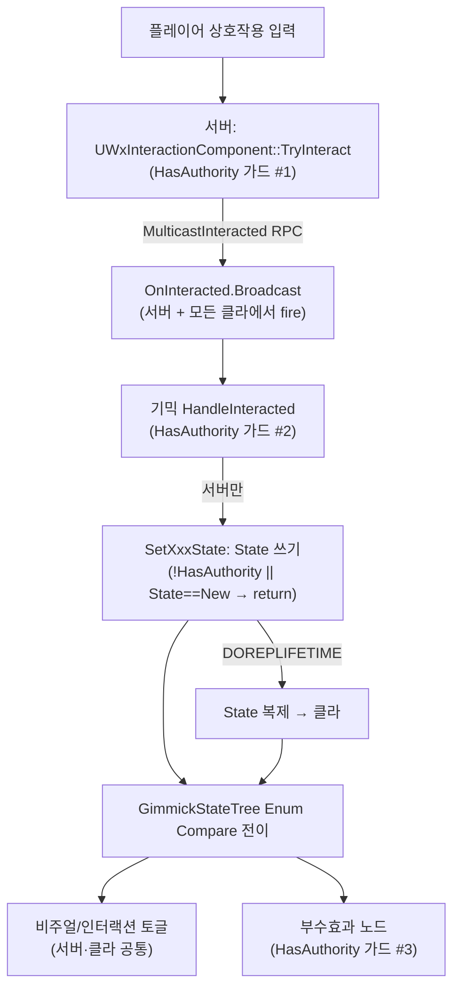

# WxGimmick — State 변경의 서버 권위 구조

상호작용 월드 오브젝트(`AWxGimmick` 파생)의 상태(State)가 **서버 권위로만 확정·복제**되고, 클라이언트와 부수효과·세이브가 그 State 를 **추종**하는 흐름. 트리거(인터랙션) → State 확정 → 복제 → StateTree 추종 → 부수효과(스폰/FX)·세이브까지 추적한다.

---

## 한 문장 요약

> 인터랙션은 서버에서만 발동되고, 서버 권위 측만 각 기믹 자신의 `State` enum 을 쓴다. `State` 는 `DOREPLIFETIME` 으로 복제(RepNotify 없음)되며, 서버·클라가 동일하게 `GimmickStateTree` 의 Enum Compare 전이로 복제 State 를 폴링해 비주얼·인터랙션 토글·부수효과를 적용한다.

이 시스템을 가르는 두 축:

- **권위 축** — State 쓰기·부수효과는 **서버 전용** / 비주얼·인터랙션 토글은 **모든 피어 공통**
- **시점 축** — **라이브 전이**(상호작용 발동: SourceStateID 유효) / **초기 진입**(StateTree 시작·세이브 복원·레이트조인: SourceStateID 무효)

두 번째 축이 부수효과 중복·복원 침묵을 가르는 결정 기준이다.

---

## 전체 그림

---

## 권위 게이트는 세 겹이다

State 가 서버에서만 바뀌고 부수효과가 한 번만 일어나는 보증은 한 곳이 아니라 **세 지점의 중첩 가드**에서 나온다.

1. **인터랙션 진입** — `UWxInteractionComponent::TryInteract` 가 `!Owner->HasAuthority()` 면 즉시 return. 상호작용 자체가 서버에서만 발동된다(`WxAbility_Interact` 가 클라 선택을 TargetData 로 서버에 전달 → 서버가 `TryInteract` 호출). 통과하면 `MulticastInteracted` RPC 로 `OnInteracted` 를 **서버+모든 클라**에서 broadcast 한다.

2. **State 쓰기** — `OnInteracted` 는 모든 피어에서 fire 되지만, 각 기믹의 `HandleInteracted` 가 `if (HasAuthority())` 로 분기해 **서버만** `SetXxxState` 를 부른다. `SetXxxState` 는 한 번 더 `if (!HasAuthority() || State == NewState) return;` 로 비권위·동일값을 거른다(전 기믹 동일 패턴).

3. **부수효과 실행** — 스폰/이동처럼 권위 사건인 StateTree 태스크가 `EnterState`/`Tick` 안에서 `Owner->HasAuthority()` 를 다시 확인해 **서버만** 실행한다(클라 중복 스폰 방지). 비주얼·인터랙션 토글 태스크에는 이 가드가 없다.

> 핵심: 클라이언트는 State 를 **절대 쓰지 않는다**. 클라가 하는 일은 복제된 State 를 StateTree 가 추종해 비주얼/인터랙션을 맞추는 것뿐이다. RepNotify 가 없는 이유 — State 변화 감지는 콜백이 아니라 StateTree 의 Enum Compare 전이 폴링이 담당한다.

---

## 복제·추종 축: StateTree 가 복제 State 를 폴링한다

각 기믹은 자기 `State` enum 을 `UPROPERTY(..., Replicated, SaveGame)` 으로 소유하고 `GetLifetimeReplicatedProps` 에서 `DOREPLIFETIME` 한다. 베이스 `AWxGimmick` 는 `bReplicates = true` 와 공통 `StateTree`(`UStateTreeComponent`)만 제공하고, State enum 자체는 갖지 않는다(자식별 권위 원천).

추종 메커니즘은 **이벤트 태그 없이** 동작한다. ST 에셋의 각 상태에 `State` 에 바인딩한 Enum Compare 전이 조건이 걸려 있어, 복제/복원으로 State 가 현재 비주얼 상태와 달라지면 Root 재선택이 일어나 해당 상태로 전이한다. 서버는 자기가 쓴 State 로, 클라는 복제된 State 로 **같은 경로**를 탄다.

| 추종 대상 | 담당 ST 태스크(`WxGimmickStateTreeNodes`) | State 읽음? | 권위 가드 |
| --- | --- | --- | --- |
| 인터랙션 활성/비활성 | `Wx Enable Interaction` | X (bEnable 직접) | 없음(공통) |
| 직선 슬라이드(문 등) | `Wx Component Move` | X (순수 비주얼) | 없음(공통) |
| 스플라인 이동(엘리베이터) | `Wx Component Spline Move` | X | 없음(공통) |
| 애니메이션(상자 열기) | `Wx Play Animation` | X | 없음(공통) |
| 사운드 1회 | `Wx Play Sound` | X | 없음(피어별 로컬 재생) |
| Niagara 1회 | `Wx Spawn Niagara` | X | 없음(피어별 로컬 재생) |
| 스포너 트리거 | `Wx Trigger Spawners` | X | **`HasAuthority`** |

> 태스크는 State enum 을 직접 읽지 않는다. "어느 State 에서 무엇을 할지"는 ST 에셋이 상태별로 author 하고, 태스크는 바인딩된 컴포넌트/파라미터에 대한 순수 동작만 수행한다. 그래서 노드가 기믹 종류와 무관하게 재사용된다.

---

## 시점 축: 라이브 vs 초기 진입 — 부수효과 중복·복원 침묵의 분기

모든 부수효과/비주얼 노드가 `!Transition.SourceStateID.IsValid()` 로 **초기 진입**(StateTree 시작·세이브 복원·레이트조인)과 **라이브 전이**(상호작용 발동)를 구분한다. 이 한 줄이 권위 가드와 함께 중복을 막는다.

| 노드 | 초기 진입 | 라이브 전이 |
| --- | --- | --- |
| `Wx Play Sound` / `Wx Spawn Niagara` | 재생 안 함(복원 시 침묵) | 1회 재생(피어별 로컬) |
| `Wx Trigger Spawners` | 재실행 안 함 | 서버만 각 `Respawn()` 호출 |
| `Wx Play Animation` | 끝 프레임 스냅(발동 완료 포즈 복원) | 처음부터 재생 |
| `Wx Component (Spline) Move` | 목표 위치 즉시 스냅 | 목표까지 일정 속도 슬라이드 |

- **중복 방지의 두 겹** — 스폰은 (a) 초기 진입에서 스킵 + (b) 라이브여도 `HasAuthority` 인 서버만 실행. (a) 가 세이브 복원 시 재스폰을, (b) 가 클라 중복 스폰을 각각 막는다. `Wx Trigger Spawners::EnterState` (`WxGimmickStateTreeNodes.cpp` 약 398·406행)에서 두 가드를 연속으로 본다.
- **FX 는 가드 불필요** — 사운드/Niagara 는 권위와 무관한 로컬 표현이라 모든 피어가 각자 라이브 진입 시 1회 재생한다(멀티캐스트 불필요). 초기 진입 스킵만으로 복원 침묵을 보장한다.
- **스포너 측 이중 안전망** — `AWxSpawner::Respawn`/`SpawnTarget`/`MarkKilled` 자체도 `HasAuthority` 게이트라, 태스크 가드가 뚫려도 클라에서 스폰이 일어나지 않는다.

---

## 세이브/복원: 별도 후크 없이 StateTree 가 복원 State 를 폴링

`AWxGimmick` 는 `IWxSavable`(WxCore) 을 구현한다. 자식의 `UPROPERTY(SaveGame) State` 가 `GetWxSaveId()`(에디터에서 ActorGuid 로 1회 부여, 에셋에 직렬화돼 런타임/세션 불변) 키로 슬롯에 기록된다.

복원 시 SaveGame 필드(State)가 먼저 복원되고 `OnWxSaveRestored()` 가 호출되지만, **기믹은 이 후크를 오버라이드하지 않는다**. State 가 복원된 채로 StateTree 가 시작/실행되면, 각 상태의 enter condition(State 에 바인딩한 Enum Compare)이 복원된 State 로 초기 선택하고, 그 상태의 비주얼 태스크가 **초기 진입 경로**로 포즈를 스냅한다(애니=끝 프레임, Move=목표 위치). FX·스폰은 초기 진입이라 침묵한다. 즉 복원은 추종 경로의 한 케이스일 뿐 전용 코드가 없다.

> `AWxSpawner` 는 대조적으로 `OnWxSaveRestored()` 를 오버라이드해 `bIsKilled` 복원 후 잔존 인스턴스를 정리한다. 기믹은 상태가 곧 비주얼 출력으로 환원되므로 후크가 불필요하지만, 스포너는 "이미 spawn 된 액터"라는 외부 부작용을 정리해야 하기 때문이다.

---

## 기믹별 State 전이 요약

전이 로직 자체가 권위 측 `Handle...` 에 있다(클라엔 없음). 콘솔류는 1회성 단방향, Door/Elevator 는 목표값 직접 확정형이다.

| 기믹 | State enum | 권위 전이(서버 `Handle...`) |
| --- | --- | --- |
| `AWxTreasureChest` | `Closed`/`Open` | 상호작용 → `Open` (1회성) |
| `AWxAlarmConsole` | `Idle`/`Alarmed` | 상호작용 → `Alarmed` (1회성) |
| `AWxSpawnConsole` | `Idle`/`Spawned` | 상호작용 → `Spawned` (1회성) |
| `AWxDoor` | `Close`/`Open` | 콘솔 상호작용 → `Open` (현재 Open 인터랙션 비활성이라 단방향) |
| `AWxElevator` | `Closed`/`AtStart`/`AtEnd` | CallConsoleA→`AtStart`, CallConsoleB→`AtEnd`, Platform→반대 끝점 토글 |

엘리베이터만 다중 인터랙션 영역(Platform/CallA/CallB)과 현재 State 를 본 다음-State 산출이 있어 전이가 복잡하다. State 는 "도착"이라는 권위 사건 없이 인터랙션 시점에 곧장 최종 끝점값으로 확정되고, 플랫폼 이동은 `Wx Component Spline Move` 가 순수 비주얼로 처리한다(위치 스냅을 C++ 가 하면 도착지로 순간이동하므로 하지 않는다).

---

## 주의할 점

- **`OnInteracted` 는 모든 피어에서 fire 된다** — `MulticastInteracted` 가 서버+클라 전부에서 broadcast 하므로, 핸들러에서 권위 분기를 빠뜨리면 클라가 State 를 쓰려 시도한다(쓰기는 `SetXxxState` 의 두 번째 가드가 다시 막지만, 핸들러 안의 다른 권위 로직은 보호되지 않는다). 신규 기믹 핸들러는 반드시 `HasAuthority()` 분기로 시작한다.
- **RepNotify 를 추가하지 말 것** — 추종은 StateTree 의 Enum Compare 폴링이 전담한다. State 변화에 코드 훅을 달면 추종 경로와 이원화된다. 새 동작은 ST 노드/전이로 표현한다.
- **부수효과 노드는 시점·권위 가드를 둘 다 둔다** — 새 사이드이펙트 태스크는 "초기 진입 스킵 + (필요 시)HasAuthority" 두 가드를 따른다. FX 류는 권위 가드를 빼고 피어별 로컬 재생한다.
- **책임 경계: 플러그인 참조 규칙** — `WxWorld` 는 `WxCore` 외 도메인을 참조하지 못한다. 그래서 보상은 C++ 가 아니라 `AWxTreasureChest` 상속 **BP** 에서 `WxInventory` 의 RewardComponent 를 추가하고, 그 컴포넌트가 `InteractionComponent` 에 자가 바인딩한다(BP 그래프 배선 없음). 세이브 연동도 같은 이유로 `IWxSavable` 인터페이스만 WxCore 에 두어 `WxWorld`↔`WxSave` 직접 의존을 끊었다.
- **베이스 StateTree 는 자동 시작** — `AWxGimmick` 생성자가 `StateTree->SetStartLogicAutomatically(true)` 로 설정하고 자식은 명시 `StartLogic` 을 호출하지 않는다(초기 진입 스냅은 각 태스크가 자체 수행). 따라서 자식 `BeginPlay` 에서 StartLogic 을 부르는 코드를 추가하지 않는다.

---

### 참조 코드

| 타입 | 모듈 | 역할 |
| --- | --- | --- |
| `AWxGimmick` | `WxWorld` (`Public|Private/Gimmick/WxGimmick.h/.cpp`) | 공통 베이스: `bReplicates`, `StateTree`, `IWxSavable` |
| `AWxTreasureChest` / `AWxAlarmConsole` / `AWxSpawnConsole` | `WxWorld` (`.../Gimmick/`) | 1회성 콘솔/상자: State enum + `HasAuthority` 게이트 `Handle/Set` |
| `AWxDoor` / `AWxElevator` | `WxWorld` (`.../Gimmick/`) | 목표값 확정형 전이(엘리베이터 다중 인터랙션) |
| `FWxStateTreeTask_*` | `WxWorld` (`.../Gimmick/WxGimmickStateTreeNodes.h/.cpp`) | 추종 노드들; 시점(SourceStateID)·권위(HasAuthority) 가드 |
| `UWxInteractionComponent` | `WxWorld` (`.../Interaction/WxInteractionComponent.h/.cpp`) | 서버 진입점 `TryInteract`, `MulticastInteracted` |
| `AWxSpawner` | `WxWorld` (`.../Spawnable/WxSpawner.cpp`) | `Wx Trigger Spawners` 의 부수효과 대상; `Respawn` 등 `HasAuthority` 게이트 |
| `IWxSavable` | `WxCore` (`Public/WxSavable.h`) | `SaveGame` State 슬롯 기록·복원 계약(도메인 디커플링) |
