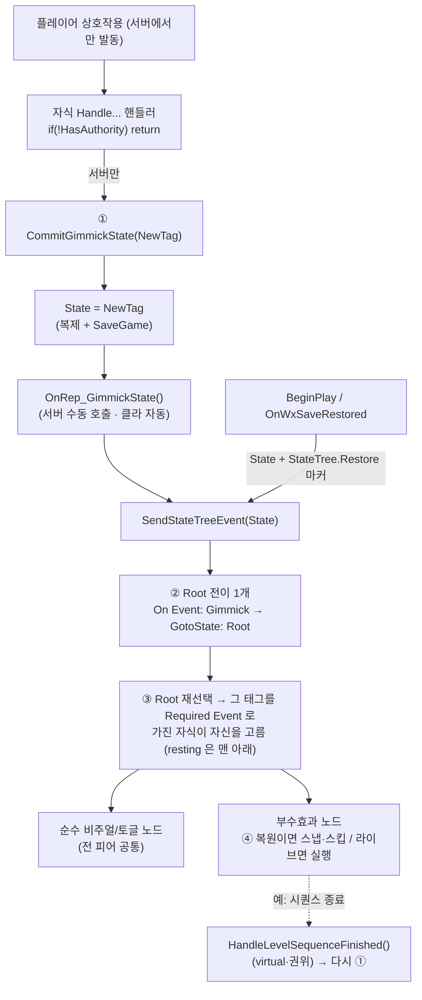

# WxGimmick ↔ StateTree — 상태 권위와 계약 규칙

상호작용 월드 오브젝트(`AWxGimmick` 파생)의 **상태(State)와 그것을 추종하는 StateTree 사이의 계약**을 정리하고, 신규 기믹·ST 노드·ST 에셋을 작성할 때 따라야 할 규칙을 못박는다. 규칙은 많아 보이지만 **새로 배워야 하는 기믹 고유 규칙은 3개뿐**이고, 나머지는 UE 표준이거나 StateTree 사용상의 마찰이다.

---

## 한 문장 요약

> 기믹의 권위 상태는 베이스 `AWxGimmick` 가 소유하는 **하나의 `FGameplayTag State`**(복제 + SaveGame)이며, 이 태그는 곧 **StateTree 로 보내는 진입 이벤트**(상태의 *Required Event to Enter*)를 겸한다. State 쓰기는 서버 권위 단일 진입점(`CommitGimmickState`)만 하고, 서버·클라·세이브 복원이 모두 같은 태그를 ST 에 발행해 비주얼·인터랙션·부수효과를 추종한다.

이 시스템을 가르는 두 축:

- **권위 축** — State 쓰기·서버 권위 부수효과(스폰/지급)는 **서버 전용** / 비주얼·인터랙션 토글·로컬 FX 는 **모든 피어 공통**
- **시점 축** — **라이브 전이**(상호작용 발동: `SourceStateID` 유효) / **초기·복원 진입**(ST 시작·세이브 복원·레이트조인: `SourceStateID` 무효 또는 `StateTree.Restore` 마커)

---

## 핵심 3규칙 (이것만 새로 배우면 된다)

### 1. State 쓰기는 `CommitGimmickState` 하나로만
자식 핸들러는 `State` 를 직접 대입하거나 `SendStateTreeEvent` 를 직접 부르지 않는다. 오직 `CommitGimmickState(FGameplayTag)` 로만 전이를 확정한다. 이 단일 진입점이 권위 가드를 적용하고 `OnRep` 를 통해 서버·클라 추종을 일원화한다.

> **유일 예외**: 비영속 일시상태 리셋(현재 `CutsceneTrigger` 한 곳). 단일 SaveGame 베이스 필드의 한계라, `Super::BeginPlay`/`OnWxSaveRestored` **앞에서** 권위 측 `State = <resting>` 만 쓰고 의도를 주석으로 남긴다. 새 일시상태 기믹은 반드시 이 형태를 따른다.

### 2. State 태그값 = ST 진입 이벤트 (1:1 일치), Root 는 재선택만 연다
`State` 태그는 두 역할을 겸한다 — **(a) 저장·복제되는 권위 값**이자 **(b) `SendStateTreeEvent` 로 보내는 진입 이벤트**. 그래서 태그값은 ST 에셋의 어떤 상태 *Required Event to Enter* 와 **정확히 1:1로 맞아야** 한다.

ST 에셋 배선은 **재선택 패턴**이다 — 전이는 목적지를 못박는 장치가 아니라 재선택 방아쇠이고, 목적지는 자식이 스스로 고른다.

- **Root 전이는 딱 하나** — *Trigger*: `On Event`, *Tag*: **`Gimmick`**(부모 태그), *Transition*: `GotoState: Root`. 태그 계층 매칭이라 `Gimmick.*` 상태 태그 전부가 이 전이 하나를 발화시킨다. **상태를 추가해도 Root 배선은 그대로다.**
- **자식이 스스로 걸러진다** — 비기본 상태마다 그 태그를 *Required Event to Enter* 로 건다. 배선할 곳은 여기 한 군데뿐이다.
- **기본(resting) 상태는 Root 자식 중 마지막** — Idle/Close/Closed/Active 등은 *Required Event 없이* 두어 시작 시 선택되게 하는데, 조건 없는 상태는 재선택 때마다 **항상** 매칭되므로 위에 있으면 상태를 바꿔도 계속 resting 이 선택된다. Root 의 *Selection Behavior* 는 `Try Select Children In Order` 를 유지한다.
- **불일치는 침묵 무동작**이며 컴파일이 못 잡는다(→ [검증 불가능한 계약](#검증-불가능한-계약)). 상태를 추가할 땐 **코드 태그(WxCore)와 에셋의 Required Event 를 한 커밋에서 함께** 바꾼다.
- 이 형태는 엔진이 의도한 사용법 그대로다 — 엔진 테스트 `FStateTreeTest_StateRequiringEvent`(`StateTreeTest.cpp`)가 자식마다 `RequiredEventToEnter` 를 걸고, 조건 없는 fallback 을 맨 뒤에 두고, 전이 하나를 `GotoState → Root` 로 보내는 동일 구성을 검증한다. `RequiredEventToEnter` 가 엔진에서 *Enter Conditions* 범주로 분류된 것도 "선택 시점 필터"라는 같은 의도다.
- **`Gimmick` 계층에는 상태 태그만 둔다.** Root 전이가 이 부모 태그를 통째로 받으므로, 상태가 아닌 마커를 여기 두면 그 마커까지 재선택을 유발한다(복원 마커가 `StateTree.Restore` 로 따로 사는 이유).

### 3. 부수효과 노드는 복원 시 스냅·스킵
일회성/라이브 전용 효과(스폰·보상 지급·사운드·Niagara·시퀀스·스포너 트리거)는 **초기·복원 진입이면 스냅하거나 건너뛰고, 라이브 전이일 때만 실행**한다. 빠뜨리면 로드 시 보상 재지급·재스폰·FX 재생이 일어난다.

- 판정 헬퍼: `IsInitialOrRestoreEntry` = `!Transition.SourceStateID.IsValid() || Context.HasEventToProcess(StateTree.Restore)`.
- 베이스가 `BeginPlay`/`OnWxSaveRestored` 에서 상태 태그를 **`StateTree.Restore` 마커와 함께** 재발행해, 노드가 이 진입을 라이브 발동이 아닌 복원으로 보게 한다.

---

## 전체 그림

---

## 나머지 규칙 — 대부분 표준이거나 StateTree 마찰

### 네트워크·컴포넌트 표준 (UE 프로그래머라면 이미 하는 것)
- 인터랙션 응답(`IWxInteractable::OnInteracted` override)은 서버 권위(`TryInteract`)에서만 호출되므로 핸들러 내 `HasAuthority` 게이트는 불필요하다(`CommitGimmickState` 도 자체 권위 가드).
- 서버 권위 부수효과(스폰/`Respawn`/보상)는 노드 안에서 `Owner->HasAuthority()` 게이트를 추가한다. 로컬 표현(사운드/Niagara)은 권위 게이트 없이 피어별 1회.
- `OnRep_GimmickState` 는 이벤트 재발행 외 로직을 두지 않는다(추종 경로 이원화 금지). State 변화에 별도 코드 훅을 달지 않는다.
- 자식은 `StartLogic`/`RestartLogic` 을 호출하지 않는다(베이스 자동시작). 실행 ST 에셋은 자식 **BP** 에서 할당한다.
- 런타임 리소스(시퀀스 플레이어·스폰체)를 가진 노드는 `ExitState` 에서 멱등 정리한다.

### StateTree 를 이 용도로 쓰며 생기는 마찰 (기믹 설계 탓이 아니라 ST 모서리)
- **완료/thrash** — 노드는 작업이 끝나면 `Succeeded` 를 반환해 상태를 자가 완료시킨다. 단 **정지(머무는) leaf** 는 즉시완료 태스크를 완료판정에서 빼거나 `bConsideredForCompletion=false` 로 둬야 Root 재선택 thrash 를 피한다(순간 토글 태스크는 기본 off). 순차 choreography(엘리베이터)만 완료판정을 켜고 *On State Completed→Next*.
- **바인딩 단방향** — 태스크는 바인딩으로 액터 멤버에 못 쓴다(읽기만). 태스크가 생산하는 런타임 데이터(스폰 목록 등)는 그 태스크의 인스턴스 데이터에 두고, 소비 노드는 태스크↔태스크 바인딩으로 읽는다(생산 노드를 앞에 배치).
- **노드 순수성** — 노드는 바인딩된 파라미터/컴포넌트만 읽고 동작하게 둔다. `Context.GetOwner()` 를 `AWxGimmick` 으로 캐스트하는 건 진짜 기믹 상태/콜백이 필요한 노드만(현재 `GimmickStateIs`·`PlayLevelSequence` 둘).
- **노드→호스트 통지** — 필요하면 `AWxGimmick` 의 virtual(기본 노옵·권위 측 호출)로 받는다(`HandleLevelSequenceFinished`). 통지받은 자식도 결국 `CommitGimmickState`(규칙 1)로만 State 를 바꾼다.

### 크로스모듈 노드 (WxWorld 외 도메인)
- 오너는 `AActor` 로만 캐스트한다(`AWxGimmick` 금지 — 플러그인 참조 규칙). 복원 게이트는 WxCore 의 `Gimmick.Restore` 태그로 직접 검사한다(WxWorld 헬퍼 공유 불가라 인라인 — `Wx Grant Reward` 가 그 예).
- 복원 프로토콜의 공유 어휘(`Gimmick.Restore`, `Gimmick.*` 상태 태그)는 **WxCore** 에 둔다 — 도메인 간 코드 의존 없이 복원에 참여하는 유일한 통로.

---

## 검증 불가능한 계약

코드가 못 잡는 계약은 이 둘이며, 신규 작업 시 가장 깨지기 쉽다.

- **규칙 2 — 태그↔에셋 1:1, 그리고 resting 의 위치.** State 태그가 어떤 ST 상태의 *Required Event* 와 정확히 일치해야 하고, 조건 없는 resting 상태는 Root 자식 중 마지막이어야 한다. 둘 다 어기면 "조용히 안 됨"으로 나타난다(컴파일·런타임 모두 침묵) — 태그 불일치는 무반응으로, resting 순서 실수는 "상태를 바꿔도 즉시 resting 으로 돌아옴"으로 드러난다. 다만 실패는 **테스트에서 기믹이 무반응으로 즉시 드러나므로**, 진단용 런타임 경고/에디터 검증 코드는 비용 대비 효용이 낮다고 보아 도입하지 않는다(필요 시 후속). 운용 규칙으로 대신한다: 상태 추가는 코드 태그와 에셋의 Required Event 를 한 커밋에서 함께 바꾼다. Root 전이는 상태 수와 무관하게 하나로 고정이라 여기서 실수할 여지가 없다.
- **규칙 1 예외(일시상태 리셋).** 단일 SaveGame 베이스 필드라, 저장하면 안 되는 일시상태(예: 컷신 `Playing`)는 자식이 복원 시 직접 resting 으로 리셋해야 한다. 안 하면 복원 고착(입력 차단·재상호작용 불가).

---

## 기믹은 두 부류다 — 사소한 건 ST 에 억지로 넣지 않기

위 계약 전체는 **시퀀스형 기믹**을 위한 것이다. 사소한 기믹까지 같은 세금을 낼 필요는 없다.

| 부류 | 예시 | StateTree |
| --- | --- | --- |
| **사소** (1~2 상태 토글, 즉시/단일 비주얼) | Door, TreasureChest, AlarmConsole, SpawnConsole | 과한 편 |
| **시퀀스** (다단계·완료 대기) | Elevator(닫기→이동→열기), CutsceneTrigger(시퀀스 종료 대기), LaserCorridor(주기 스폰) | 제값을 함 |

- 시퀀스형은 위 계약을 그대로 따른다 — ST 의 노드 재사용·디자이너 author 가 값을 한다.
- **단순 토글뿐인 신규 기믹**은 `AWxGimmick`+ST 로 강제하기 전에, 작은 전용 액터(복제 enum + `OnRep` 비주얼)가 더 싸지 않은지 먼저 따진다. "모든 기믹 = AWxGimmick+ST"를 교리로 굳히지 않는다.

---

## 주의할 점 (놓치기 쉬운 함정)

- **`OnInteracted` 는 서버 권위에서만 호출** — `TryInteract` 가 권위·활성 게이트를 통과한 뒤에만 소유자 `IWxInteractable::OnInteracted` 를 부른다(클라 호출 없음). 클라 비주얼은 복제 State 로 수렴한다.
- **복원은 추종 경로의 특수 케이스** — 베이스가 `StateTree.Restore` 마커로 상태 태그를 재발행하면 노드들이 라이브 대신 스냅·스킵으로 처리한다. 기믹별 전용 복원 코드는 없다(일시상태 리셋 예외만).
- **책임 경계: 플러그인 참조 규칙** — `WxWorld` 는 `WxCore` 외 도메인을 참조 못 한다. 타 도메인 동작(보상 지급 등)은 그 도메인의 ST 노드가 맡고 WxCore 공유 태그로 복원 프로토콜에 참여한다.

---

### 참조 코드

| 타입 | 모듈 | 역할 |
| --- | --- | --- |
| `AWxGimmick` | `WxWorld` (`Public\|Private/Gimmick/WxGimmick.h/.cpp`) | 베이스: `State`(복제+SaveGame) 소유, `CommitGimmickState`(규칙 1), `OnRep_GimmickState`/`SendGimmickStateEvent`(ST 발행), `HandleLevelSequenceFinished`(virtual), `IWxSavable`, `IWxInteractable`(`OnInteracted` 은 자식 override) |
| `AWxTreasureChest` / `AWxAlarmConsole` / `AWxSpawnConsole` / `AWxDoor` | `WxWorld` (`.../Gimmick/`) | 사소형: 생성자 기본 태그 + `IWxInteractable::OnInteracted` override(`CommitGimmickState`) |
| `AWxElevator` / `AWxCutsceneTrigger` | `WxWorld` (`.../Gimmick/`) | 시퀀스형: 다중 인터랙션·완료 대기. CutsceneTrigger 는 일시상태 리셋 예외(규칙 1) |
| `FWxStateTreeTask_*` / `FWxStateTreeCondition_GimmickStateIs` | `WxWorld` (`.../Gimmick/WxGimmickStateTreeNodes.h/.cpp`) | 추종 노드들. `IsInitialOrRestoreEntry`(규칙 3)·`HasAuthority`(권위) 가드 |
| `FWxStateTreeTask_GrantReward` | `WxInventory` (`.../Inventory/WxRewardStateTreeNodes.cpp`) | 크로스모듈 노드 예시: `AActor` 캐스트 + WxCore `StateTree.Restore` 인라인 검사 |
| `UWxAbility_Interact` | `WxGame` (`.../Ability/WxAbility_Interact.cpp`) | 서버 권위 실행 진입점. 사거리·활성 검증 → 대상 액터 `IWxInteractable::OnInteracted`(서버 전용) |
| `WxGameplayTags` (`Gimmick`, `Gimmick.*`, `StateTree.Restore`) | `WxCore` (`Public/WxGameplayTags.h`) | 상태 어휘·Root 전이가 받는 부모 태그·복원 마커. 도메인 간 공유 통로 |
| `IWxSavable` | `WxCore` (`Public/WxSavable.h`) | `SaveGame` State 슬롯 기록·복원 계약(도메인 디커플링) |
