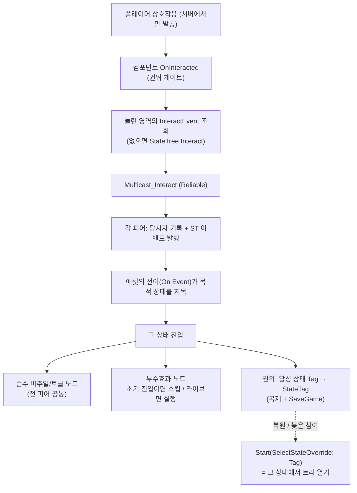

# 기믹 ↔ StateTree — 상태 권위와 계약 규칙

상호작용 월드 오브젝트(기믹)의 **상태와 그것을 구동하는 StateTree 사이의 계약**을 정리하고, 신규 기믹·ST 노드·ST 에셋을 작성할 때 따라야 할 규칙을 못박는다.

기믹은 **C++ 없이 만든다** — 아무 액터(순수 BP 포함)에 `UWxGimmickStateTreeComponent` 를 붙이고 ST 에셋 하나를 저작하면 그것이 곧 기믹이다.

---

## 한 문장 요약

> 기믹의 상태는 **ST 에셋의 상태 그 자체**이고, 그 상태에 붙인 **엔진 순정 Tag** 가 저장 키다. 컴포넌트는 상호작용을 이벤트로 전 피어에 뿌리기만 하며, 어느 상태로 갈지는 전적으로 에셋의 전이가 정한다. 세이브 복원·늦은 참여는 저장된 Tag 로 **그 상태에서 트리를 여는 것**으로 끝난다.

이 시스템을 가르는 두 축:

- **권위 축** — 상호작용 판정·서버 권위 부수효과(스폰/지급/저장)는 **서버 전용** / 비주얼·인터랙션 토글·로컬 FX 는 **모든 피어 공통**
- **시점 축** — **라이브 전이**(상호작용 발동: `SourceStateID` 유효) / **초기 진입**(트리 시작·세이브 복원·레이트조인: `SourceStateID` 무효)

---

## 핵심 3규칙

### 1. 영속이 필요한 상태에는 Tag 를 단다
상태 디테일의 **Tag**(엔진 순정 필드)가 그 상태의 이름이자 저장 값이다. 컴포넌트가 틱마다 활성 상태의 Tag 를 읽어 `SaveGame` 프로퍼티에 담고, 복원 시 그 Tag 로 트리를 연다.

- 활성 leaf 에서 **위로 올라가며** 처음 만나는 Tag 를 쓴다. 그래서 시퀀스를 자식 상태로 쪼갠 기믹(엘리베이터)은 시퀀스를 감싼 상위 상태에만 Tag 를 달면 된다.
- **한 에셋 안에서 Tag 는 유일해야 한다.** 같은 태그가 둘이면 breadth-first 로 먼저 찾은 상태가 잡힌다.
- Tag 를 안 달면 그 상태는 저장되지 않는다(마지막 유효 Tag 가 유지된다). 신규 상태 태그는 **프로젝트 태그 설정(`Config/DefaultGameplayTags.ini`, 에디터의 태그 매니저)** 에 추가한다 — C++ 은 필요 없다.

### 2. 상호작용은 이벤트로 오고, 목적지는 전이가 정한다
`Enable Interaction` 태스크가 상태마다 "이 영역이 켜지는가 / 문구는 무엇인가 / 누르면 어떤 이벤트가 뜨는가(`InteractEvent`)"를 선언한다. 눌리면 컴포넌트가 그 태그를 **Reliable 멀티캐스트**로 전 피어에 뿌리고, 각 피어의 트리가 자기 전이로 이동한다.

- `InteractEvent` 를 비우면 공용 태그 `StateTree.Interact` 를 쓴다. 영역이 하나뿐인 기믹은 그대로 두면 된다.
- 영역마다 갈 곳이 다르면 `StateTree.Interact` **아래에 영역별 자식 태그**를 두고 전이를 그 태그로 받는다. 부모로 받는 전이는 아무 영역이나 받고, 자식으로 받는 전이는 그 영역만 받는다(태그 계층 매칭).
- 상태를 바꾸지 않는 반응(예: 이미 불이 켜진 체크포인트에서 다시 쉬기)은 **자기 자신으로 가는 전이**로 표현한다 — 재진입이 그 상태의 액션 태스크를 다시 돌린다.
- 이벤트 페이로드(`FWxGimmickInteractEvent`: Source 메시·Interactor)는 더 세밀한 전이 조건이 필요할 때만 바인딩해 쓴다.

### 3. 부수효과 노드는 초기 진입에서 스킵
일회성/라이브 전용 효과(스폰·보상 지급·회복·사운드·Niagara·시퀀스·저장)는 **초기 진입이면 건너뛰고, 라이브 전이일 때만 실행**한다. 빠뜨리면 로드 시 보상 재지급·재스폰·FX 재생이 일어난다.

> **비주얼 노드는 이 구분을 하지 않는다.** 메시 이동(`Component Move`·`Component Spline Move`)과 애니(`Play Animation`)는 진입 경로를 가리지 않고 그냥 연출을 재생한다 — 복원 직후 문이 열리고 상자가 열리는 동작이 한 번 보인다. 포즈만 끝 상태로 스냅하던 분기는 제거했다(2026-07-31). 로드 직후의 연출 재생이 거슬리면 그때 다시 다룬다.

- 판정은 한 줄이다: `!Transition.SourceStateID.IsValid()`.
- 세이브 복원이 "저장된 상태에서 트리 시작"이라 자연히 초기 진입으로 들어온다. 그래서 **복원 마커 같은 별도 프로토콜이 없다.**

---

## 전체 그림

---

## 나머지 규칙

### 네트워크·컴포넌트 표준
- 인터랙션 응답은 서버 권위에서만 호출되고, 컴포넌트가 한 번 더 `HasAuthority` 로 가른다(멀티캐스트는 권위에서만 유효).
- 서버 권위 부수효과(스폰·리스폰·보상·GE 적용·저장)는 노드 안에서 `Owner->HasAuthority()` 게이트를 추가한다. 로컬 표현(사운드/Niagara)은 권위 게이트 없이 피어별 1회.
- 각 피어가 같은 이벤트로 같은 전이를 밟는다는 전제가 있다. 랜덤·시간 기반 조건을 전이에 쓰면 갈릴 수 있고, 그때는 복제된 `StateTag` 가 재시작 스냅으로 교정한다.
- 호스트는 `StartLogic`/`RestartLogic` 을 직접 부르지 않는다(컴포넌트 자동 시작). 실행 ST 에셋은 컴포넌트 디테일에서 지정한다.
- 런타임 리소스(시퀀스 플레이어·스폰체)를 가진 노드는 `ExitState` 에서 멱등 정리한다.

### StateTree 를 이 용도로 쓰며 생기는 마찰
- **시작 상태는 Root 의 첫 자식** — 저장 값이 없으면 순정 루트 선택이 첫 유효 자식을 고른다. 그래서 resting 상태(Idle/Close/Closed/Unlit)를 **맨 위**에 둔다.
- **완료/thrash** — 노드는 작업이 끝나면 `Succeeded` 를 반환해 상태를 자가 완료시킨다. 상태가 완료됐는데 맞는 완료 전이가 없으면 엔진은 Root 로 되돌아가 재선택한다. 따라서 **정지(머무는) leaf** 는 완료 구동자가 없어야 한다 — 즉시완료 태스크만 든 leaf 는 에셋에서 그 노드의 완료판정을 꺼서(`bConsideredForCompletion`) 머물게 한다. 순차 choreography(엘리베이터)만 완료판정을 켜고 *On State Completed → Next*.
- **바인딩 단방향** — 태스크는 바인딩으로 액터 멤버에 못 쓴다(읽기만). 태스크가 생산하는 런타임 데이터(스폰 목록 등)는 그 태스크의 인스턴스 데이터에 두고, 소비 노드는 태스크↔태스크 바인딩으로 읽는다(생산 노드를 앞에 배치).
- **노드 순수성** — 노드는 바인딩된 파라미터/컴포넌트만 읽고 동작하게 둔다. 오너에서 기믹 컴포넌트를 찾는 건 진짜 기믹 상태가 필요한 노드만(`Enable Interaction`·`Move Interactor To Target`·`Play Interactor Montage`·`Apply Gameplay Effect To Interactor`).

### 크로스모듈 노드 (WxWorld 외 도메인)
- 오너는 `AActor` 로만 캐스트한다(플러그인 참조 규칙). 초기 진입 판정도 `SourceStateID` 한 줄이라 공유할 어휘가 없다 — `Grant Reward`·`Refill Item Charges`·`Save Game` 이 그 예다.
- 전투 도메인의 GE 같은 타 도메인 에셋은 **에셋 레벨 참조**로 연결한다(`Apply Gameplay Effect To Interactor` 의 EffectClass 를 ST 에셋에서 지정) — 코드 의존이 생기지 않는다.

---

## 검증 불가능한 계약

코드가 못 잡는 계약은 이 셋이며, 신규 작업 시 가장 깨지기 쉽다. 셋 다 테스트에서 즉시 드러나므로 진단 전용 코드는 두지 않는다.

- **상태 Tag 누락·중복.** 저장이 안 되거나(복원하면 다른 상태) 엉뚱한 상태로 복원된다.
- **resting 이 첫 자식이 아님.** 저장 값이 없는 새 세션에서 엉뚱한 상태로 시작한다.
- **`InteractEvent` ↔ 전이 태그 불일치.** 상호작용해도 무반응이다.
- **배치 후 맵 미저장.** 저장 키(`SaveId`)는 에디터에서 심어 에셋에 직렬화되므로, 기믹을 놓고 맵을 저장하지 않으면 키가 없어 영속되지 않는다. 이 경우만 캡처 경로가 경고를 남긴다.

---

## 기믹은 두 부류다 — 사소한 건 ST 에 억지로 넣지 않기

| 부류 | 예시 | StateTree |
| --- | --- | --- |
| **사소** (1~2 상태 토글, 즉시/단일 비주얼) | Door, TreasureChest, AlarmConsole, SpawnConsole | 과한 편 |
| **시퀀스** (다단계·완료 대기) | Elevator(닫기→이동→열기), LaserCorridor(주기 스폰) | 제값을 함 |

단순 토글뿐인 신규 기믹은 컴포넌트+ST 로 강제하기 전에, 작은 전용 액터가 더 싸지 않은지 먼저 따진다. "모든 기믹 = 컴포넌트+ST"를 교리로 굳히지 않는다.

---

### 참조 코드

| 타입 | 모듈 | 역할 |
| --- | --- | --- |
| `UWxGimmickStateTreeComponent` | `WxWorld` (`Public\|Private/Gimmick/WxGimmickStateTreeComponent.h/.cpp`) | 기믹의 실체: 상호작용 계약(`IWxInteractable`)·영속(`IWxSavable`)·상태 Tag 기록/복제·저장 상태에서 트리 열기 |
| `AWxGimmick` 과 그 자식들 | `WxWorld` (`.../Gimmick/`) | 이미 배치된 기믹 넷의 얇은 호스트(부착 루트 + 메시). 순수 BP 재저작 후 삭제 예정이며, 신규 기믹은 상속하지 않는다 |
| `FWxStateTreeTask_*` | `WxWorld` (`.../Gimmick/WxGimmickStateTreeNodes.h/.cpp`) | 공용 노드들. `IsInitialEntry`(규칙 3)·`HasAuthority`(권위) 가드 |
| `FWxStateTreeTask_GrantReward` | `WxInventory` (`.../Inventory/WxRewardStateTreeNodes.cpp`) | 크로스모듈 노드 예시: `AActor` 캐스트 + 초기 진입 인라인 검사 |
| `UWxAbility_Interact` | `WxGame` (`.../Ability/WxAbility_Interact.cpp`) | 서버 권위 실행 진입점. 사거리·활성 검증 → 대상의 `IWxInteractable::OnInteracted` |
| `IWxInteractable` / `IWxSavable` | `WxCore` (`Public/WxInteractable.h`, `Public/WxSavable.h`) | 상호작용·영속 계약. 액터가 구현하지 않았으면 컴포넌트에서 찾으므로 호스트를 순수 BP 로 둘 수 있다 |
| `WxGameplayTags::StateTree_Interact` | `WxCore` (`Public/WxGameplayTags.h`) | 상호작용 발동 이벤트의 기본 태그. 영역별 자식 태그는 `Config/DefaultGameplayTags.ini` |
