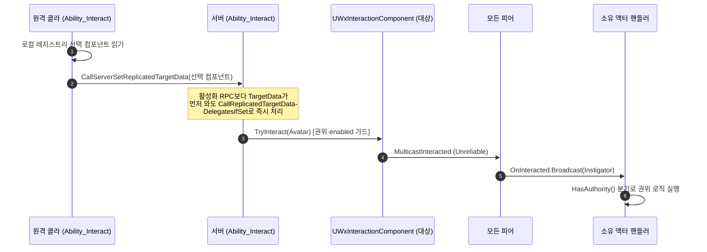

# 상호작용 시스템 — 등록과 실행

월드의 상호작용 대상이 어떻게 후보로 잡혀 HUD에 노출되고(등록·감지), 입력으로 어떻게 효과까지 실행되는지(트리거→기믹/지급)의 전 경로. 모듈 경계(WxCore / WxWorld / WxGame / WxUI / WxInventory)를 넘어 추적한다.

---

## 한 문장 요약

> 플레이어 측 어빌리티(`UWxAbility_Interact`)가 주변의 `UWxInteractionComponent` 볼륨을 주기 스캔해 로컬 레지스트리에 모으고(감지=로컬 어포던스, 비복제), 입력 시 선택된 컴포넌트를 GAS TargetData로 서버에 보내 **서버 권위**에서 `TryInteract`→`Multicast`로 `OnInteracted` 델리게이트를 fire한다(실행=권위).

이 시스템을 가르는 두 축:

- **감지 vs 실행** — 감지(스캔·목록·선택·하이라이트)는 **로컬 전용**이고 어디에도 복제되지 않는다 / 실행(`TryInteract`→효과)은 **서버 권위**이며 Multicast로 모든 피어에 알린다.
- **계약의 위치** — 상호작용 대상의 계약 인터페이스 `IWxInteractionSource`는 `WxCore`에, 그 유일 구현 `UWxInteractionComponent`는 `WxWorld`에 있다. 소비 도메인(`WxInventory` 픽업 등)은 `WxWorld`를 보지 않고 인터페이스로만 대상을 다룬다.

---

## 전체 그림

```mermaid
flowchart TD
    subgraph 감지["감지 — 로컬 전용 (소유 클라/리슨 호스트)"]
        Timer["Ability_Interact 스캔 타이머<br/>(부여 동안 상주)"] --> Scan["OverlapMultiByObjectType<br/>(WxInteractable)"]
        Scan --> Sort["후보 거리순 정렬"]
        Sort --> Reg["Registry.UpdateInRange()"]
        Reg -->|"OnListChanged / OnSelectionChanged"| VM["VM_InteractionList"]
        VM --> HUD["WBP_InteractionList (프롬프트·선택 표시)"]
        Reg -->|"ApplyHighlight"| Outline["선택 대상 메시 외곽선"]
    end
    subgraph 실행["실행 — 서버 권위"]
        Input["Input.Interact"] --> Ability["Ability_Interact 활성화"]
        Ability -->|"원격 클라: 선택을 TargetData로 전송"| Server["서버 인스턴스 수신"]
        Ability -->|"리슨/단일 PIE: 직접"| Try
        Server --> Try["Selected->TryInteract(Avatar) [권위 가드]"]
        Try --> Mcast["MulticastInteracted (Unreliable)"]
        Mcast --> Fire["OnInteracted.Broadcast (서버+모든 클라)"]
        Fire --> Handler{"소유 액터 핸들러"}
        Handler -->|"기믹"| Commit["CommitGimmickState (권위) → State 복제 → ST"]
        Handler -->|"아이템 픽업"| Grant["인벤토리 지급 (권위) → Destroy"]
    end
```

---

## 등록·감지 — "등록"은 폴링 수집이다

핵심 반전: 대상은 자신을 레지스트리에 **등록하지 않는다.** 등록의 실체는 (1) 콜리전 채널로 식별되는 수동 볼륨과 (2) 플레이어가 그 볼륨을 주기 폴링해 로컬 목록에 채우는 것이다.

1. **식별** — `UWxInteractionComponent`는 `USphereComponent`이며 Object Type을 `WxCollision::WxInteractable`(`ECC_GameTraceChannel2`, DefaultResponse=Ignore)로 설정한 `QueryOnly` 볼륨이다. 오버랩 이벤트는 끈다(`SetGenerateOverlapEvents(false)`) — 자신은 아무 이벤트도 쏘지 않고, 스캐너의 쿼리에 잡히기만 하는 수동 표적이다. 한 액터에 영역이 여럿이면(엘리베이터 등) 컴포넌트를 영역 수만큼 둔다.
2. **수집 주체** — `UWxAbility_Interact`가 `OnGiveAbility`에서 월드 타이머매니저에 `ScanAndPush`를 건다(`ScanInterval` 기본 0.1초). 타이머는 **어빌리티 활성화와 독립**이며 부여(grant) 동안 상주한다(인스턴스는 `InstancedPerActor`). 데디 서버는 LocalPlayer가 없어 미설정 — 감지는 로컬 어포던스다.
3. **스캔** — `ScanAndPush`는 아바타 위치에서 `OverlapMultiByObjectType(WxInteractable)`로 후보 컴포넌트를 모아 거리순 정렬 후 `Registry->UpdateInRange(Candidates)`로 push한다. 단, `CanActivateAbility` 실패(예: `State.Dead`) 시엔 빈 배열을 push해 목록·선택·하이라이트를 즉시 정리한다.
4. **생명주기 토글** — 활성/비활성은 `SetInteractionEnabled(bool)`로 콜리전을 `QueryOnly`↔`NoCollision` 토글한다. 비활성 볼륨은 ObjectType 쿼리에 안 잡혀 다음 스캔에서 자연 탈락한다. 기믹은 StateTree의 `Wx Enable Interaction` 노드가 상태별로 이를 토글한다(예: 문이 열리면 콘솔 인터랙션 비활성).

`UWxInteractionRegistrySubsystem`(`ULocalPlayerSubsystem`)은 로컬 플레이어당 하나다. `UpdateInRange`는 **기존 순서를 보존**하고 신규만 뒤에 append, 이탈은 제거하며, 멤버십이 실제로 바뀐 경우에만 발화한다(거리 변동에 목록이 흔들리지 않게). 갱신 전 선택 컴포넌트를 포인터로 캐시해 순서가 바뀌어도 같은 대상으로 선택을 잇는다. 선택(`SelectedIndex`)을 이 서브시스템이 **소유**하고, 선택된 컴포넌트만 외곽선을 켠다(`ApplyHighlight`).

---

## 후보 목록 → UI

레지스트리(`WxWorld`)와 뷰모델(`WxUI`)은 서로를 참조할 수 없으므로 `WxGame`의 리졸버가 다리를 놓는다.

- **리졸버** `UWxViewModelResolver_InteractionList`(WBP의 View Bindings에서 `Creation Type = Resolver`)가 `CreateInstance`에서 LocalPlayer의 레지스트리를 찾아 `UWxViewModel_InteractionList`를 생성하고, 레지스트리의 `OnListChanged`/`OnSelectionChanged`를 VM의 `HandleListChanged`/`HandleSelectionChanged`(엔진 타입 인자)에 연결한 뒤 현재 목록·선택으로 시드한다. VM은 LocalPlayer를 Outer로 두어 폰 리스폰에도 생존한다.
- **VM** `UWxViewModel_InteractionList`는 프롬프트 목록을 항목 VM(`UWxViewModel_Interaction`: `Prompt`+`bSelected`) 배열로 재구성하고 선택 인덱스를 표시만 한다. **입력(휠/방향키)은 VM이 아니라 WBP가 레지스트리의 `CycleSelection`을 직접 호출**해 흘린다 — 선택의 단일 소유자는 레지스트리다.
- 프롬프트 문자열은 각 컴포넌트의 `GetInteractionText()`(대상이 `SetInteractionText`로 갱신)에서 온다.

---

## 실행 — 입력에서 효과까지 (서버 권위)

입력 `Input.Interact`가 `Ability_Interact`(`ActivationPolicy = OnInputTriggered`, `NetExecutionPolicy = LocalPredicted`, `ActivationBlockedTags = State.Dead`)를 활성화한다. `ActivateAbility`는 네트워크 역할로 갈린다.

| 분기 | 조건 | 동작 |
| --- | --- | --- |
| **리슨 호스트 / 단일 PIE** | `HasAuthority && IsLocallyControlled` | 로컬 선택을 직접 읽어 `TryInteract` 즉시 호출 후 `EndAbility` (RPC 왕복 없음) |
| **원격 클라** | `!HasAuthority` | 로컬 선택 컴포넌트를 `FWxAbilityTargetData_Interaction`에 담아 `CallServerSetReplicatedTargetData`로 전송 후 `EndAbility` |
| **서버(원격 클라 처리)** | `HasAuthority && !IsLocallyControlled` | `AbilityTargetDataSetDelegate` 구독 → 수신 핸들러 `HandleTargetDataReceived`에서 `TryInteract` 후 `EndAbility` |

선택은 클라의 로컬 레지스트리만 알기 때문에, 클라가 선택을 읽어 서버로 넘기고 실행은 권위에서만 한다 — 이것이 GAS TargetData 경유의 이유다. `TryInteract` 자체도 `Owner->HasAuthority() && bInteractionEnabled` 가드를 다시 건다(이중 안전).

`OnInteracted`는 Multicast로 **서버와 모든 클라이언트에서 fire**된다. 따라서 효과의 권위 로직(상태 확정·아이템 지급)은 핸들러 안에서 `HasAuthority()`로 분기해야 한다.

### 효과 — 대상별 핸들러

- **기믹** (`AWxGimmick` 자식, 예: `AWxDoor`): 자식이 BP가 아니라 C++ 생성자에서 `UWxInteractionComponent`를 직접 만들고, `BeginPlay`에서 `OnInteracted`에 핸들러를 바인딩한다. 핸들러는 `HasAuthority()` 가드 후 `CommitGimmickState(NewState)`로 State를 확정한다. State는 복제+SaveGame이며, `OnRep_GimmickState`(권위는 Commit이 직접 호출)가 그 태그를 StateTree 이벤트로 발행해 비주얼·인터랙션 토글·사이드이펙트를 구동한다. 클라 핸들러는 노옵 — 복제된 State가 ST 진입을 구동하므로 클라가 직접 State를 쓰지 않는다(기믹 전이의 서버 권위 규칙).
- **아이템 픽업** (`AWxItemPickup`, WxInventory): 플러그인 참조 금지 때문에 상호작용 컴포넌트를 C++가 아닌 **상속 BP에서** 추가한다. `BeginPlay`가 `GetComponentsByInterface(UWxInteractionSource::StaticClass())`로 그 컴포넌트를 자동으로 찾아 `GetOnInteractedDelegate()`에 `HandleInteracted`를 바인딩한다(BP 배선 불필요). 핸들러는 권위에서 `UWxInventoryManagerComponent::FindInventory(Interactor)`로 인벤토리에 지급 후 `Destroy`. 프롬프트도 `SetInteractionText`로 `"[F] {DisplayName}"` 형태로 갱신한다.

`AWxGimmick`의 다른 자식들(`WxElevator`, `WxTreasureChest`, `WxAlarmConsole`, `WxSpawnConsole`, `WxCutsceneTrigger`)도 같은 `OnInteracted`→`CommitGimmickState` 패턴을 따른다(`WxCutsceneTrigger`는 일시 상태라 복원 시 Idle 리셋).

---

## 아키텍처 제약이 강제한 설계

- **모든 플러그인은 WxCore만 참조 가능, 도메인↔도메인 의존 금지** → 상호작용 대상의 계약 `IWxInteractionSource`(델리게이트 접근자 + 프롬프트 setter)를 `WxCore`에 두고, 구현 `UWxInteractionComponent`만 `WxWorld`에 둔다. `WxInventory` 픽업은 `WxWorld`를 모른 채 인터페이스로 컴포넌트를 찾아 바인딩한다.
- **WxUI는 WxWorld(레지스트리)를 못 본다** → 양쪽에 의존할 수 있는 `WxGame`의 리졸버가 델리게이트를 연결한다(통합 모듈이 다리, 의존 방향 보존).
- **감지는 로컬, 실행은 권위** → GAS `LocalPredicted` + TargetData로 "클라만 아는 선택"을 권위로 전달한다. 레지스트리 자체는 복제하지 않는다(로컬 표시 전용 LocalPlayerSubsystem).

---

## 주의할 점

- **`OnInteracted`는 서버+모든 클라에서 fire** — 핸들러에서 `HasAuthority()`로 권위 로직을 반드시 분기. 빠뜨리면 클라가 상태/지급을 중복·무권한 실행.
- **외곽선 강조는 부착 부모가 메시일 때만** — `SetHighlightEnabled`는 `Cast<UMeshComponent>(GetAttachParent())` 성공 시에만 Custom Depth를 켠다. 인터랙션 볼륨을 비-메시에 부착하면 강조가 안 보인다(프롬프트는 정상).
- **EndAbility가 어빌리티의 모든 타이머를 비운다** — 그래서 `EndAbility`에서 스캔 타이머를 다시 건다(`StartScanTimer`). 제거 경로면 직후 `OnRemoveAbility`가 최종 정리.
- **TargetData 레이스** — 서버가 활성화 RPC보다 TargetData를 먼저 받을 수 있어, 구독 직후 `CallReplicatedTargetDataDelegatesIfSet`로 이미 도착분을 즉시 처리한다.
- **책임 경계** — 컴포넌트는 프롬프트 표시를 하지 않는다(HUD 리스트 담당). 선택 소유는 레지스트리, 표시는 VM, 입력은 WBP, 실행 권위는 서버로 분리돼 있다.

---

### 참조 코드

| 타입 | 모듈 | 역할 |
| --- | --- | --- |
| `IWxInteractionSource` | `WxCore` | 대상 계약 인터페이스(`GetOnInteractedDelegate`/`SetInteractionText`). 소비 도메인이 WxWorld 없이 대상을 다루는 접점 |
| `WxCollision::WxInteractable` | `WxCore` | 인터랙션 볼륨 Object Channel(`ECC_GameTraceChannel2`). 스캐너 쿼리의 식별 키 |
| `Input_Interact` / `Ability_Interact` | `WxCore` | 입력·어빌리티 GameplayTag |
| `UWxInteractionComponent` | `WxWorld` | 수동 쿼리 볼륨 + `IWxInteractionSource` 구현. `TryInteract`(권위)→`MulticastInteracted`→`OnInteracted` |
| `UWxInteractionRegistrySubsystem` | `WxWorld` | LocalPlayer별 인-레인지 목록·선택 소유. `UpdateInRange`/`CycleSelection`/`GetSelectedComponent` |
| `AWxGimmick` / `AWxDoor` | `WxWorld` | 상호작용 대상 구현(기믹). `OnInteracted`→`CommitGimmickState`(권위)→복제 State→StateTree |
| `UWxAbility_Interact` | `WxGame` | 스캔 타이머(감지) + 입력 트리거 실행. 역할별 분기로 TargetData 송수신·`ExecuteInteract` |
| `FWxAbilityTargetData_Interaction` | `WxGame` | 선택 컴포넌트를 서버로 넘기는 TargetData(PackageMap 직렬화) |
| `UWxViewModelResolver_InteractionList` | `WxGame` | 레지스트리(WxWorld)↔VM(WxUI) 델리게이트 연결·시드 |
| `UWxViewModel_InteractionList` / `UWxViewModel_Interaction` | `WxUI` | HUD 리스트·항목 표시 전용 VM |
| `AWxItemPickup` | `WxInventory` | 비-기믹 대상 구현. BP에서 컴포넌트 추가, `GetComponentsByInterface`로 자동 바인딩→인벤토리 지급 |
